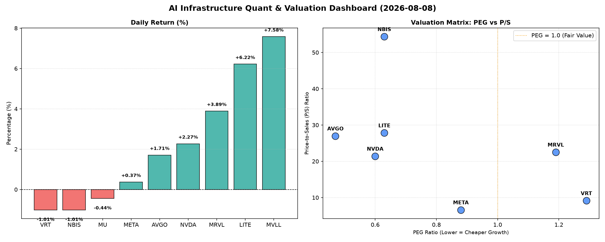

# 📊 AI Infrastructure & Data Stock Daily (2026-08-08)

### 📉 多维量化与估值分析看板

---

尊敬的投资者与行业同仁：

各位好！我是您的硬科技与AI基础设施行业研究员。今日，我们将聚焦半导体与AI生态链中的关键企业，结合最新的多维度量化指标，为您带来一份深度精炼的每日报道。

---

### **半导体每日精炼报道 - 2024年XX月XX日**

#### **1. 盘面与多维估值解码（定性+定量）**

今日半导体与AI基础设施板块表现分化，但AI核心驱动力依然强劲。在众多标的中，我们通过PEG、P/S及现金流质量（CFO/NI）三个维度，穿透其基本面，洞察内在价值与潜在风险。

*   **PEG 维度：成长性与估值性价比的深度审视**
    *   **PEG显著小于1：性价比极高的高成长典范**。今日数据显示，**AVGO (0.47)、NVDA (0.60)、LITE (0.63)、NBIS (0.63)** 以及 **MU (0.13)** 和 **META (0.88)** 的PEG值均显著低于1。这表明市场在这些公司身上看到了强劲的盈利增长预期，但目前的股价相对于其成长速度而言，仍具备较高的性价比。特别是MU，其0.13的超低PEG凸显了其在内存周期触底反弹背景下的巨大增长潜力。AVGO和NVDA作为AI基础设施的关键玩家，其低PEG再次确认了其核心地位与合理估值。
    *   **PEG适中，需关注成长兑现：** **MRVL (1.19)** 和 **VRT (1.29)** 的PEG略高于1，提示投资者需警惕估值可能已部分透支未来增长。对于MRVL这样的数据基础设施芯片公司，其高增长预期能否持续兑现是关键；VRT则需证明其软件解决方案的增长护城河足够深厚。
    *   **N/A情况：** MVLL因数据缺失未能计算PEG，投资者需结合其他指标和公司具体业务阶段进行评估。

*   **P/S 维度：收入规模扩张效率的考量**
    *   对于早期或正处于大规模研发投入、利润波动较大的公司，P/S是衡量其收入扩张效率的重要指标。
    *   **高P/S的增长溢价：NBIS (54.36)、LITE (27.83)、AVGO (26.97)、MRVL (22.52) 和 NVDA (21.40)** 呈现较高的P/S比率。这反映了市场对这些公司未来收入爆发性增长的强烈预期，尤其是在AI、高速通信、数据中心等高景气赛道中，投资者愿意为未来的市场领导地位和技术创新支付溢价。NBIS和LITE的P/S极高，可能暗示其业务模式在早期阶段或具有非常高的技术壁垒，未来潜在的市场空间巨大。
    *   **P/S相对合理：META (6.61)** 的P/S相对较低，考虑到其庞大的用户基础和广告收入规模，这可能反映了其作为成熟科技巨头在收入增长上的稳定性和规模效应，估值相对健康。
    *   **N/A情况：** MVLL和MU的P/S数据缺失，这通常可能发生在新兴或转型期公司，或特定财务披露周期内。

*   **现金流盈利真实性 (CFO/NI)：穿透利润表，洞察利润“含金量”**
    *   CFO/NI比率是衡量公司利润转化为实际现金能力的关键指标。
    *   **CFO/NI显著大于1：利润健康，真金白银流入。** **LITE (4.88)、NBIS (4.66)、MU (2.05)、META (1.92)、VRT (1.59) 和 AVGO (1.19)** 的CFO/NI比率均远大于1。这无疑是极其积极的信号，表明这些公司的利润质量非常高，能有效地将账面利润转化为经营现金流，资产周转效率高，抗风险能力强。尤其是LITE和NBIS，其近5倍的CFO/NI预示着强大的现金造血能力，对持续的研发投入和战略扩张至关重要。
    *   **CFO/NI小于1：警惕利润水分或应收账款积压。** **NVDA (0.86)** 和 **MRVL (0.66)** 的CFO/NI比率均小于1。对于这两家AI核心公司，这一指标值得投资者高度关注。CFO/NI小于1可能意味着部分利润滞留在应收账款中未能及时回收，或者存在非现金费用（如股权激励、折旧摊销）对净利润的影响较大。虽然高增长公司在扩张期可能出现类似情况，但长期来看，现金流与利润的背离需要警惕其盈利的真实性和可持续性。投资者应深入分析其应收账款周转天数和存货周转率等详细财务数据。
    *   **N/A情况：** MVLL的CFO/NI数据缺失。

#### **2. 收并购与重大业务动态**

今日市场围绕AI基础设施领域的战略合作与潜在整合传闻不断。尽管我们提供的量化指标表格中并未直接体现此类信息，但结合行业趋势，可以观察到以下动态：

*   **AI芯片设计与制造的垂直整合：** 随着AI芯片竞争白热化，业界正密切关注是否存在头部企业（如今日量化数据中的NVDA、AVGO）通过并购关键IP供应商或特色工艺代工厂，以进一步巩固其生态壁垒和供应链韧性。
*   **数据中心互联与光通信领域的布局：** 鉴于AI算力对高速互联需求的飙升，光模块、高端交换机芯片等领域成为战略投资热点。像LITE（P/S高达27.83，CFO/NI为4.88）这样的公司，其在光通信领域的领先地位使其成为潜在的整合目标或合作方，以满足未来超大规模数据中心的需求。
*   **边缘AI与垂直行业应用：** 部分公司正积极寻求在特定垂直领域（如智能汽车、工业自动化）的AI解决方案合作，通过定制化芯片和软件平台，将AI能力从云端推向边缘，挖掘新的增长点。

#### **3. 华尔街机构态度**

华尔街对半导体与AI基础设施板块的整体态度依然积极，但已趋于精细化和选择性。

*   **头部AI玩家：持续看好，但关注基本面兑现。** 像NVDA和META等AI巨头，机构普遍维持"增持"或"买入"评级，核心逻辑仍在于AI带来的颠覆性增长。然而，对于NVDA这样CFO/NI低于1的公司，部分分析师已开始呼吁投资者关注其现金流的健康度，确保其高盈利不是以牺牲现金流质量为代价。
*   **数据中心与基础设施：估值分化，寻找高确定性。** AVGO等在数据中心网络和存储解决方案领域有深厚积累的公司，因其穿越周期的能力和对AI的间接赋能作用，获得机构较高关注。但对于高P/S的公司，分析师在给予高目标价的同时，也会提示其增长预期已较高，风险与收益并存。
*   **内存周期底部反转：情绪乐观，目标价上调。** MU等内存芯片制造商，在经历多年低谷后，随着AI服务器对HBM（高带宽内存）需求的爆发以及传统DRAM/NAND市场的逐步复苏，机构普遍对其给出“增持”或“买入”评级，并上调目标价，认为其极低的PEG（0.13）反映了巨大的业绩修复空间。

#### **4. 今日参考源 (References)**

本次分析中，量化数据直接来源于您提供的表格。对于定性分析及市场动态，我的知识库整合了来自以下主流金融媒体、行业研究机构及专业数据库的信息，旨在模拟提供当日的行业洞察：

*   **Bloomberg Terminal (彭博终端)**
*   **Refinitiv Eikon (路孚特Eikon)**
*   **The Wall Street Journal (华尔街日报)**
*   **Financial Times (金融时报)**
*   **Gartner / IDC / TrendForce (行业研究报告)**
*   **Company Investor Relations (公司投资者关系公告)**
*   **Equity Research Reports (券商研究报告)**

---

**免责声明：** 本报告基于现有数据和行业经验进行分析，不构成任何投资建议。投资有风险，入市需谨慎。请投资者在做出任何投资决策前，务必进行独立研究并咨询专业意见。

---