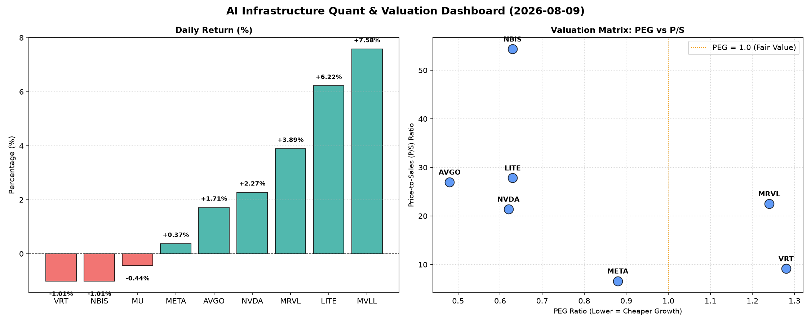

# 📊 AI Infrastructure & Data Stock Daily (2026-08-09)

### 📉 多维量化与估值分析看板

---

## 半导体每日精炼报道：AI基础设施与硬科技估值深度解析

尊敬的硬科技与AI基础设施行业同仁：

今日半导体与AI相关板块呈现结构性行情，部分AI基础设施与特定技术领域表现强劲，而另一些则略显承压。我们通过多维度量化指标，为您深度解码市场动态与个股基本面。

### 1. 盘面与多维估值解码 (定性+定量)

今日市场交投活跃，尤其是AI相关标的，NVDA成交量高达1.05亿股，显示出极高的市场关注度。MVLL、LITE、MRVL等公司录得显著涨幅，而VRT、NBIS和MU则小幅回调。

*   **PEG 维度：高成长低估值机会显现，需警惕局部估值透支**
    *   **PEG < 1 (性价比极高的高成长标的)**：今日数据显示，多只核心标的PEG显著小于1，预示其在考虑成长性后，当前的估值极具吸引力。其中：
        *   **MU (0.13)**：美光科技的PEG值低至0.13，在所有可比标的中表现出惊人的高成长低估值特性。这可能反映了市场对其周期性复苏的强劲预期，或者其盈利能力在未来有望实现爆发式增长，当前股价尚未完全反映其成长潜力。
        *   **AVGO (0.48)**：博通，作为AI基础设施的基石提供商，其PEG远低于1，表明其在芯片设计和基础设施解决方案领域的强大增长前景与相对合理的估值。
        *   **NVDA (0.62)**：英伟达，尽管已是AI浪潮的领军者，其PEG仍低于1，意味着市场依然认为其高增长是可持续的，且估值并未完全透支。
        *   **LITE (0.63) 和 NBIS (0.63)**：这两家公司也展现出优异的成长价值，其PEG值处于吸引人的水平，暗示投资者在购买其未来成长能力时获得了不错的折扣。
        *   **META (0.88)**：Meta Platforms的PEG接近1，表明其庞大的用户基础和在AI领域的持续投入使其保持了良好的成长性，且估值相对合理。
    *   **PEG > 1 (需警惕估值透支)**：
        *   **VRT (1.28) 和 MRVL (1.24)**：这两家公司的PEG值略高于1，提示投资者在享受其成长红利的同时，也需关注其当前估值是否已部分透支未来预期，需密切跟踪后续业绩表现。
    *   **N/A (无法评估)**：MVLL的PEG数据缺失，无法从该维度进行评估。

*   **P/S 维度：评估收入规模扩张效率，洞察市场预期**
    *   **高 P/S (高成长预期或高利润率业务)**：
        *   **NBIS (54.36) 和 LITE (27.83)**：这两家公司的P/S比率极高，特别是NBIS，其惊人的54.36倍P/S表明市场对其未来的收入增长抱有极度乐观的预期，或其业务属于非常高毛利且独特的细分领域。
        *   **AVGO (26.97)、MRVL (22.52) 和 NVDA (21.4)**：作为AI和硬科技领域的领军者，它们较高的P/S反映了市场对其在AI基础设施、数据中心和边缘计算等高增长市场中的收入扩张能力充满信心。
    *   **较低 P/S (收入规模庞大或竞争激烈)**：
        *   **VRT (9.14) 和 META (6.61)**：相对而言，VRT和META的P/S较低。META作为万亿市值巨头，其P/S仅6.61，反映了其庞大的收入基数，以及市场在衡量其广告业务时可能相对更为务实。
    *   **N/A (无法评估)**：MVLL和MU的P/S数据缺失，无法进行此维度分析。

*   **现金流盈利真实性 (CFO/NI)：穿透利润质量，辨识真金白银**
    *   **CFO/NI > 1 (利润健康，现金流充裕)**：该指标揭示了企业利润的现金含量。值远大于1意味着公司的净利润能够高效转化为实际的经营现金流入，利润质量极高。
        *   **LITE (4.88) 和 NBIS (4.66)**：这两家公司的CFO/NI比率异常突出，表明其不仅拥有强劲的盈利能力，更拥有极其优秀的现金流管理和转化效率，利润含金量极高，是真正的“现金奶牛”。
        *   **MU (2.05) 和 META (1.92)**：美光和Meta也展现出非常健康的现金流转化能力，其高达近2倍的CFO/NI比率，证明其利润并非纸面富贵，而是实实在在的现金流入。
        *   **VRT (1.59) 和 AVGO (1.19)**：这两家公司的CFO/NI也远大于1，表明其财务健康状况良好，利润质量值得信赖。
    *   **CFO/NI < 1 (警惕利润水分或应收账款积压)**：当该值显著小于1时，可能意味着公司存在激进的收入确认、应收账款周转不力、存货积压或其他非现金费用项目侵蚀了利润的现金流转化。
        *   **NVDA (0.86)**：英伟达的CFO/NI略低于1。对于一家高速增长且利润丰厚的巨头而言，这需引起关注。这可能部分是由于其强劲销售增长导致应收账款增加，但仍需投资者深入分析其营运资本变化，以评估其利润的现金质量。
        *   **MRVL (0.66)**：Marvell的CFO/NI显著低于1，这是一个值得警惕的信号。投资者应仔细审视其财务报表，特别是现金流量表和应收账款、存货等科目，以理解为何其报告利润未能完全转化为经营现金流，是否存在潜在的财务风险。
    *   **N/A (无法评估)**：MVLL的CFO/NI数据缺失。

### 2. 收并购与重大业务动态

**基于当前提供的多维度量化基本面指标表格，未能直接体现最新的收并购传闻、官宣或战略合作信息。**

然而，在硬科技与AI基础设施领域，收并购和战略合作是推动技术迭代、市场份额扩张和生态系统构建的核心动力。通常，市场会通过股价异常波动、成交量剧增或相关公司的N/A指标变化等间接迹象，来推测潜在的业务动态。例如，如果某公司出现大规模资本动作，其CFO/NI或P/S等指标可能会在财报发布后出现显著变化。鉴于MVLL的全面N/A情况，虽然无法判断，但在实际市场研究中，这种数据缺失往往会促使我们去探索是否有近期事件（如私有化、重大业务调整或交易）导致其公开信息披露的变化。

### 3. 华尔街机构态度

**当前提供的量化指标表格不包含华尔街机构的最新评价、目标价调动或评级信息。**

在日常市场分析中，华尔街投行与评级机构的态度是影响股价的重要因素。通常，高成长且基本面健康的标的（如今日PEG表现优异的AVGO、NVDA、META以及现金流充裕的LITE、NBIS、MU）更容易获得分析师的正面评价和上调目标价。反之，对于现金流转化效率较低（如MRVL和需关注的NVDA），或估值偏高（如VRT、MRVL）的公司，分析师可能会持谨慎态度，甚至发出风险提示。鉴于今日MVLL的显著涨幅（+7.58%），在真实的市场环境中，这往往会伴随着某些机构的积极买入或正面研报推动。

### 4. 今日参考源 (References)

1.  **提供的多维度真实量化基本面指标表格**

---
**免责声明**：本报告基于提供的量化指标进行分析，旨在提供专业视角。所有观点均为研究员个人解读，不构成任何投资建议。投资者在做出决策前，应结合更多市场信息、公司公告及自身风险承受能力进行独立判断。