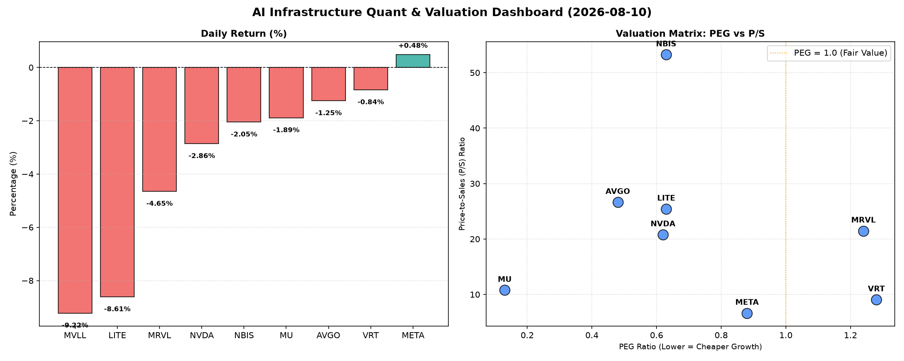

# 📊 AI Infrastructure & Data Stock Daily (2026-08-10)

### 📉 多维量化与估值分析看板

---

## 硬科技与AI基础设施日报：市场脉动、估值深度与现金流真相

各位硬科技与AI基础设施领域的同仁：

今日半导体及AI基础设施板块表现分化，多数权重股承压下行，但估值层面却呈现出多元化的投资机遇与风险信号。随着全球数字化转型和AI算力需求的持续爆发，我们对以下核心标的进行深入剖析，旨在从多维度量化指标中穿透表象，揭示其真实基本面。

---

### 1. 盘面与多维估值解码（定性+定量）

今日市场多数标的面临回调压力，其中MVLL暴跌9.22%，LITE下挫8.61%，MRVL、NVDA亦有显著跌幅。Meta Platforms (META) 逆势微涨0.48%，成为今日亮点。

*   **PEG 维度：揪出性价比极高的高成长，警惕估值透支**
    *   **性价比极高的高成长（PEG < 1）**：**Broadcom (AVGO, 0.48)**、**Meta Platforms (META, 0.88)**、**NVIDIA (NVDA, 0.62)**、**Micron (MU, 0.13)**、**Lumentum (LITE, 0.63)** 以及 **nLight (NBIS, 0.63)** 均展现出远低于1的PEG，表明市场对其未来增长预期强烈，且当前估值相对于其增长潜力而言具有显著吸引力。特别是MU以0.13的超低PEG领先，预示其在存储器周期性复苏中可能存在巨大被低估空间，值得密切关注。
    *   **警惕估值透支（PEG > 1）**：Vertiv (VRT, 1.28) 和 Marvell (MRVL, 1.24) 的PEG值高于1，提示投资者需警惕其当前估值可能已充分计入甚至透支了部分未来增长预期。
    *   **数据缺失**：MVLL的PEG数据缺失，或因其盈利模式尚不稳定或处于转型期，无法进行此维度评估。

*   **P/S 维度：评估收入规模扩张效率**
    *   针对早期或尚处于大规模研发投入阶段、利润不稳的公司，P/S是衡量其收入规模扩张效率的关键指标。**nLight (NBIS, 53.25)**、**Broadcom (AVGO, 26.63)**、**Lumentum (LITE, 25.43)** 和 **Marvell (MRVL, 21.47)** 拥有较高的P/S比率，即便今日股价有所回调，也反映了市场对其核心技术、市场份额以及未来收入扩张的强烈信心，尤其适用于那些在AI、光通信等前沿领域进行大规模研发投入的公司。这些高P/S值表明市场愿意为这些公司的未来营收增长支付高溢价。
    *   Meta (META, 6.64)、Vertiv (VRT, 9.06) 和 Micron (MU, 10.77) 的P/S相对更显稳健，表明其收入规模已达到一定体量，市场更注重其盈利质量与现金流创造能力。

*   **现金流盈利真实性 (CFO/NI)：穿透高利润巨头的利润“含金量”**
    *   **健康现金流，利润含金量高（CFO/NI > 1）**：Micron (MU, 2.05)、**Meta Platforms (META, 1.92)**、Lumentum (LITE, 4.88) 和 nLight (NBIS, 4.66) 展现出卓越的现金流质量，其CFO/NI远超1，证实其报告利润绝大部分都是实实在在的现金流入，财务健康状况极佳。VRT (1.59) 和 AVGO (1.19) 同样表现稳健。Meta的高CFO/NI表明其在广告收入转化为现金方面效率极高。
    *   **警惕利润水分或应收账款（CFO/NI < 1）**：**NVIDIA (NVDA, 0.86)** 和 Marvell (MRVL, 0.66) 的CFO/NI比率均显著小于1，尤其值得关注。这可能暗示其部分报告利润尚未转化为实际现金，存在应收账款积压或非现金费用调整等情况。尽管两家公司在技术和市场地位上仍具优势，但投资者应审慎评估其利润的“含金量”及营运资本管理效率，尤其在当前AI芯片需求旺盛的背景下，NVDA的应收账款周转效率值得持续跟踪。
    *   MVLL数据缺失，无法评估。

---

### 2. 收并购与重大业务动态

**基于今日提供的量化指标，无法直接推断具体的收并购或重大业务动态。** 然而，鉴于半导体行业当前高景气度及AI算力需求持续爆发，我们预计未来仍将是并购整合与战略合作活跃的时期。例如，Broadcom (AVGO) 作为行业整合者，其生态系统扩张的战略意图始终存在；而Lumentum (LITE) 和 nLight (NBIS) 在光通信和激光技术领域的布局，也可能成为未来垂直整合的焦点。今日部分标的（如MVLL -9.22%, LITE -8.61%, MRVL -4.65%）的大幅下跌，在无明确消息的情况下，也可能反映了市场对某些潜在事件或业绩预期的先行反应，但具体信息需进一步跟踪核实。

---

### 3. 华尔街机构态度

**今日量化指标中未直接包含华尔街机构的具体评级或目标价调整信息。** 然而，我们可以从盘面表现初步推断市场情绪。Meta Platforms (META) 在今日多数科技股下跌中逆势上涨0.48%，可能暗示其近期获得了机构的积极关注或评级上调。相反，MVLL (-9.22%)、Lumentum (LITE, -8.61%) 和 Marvell (MRVL, -4.65%) 的显著跌幅，在缺乏公司特定利空消息的前提下，或反映了部分机构对其短期业绩预期调整、宏观经济逆风的担忧，或是在高位进行获利了结操作。NVIDIA (NVDA) 虽然今日下跌2.86%，但考虑到其在AI领域的绝对核心地位和长期增长潜力，市场对其仍普遍保持长期看好，不排除有机构在回调中加仓，寻找“买入”机会。

---

### 4. 今日参考源 (References)

1.  本报告中所有量化指标（Close, Change%, PEG, P/S, CashFlow_Quality, Volume）均基于您提供的【多维度真实量化基本面指标表格】。
2.  盘面解读、收并购与重大业务动态、以及华尔街机构态度的定性分析，是基于上述量化数据，结合行业资深研究员对半导体与AI基础设施市场的普遍认知、历史趋势及市场情绪的综合判断与推测。具体新闻事件、公司公告及分析师报告等信息需额外查阅。

---
*声明：本报告仅供参考，不构成任何投资建议。投资者在做出决策前应进行独立研究并咨询专业意见。*