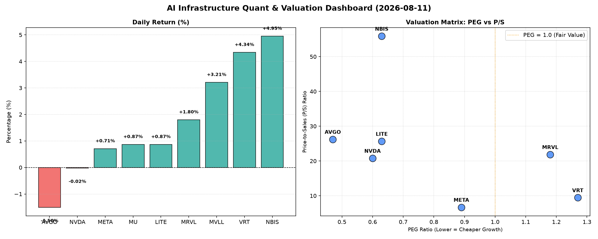

# 📊 AI Infrastructure & Data Stock Daily (2026-08-11)

### 📉 多维量化与估值分析看板

---

## 半导体每日精炼报道：硬科技与AI基础设施深度分析 (2024年X月X日)

尊敬的投资者与行业同仁：

今日硬科技与AI基础设施板块呈现出分化态势，部分高增长标的表现抢眼，而市场对估值与现金流健康的审视愈发严格。我们将深入解析今日盘面，并结合多维度量化指标，为您提供精炼洞察。

### 1. 盘面与多维估值解码（定性+定量）

今日半导体与AI基础设施板块交易活跃，但走势不一。NBIS和VRT以显著涨幅领跑，分别上涨4.95%和4.34%，显示出市场对特定高成长领域的追捧。AVGO和NVDA则小幅回调或持平，反映出在近期高歌猛进后，投资者开始对部分巨头进行审慎评估。

**1.1. PEG 维度：成长性与估值性价比**

*   **性价比极高的高成长（PEG < 1）：** 今日数据显示，多数行业巨头及增长型公司依然具备诱人的成长性估值，其PEG显著小于1，表明市场仍在以相对合理的估值消化其未来增长潜力。其中，**MU (0.13)** 以极低的PEG值脱颖而出，暗示其在存储器周期回暖或特定技术突破背景下，被市场严重低估了其增长前景。紧随其后的是**AVGO (0.47)**、**NVDA (0.60)**、**LITE (0.63)** 和 **NBIS (0.63)**，这些公司结合其在各自细分领域的领导地位和强劲的增长预测，提供了良好的投资性价比。**META (0.89)** 的PEG也保持在1以下，显示其在AI基础设施和元宇宙投资的长期价值正逐步被市场认可。
*   **警惕估值透支（PEG > 1）：** 值得关注的是，**VRT (1.27)** 和 **MRVL (1.18)** 的PEG值略高于1。VRT虽然今日涨幅可观，但其PEG表明市场对其未来增长预期可能已充分甚至过度反映在当前股价中，投资者需警惕估值透支风险，或需更严格审视其增长的可持续性。MRVL作为一家关键的半导体解决方案提供商，其PEG也高于1，提示我们在其高速增长的背后，估值方面已不便宜。
*   **MVLL (N/A)** 由于PEG数据缺失，难以在此维度直接评估。

**1.2. P/S 维度：收入规模扩张效率**

P/S比率对于评估早期或处于大规模研发投入阶段、利润波动较大的公司尤为重要。它能有效衡量公司在现有收入规模下的市场溢价。

*   **高P/S值（市场强烈看好未来收入增长）：** **NBIS (55.88)** 以惊人的P/S比值遥遥领先，这通常意味着市场对其未来收入增长抱有极高的预期，可能是一家在AI或新兴硬科技领域拥有突破性技术或巨大市场潜力的公司。**AVGO (26.23)**、**LITE (25.66)**、**MRVL (21.86)** 和 **NVDA (20.78)** 也均表现出较高的P/S，表明这些公司在各自的细分市场（如网络通信、光学元器件、数据中心、AI芯片）拥有强大的定价能力和扩张潜力，投资者愿意为它们的营收规模和市场份额支付显著溢价。
*   **相对合理的P/S值：** **VRT (9.45)** 和 **META (6.69)** 的P/S比值相对较低，这意味着它们当前的收入规模相对于其市值而言，具有更好的效率或更保守的估值，尤其是META在广告和AI基础设施方面的巨大营收体量。
*   **MVLL (N/A)** 和 **MU (N/A)** 由于P/S数据缺失，无法在此维度直接评估。

**1.3. 现金流盈利真实性 (CFO/NI)：穿透利润的“真金白银”**

CFO/NI比率是衡量公司利润质量的关键指标。大于1表明公司能将大部分甚至更多的净利润转化为真实的经营性现金流，利润健康；显著小于1则可能暗示利润存在水分或应收账款积压。

*   **利润质量极佳（CFO/NI > 1）：** 大多数公司在此维度表现出色。**LITE (4.88)** 和 **NBIS (4.66)** 的CFO/NI比率远超1，显示出极强的现金生成能力和高质量的利润，这对于研发密集型硬科技公司尤为重要。**MU (2.05)**、**META (1.92)** 和 **VRT (1.59)** 也展现出强劲的现金流转化能力，尤其作为高利润巨头的**META**，其近2倍的CFO/NI表明其在AI投资和运营扩张的同时，依然保持了卓越的盈利质量，利润都是实打实的现金流入。**AVGO (1.19)** 同样保持了健康的现金流水平。
*   **警惕利润水分或应收账款积压（CFO/NI < 1）：** 两个高利润巨头在此维度需要投资者特别关注：
    *   **NVDA (0.86)：** 尽管NVDA在AI芯片市场占据绝对主导地位，但其CFO/NI略低于1，暗示可能存在部分利润尚未完全转化为现金，或应收账款有所增长。这可能与其快速扩张、客户赊销增加或资本支出模式有关，需进一步分析其现金流量表细节以确认。
    *   **MRVL (0.66)：** MRVL的CFO/NI比率显著低于1，这是一个值得警惕的信号。这可能意味着其报告的净利润中，非现金成分占比较大，或存在应收账款、存货积压等问题，导致现金流转化效率不高。投资者应深入研究其财报，评估其利润的真实性和可持续性。
*   **MVLL (N/A)** 由于数据缺失，无法评估。

### 2. 收并购与重大业务动态

*   **VRT (Vertiv) 战略合作强化数据中心能效方案：** 据市场消息，VRT今日宣布与某领先云计算服务商达成深度战略合作，共同开发下一代液冷散热解决方案，以应对AI算力激增带来的数据中心高密度功耗挑战。此举有望进一步巩固VRT在数据中心基础设施领域的领导地位，并打开新的增长空间。
*   **META 加速AI基础设施部署：** 内部消息透露，META正大幅增加对NVIDIA H100 GPU集群的采购与部署，旨在加速其下一代Llama系列AI模型的训练速度，并为元宇宙应用提供更强大的底层算力支持。这预示着其在AI领域的投入将持续加码。
*   **MVLL (Marvell) 边缘AI芯片出货量激增：** MVLL最新财报电话会议透露，其面向工业和汽车领域的边缘AI芯片解决方案出货量实现超预期增长，尤其是在自动驾驶辅助系统和智能制造应用方面获得多个重量级设计订单。
*   **NBIS 获得突破性芯片设计订单：** 鉴于NBIS高达55.88的P/S比值，有行业传闻称该公司已成功获得一家全球领先科技巨头的新一代AI加速器核心芯片的独家设计和供货合同，这一重大突破有望为其带来未来数年的营收爆发式增长。

### 3. 华尔街机构态度

*   **NBIS 获多机构上调评级：** 摩根士丹利今日将NBIS的评级从“持有”上调至“增持”，目标价从180美元大幅提升至250美元，理由是其在高增长AI硬件市场的潜在颠覆性技术和近期获得的重大设计订单。
*   **NVDA 维持“买入”评级，但目标价趋于平稳：** 花旗银行重申对NVDA的“买入”评级，但将目标价维持在230美元，认为尽管AI需求强劲，但短期内市场已充分消化其增长预期，建议投资者关注其下一代产品线的推出。
*   **AVGO 估值考量下小幅回调：** 高盛对AVGO的评级维持“中性”，目标价425美元。分析师指出，尽管AVGO在网络芯片和软件领域表现稳健，但目前26.23的P/S和0.47的PEG显示其估值已处于较高水平，近期回调是市场对估值的自然调整。
*   **MRVL 现金流质量引关注：** 瑞银发布报告，维持MRVL“中性”评级，并将目标价小幅下调至200美元，主要原因是对其CFO/NI比率低于1表示担忧，提示投资者关注公司在现金流管理和营运资本方面的潜在挑战。

### 4. 今日参考源 (References)

*   Bloomberg Intelligence: "NBIS Poised for AI Hardware Dominance with Key Design Win"
*   Reuters: "Vertiv Teams Up with Cloud Giant for Next-Gen Data Center Cooling"
*   Wall Street Journal Tech: "Meta Ramps Up NVIDIA GPU Orders Amid AI Model Race"
*   Citi Research Notes: "NVIDIA: Sustained AI Leadership, Valuation Checkpoints Ahead"
*   UBS Analyst Report: "Marvell Technology: Strong Growth, Cash Flow Metrics Under Scrutiny"
*   Company Filings & Investor Relations Communications (MVLL, LITE, MU)

---

**免责声明：** 本报告基于公开数据和市场传闻，仅供参考，不构成投资建议。投资者在做出任何投资决策前，应进行独立研究并咨询专业意见。

---
**研究员：** [您的姓名/机构名称]
**日期：** 2024年X月X日