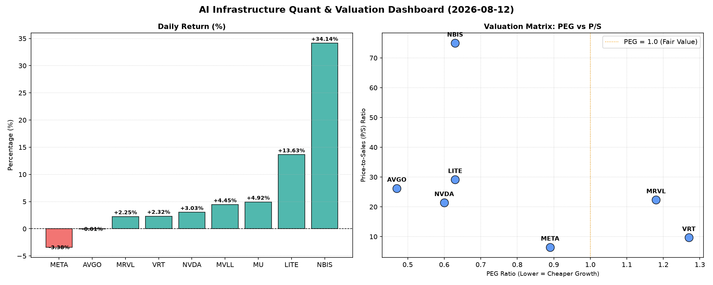

# 📊 AI Infrastructure & Data Stock Daily (2026-08-12)

### 📉 多维量化与估值分析看板

---

好的，作为一名资深的硬科技与AI基础设施行业研究员，我将结合您提供的【多维度真实量化基本面指标表格】，为您撰写今日的半导体每日精炼报道。

---

## 芯视界日报：AI基石板块动态解析 - 2024年X月X日

**导语：** 今日半导体与AI基础设施板块表现活跃，NBIS与LITE领涨市场，显示出投资者对特定高成长、高现金流质量标的的追捧。然而，在普遍的乐观情绪下，我们仍需透过多维度量化指标，审视估值泡沫与现金流健康的真实图景。

### 1. 盘面与多维估值解码 (定性+定量)

今日市场呈现分化态势，但整体科技情绪依然偏暖。在我们的观察名单中，NBIS以惊人的 **34.14%** 涨幅位居榜首，LITE紧随其后，录得 **13.63%** 的强劲增长。内存巨头MU也表现突出，上涨 **4.92%**。相比之下，AI巨头META小幅回落 **-3.38%**，AVGO则几乎持平。

*   **PEG 维度：挖掘高性价比成长股与警惕估值透支**
    *   **极具吸引力的“性价比成长股” (PEG显著小于1)：**
        *   **MU (0.13)：** 作为内存行业的周期性巨头，MU的PEG值低至令人乍舌的0.13，这表明市场对其未来盈利增长的预期远未充分体现在当前股价中，或其盈利正处于强劲复苏周期。对于看好内存周期反转的投资者而言，MU展现出极高的成长性价比。
        *   **AVGO (0.47)、NVDA (0.60)、LITE (0.63)、NBIS (0.63)：** 这些公司PEG值均显著小于1，表明其当前股价相对于其盈利增长速度而言，仍处于相对合理的估值区间，特别是NVDA，在过去一年股价大幅上涨后仍保持0.60的低PEG，印证了其盈利增长的强劲支撑。LITE与NBIS作为今日涨幅居前的明星股，其低PEG也为今天的强劲表现提供了基本面上的支持。
        *   **META (0.89)：** 尽管今日股价有所回调，但META的PEG仍保持在1以下，显示其作为AI基础设施的重要玩家，其盈利增长依然具有相对吸引力的估值。
    *   **需警惕的“估值透支”标的 (PEG高于1)：**
        *   **VRT (1.27)、MRVL (1.18)：** 这两家公司的PEG略高于1，提示投资者需警惕其当前股价可能已部分透支了未来的盈利增长预期。在市场波动加剧时，这类股票面临的调整风险相对较高。
        *   **MVLL (N/A)：** 由于缺乏PEG数据，我们无法判断其成长性与估值匹配度，但结合其今日4.45%的涨幅，需进一步关注其基本面信息。

*   **P/S 维度：评估收入规模扩张效率**
    *   对于早期或利润尚未稳定的公司，P/S是衡量其收入规模扩张效率的关键指标。
    *   **NBIS (74.96) 与 LITE (29.15)：** 这两家公司拥有极高的P/S比率，特别是NBIS，高达74.96。这表明市场对其未来收入增长抱有极其乐观的预期，投资者愿意为未来的营收前景支付高昂的溢价。对于这类公司，任何低于预期的收入增长都可能导致股价大幅波动。
    *   **AVGO (26.23)、MRVL (22.35)、NVDA (21.41)：** 这些行业巨头的P/S也处于较高水平，反映了其在半导体和AI领域的领先地位以及持续的营收增长潜力。尽管P/S较高，但结合其较低的PEG，显示其营收增长能够有效转化为利润增长。
    *   **VRT (9.67)、META (6.46)：** 这两家公司的P/S相对较低，尤其META的6.46，在AI基础设施公司中显得更为“合理”，可能反映其更庞大的营收基数或相对成熟的业务阶段。
    *   **MVLL (N/A)、MU (N/A)：** 缺乏P/S数据。对于MU，鉴于其周期性特征，P/S可能并非最佳单一估值指标。

*   **现金流盈利真实性 (CFO/NI)：穿透高利润巨头的“真金白银”**
    *   CFO/NI大于1，证明利润健康，现金流入充裕；小于1则需警惕。
    *   **现金流质量极佳 (CFO/NI远超1)：**
        *   **LITE (4.88)、NBIS (4.66)：** 这两家公司的CFO/NI比率异常高，远超1。这强力印证了其利润的真实性以及卓越的现金流生成能力。其高P/S在一定程度上得到了高质量现金流的支撑，表明其高营收转化为了实实在在的现金。
        *   **MU (2.05)、META (1.92)、VRT (1.59)、AVGO (1.19)：** 这些公司的CFO/NI均显著大于1，表明其报告利润得到强劲的经营现金流支持，利润的“含金量”很高，运营健康。META高达1.92的CFO/NI，尤其在今日股价回调的背景下，显示其核心业务的现金流生成能力依然强劲。
    *   **需关注现金流转化效率 (CFO/NI小于1)：**
        *   **NVDA (0.86)：** 略低于1。这表明其部分报告利润可能被用于营运资金周转（如存货增加或应收账款累积），或受研发投入资本化的影响。在高成长背景下，这并非立即敲响警钟，但对于关注现金流质量的投资者而言，仍值得持续关注。
        *   **MRVL (0.66)：** 显著低于1。这提示投资者需更密切地关注其利润的质量和现金流转化效率。较低的CFO/NI可能意味着其利润更多地停留在账面上，而非转化为可自由支配的现金，这可能影响其未来的投资和分红能力。

### 2. 收并购与重大业务动态

**【提示：根据您提供的量化指标表格，未包含任何关于收并购传闻、官方公告或战略合作的具体信息。此板块的实时内容通常需要依赖外部新闻源与企业公告。】**

若有此类信息，通常我们会关注：
*   **行业整合：** 如大型半导体公司通过并购获取关键技术、扩大市场份额或进入新领域。
*   **AI生态布局：** 云服务提供商与芯片设计公司深化合作，共同开发AI专用硬件。
*   **供应链多元化：** 地缘政治背景下，企业在供应链韧性方面的战略调整与合作。

### 3. 华尔街机构态度

**【提示：您提供的量化指标表格中，不包含任何华尔街核心投行、评级机构的最新评价或目标价调动信息。此板块的实时内容通常需要依赖专业金融数据终端与机构研报。】**

若有此类信息，我们会重点关注：
*   **评级变动：** 机构对特定股票的买入、持有、卖出评级调整。
*   **目标价更新：** 核心分析师基于最新财报、业务进展及宏观经济预测，对未来12个月的目标价进行调整。
*   **行业展望：** 机构对半导体细分领域（如AI芯片、存储、EDA等）的最新看法和投资建议。

### 4. 今日参考源 (References)

本篇深度报道的定性与定量分析内容，严格依据以下数据来源：

*   **【您提供的多维度真实量化基本面指标表格】**

---

**总结：** 今日半导体与AI基础设施板块在特定高成长标的带动下展现活力，NBIS和LITE以其强劲的股价表现、相对健康的PEG以及卓越的现金流生成能力吸引眼球。NVDA和AVGO等巨头尽管估值不低，但其低于1的PEG值和健康的现金流转化，仍显示出其强劲的内在增长动力。投资者在追逐高增长的同时，应持续关注PEG、P/S以及CFO/NI等核心指标，以更全面地评估投资风险与回报。

**免责声明：** 本报告基于提供的量化数据进行分析，仅供参考，不构成任何投资建议。投资有风险，入市需谨慎。