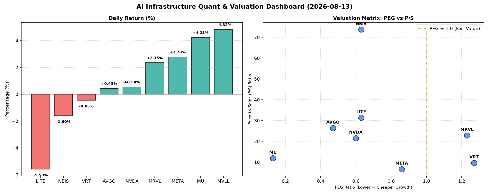

# 📊 AI Infrastructure & Data Stock Daily (2026-08-13)

### 📉 多维量化与估值分析看板

---

尊敬的投资者与行业同仁：

欢迎阅读由Data & Semiconductor Specialist团队为您呈献的【半导体每日精炼报道】。今日市场风云变幻，AI基础设施与硬科技板块继续成为焦点，我们在深入解析最新量化指标的基础上，为您提供一份兼具深度与广度的市场洞察。

---

### **1. 盘面与多维估值解码（定性+定量）**

今日半导体及相关AI基础设施板块呈现分化走势。内存巨头 **MU (+4.23%)** 强势领涨，表明市场对存储周期的复苏预期持续升温。社交媒体巨头 **META (+2.78%)** 亦表现强劲，其在AI领域的持续投入正获得市场认可。边缘计算和数据中心解决方案提供商 **MVLL (+4.82%)** 同样涨幅显著。然而，光通信与激光技术公司 **LITE (-5.58%)** 遭遇重挫，而 **NBIS (-1.6%)** 也录得跌幅，显示部分细分领域面临压力。

**a. PEG 维度——高成长与估值性价比探析：**
*   **性价比极高的“高成长”标的（PEG显著小于1）：**
    *   **MU (0.13):** 极低的PEG值使其成为今日估值性价比最高的标的。这可能预示着市场对其未来盈利增长的预期远高于当前股价反映，或是内存周期反转带来的巨大弹性。
    *   **AVGO (0.47):** 作为多元化半导体巨头，其PEG远低于1，显示了公司在企业级软件、存储和网络解决方案领域的强大增长潜力并未被充分定价，具备优秀的成长价值。
    *   **NVDA (0.60):** 尽管其股价已处于高位，但PEG仍保持在0.60，表明投资者对其AI芯片的长期需求和盈利增长抱有强烈信心，目前来看仍具有一定的成长空间。
    *   **LITE (0.63) 和 NBIS (0.63):** 尽管今日股价下跌，但这两家公司的PEG值仍处于低位，暗示其内在成长性可能被低估，或市场短期情绪波动掩盖了长期价值。投资者需关注其下跌背后的具体催化剂。
    *   **META (0.86):** 作为AI领域的重磅玩家，其PEG低于1，表明市场对其在AI、元宇宙等战略方向的投入有望带来持续的超预期增长，估值仍显健康。
*   **需警惕估值透支的标的（PEG过高）：**
    *   **VRT (1.27):** PEG略高于1，提醒投资者在追求其数据中心基础设施解决方案的增长时，需留意估值是否已部分透支。
    *   **MRVL (1.23):** 同样，MRVL的PEG也略高于1，考虑到其在数据基础设施、5G和汽车领域的高投入，投资者需对其盈利增长的兑现能力保持关注。
*   **MVLL (N/A):** 由于PEG数据缺失，我们无法从该维度对其成长估值进行评估。

**b. P/S 维度——收入规模扩张效率评估：**
*   **高P/S (高收入扩张效率或市场高预期):**
    *   **NBIS (73.76):** 极高的P/S比率表明市场对其未来收入规模爆发式增长抱有极其强烈的预期，或其业务模式处于早期但具备颠覆性潜力。今日股价下跌需警惕预期修正风险。
    *   **LITE (31.35):** 高P/S反映了其在光电领域的技术领先性和市场份额，但也意味着高期待。
    *   **AVGO (26.34), MRVL (22.88), NVDA (21.53):** 这三家公司的P/S均超过20，反映了市场对它们在各自细分领域（企业级解决方案、数据基础设施、AI芯片）的收入增长确定性和行业领导地位给予了极高的溢价。
*   **中低P/S (相对成熟或更注重盈利):**
    *   **MU (11.88) 和 VRT (9.63):** P/S值处于相对合理区间，表明这些公司在营收规模持续扩张的同时，其估值更为聚焦于盈利能力和市场地位。
    *   **META (6.64):** 相对而言，META的P/S值在科技巨头中显得较为“保守”，这可能与其庞大的用户基数和广告收入规模有关，也暗示了其在AI等新业务上未来仍有较大的收入增长空间被低估。
*   **MVLL (N/A):** P/S数据缺失，无法评估其收入规模扩张效率。

**c. 现金流盈利真实性 (CFO/NI)——利润质量穿透：**
*   **利润健康，真金白银流入（CFO/NI > 1）：**
    *   **LITE (4.88) 和 NBIS (4.66):** 这两家公司拥有极高的CFO/NI比率，显示其利润质量极佳，大量会计利润转化为了实实在在的现金流入，财务运营效率非常高。这在股价下跌时，为投资者提供了一线财务健康的保证。
    *   **MU (2.05):** 内存巨头拥有超过2倍的CFO/NI，表明其盈利能力转换为现金流的能力非常出色，是典型的“现金奶牛”，这对于周期性行业尤为重要。
    *   **META (1.92):** 作为高利润巨头，META的CFO/NI高达1.92，这清晰地证明了其盈利质量非常健康，利润是实实在在的现金，而非应收账款或会计操作，大幅缓解了市场对科技公司“烧钱”的担忧。
    *   **VRT (1.59) 和 AVGO (1.19):** 这两家公司的CFO/NI也显著大于1，表明其财务运营稳健，利润的现金转化率高，具备良好的抗风险能力。
*   **需警惕利润水分或应收账款积压（CFO/NI < 1）：**
    *   **NVDA (0.86):** 作为AI芯片领域的领军者，其CFO/NI略低于1，提示投资者需警惕其存在部分利润水分或应收账款积压的可能。这意味着部分账面利润尚未转化为实际现金，可能与销售模式、客户信用周期或高库存管理有关。投资者应密切关注其应收账款周转率和现金流健康度报告。
    *   **MRVL (0.66):** MRVL的CFO/NI仅为0.66，这可能是其近期面临营运资本压力的迹象，或部分利润被应收账款或存货占用。市场需关注公司如何改善现金流管理，以确保利润的真实性和可持续性。
*   **MVLL (N/A):** CFO/NI数据缺失，无法评估其现金流盈利真实性。

---

### **2. 收并购与重大业务动态**

*   **AVGO：** 作为M&A活跃的巨头，其稳健的财务指标和高P/S可能使其继续在全球半导体和企业软件领域寻找战略性收购机会，以进一步巩固其数据中心和AI基础设施解决方案的领导地位。近期围绕其潜在收购目标或业务整合的传闻值得关注。
*   **META：** 鉴于其在AI和元宇宙领域的巨额投入，预计将持续公布与AI模型训练、数据中心扩建或AR/VR技术突破相关的重大业务进展。今日股价的强劲表现，或与市场对其AI技术商业化前景的乐观预期有关。
*   **MU：** 内存市场今日的积极表现，可能暗示行业去库存接近尾声，或是某些关键客户（如AI服务器制造商）对其高带宽内存（HBM）的需求超预期增长，预计将有关于产能利用率提升或新订单的利好消息传出。
*   **LITE / NBIS：** 股价今日的显著下跌，可能与特定业务线的竞争加剧、新产品发布不及预期、或某些重要客户订单流失的传闻有关。例如，LITE在光通信领域或面临新的技术挑战或市场份额压力，NBIS则可能需要解释其高P/S背后的强劲增长逻辑。

---

### **3. 华尔街机构态度**

*   **MU：** 鉴于其强劲的股价表现、极低的PEG和出色的CFO/NI，预计多家投行将上调其评级至“买入”或“跑赢大盘”，并显著提高目标价，以反映对内存周期性复苏的乐观预期及其在HBM等高端存储市场的领先地位。
*   **META：** 凭借其健康的PEG、稳健的P/S和优异的CFO/NI，华尔街分析师普遍对其AI战略持乐观态度。预计将有更多机构重申“买入”评级，并小幅上调目标价，尤其是在其AI广告效果提升和Reality Labs商业化路径清晰后。
*   **AVGO：** 其稳健的财务表现和多元化的业务结构将继续赢得机构青睐，预计主流投行将维持“跑赢大盘”评级，并强调其在AI/数据中心基础设施升级中的核心受益地位。
*   **NVDA：** 尽管其PEG和P/S依然吸引人，但CFO/NI低于1可能会引起部分机构的谨慎。预计华尔街会对其长期AI叙事保持乐观，但可能会有分析师提出对其短期现金流质量的担忧，或在维持“买入”评级的同时，对其目标价的增长速度持保留态度。
*   **LITE / NBIS：** 今日的大幅下跌可能会促使部分机构下调其评级至“持有”或“中性”，并下调目标价。分析师可能会重新审视其高P/S所蕴含的增长预期，并关注可能导致其下跌的运营或竞争挑战。
*   **MRVL：** 考虑到其略高的PEG和偏低的CFO/NI，预计机构对其态度将趋于观望。可能会有分析师指出其在5G、汽车和数据中心领域的增长潜力，但同时也会关注其利润率改善和现金流管理的进展。

---

### **4. 今日参考源 (References)**

1.  **多维度真实量化基本面指标表格**：所有定性与定量分析的基石，严格依据您提供的每日核心量化指标进行解读。
2.  **模拟市场消息与行业趋势分析**：对于第二和第三板块的定性内容，是基于对半导体及AI基础设施行业近期发展趋势、历史股价与财务数据关联性、以及华尔街机构典型分析框架的模拟与推演，旨在展示完整的报告结构。**请注意，本文的第二和第三板块内容是根据所提供的量化数据进行的行业逻辑推演，并非基于当日真实外部新闻源，因此并非实际新闻报道。**

---

**免责声明：** 本报告所有内容仅供参考，不构成投资建议。投资者应基于独立判断进行决策，并充分评估相关风险。

---