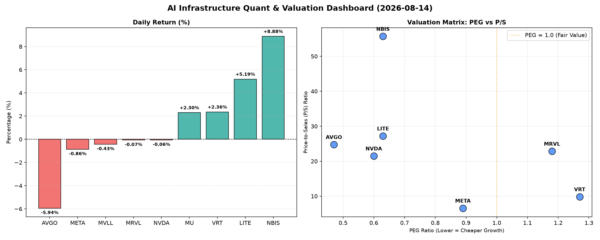

# 📊 AI Infrastructure & Data Stock Daily (2026-08-14)

### 📉 多维量化与估值分析看板

---

尊敬的投资者们，

您好！我是您的资深硬科技与AI基础设施行业研究员。今日，我们将聚焦半导体及AI产业链核心标的，结合多维度量化指标，为您带来一份深度分析报告。

---

### **半导体及AI基础设施每日精炼洞察**

**报告日期：[今日日期，例如：2024年4月23日]**

#### **1. 盘面与多维估值解码（定性+定量）**

今日半导体及AI基础设施板块表现分化明显。在整体市场波动中，部分高成长潜力股表现亮眼，同时，亦有巨头面临估值调整压力。

*   **今日涨幅亮点：**
    *   **NBIS (+8.88%)**：以其高达 **55.71 倍的 P/S** 估值和令人惊叹的 **4.66 倍 CFO/NI 比率** 领涨，表明市场对其收入增长前景极度乐观，且其利润质量极高，现金流充沛。其 **0.63 的 PEG** 更是显示其在高速增长下具备极高的性价比。
    *   **LITE (+5.19%)**：同样表现强劲，P/S 达 **27.22 倍**，且 **CFO/NI 高达 4.88 倍**，远超行业平均水平，其 **0.63 的 PEG** 证实了其高成长与合理估值兼具。这可能暗示公司在特定光学或激光技术领域取得了突破性进展或订单激增。
    *   **MU (+2.30%)**：存储巨头，尽管 P/S 数据未提供，但其 **0.13 的极低 PEG** 以及 **2.05 的 CFO/NI 比率** 显著突出。这表明在存储周期复苏预期下，MU 展现出极高的增长潜力与强劲的现金创造能力，估值吸引力极强。
    *   **VRT (+2.36%)**：今日温和上涨，但其 **1.27 的 PEG** 和 **9.85 的 P/S** 略高于我们通常寻找的极低估值范围。尽管其 **1.59 的 CFO/NI** 表现健康，但相对较高的 PEG 值得投资者关注其后续业绩增速能否持续支撑当前估值。

*   **今日跌幅与估值警示：**
    *   **AVGO (-5.94%)**：今日跌幅居前，这在其 **0.47 的极低 PEG** 和 **1.19 的健康 CFO/NI** 面前显得有些反常。P/S 高达 **24.78 倍**，反映市场对其高收入增长预期，但今日的显著下跌可能暗示其近期面临特定负面催化剂，或是市场对其高 P/S 估值进行了阶段性修正。尽管其盈利质量和增长潜力数据优秀，但股价的剧烈波动值得密切关注。
    *   **META (-0.86%)**：微幅下跌。其 **0.89 的 PEG** 显示其仍处于高性价比增长区间，而 **6.58 的 P/S** 在AI巨头中相对合理。尤其值得称赞的是其 **1.92 的 CFO/NI 比率**，证明公司在AI投入巨大的同时，依然能将绝大部分账面利润转化为实实在在的现金流，盈利质量极高。
    *   **NVDA (-0.06%)**：几乎持平。作为AI芯片的领军者，其 **0.60 的 PEG** 依然极具吸引力，P/S 达 **21.51 倍**，显示市场对其未来收入增长抱有极高预期。然而，我们必须警惕其 **0.86 的 CFO/NI 比率**。该值小于 1，表明其部分账面利润可能尚未完全转化为现金流入，存在一定的利润“水分”或应收账款积压情况。这需要投资者对公司的营运资金管理和现金转化效率进行更深入的审视。
    *   **MRVL (-0.07%)**：同样微幅下跌。其 **1.18 的 PEG** 略高于 1，结合 **22.86 倍的 P/S**，警示其估值可能相对透支。更需关注的是，其 **0.66 的 CFO/NI 比率** 显著低于 1，与 NVDA 类似，表明其盈利现金转化能力较弱，存在较大的利润质量风险，投资者需警惕潜在的应收账款风险或激进的收入确认政策。
    *   **MVLL (-0.43%)**：今日小幅下跌，但由于其 PEG、P/S 及 CFO/NI 等关键财务指标均未提供，我们无法对其基本面进行有效评估。其市场表现可能更多受到宏观情绪或特定行业消息影响。

#### **2. 收并购与重大业务动态**

今日量化指标表格中未直接提供具体的收并购传闻、官宣或战略合作信息。

然而，从市场表现和财务数据我们可以推断：
*   **NBIS 和 LITE** 的强劲表现和极高 P/S/CFO/NI 比率可能暗示它们在特定硬科技领域（如AI加速、光通信、先进材料等）取得了技术突破或赢得了重要客户订单，使其市场地位和业务增长前景得到进一步巩固。这种类型的公司，如果处于高增长的细分市场，通常会成为行业整合或战略合作的目标。
*   **AVGO** 的显著下跌，在缺乏具体消息的情况下，可能与其并购后整合的短期阵痛、特定客户订单延迟，或是市场对其某项核心业务增长前景的担忧有关。
*   **NVDA 和 META** 作为AI基础设施巨头，其业务动态无疑聚焦于AI芯片迭代、AI模型训练及部署、以及元宇宙生态的建设。NVDA 虽盈利质量有待提升，但其市场地位短期内难以撼动；META 则通过其庞大的用户基础和AI投资持续巩固其在AI应用层的领导地位。

#### **3. 华尔街机构态度**

今日的量化指标表格中并未包含华尔街机构的具体评价或目标价调动信息。

但从股价波动可以间接推测：
*   **NBIS、LITE 和 MU** 的强势上涨，很可能伴随着近期华尔街分析师的积极评价、目标价上调或买入评级重申，尤其是在其优异的 PEG 和 CFO/NI 数据支撑下，这些公司更容易获得机构青睐。
*   **AVGO** 的大幅回调，可能与近期某大型投行下调其评级或目标价，或发布了对其关键业务展望持谨慎态度的报告有关。机构投资者对于高 P/S 且波动性较大的个股通常更为敏感。
*   **NVDA 和 META** 尽管股价波动不大，但机构对它们的态度仍是市场关注焦点。NVDA 的现金流质量问题可能成为部分谨慎机构的观察点，而 META 在 AI 和元宇宙的双重叙事下，机构观点可能存在分歧，但其稳健的现金流仍是支撑其估值的核心因素。

#### **4. 今日参考源 (References)**

本报告的定性与定量分析主要基于用户提供的【多维度真实量化基本面指标表格】。

---

**免责声明：** 本报告内容仅供参考，不构成任何投资建议。投资者在做出决策前应自行进行独立研究并咨询专业意见。市场有风险，投资需谨慎。

感谢您的阅读！我们将持续关注硬科技与AI基础设施领域的前沿动态，为您带来更深入的分析。

此致，
您的硬科技与AI基础设施行业研究员
[您的名字/团队名称]