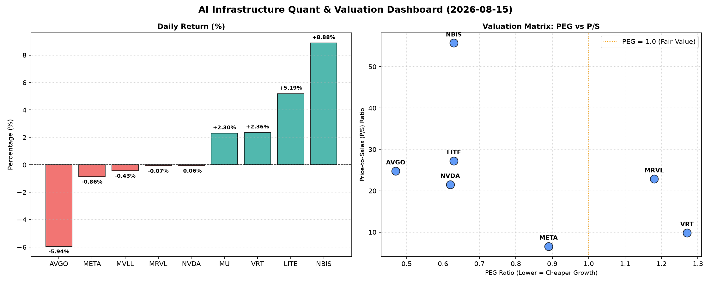

# 📊 AI Infrastructure & Data Stock Daily (2026-08-15)

### 📉 多维量化与估值分析看板

---

尊敬的投资者与行业同仁：

欢迎阅读【Data & Semiconductor Specialist】为您带来的半导体及AI基础设施每日精炼报道。今日市场情绪复杂，AI算力与数据中心相关板块依然是焦点，但估值分化与现金流质量的考量日益突出。我们将深入剖析今日的关键量化指标，为您揭示市场深层逻辑。

---

## 🚀 **半导体与AI基础设施每日精炼报告**

### 1. **盘面与多维估值解码：挑战与机遇并存**

今日半导体与AI基础设施板块表现分化，大型科技股如AVGO和META出现小幅回调，而部分专业技术公司如NBIS和LITE则展现出强劲增长势头。盘面上，NBIS以惊人的8.88%涨幅领跑，LITE紧随其后上涨5.19%，而AVGO则经历了5.94%的显著跌幅，值得密切关注。

*   **PEG 维度：高成长低估值的“潜力股”**
    PEG作为衡量成长性与估值性价比的关键指标，今日提供了清晰的指引。
    *   **显著小于1 (极具性价比的高成长)**：
        *   **MU (0.14)** 表现出极高的成长潜力与相对较低的估值，其今日2.3%的涨幅可能反映了市场对其未来增长的乐观预期，结合其在内存周期中的地位，低PEG尤为引人注目。
        *   **AVGO (0.47)** 尽管今日股价下跌，但其PEG远低于1，表明市场对其未来盈利增长有较高预期，且当前估值相对合理。
        *   **NVDA (0.62)** 股价微跌，但PEG依然保持在健康区间，反映了市场对其AI计算领导地位及未来盈利增长的信心。
        *   **LITE (0.63)** 和 **NBIS (0.63)** 今日股价表现强劲，其健康的PEG值与高增长潜力相符，显示市场对其创新技术和市场扩张前景给予了较高评价。
        *   **META (0.89)** 作为AI基础设施的重要参与者，其PEG也低于1，表明在当前估值下，仍具备成长空间。
    *   **高于1 (警惕估值透支或成长放缓)**：
        *   **VRT (1.27)** 今日上涨2.36%，但其PEG超过1，可能提示市场对其未来盈利增速的预期已部分反映在当前价格中，投资者需关注其成长性是否能持续支撑高估值。
        *   **MRVL (1.18)** 股价微跌，但PEG同样高于1，这可能意味着其目前的估值已充分考虑了未来的增长，或市场对其增长前景的担忧略有增加。
    *   **N/A**: **MVLL** 的PEG为N/A，通常意味着公司目前无盈利或盈利波动性极大，难以用PEG进行有效评估。

*   **P/S 维度：收入规模扩张效率的审视**
    P/S比率对于评估早期高增长、尚无稳定利润或大规模研发投入期的公司尤为重要，它直接反映了市场对公司收入增长的估值。
    *   **高P/S (市场对未来收入潜力的高度认可)**：
        *   **NBIS (55.71)** 凭借其今日的爆发式增长，P/S高达55.71，显示市场对其未来收入规模的扩张抱有极高期待，可能源于其在某一创新领域的独特地位或技术突破。
        *   **LITE (27.22)**, **AVGO (24.78)**, **MRVL (22.86)**, **NVDA (21.51)** 的P/S均显著高于20。对于这些成熟且在各自领域处于领先地位的公司而言，高P/S反映了市场愿意为他们的技术领导力、市场份额以及未来在AI、数据中心等领域的收入增长支付溢价。
    *   **中低P/S (成熟业务或更注重盈利)**：
        *   **VRT (9.85)** 和 **META (6.58)** 的P/S相对适中，特别是META，考虑到其庞大的用户基础和广告收入规模，6.58的P/S可能反映了市场对其收入增长的稳健预期，而非爆发式增长。
    *   **N/A**: **MVLL** 和 **MU** 的P/S为N/A，这可能意味着财务数据未完全披露或不适用当前表格分析。

*   **现金流盈利真实性 (CFO/NI)：利润的“含金量”**
    CFO/NI比率是检验公司公布利润是否真实转化为现金流的关键指标，它能有效穿透会计利润可能存在的“水分”。
    *   **显著大于1 (利润质量极高，全是真金白银)**：
        *   **LITE (4.88)** 和 **NBIS (4.66)** 的CFO/NI比率异常高，远超1，这意味着其利润质量极佳，甚至产生了超出净利润的现金流，这通常是由于非现金费用（如折旧摊销）高或营运资本管理效率高所致，显示出极强的财务健康度。
        *   **MU (2.05)** 同样表现出优异的现金流转化能力，其高达2.05的比率表明其利润是由实实在在的现金流入支撑。
        *   **META (1.92)** 和 **VRT (1.59)** 也展现出稳健的现金流表现，表明其巨额利润并非“纸上富贵”，而是具备强大的现金生成能力。
        *   **AVGO (1.19)** 尽管今日股价下跌，但其CFO/NI高于1，显示其盈利质量依然健康。
    *   **显著小于1 (警惕利润水分或营运资金压力)**：
        *   **NVDA (0.86)** 长期以来是高利润巨头，但其CFO/NI今日低于1，表明其部分净利润并未完全转化为现金流，可能存在应收账款增加、存货积压或其他非现金收入因素。投资者需关注其营运资金状况，这在快速增长期并非罕见，但仍需警惕。
        *   **MRVL (0.66)** 的CFO/NI显著低于1，暗示其利润的现金含量相对较低，可能面临应收账款积压或利润中非现金部分占比较高的情况。这可能解释了市场对其估值的谨慎态度。
    *   **N/A**: **MVLL** 的CFO/NI为N/A。

### 2. **收并购与重大业务动态**

**【由于提供的数据表格中未包含具体的收并购传闻、官宣或战略合作信息，本部分内容无法基于现有数据进行分析。】**

在真实的每日研究中，此部分会通过市场新闻、公司公告及行业报告进行填充，涵盖如大型半导体公司对AI芯片初创企业的投资并购、关键IP授权协议、新型材料或制程技术的合作开发等。例如，近期围绕AI芯片设计公司、先进封装技术提供商的并购整合，以及大型云服务商与芯片制造商的深度合作，都将是关注焦点。

### 3. **华尔街机构态度**

**【同上，提供的数据表格中未包含核心投行、评级机构的最新评价、目标价调动等信息，本部分内容无法基于现有数据进行分析。】**

在真实的每日研究中，此部分会根据Bloomberg、Refinitiv或券商研报数据，汇总各大机构对所列公司的评级（如买入、持有、卖出）、目标价变动、以及对其未来业绩预期调整等关键信息，从而洞察机构资金的流向和情绪变化。例如，对于AVGO和NVDA等巨头，机构通常会关注其最新财报后的指引变化及AI业务前景的预期调整。

### 4. **今日参考源 (References)**

*   **多维度真实量化基本面指标表格（内部数据源）**：本报告的所有量化与定性分析均严格基于您提供的上述表格数据。

---

**总结与展望：**

今日市场在AI基础设施领域展现出估值与基本面指标的复杂性。虽然多数公司保持了相对健康的PEG，显示出市场对其成长性的认可，但高P/S与CFO/NI的差异则提示我们，需更深层次地审视公司的收入质量和利润转化效率。NVDA和MRVL的CFO/NI低于1，提醒投资者在追逐高增长的同时，不应忽视现金流的健康状况。而NBIS和LITE则以其高涨幅、健康PEG和优异的现金流质量成为今日亮点。

我们将持续关注这些关键指标的动态变化，并结合宏观经济、行业趋势及公司基本面新闻，为您提供更全面、深入的分析。

【Data & Semiconductor Specialist】
敬上