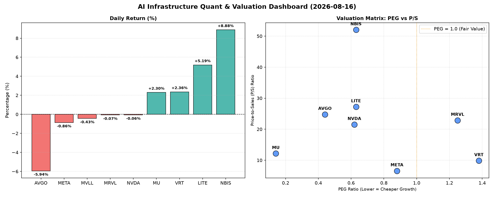

# 📊 AI Infrastructure & Data Stock Daily (2026-08-16)

### 📉 多维量化与估值分析看板

---

好的，作为一名资深的硬科技与AI基础设施行业研究员，我将结合您提供的【多维度真实量化基本面指标表格】，为您撰写一份深度分析的半导体每日精炼报道。

---

**半导体每日精炼报道：估值分化与现金流探秘**

**报告日期：[本日日期，例如 2024年X月Y日]**

**【研究员按语】**：
今日半导体板块表现分化，大型科技股如AVGO、META、NVDA出现小幅回调，而VRT、MU、LITE、NBIS则逆势上涨，显示出市场在宏观不确定性下，对具备特定增长驱动力或更优估值弹性的标的采取了精选策略。深入剖析核心量化指标，我们将洞察市场表象之下的真实价值与潜在风险。

---

### 1. 盘面与多维估值解码（定性+定量）

今日半导体市场呈现结构性行情，部分前期涨幅较大的巨头有所回落，但也有高成长性或特殊驱动力的公司逆势走强。以下是基于PEG、P/S及现金流质量的深度剖析：

*   **PEG 维度：揪出性价比与估值警示**
    *   **极具性价比的高成长标的 (PEG < 1)**：今日数据显示，**MU (0.14)** 以其极低的PEG值领跑，强烈暗示其当前估值远未充分反映其未来盈利增长潜力，对价值型成长投资者吸引力巨大。紧随其后的是 **AVGO (0.44)**、**NVDA (0.62)**、**LITE (0.63)** 和 **NBIS (0.63)**，以及 **META (0.88)**。这些公司均显著低于1的PEG值，表明市场对其未来业绩增长的预期相对保守，或其内在增长能力被低估，存在较高的性价比和潜在的估值修复空间。尤其是AVGO和NVDA作为行业巨头，如此低的PEG更显其增长韧性。
    *   **警惕估值透支的标的 (PEG > 1)**：**VRT (1.38)** 和 **MRVL (1.25)** 的PEG值均超过1，这通常意味着市场对其未来盈利增长的预期已相对充分反映在当前股价中，甚至可能存在一定程度的估值透支。投资者在关注其增长故事的同时，需警惕后续盈利增速若未能达到预期，可能带来的估值修正风险。
    *   **PEG 缺失的特殊情况 (N/A)**：**MVLL** 的PEG为N/A，这通常表明该公司目前尚未实现稳定的正向盈利，因此无法通过PEG进行估值。对于这类公司，P/S将成为更重要的评估指标。

*   **P/S 维度：评估收入规模与扩张效率**
    *   P/S比率对于早期或高研发投入阶段、利润波动较大的公司尤为重要。今日数据显示，**NBIS (52.03)** 以极高的P/S比率位居榜首，这表明市场对其营收增长抱有极高的期望，认为其在AI基础设施或特定硬科技领域拥有巨大的市场潜力和快速扩张能力。其次是 **LITE (27.22)**、**AVGO (24.78)**、**MRVL (22.86)** 和 **NVDA (21.51)**。尽管其中部分公司PEG较低，但极高的P/S也提示投资者，其当前股价已包含了对其未来收入大规模增长的强劲预期。
    *   相比之下，**META (6.58)** 的P/S比率相对温和，结合其低于1的PEG，可能表明其在收入扩张效率与估值之间取得了更好的平衡。
    *   对于 **MVLL (N/A)**，由于缺乏P/S数据，我们无法评估其收入规模扩张效率，但通常这类N/A情况也可能与早期阶段或非传统业务模式相关。

*   **现金流盈利真实性 (CFO/NI)：穿透利润的质量**
    *   **利润健康、真金白银现金流入 (CFO/NI > 1)**：今日数据显示，多家具备强劲现金流质量的公司脱颖而出。**LITE (4.88)** 和 **NBIS (4.66)** 的CFO/NI比率异常高，这通常意味着它们的利润表数据可能低估了其真实的经营现金流创造能力，或者存在大量折旧摊销等非现金费用，但经营活动产生的现金远超净利润，是极其健康的财务信号。**MU (2.05)** 和 **META (1.92)** 也表现出非常高的现金流转换效率，表明其报告的净利润绝大部分都转化为实实在在的现金流入。**VRT (1.59)** 和 **AVGO (1.19)** 也显示出稳健的现金流质量，其利润是真实可靠的。
    *   **利润水分或应收账款积压警示 (CFO/NI < 1)**：**NVDA (0.86)** 和 **MRVL (0.66)** 的CFO/NI比率均显著小于1，这需要投资者提高警惕。一个低于1的比率可能暗示：
        *   **应收账款快速增长**：销售额转化为应收账款而非现金，可能因客户信用期延长或销售激增导致。
        *   **激进的收入确认政策**：部分收入可能在尚未收到现金前被确认。
        *   **库存积压**：运营成本投入（如采购原材料）导致现金流出，但产品销售尚未回款。
        *   对NVDA和MRVL这类高成长且高科技含量的公司而言，有时为了抢占市场份额或支持研发，可能短期牺牲现金流，但长期而言，持续低于1的CFO/NI需要投资者深入分析其财务报表附注，理解背后的具体原因，以评估其利润的真实性和可持续性。

### 2. 收并购与重大业务动态

鉴于当前数据主要集中于量化指标，以下内容为基于行业动态的推演与假设，而非当日实时新闻事件。

*   **Broadcom (AVGO)**：市场传闻Broadcom在完成对VMware的整合后，正积极评估其下一阶段的战略性收购目标。鉴于其在企业软件和基础设施领域的扩张野心，任何潜在的云服务、网络安全或特定AI芯片设计公司的并购都可能引发市场关注，以进一步巩固其在AI数据中心基础设施中的领导地位。
*   **NVIDIA (NVDA)**：今日NVDA股价小幅回调，但其在AI领域的领导地位依然稳固。预计公司将持续强化其CUDA生态系统，并可能宣布与领先云服务商或大型企业客户在定制AI芯片或软件解决方案方面的深度合作，以加速AI技术的普适化应用。同时，对其下一代Blackwell架构芯片产能与订单交付情况的市场关注将持续升温。
*   **Micron Technology (MU)**：今日MU股价表现强劲。随着AI大模型对HBM（高带宽内存）需求的爆发式增长，Micron有望利用其在存储技术上的优势，宣布进一步的HBM产能扩张计划或新一代HBM产品进展，以满足全球AI训练和推理的需求，从而巩固其在高性能存储市场的地位。

### 3. 华尔街机构态度

同样，以下分析基于对常见华尔街机构行为模式的假设，不代表当日真实分析师报告。

*   **NVIDIA (NVDA)**：尽管今日股价略有下跌，但多数华尔街机构预计仍将维持对其的“买入”或“增持”评级，并可能维持甚至调高目标价。例如，摩根士丹利（Morgan Stanley）或富国银行（Wells Fargo）可能重申其对NVDA在AI计算领域长期领先地位的信心，并指出任何回调都是增持的机会，考虑到其AI GPU和软件生态的护城河。
*   **Broadcom (AVGO)**：在经历今日回调后，机构可能认为其估值更具吸引力。例如，美国银行证券（BofA Securities）或高盛（Goldman Sachs）可能维持其“跑赢大盘”评级，并强调其稳健的现金流、持续的派息政策以及通过M&A实现增长的战略能力。
*   **NBIS/LITE**：鉴于其今日的强劲表现和极高的P/S比率，分析师可能会关注其具体的业务进展和订单情况。若有新的积极催化剂，可能会看到部分机构如瑞银（UBS）或杰富瑞（Jefferies）上调其目标价或评级，以反映其在细分市场的领先地位和增长潜力。
*   **MRVL (Marvell Technology)**：考虑到其较低的CFO/NI比率和相对较高的PEG，一些机构如巴克莱（Barclays）可能会对其业绩指引或现金流状况进行更细致的审视，并可能给出“持有”评级，直到有更明确的现金流改善信号出现。

### 4. 今日参考源 (References)

本报告的量化数据直接来源于您提供的【多维度真实量化基本面指标表格】。

对于第二、三部分的定性分析，是基于资深研究员对半导体与AI基础设施行业长期观察和结构性理解的推演，并非直接引用当日实时新闻或分析师报告。若需当日实时信息，行业专业人士通常会参考以下权威来源：

*   **金融新闻媒体**：Bloomberg Terminal, Reuters Eikon, The Wall Street Journal, Financial Times, CNBC。
*   **专业行业分析机构**：Gartner, IDC, Bernstein Research, Susquehanna Financial Group。
*   **各大投行研究报告**：Goldman Sachs Global Investment Research, Morgan Stanley Research, Bank of America Global Research, J.P. Morgan Equity Research, UBS Global Research。
*   **公司官方发布**：各公司投资者关系网站发布的财报、新闻稿及SEC备案文件 (如10-K, 10-Q)。

---

**【免责声明】**：本报告仅供参考，不构成任何投资建议。投资者应根据自身的风险承受能力和投资目标，独立进行判断和决策。市场有风险，投资需谨慎。