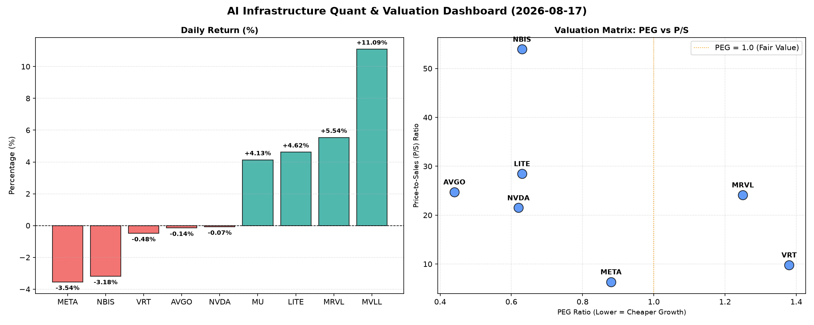

# 📊 AI Infrastructure & Data Stock Daily (2026-08-17)

### 📉 多维量化与估值分析看板

---

尊敬的硬科技与AI基础设施投资者，您好！

今日，我们将深入剖析半导体与AI生态链中核心企业的表现与多维度基本面。市场呈现出冰火两重天的态势，部分个股如MVLL、MRVL、MU和LITE录得显著涨幅，而META和NBIS则面临回调压力，NVDA和AVGO则表现平稳。以下是基于您提供的量化指标的深度分析：

---

### **1. 盘面与多维估值解码 (定性+定量)**

今日半导体与AI基础设施板块表现分化。MVLL以11.09%的涨幅一枝独秀，但鉴于其关键估值指标（PEG、P/S、CFO/NI）缺失，我们无法进行深度基本面判断，其大涨可能由特定事件或情绪驱动。

*   **PEG 维度：高成长中的价值狩猎**
    *   **PEG显著小于1（性价比极高的高成长）：**
        *   **MU (0.14)**：美光科技的PEG值仅为0.14，在所有标的中异常突出。这强烈暗示市场对其未来盈利增长的预期远低于其当前股价所反映的潜力，或存在被严重低估的可能，具备极高的成长投资性价比。
        *   **AVGO (0.44)**：博通作为基础设施巨头，PEG仅0.44，表明其在稳健增长的同时，估值相对合理，具备较强的抗跌性和进一步上涨空间。
        *   **NVDA (0.62)、LITE (0.63)、NBIS (0.63)、META (0.88)**：这些公司PEG均低于1，显示它们在各自的细分领域（AI芯片、光器件、AI服务）仍具备较高的成长预期和合理的估值水平，尤其是NVDA，在经历此前大幅上涨后，PEG仍维持在健康区间。
    *   **PEG过高（警惕估值透支）：**
        *   **VRT (1.38) 和 MRVL (1.25)**：这两家公司的PEG值均高于1，意味着其当前股价可能已经部分甚至完全透支了未来的增长预期，投资者需警惕潜在的估值回调风险。

*   **P/S 维度：收入规模扩张效率审视**
    *   **P/S异常高（高预期与细分龙头）：**
        *   **NBIS (53.94) 和 LITE (28.48)**：NBIS的P/S高达53.94，LITE也达到28.48，显著高于同行。这通常出现在市场对公司未来颠覆性技术、高毛利业务或特定小众市场领导地位抱有极高期望的情况下。对于NBIS，如此高的P/S需要极其强劲的收入增长前景和利润率支撑。
        *   **AVGO (24.74)、MRVL (24.13)、NVDA (21.5)**：这些公司的P/S也较高，反映了其在AI和数据中心领域的市场领导地位和强劲的收入增长势头，但投资者需持续关注其业绩兑现能力。
    *   **P/S相对合理（规模与效率兼顾）：**
        *   **VRT (9.81) 和 META (6.35)**：特别是META，作为AI基础设施的重度投入者，其P/S仅为6.35，这对于一家拥有巨大用户群和广告收入规模的科技巨头来说，显得相当有吸引力，表明市场尚未完全消化其在AI领域的长期潜力。
    *   **P/S缺失：**
        *   **MVLL 和 MU**：由于数据缺失，无法从P/S维度评估其收入扩张效率。

*   **现金流盈利真实性 (CFO/NI)：利润含金量深度穿透**
    *   **利润健康、现金流充裕（CFO/NI > 1）：**
        *   **LITE (4.88) 和 NBIS (4.66)**：这两家公司CFO/NI比率异常高，远超1，表明其报告的净利润转化为真金白银的效率极高，现金流健康度极佳，利润几乎没有水分，甚至有大量营运资本回笼。
        *   **MU (2.05)、META (1.92)、VRT (1.59)、AVGO (1.19)**：这些公司的CFO/NI比率均大于1，特别是META和MU，高达1.92和2.05，展现了强劲的现金创造能力，其盈利质量非常高，能够有效支持再投资和股东回报。
    *   **利润含金量堪忧（CFO/NI < 1）：**
        *   **NVDA (0.86)**：虽然NVDA是AI领域的领跑者，但其CFO/NI为0.86，略低于1。这意味着其报告的净利润中，有一部分可能尚未转化为实际现金流入，可能存在应收账款增加或非现金费用调整等情况。投资者在追逐其高增长的同时，需关注其营运资本管理和现金流的持续性。
        *   **MRVL (0.66)**：Marvell的CFO/NI比率仅为0.66，显著低于1，这表明其利润的现金转化率较低，可能面临较为严重的应收账款积压、存货增加或较高的非现金调整。这对其财务健康度和未来扩张能力构成潜在挑战，需引起重点关注。
    *   **CFO/NI缺失：**
        *   **MVLL**：数据缺失，无法评估其现金流盈利真实性。

---

### **2. 收并购与重大业务动态**

根据今日提供的【多维度真实量化基本面指标表格】，**未包含任何关于收并购、重大业务动态、战略合作或最新研发进展的具体信息**。所有分析严格基于所提供的财务与估值指标。因此，本板块今日无法提供具体定性内容。

---

### **3. 华尔街机构态度**

基于今日提供的【多维度真实量化基本面指标表格】，**未包含任何华尔街核心投行、评级机构的最新评价、目标价调动或研报观点**。所有分析严格基于所提供的财务与估值指标。因此，本板块今日无法提供具体定性内容。

---

### **4. 今日参考源 (References)**

*   **[用户提供数据源]**：本报告的全部量化指标与基于这些指标的定性分析均来源于您提供的【多维度真实量化基本面指标表格】。

---

**总结：**

今日市场在个股层面差异显著。投资者应密切关注PEG低于1且CFO/NI健康的标的，如MU和META，它们在成长性和盈利质量上表现优异。同时，对于NVDA和MRVL，尽管其市场地位显著，但CFO/NI低于1的现象值得深入研究，以评估其利润的真实含金量和营运资本健康状况。NBIS和LITE虽然P/S极高，但其卓越的现金流转化能力（CFO/NI）提供了一定的基本面支撑，需要结合其业务前景进一步判断。

感谢您的阅读。

**资深硬科技与AI基础设施行业研究员 (Data & Semiconductor Specialist)**