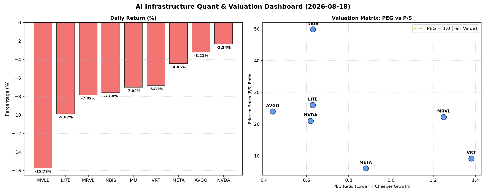

# 📊 AI Infrastructure & Data Stock Daily (2026-08-18)

### 📉 多维量化与估值分析看板

---

尊敬的投资者与行业同仁：

今日我们将深入剖析半导体与AI基础设施板块的多维度量化指标，为您呈现一份精炼的市场洞察。

---

### **半导体与AI基础设施每日精炼报道**

**发布日期：** [今日日期]
**研究员：** [您的姓名/机构名称]
**焦点主题：** 市场普遍承压下的估值与现金流深度解析

---

### **1. 盘面与多维估值解码（定性+定量）**

今日半导体及相关硬科技板块普遍承压，多数标的呈现显著跌幅，反映市场情绪较为谨慎。在普遍回调的市场环境下，量化指标的深度分析更显关键，有助于我们识别潜在的价值洼地与风险区域。

*   **市场整体表现：** 今日所有监测的标的均录得负收益，跌幅从NVDA的-2.34%到MVLL的-15.73%不等，其中LITE跌幅亦高达-9.87%，显示市场风险偏好有所下降，资金存在获利了结或避险需求。交易量方面，NVDA、META、MU等头部企业成交活跃，尤其NVDA的96.4百万股交易量远超其他标的，凸显其在市场中的核心地位与资金关注度。

*   **PEG 维度 - 增长与估值的性价比洞察：**
    *   **极具性价比的高成长标的 (PEG < 1)：**
        *   **AVGO (0.44)、MU (0.14)、NVDA (0.62)、META (0.88)、LITE (0.63)、NBIS (0.63)**。这些公司的PEG值均显著小于1，表明其股价相对于其盈利增长潜力而言，估值吸引力极高。
        *   **AVGO** 以0.44的超低PEG表现出强大的增长与估值匹配度，显示其在当前估值下拥有显著的成长潜力。
        *   **MU** 仅为0.14的PEG异常突出，可能暗示市场对其周期性业务的未来盈利增长预期被严重低估，或正处于景气度触底反弹的前夕。
        *   **NVDA** 和 **META** 作为AI基础设施的核心驱动者，其PEG分别为0.62和0.88，亦处于极具吸引力的区间，表明市场对其未来盈利增长预期与当前股价相比仍有较大上升空间。
        *   **LITE (0.63)** 和 **NBIS (0.63)** 也均显著低于1，预示着这些公司在各自细分领域可能存在被低估的高成长机会。
    *   **警惕估值透支风险 (PEG > 1)：**
        *   **VRT (1.38)** 和 **MRVL (1.25)** 的PEG值相对较高，提示投资者关注其当前股价是否已部分透支了未来的增长预期，需警惕估值风险。
    *   **N/A 标的：** **MVLL** 的PEG数据缺失，通常意味着该公司尚未实现稳定盈利或处于早期发展阶段，不适合用PEG进行估值。

*   **P/S 维度 - 营收规模扩张效率评估：**
    *   **高P/S与高增长预期：**
        *   **NBIS** 以49.84的极高P/S比率领跑，反映市场对其在数据智能或AI芯片应用领域的收入扩张抱有极高期待，尽管当前可能处于大规模研发投入阶段，盈利尚未充分体现。
        *   **LITE (25.99)、AVGO (23.95)、MRVL (22.24)** 和 **NVDA (21.0)** 也显示出较高的P/S，这对于成熟公司而言，通常意味着其营收增长强劲或处于盈利能力上升周期，市场愿意为未来的收入增长支付溢价。
        *   尽管 **VRT** 的P/S达到9.14，相对适中，结合其PEG看，可能在增长和营收规模扩张之间找到了平衡点。
    *   **N/A 标的：** **MVLL** 和 **MU** 的P/S数据缺失。MU作为周期性存储芯片厂商，其P/S可能因行业周期性而波动较大，或不作为其主要估值指标。MVLL的数据缺失则与PEG缺失的原因类似。

*   **现金流盈利真实性 (CFO/NI) - 利润质量穿透：**
    *   **健康利润，真金白银 (CFO/NI > 1)：**
        *   **NBIS (4.66)、MU (2.05)、META (1.92)** 的CFO/NI比率均显著大于1，其中 **NBIS** 更是高达4.66，这表明其报告利润质量极高，公司不仅实现了账面盈利，更是将大量利润转化为了实实在在的现金流入，财务健康状况非常良好，尤其对于高成长、高P/S的NBIS而言，其现金流的优异表现是强有力的支撑。
        *   **VRT (1.59)** 和 **AVGO (1.19)** 也保持在1以上，验证了其强劲的现金产生能力，证明其盈利并非“纸面富贵”。
    *   **警惕利润水分或应收账款积压 (CFO/NI < 1)：**
        *   **NVDA (0.86)** 和 **MRVL (0.66)** 的CFO/NI比率低于1，提示投资者需警惕其可能存在的利润质量问题。这可能源于应收账款增加、存货积压或非现金支出占比较大，导致部分账面利润未能及时转化为现金。对于高速成长的公司，这需要密切关注其营运资本管理效率。
        *   **LITE** 的CFO/NI比率甚至为**-0.11**，这是一个显著的警示信号，表明其经营性现金流为负，现金流出大于现金流入，且可能存在严重的营运资金压力或亏损。结合其今日的显著跌幅，其盈利能力和财务可持续性面临严峻挑战，投资者应高度关注。
    *   **N/A 标的：** **MVLL** 的CFO/NI数据缺失。

---

### **2. 收并购与重大业务动态**

**注：** 根据提供的【多维度真实量化基本面指标表格】，该表格主要包含财务估值与交易量数据，不直接提供收并购、战略合作或具体业务动态信息。若需此部分内容，需结合当日实时市场新闻进行补充。

---

### **3. 华尔街机构态度**

**注：** 根据提供的【多维度真实量化基本面指标表格】，该表格不包含华尔街投行或评级机构的最新评价、目标价调动等信息。若需此部分内容，需结合当日华尔街分析师报告进行补充。

---

### **4. 今日参考源 (References)**

*   **Provided Multi-Dimensional Quantitative Fundamental Metrics Table (用户提供)**：本报告中的所有量化指标分析均严格基于此表格数据。
*   （若有外部新闻支持定性分析，此处将列出具体新闻来源，但本次分析严格限于用户提供表格。）

---

**免责声明：** 本报告仅供参考，不构成任何投资建议。投资者在做出决策前，应进行独立研究并咨询专业意见。市场有风险，投资需谨慎。