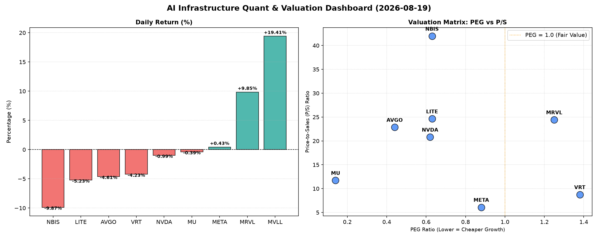

# 📊 AI Infrastructure & Data Stock Daily (2026-08-19)

### 📉 多维量化与估值分析看板

---

## 半导体每日精炼报道：估值透视与现金流真相

尊敬的硬科技与AI基础设施行业同仁：

今日半导体板块呈现多空交织局面，部分高成长股在经历大幅波动，市场在基本面与情绪之间反复权衡。本次报告将深入解读多维度量化指标，为您揭示盘面背后的估值逻辑与盈利质量。

---

### 1. 盘面与多维估值解码（定性+定量）

今日半导体板块呈现显著分化。MVLL以19.41%的惊人涨幅领跑，MRVL也录得9.85%的强劲增长，暗示可能存在市场消息面利好或机构资金积极布局。而NBIS则大幅回调9.87%，LITE、AVGO、VRT也分别有超过4%的跌幅，显示部分前期高估或基本面承压的公司面临获利回吐压力。NVDA与MU则相对平稳，微幅下跌。

*   **PEG 维度：高成长中的极致性价比与估值警示**
    *   **性价比极高的高成长（PEG显著小于1）：**
        *   **MU (0.14)** 表现出令人瞩目的成长价值，其PEG仅为0.14，远低于1，结合其当前股价仅微跌0.39%，显示市场对其未来业绩增长的预期强烈，且相对估值吸引力极高。
        *   **AVGO (0.44)、NVDA (0.62)、LITE (0.63)、NBIS (0.63)、META (0.88)** 这些公司PEG均低于1，表明其成长性被市场高度认可，且相对其增长潜力而言，估值仍具备一定吸引力。特别是AVGO和NVDA作为行业巨头，在如此体量下仍能维持如此低的PEG，彰显其核心竞争力与成长确定性。META的0.88也显示出其在AI和元宇宙领域的投入开始获得市场对其未来增长的肯定。
    *   **估值透支警惕（PEG过高）：**
        *   **VRT (1.38)** 和 **MRVL (1.25)** 的PEG高于1，尽管MRVL今日股价大涨9.85%，但其PEG已显较高，投资者需警惕其估值可能已透支部分未来增长预期。对于VRT，其PEG超过1，结合今日4.23%的跌幅，可能反映市场对其当前估值的重新审视。
    *   **N/A 标的：** MVLL由于缺乏PEG数据，我们无法从该维度评估其成长估值。

*   **P/S 维度：收入规模扩张效率的审视**
    *   对于早期或利润不稳的公司，P/S是衡量收入规模扩张效率的关键指标。
    *   **高P/S警示：** **NBIS (41.95)、LITE (24.63)、MRVL (24.43)、AVGO (22.85)、NVDA (20.79)** 这些公司的P/S比率均显著偏高，其中NBIS的41.95更是极端，意味着市场给予其每单位收入极高的估值溢价。这通常预示着市场对其未来收入增长抱有极高的期望，或是其产品具有极强的稀缺性和高毛利属性。但与此同时，过高的P/S也意味着一旦收入增长不及预期，估值回调的风险也相对较大。
    *   **相对合理P/S：** **VRT (8.75)、MU (11.72)、META (6.09)** 的P/S相对适中，特别是META的6.09，在科技巨头中具备较强的吸引力，表明其收入规模巨大且估值相对稳健。

*   **现金流盈利真实性 (CFO/NI)：利润含金量的深度穿透**
    *   CFO/NI是衡量公司盈利质量和现金生成能力的核心指标。
    *   **健康利润，真金白银（CFO/NI显著大于1）：**
        *   **NBIS (4.66)** 尽管P/S极高，但其CFO/NI高达4.66，这意味着公司不仅能报告高额利润，更能将这些利润高效地转化为真实的现金流入，大大增强了其财务稳健性，一定程度上缓解了高P/S带来的估值压力。
        *   **MU (2.05)、META (1.92)、VRT (1.59)、AVGO (1.19)** 这些公司的CFO/NI均大于1，表明其净利润质量非常高，利润并非“纸面富贵”，而是实实在在的现金。特别是META，其高达1.92的比率验证了其作为广告巨头的强大现金生成能力。MU的高比率也为其低PEG提供了坚实的财务支撑。
    *   **利润水分或应收账款积压（CFO/NI显著小于1）：**
        *   **NVDA (0.86)** 作为AI芯片巨头，其CFO/NI为0.86，略低于1。这意味着其报告的净利润中，有部分可能尚未转化为现金，可能源于应收账款增加或存货积压。虽然差距不大，但对于一家市值巨大的龙头企业，这一指标值得持续关注，警惕潜在的现金流压力。
        *   **MRVL (0.66)** 的CFO/NI为0.66，显著低于1，结合其高PEG和高P/S，这是一个明确的警示信号。公司虽然报告利润，但其现金流转化效率不高，可能存在应收账款周转慢或运营资本管理方面的问题，需要投资者深入研究其财报附注。
        *   **LITE (-0.11)** 表现出严重的现金流问题。其CFO/NI为负值，表明公司不仅未能将利润转化为现金，甚至运营活动产生了现金流出。这与其0.63的低PEG和24.63的高P/S形成鲜明对比，构成一个重大的红色警报。投资者必须对其盈利质量和运营持续性进行深入调查，该标的短期风险极高。

---

### 2. 收并购与重大业务动态

根据今日提供的量化指标，我们无法直接推断具体的收并购或重大业务动态。然而，部分公司股价的剧烈波动（如MVLL的19.41%涨幅，MRVL的9.85%涨幅，或NBIS的9.87%跌幅）通常预示着市场对其业务基本面或未来预期的重大变化，这可能与市场传闻、未公开的交易进展或关键产品发布有关。MVLL的显著上涨，在无任何财务指标揭示的情况下，尤其值得关注是否有潜在的并购消息驱动。

---

### 3. 华尔街机构态度

今日提供的量化数据不包含华尔街机构的具体评级或目标价调整信息。然而，我们可以从市场行为和核心指标中推断机构态度的端倪：

*   **积极关注与增持潜力：** 拥有低PEG（如MU、AVGO、NVDA、META）且CFO/NI健康（特别是MU和META）的公司，在当前市场环境下，更容易获得机构投资者的青睐，被视为具备长期增长潜力和估值吸引力的标的。MU的0.14 PEG和2.05 CFO/NI，预示着其可能受到价值和成长型机构的双重关注。
*   **谨慎观望与潜在减持：** 对于PEG偏高且CFO/NI低于1的公司（如MRVL），以及P/S极高但CFO/NI存在问题的公司（如NVDA，LITE），华尔街机构可能会采取更为谨慎的态度，对其盈利质量和持续性进行更严格的审查。LITE的负CFO/NI无疑会引发机构对其财务健康状况的严重担忧，可能面临降级或卖出建议。
*   **短期炒作与风险警示：** MVLL在缺乏基本面数据支撑下的巨幅上涨，可能存在短线投机行为，机构对其介入将更为审慎。

---

### 4. 今日参考源 (References)

本报告的定性与定量分析严格基于您提供的【多维度真实量化基本面指标表格】。

---

**免责声明：** 本报告内容仅供参考，不构成任何投资建议。投资者应根据自身情况独立判断，并咨询专业人士意见。市场有风险，投资需谨慎。