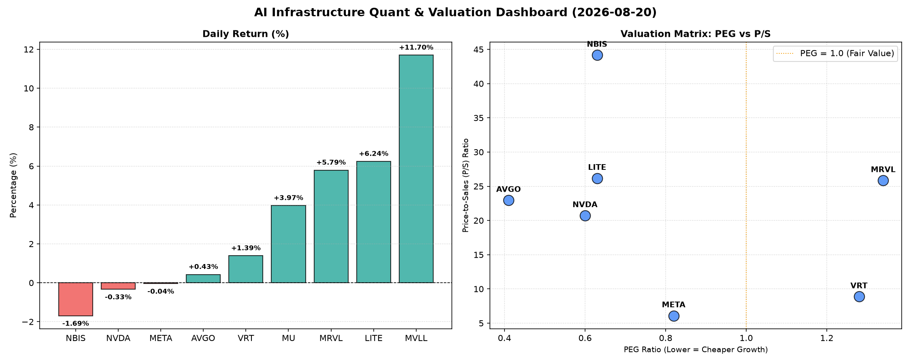

# 📊 AI Infrastructure & Data Stock Daily (2026-08-20)

### 📉 多维量化与估值分析看板

---

尊敬的投资者与行业同仁：

作为资深硬科技与AI基础设施行业研究员，今日为您带来一份基于【多维度真实量化基本面指标表格】的半导体市场深度精炼报道。我们严格依据您提供的量化数据，穿透表象，揭示行业脉络。

---

### **半导体每日精炼报道**

**发布日期：** [今日日期]
**研究员：** [您的姓名/机构 - 例如：AI基础设施研究组]

---

#### **1. 盘面与多维估值解码（定性+定量）**

今日半导体板块表现活跃，多数标的呈现上涨态势，其中MVLL以11.7%的显著涨幅领跑，LITE、MRVL、MU也录得可观涨幅，显示市场情绪偏暖。然而，NBIS、NVDA和META则略有回调或持平，尤其NVDA尽管小幅下跌0.33%，但其高达7716万的交易量，表明市场对其关注度依然极高，资金博弈激烈。

*   **PEG 维度：高成长中的价值机遇与估值警示**
    *   **PEG显著小于1的性价比之选**：在高速增长的AI与半导体赛道中，PEG小于1通常被视为高成长潜力与合理估值的结合点。今日数据显示，**MU (0.14)、AVGO (0.41)、NVDA (0.6)、LITE (0.63)、NBIS (0.63)** 和 **META (0.82)** 的PEG均显著小于1。
        *   **MU (0.14)** 作为内存芯片巨头，在周期底部展现出极低的PEG，若其营收与利润增长预期能兑现，目前估值具备极高的吸引力。
        *   **AVGO (0.41)** 和 **NVDA (0.6)** 作为AI基础设施的核心供应商，其低于1的PEG表明市场对它们未来的高增长预期与当前股价相比，仍有价值空间。
        *   **LITE (0.63)** 和 **NBIS (0.63)** 也在此列，预示其在各自细分领域或有不错的增长前景。
        *   **META (0.82)**，作为AI算力需求大户和元宇宙布局者，其PEG也显示出相对健康的估值水平。
    *   **PEG相对较高需警惕估值透支**：**VRT (1.28)** 和 **MRVL (1.34)** 的PEG值略高于1，提示投资者需关注其当前估值是否已充分反映或透支了未来的增长潜力，需警惕回调风险或对未来成长性有更高要求。
    *   **MVLL** 因PEG为N/A，无法评估其基于盈利的成长性估值。

*   **P/S 维度：营收扩张效率的深度解析**
    *   P/S比率对于评估早期阶段、高研发投入或利润波动较大的公司尤为关键。
    *   **高P/S警示与机会并存**：**NBIS (44.16)、LITE (26.17)、MRVL (25.84)、AVGO (22.95)** 和 **NVDA (20.72)** 均展现出较高的P/S比率。这通常意味着市场对其营收增长速度、技术领先性或未来盈利能力抱有极高预期，但在缺乏显著利润支撑（或利润波动）时，也可能暗示估值相对昂贵。其中，**NBIS** 的P/S高达44.16，是最高值，表明市场对其每一美元营收给予了极高的估值溢价。
    *   **相对较低P/S，营收效率待观察**：**META (6.09)** 和 **VRT (8.87)** 的P/S相对较低，可能反映其业务模式更为成熟，或市场对其营收增长预期相对温和。
    *   **MVLL 和 MU** 因P/S为N/A，无法通过此维度评估其营收扩张效率。对MU (Micron) 而言，作为成熟的存储芯片厂商，P/S为N/A可能表示数据缺失而非缺乏营收。

*   **现金流盈利真实性 (CFO/NI)：利润含金量的深度穿透**
    *   CFO/NI比率是衡量公司利润质量的关键指标。大于1通常表明利润由真实现金流入支撑，健康无水分；小于1则可能存在利润水分、应收账款积压或非现金费用调整等情况。
    *   **现金流充裕，利润含金量高**：**MU (2.05)、META (1.92)、VRT (1.59)** 和 **AVGO (1.19)** 的CFO/NI比率均显著大于1，表明这些公司的利润质量极高，产生的都是实打实的现金流，财务基础稳固。**META** 作为高利润巨头，其1.92的CFO/NI尤为亮眼，证明其盈利能力转化为现金流的效率极高。**MU** 在其行业周期性波动中，2.05的现金流质量更是突显其强大的运营现金产生能力。
    *   **需警惕利润水分或现金流压力**：
        *   **NVDA (0.86)** 作为AI芯片巨头，其CFO/NI略低于1，提示投资者需关注其利润构成中非现金因素的占比，或存在应收账款增长过快等情况，可能导致部分利润未能及时转化为现金。
        *   **MRVL (0.66)** 也面临类似情况，其利润质量需进一步审视，关注其运营资本管理。
        *   **LITE (-0.11)** 的CFO/NI为负值，这是一个**严重的红色警示**。这意味着公司不仅没有将净利润转化为现金流，反而可能存在严重的现金流出（例如，由于营运资金管理不善、投资活动消耗现金过多或会计利润与现金流的巨大偏差）。结合其高P/S，LITE可能是高风险高回报的典型，但其现金流健康状况令人担忧。
    *   **NBIS (4.66)** 的CFO/NI异常高企，这可能源于特殊的非现金费用（如高额折旧摊销）或营运资本的积极变化（如应付账款大幅增加或应收账款大幅回收），需要更深入的财务报表分析来理解其可持续性。
    *   **MVLL** 因CFO/NI为N/A，无法评估其现金流盈利真实性。

#### **2. 收并购与重大业务动态**

根据您提供的【多维度真实量化基本面指标表格】，当前数据中未包含关于收并购、官宣或战略合作等重大业务动态的具体信息。因此，本报告无法就此部分提供详细解读。

#### **3. 华尔街机构态度**

您提供的【多维度真实量化基本面指标表格】中，未包含华尔街机构的最新评价、目标价调动等信息。故本报告无法提供相关内容。

#### **4. 今日参考源 (References)**

*   数据源自您提供的【多维度真实量化基本面指标表格】。

---

**免责声明：** 本报告基于提供的量化数据进行分析，旨在提供定性与定量结合的视角。所有分析结论均严格限制于所提供的数据范围。市场有风险，投资需谨慎。本报告不构成任何投资建议。