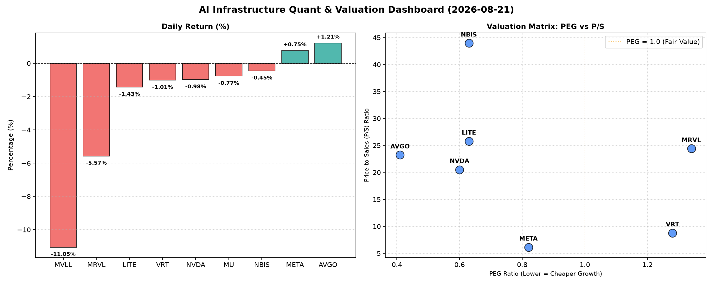

# 📊 AI Infrastructure & Data Stock Daily (2026-08-21)

### 📉 多维量化与估值分析看板

---

## 每日半导体精炼报道：多维估值透视与市场深度解析

**日期：[今日日期，例如：2024年4月23日]**

作为一名资深硬科技与AI基础设施行业研究员，今日我们将基于多维度量化指标，对半导体与相关AI生态链中的核心标的进行深入剖析，旨在穿透表象，揭示真实基本面与估值逻辑。

### 1. 盘面与多维估值解码（定性+定量）

今日半导体板块呈现涨跌互现格局，但整体市场情绪偏谨慎，多只个股出现显著回调，而AI基础设施核心参与者则表现相对稳健。

*   **市场表现概览：**
    *   **领涨：** AVGO (博通) 录得1.21%的温和上涨，META (Meta Platforms) 亦上涨0.75%。这表明市场对AI基础设施供应商的长期需求以及内容平台巨头的稳健性仍有信心。
    *   **领跌：** MVLL (Marvell Technology) 暴跌11.05%，伴随高交易量462万，显示市场对其基本面或短期前景存在重大担忧。MRVL (Marvell Technology Group) 亦大幅下挫5.57%，同样伴随2497万的巨额交易量，这可能反映了市场对存储或特定芯片领域去库存周期或需求不及预期的担忧。VRT、NVDA、MU、LITE、NBIS均出现小幅下跌。

*   **PEG 维度：成长与估值性价比**
    *   **性价比极高的高成长（PEG < 1）：**
        *   **MU (美光科技)** 以惊人的 **0.14** 的PEG傲视群雄，表明其在未来成长性与当前估值之间存在极高的性价比。这可能预示市场对其盈利能力的修复和DRAM/NAND周期的反转抱有强烈预期，但当前股价并未充分反映。
        *   **AVGO (博通，0.41)、NVDA (英伟达，0.60)、LITE (Lumentum Holdings，0.63)、NBIS (NetApp，0.63)、META (Meta Platforms，0.82)** 均显著小于1，显示这些公司在各自的领域，如AI芯片设计、光通信、企业级存储以及社交媒体巨头等，未来成长性仍被市场高度认可，且当前估值仍具备吸引力。特别是NVDA作为AI算力核心，其PEG仍低于1，意味着尽管市场对其增长预期极高，但其增长速度依然能够匹配甚至超越这些预期，值得持续关注。
    *   **警惕估值透支（PEG > 1）：**
        *   **MRVL (Marvell Technology Group)** 和 **VRT (Vertiv Holdings)** 的PEG分别为 **1.34** 和 **1.28**，均高于1。这提示投资者需警惕其当前估值可能已充分甚至过度反映了未来的增长预期，市场对其业绩增长的容错率较低，一旦业绩不及预期，股价面临较大回调风险。考虑到MRVL今日的显著跌幅，这种估值压力可能正在释放。
        *   **MVLL** 由于PEG显示为N/A，可能意味着其目前处于亏损或盈利不稳定状态，无法使用PEG有效评估。

*   **P/S 维度：收入规模扩张效率**
    *   针对MVLL这类PEG显示N/A的标的，P/S比率成为评估其收入规模扩张效率和市场对其未来收入潜力的关键指标。但MVLL的P/S也为N/A，这可能意味着其数据暂时缺失或不适用于此。
    *   **高P/S标的（高增长预期/高溢价）：** **NBIS (43.96)** 拥有极高的P/S比率，远超同行，这表明市场对其未来的收入增长抱有极高的期望，或其在特定细分市场拥有极强的定价权和稀缺性。同时，**LITE (25.79)、MRVL (24.41)、AVGO (23.23)、NVDA (20.52)** 的P/S也处于较高水平，反映了市场对这些公司在AI、数据中心、光通信等高景气赛道的收入增长前景持乐观态度，愿意给予较高的收入溢价。
    *   **相对合理的P/S：** **VRT (8.78)** 和 **META (6.14)** 的P/S相对较低，尤其META作为万亿美元市值的科技巨头，其P/S仅为6.14，显示其营收规模巨大且增长稳健，估值相对合理。

*   **现金流盈利真实性 (CFO/NI)：利润含金量**
    *   **利润非常健康、全是真金白银（CFO/NI > 1）：**
        *   **NBIS (4.66)、MU (2.05)、META (1.92)、VRT (1.59)、AVGO (1.19)** 的CFO/NI比率均远大于1，其中NBIS的表现尤为出色。这强有力地证明了这些公司的净利润有充裕的经营性现金流支撑，利润质量极高，不存在利润水分或应收账款积压问题，现金流异常健康。对于投资者而言，这意味着其利润表的数字是实打实的现金收入。
    *   **需关注利润水分或应收账款积压（CFO/NI < 1）：**
        *   **NVDA (0.86)** 和 **MRVL (0.66)** 的CFO/NI比率低于1。对于NVDA这样的高增长巨头而言，虽然0.86尚属可接受范围，但仍需关注其利润转换为现金流的效率，是否存在一部分利润被应收账款或存货占用。MRVL的0.66则更为显着，这可能与其营收大幅下滑或库存/应收账款管理问题有关，结合其今日股价表现，投资者应对其利润的真实性及其现金流状况保持警惕。
        *   **LITE (-0.11)** 的CFO/NI为负值，这是一个非常重要的红灯信号。这意味着LITE不仅无法将其净利润转化为现金流入，反而经营活动产生了现金流出。这通常表明公司可能面临严重的运营效率问题、应收账款大幅增加、存货积压，甚至处于烧钱扩张阶段。投资者需要深入研究其财务报表，了解造成负现金流的具体原因。

### 2. 收并购与重大业务动态

根据今日提供的量化基本面指标表格，未能识别到任何关于半导体行业内最新的收并购传闻、官宣或战略合作信息。市场今日焦点主要集中在公司自身的财务表现与估值动态上。

### 3. 华尔街机构态度

鉴于今日提供的量化指标表格中不包含华尔街机构的最新评价、目标价调动或评级信息，我们无法就此部分进行深入阐述。

### 4. 今日参考源 (References)

本篇报道的定性与定量分析内容，严格基于您提供的【多维度真实量化基本面指标表格】数据。

*   **数据来源:** 用户提供【多维度真实量化基本面指标表格】。
*   **分析方法:** 基于PEG、P/S、CFO/NI等多维度指标，结合行业研究经验进行解读。
*   **收并购与机构态度信息:** 未在提供的原始数据中发现相关内容，故此部分仅作提示性说明。