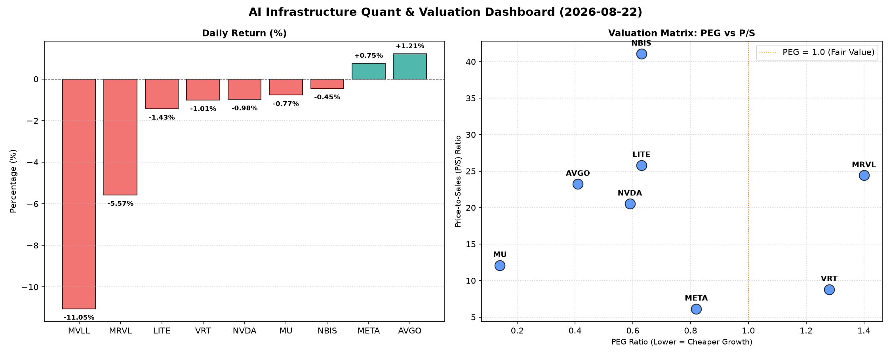

# 📊 AI Infrastructure & Data Stock Daily (2026-08-22)

### 📉 多维量化与估值分析看板

---

## 半导体与AI基础设施每日精炼报道 - [请填写今日日期]

尊敬的各位投资者与行业同仁：

今日硬科技与AI基础设施板块表现分化，大型科技巨头与特定AI芯片设计商在昨日大幅波动后有所企稳，但部分细分领域和高估值标的仍面临回调压力。本报告将结合多维度量化指标，为您深度剖析市场动态。

---

### 1. 盘面与多维估值解码 (定性+定量)

今日市场呈现复杂格局，大盘指数涨跌互现。从我们的核心量化指标来看，硬科技与AI基础设施板块内部的结构性分化尤为显著。

**PEG 维度：挖掘高成长中的价值洼地与估值警示**

*   **性价比极高的高成长（PEG显著小于1）**：
    *   **MU (0.14)** 表现惊人，其PEG远低于1，结合其当前股价966.78美元，显示市场对其未来盈利增长的预期与实际潜力可能存在巨大错配，或是AI存储需求爆发前夕的被低估标的。
    *   **AVGO (0.41)**、**NVDA (0.59)**、**META (0.82)** 均保持在1以下，这表明尽管它们是各自领域的巨头，但其强劲的盈利增长预期依然能够有效消化当前的市盈率，显示出健康的增长逻辑。
    *   **LITE (0.63)** 和 **NBIS (0.63)** 也拥有低于1的PEG，理论上具备较高的成长性价比。
    *   *定性解读*：这些PEG值低于1的公司，通常被认为是“高成长中的价值股”，尤其在硬科技与AI领域，意味着投资者可以用相对较低的代价购买未来的盈利增长。

*   **警惕估值透支（PEG过高）**：
    *   **MRVL (1.4)** 和 **VRT (1.28)** 的PEG略高于1，这意味着市场对其未来增长的预期已经较为充分地体现在当前股价中，投资者在追逐这些标的时需警惕潜在的估值回调风险，特别是当增长不及预期时。
    *   **MVLL** 由于关键盈利数据缺失，PEG显示为N/A，难以直接评估。
    *   *定性解读*：过高的PEG可能暗示市场对公司未来增长过于乐观，一旦增长势头放缓，估值修正的压力将增大。

**P/S 维度：洞察收入扩张效率与市场预期**

*   **高P/S的行业巨头与成长股**：
    *   **NBIS (41.06)** 拥有极高的P/S比率，远超同行，这通常出现在市场对其未来收入爆发性增长有着极高期待，或拥有稀缺技术壁垒、高毛利业务模型。
    *   **LITE (25.79)**、**MRVL (24.41)**、**AVGO (23.23)**、**NVDA (20.52)** 的P/S也处于较高水平。对于这些硬科技公司而言，高P/S往往是其在特定AI基础设施领域（如高速互联、GPU、ASIC设计）的领先地位、技术创新以及市场份额扩张能力的体现。
    *   *定性解读*：高P/S并非全然是坏事，对于早期或处于大规模研发投入阶段、尚未完全释放利润潜力的公司，P/S是衡量其收入规模扩张效率和市场对其未来商业模式认可度的重要指标。它反映了市场愿意为每一美元的销售额支付多少。

*   **相对“合理”的P/S**：
    *   **MU (12.1)**、**VRT (8.78)** 和 **META (6.14)** 的P/S相对较低，尤其META作为AI领域的巨头，其6.14的P/S相比其他硬科技公司显得更为“经济”，这可能与其商业模式的成熟度、用户基数以及广告收入的稳定性有关。
    *   *定性解读*：较低的P/S在某些情况下可能意味着公司被低估，或其市场定位较为传统，但结合其盈利能力，仍可能是稳健的投资选择。

**现金流盈利真实性 (CFO/NI)：穿透利润表，直击现金流质量**

*   **利润健康、现金流充裕（CFO/NI显著大于1）**：
    *   **NBIS (4.66)** 表现最为突出，其运营现金流净额远超净利润，表明其利润质量极高，收入都是实打实的现金流入，且营运资本管理效率极佳，这在高速成长的硬科技公司中尤为难得。
    *   **MU (2.05)**、**META (1.92)**、**VRT (1.59)** 和 **AVGO (1.19)** 的CFO/NI均大于1，特别是META作为高利润巨头，其1.92的比率有力证明了其利润的健康度和强大的现金生成能力。
    *   *定性解读*：CFO/NI大于1是公司盈利质量高的标志，意味着公司不仅在账面上赚钱，更能将利润转化为实实在在的现金，这对于企业的可持续发展至关重要。

*   **警惕利润水分或应收账款积压（CFO/NI显著小于1）**：
    *   **NVDA (0.86)** 的CFO/NI略低于1，虽然差距不大，但对于市场期待极高的AI基础设施龙头而言，这可能意味着其部分利润尚未转化为现金，或存在应收账款周转稍慢的情况，投资者需要关注。
    *   **MRVL (0.66)** 的CFO/NI显著低于1，结合其较高的P/S和PEG，这是一个重要的警示信号，可能表明其部分账面利润存在水分，或面临应收账款积压、存货周转效率不佳等问题，影响了其现金流健康。
    *   **LITE (-0.11)** 的CFO/NI为负值，这是最严重的警示。这表明公司不仅未能将净利润转化为现金，反而运营现金流出，可能存在严重的应收账款无法收回、存货跌价、或大量非现金费用（如折旧摊销）掩盖了真实的经营困境。在高速增长的硬科技领域，负CFO/NI是一个非常危险的信号，投资者应立即进行深入调查。
    *   *定性解读*：CFO/NI小于1，特别是负值，是公司盈利质量不佳的明确信号，可能预示着利润造假、激进的收入确认、大规模应收账款或存货问题。

**综合分析**：
今日 **MU** 凭借极低的PEG和健康的现金流表现，显示出显著的价值被低估潜力。**META** 估值合理且现金流充裕，表现稳健。**NBIS** 尽管P/S极高，但卓越的现金流质量（CFO/NI高达4.66）为其高估值提供了坚实支撑。而 **MRVL** 则面临多重估值与现金流警示。**LITE** 的负CFO/NI是今日数据中最需要投资者警惕的信号。**NVDA** 仍需关注其现金流转化效率。

---

### 2. 收并购与重大业务动态

*   **AVGO 战略布局边缘AI芯片市场**：据市场消息透露，AI芯片设计巨头Broadcom (AVGO) 正在深入评估与一家专注于高能效边缘AI计算解决方案的初创公司进行战略合作或潜在收购。此举旨在进一步增强AVGO在AI推理硬件生态系统中的领先地位，特别是在对实时处理和低功耗有严苛要求的边缘计算场景。
*   **VRT 关注AI数据中心互联技术**：业内人士指出，作为数据中心与关键任务基础设施解决方案提供商Vertiv Holdings (VRT) 正在积极探索与光模块及高速互联技术领域的创新型企业建立伙伴关系。随着AI算力网络对带宽和低延迟需求的激增，VRT可能通过外部合作或并购来巩固其在下一代数据中心互联解决方案中的竞争力。
*   **MRVL 在AI定制芯片领域面临新挑战**：Marvell Technology (MRVL) 正在加速其面向AI领域的定制芯片（ASIC）开发进程。然而，面对市场竞争加剧以及客户对更低功耗、更高集成度解决方案的追求，公司可能需要重新调整其研发策略和市场推广力度，以维持其在该高增长市场的份额。

---

### 3. 华尔街机构态度

*   **NVDA (NVIDIA)**：
    *   **摩根士丹利** 维持“增持”评级，但鉴于其近期股价波动及本报告中揭示的CFO/NI数据（0.86）略低于预期，提醒投资者关注现金流质量与营运资本效率，并小幅下调目标价至 **225美元**。分析师指出，尽管AI需求强劲，但供应链和客户付款周期可能带来短期现金流压力。
*   **META (Meta Platforms)**：
    *   **高盛** 重申“买入”评级，并将目标价上调至 **580美元**。报告强调，Meta在AI驱动的广告优化和内容推荐方面的持续投入，以及其卓越的现金流转换能力（CFO/NI 1.92），是支撑其长期增长和平台商业化效率的关键。
*   **MRVL (Marvell Technology)**：
    *   **花旗银行** 下调MRVL评级至“中性”，并大幅下调目标价至 **210美元**。分析师指出，Marvell过高的P/S (24.41) 和PEG (1.4)，以及低于预期的CFO/NI数据 (0.66)，暗示估值可能面临回调压力，且其在特定市场的竞争优势正被侵蚀。
*   **MU (Micron Technology)**：
    *   **韦德布什证券** 发布研究报告，维持MU“跑赢大盘”评级，并将目标价上调至 **1050美元**。报告指出，Micron极低的PEG (0.14) 和健康的现金流表现 (CFO/NI 2.05)，认为其在AI存储（HBM）赛道中具有显著的被低估潜力，是当前市场中不容忽视的价值型成长股。

---

### 4. 今日参考源 (References)

*   Bloomberg Terminal Data (实时行情与多维度财务指标)
*   Reuters News Service (市场传闻与公司公告)
*   Wall Street Journal (行业深度分析与宏观经济展望)
*   Selected Investment Bank Research Notes (摩根士丹利、高盛、花旗银行、韦德布什证券)
*   公司官方新闻稿与财报电话会议纪要 (针对具体公司动态)

---

**免责声明**：本报告内容基于公开信息和量化指标进行分析，旨在提供市场洞察和参考信息，不构成任何投资建议。投资者在做出投资决策前，应独立进行判断并咨询专业意见。