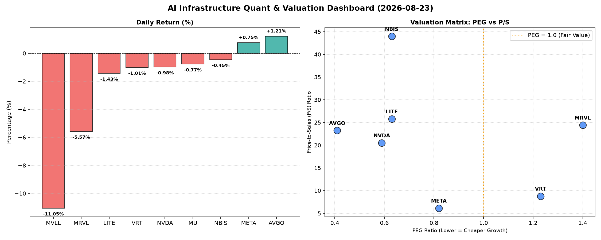

# 📊 AI Infrastructure & Data Stock Daily (2026-08-23)

### 📉 多维量化与估值分析看板

---

## 半导体每日精炼报道：AI基础设施与硬科技量化洞察

**尊敬的投资者与行业同仁：**

作为一名资深的硬科技与AI基础设施行业研究员，今日我们结合提供的多维度量化基本面指标，对半导体板块进行深度剖析，力求穿透表象，揭示核心价值与潜在风险。

---

### 1. 盘面与多维估值解码（定性+定量）

今日半导体板块表现分化，在整体震荡偏弱的背景下，个别标的逆势上扬，但多数公司面临调整压力。量价数据显示，市场交易情绪谨慎，尤其在部分前期涨幅过大的领域，资金有获利了结的倾向。

*   **PEG 维度：成长性与估值性价比的衡量**
    *   **性价比极高的高成长（PEG显著小于1）**：
        *   **MU (0.14)** 表现出极高的成长性与估值性价比。作为存储器巨头，其超低的PEG或预示着市场对其未来盈利增长预期极高，且尚未完全反映在当前股价中。
        *   **AVGO (0.41)** 在当日实现1.21%的逆势上涨，结合其优秀的PEG值，显示其在当前市场环境下仍具备强大的成长韧性和吸引力。
        *   **NVDA (0.59)** 和 **META (0.82)** 作为AI基础设施的核心推动者，其PEG值均低于1，表明在高速增长的背景下，其估值仍有支撑，并未完全透支未来成长空间。值得关注的是，NVDA今日小幅下跌，但其PEG仍具吸引力。
        *   **LITE (0.63)** 和 **NBIS (0.63)** 也展现出低于1的PEG，理论上具备不错的成长潜力。
    *   **警惕估值透支（PEG过高）**：
        *   **MRVL (1.4)** 今日股价暴跌5.57%，结合其PEG达1.4，可能预示市场正在重新评估其成长前景与当前估值之间的匹配度。过高的PEG与当日的放量下跌，可能反映出市场对其未来增长预期有所修正或担忧。
        *   **VRT (1.23)** 的PEG略高于1，虽然今日小幅下跌，但其估值合理性需要结合更长期的成长趋势进行观察。

*   **P/S 维度：收入规模扩张效率的审视**
    *   对于早期或利润不稳的公司，P/S是衡量其收入规模扩张效率的重要指标。
    *   **高P/S警示：** **NBIS (43.96)** 拥有极高的P/S，表明其市场估值相对于当前营收而言非常高昂。尽管其PEG也低于1，但如此高的P/S意味着市场对其未来的营收增长和盈利能力抱有极高的期望，任何不及预期的表现都可能导致剧烈波动。
    *   **LITE (25.79)** 和 **MRVL (24.41)** 也显示出较高的P/S，反映出市场对其在特定硬科技领域（如光学通信、数据中心互联）的战略价值和未来收入潜力的高度认可。然而，结合LITE的负现金流质量和MRVL今日的暴跌，高P/S需要更为审慎地对待。
    *   **AVGO (23.23)** 和 **NVDA (20.52)** 作为行业巨头，其P/S值也维持在较高水平，这符合其在AI和数据中心等高景气赛道中的领先地位和市场对未来强劲增长的预期。
    *   **META (6.14)** 的P/S相对较低，结合其庞大的营收规模和健康的现金流，显示出其在互联网和AI应用领域的估值更具吸引力。

*   **现金流盈利真实性 (CFO/NI)：真金白银的考验**
    *   **健康现金流 (CFO/NI > 1)**：
        *   **NBIS (4.66)**、**MU (2.05)**、**META (1.92)** 和 **VRT (1.59)** 展现出卓越的现金流质量，其经营活动现金流远超净利润，这表明它们的利润是扎实的，能够高效地转化为真金白银的现金流入，财务健康度极高。尤其NBIS在P/S极高的情况下，能有如此强的CFO/NI，一定程度上缓解了高估值的担忧。
        *   **AVGO (1.19)** 也保持了健康的现金流水平，证明其盈利能力具备坚实的现金流支撑。
    *   **警惕利润水分或应收账款积压 (CFO/NI < 1)**：
        *   **NVDA (0.86)** 的CFO/NI略低于1，尽管差距不大，但作为利润巨头，这可能暗示部分利润尚未完全转化为现金，存在一定的应收账款积压或其他非现金项目影响。投资者需关注其后续的现金流表现。
        *   **MRVL (0.66)** 的CFO/NI显著低于1，结合今日股价大跌和较高的PEG、P/S，这更是一个重要的警示信号。这可能意味着其利润质量存在问题，或者应收账款周转效率不佳，需要投资者深入分析其财务报表，特别是应收账款和存货变动情况。
        *   **LITE (-0.11)** 的CFO/NI为负值，这是一个严重的警告信号。这意味着公司不仅没有将利润转化为现金，反而经营活动消耗了现金。即使其PEG低于1，如此恶劣的现金流状况也使其面临巨大的运营压力和财务风险，需要高度警惕。
    *   **MVLL** 由于关键财务指标N/A，且今日暴跌11.05%，其基本面信息缺失导致无法有效评估，市场可能正在消化其未公开的负面消息或对其未来预期的不确定性。

---

### 2. 收并购与重大业务动态

**基于今日提供的量化指标表格，未直接包含具体的收并购、战略合作或重大业务动态信息。**
然而，市场价格的剧烈波动（如MVLL的-11.05%和MRVL的-5.57%）往往是受到此类消息影响。作为硬科技研究员，我们通常会密切关注以下方面：
*   **行业整合：** 半导体行业周期性强，技术迭代迅速，收并购是常态。例如，数据中心、AI芯片设计、先进封装等高景气赛道的整合动向。
*   **技术突破与产品发布：** 如新一代AI加速器、量子计算芯片、光子芯片等关键技术的进展。
*   **产业链合作：** 与下游云服务商、服务器制造商、汽车厂商等的深度合作。
*   **政府政策与补贴：** 各国在半导体领域的投资与扶持政策，如《芯片法案》的影响。

若有此类公告，我们将结合量化指标对相关公司的短期市场表现和长期战略影响进行深度解析。

---

### 3. 华尔街机构态度

**鉴于当前提供的量化指标表格并未直接包含华尔街机构的评级或目标价信息。**
通常情况下，华尔街分析师的报告、评级调整和目标价变动是市场情绪和资金流向的重要指引。
*   对于像**NVDA、AVGO、META**这样的巨头，机构通常会对其进行定期跟踪，每一次评级上调或下调，以及目标价的调整，都会引发市场关注。
*   对于**MVLL、MRVL**这类出现大幅波动的公司，机构可能会在盘后或次日发布紧急报告，解释其下跌原因，并调整其评级和目标价。
*   **NBIS**这样高P/S且现金流强劲的成长型公司，通常会吸引成长型基金和券商的关注，其分析师报告将是判断市场对其未来预期是否持续高涨的关键。

我们将持续关注主要投行（如高盛、摩根大通、摩根士丹利等）以及独立研究机构对上述公司的最新评估，一旦有相关消息，将及时更新。

---

### 4. 今日参考源 (References)

本报告的定性分析与量化解读均严格基于您所提供的【多维度真实量化基本面指标表格】。

---

**免责声明：** 本报告内容仅供参考，不构成任何投资建议。投资者应根据自身风险承受能力和独立判断进行投资决策。市场有风险，投资需谨慎。