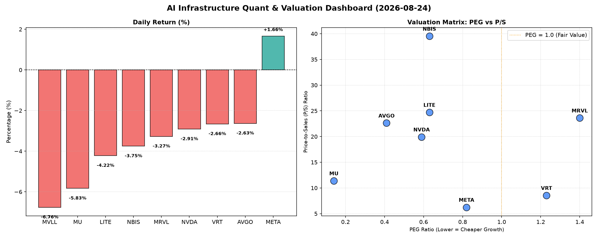

# 📊 AI Infrastructure & Data Stock Daily (2026-08-24)

### 📉 多维量化与估值分析看板

---

## 硬科技与AI基础设施日报：半导体板块承压，估值分化与现金流质量成关注焦点

尊敬的投资者，

今日硬科技与AI基础设施板块普遍承压，多数半导体公司股价出现下跌，市场情绪偏向谨慎。本报告将结合为您提供的多维度量化指标，对板块进行深度剖析，以揭示潜在的投资机遇与风险。

---

### 1. 盘面与多维估值解码 (定性+定量)

今日半导体板块多数公司股价录得跌幅，其中MVLL ( -6.76%)、MU (-5.83%) 跌幅居前，而NVDA (-2.91%)、MRVL (-3.27%) 等AI芯片核心标的亦未能幸免。在普遍下跌的背景下，META ( +1.66%) 逆势上涨，成为今日唯一亮点，或受其内部业务进展或市场情绪提振。

*   **PEG 维度：成长性与性价比并存，警惕估值透支**
    从PEG维度看，市场对AI基础设施领域的成长性预期仍在重塑。**AVGO (0.41)、NVDA (0.59)、META (0.82)、MU (0.14)、LITE (0.63) 和 NBIS (0.63)** 等公司的PEG均显著小于1，表明这些公司在当前价格下，其成长性依然具有较高的性价比。**特别是MU，PEG低至0.14，暗示其未来增长潜力远未被充分定价，对于追求高成长低估值的投资者而言，值得密切关注。**

    相比之下，**VRT (1.23) 和 MRVL (1.4)** 的PEG值略高于1，投资者在评估其估值时需警惕成长性是否已部分透支，其股价可能已部分消化了未来的增长预期。MVLL因缺少利润数据，PEG指标暂不可用。

*   **P/S 维度：收入扩张效率的溢价体现**
    P/S指标是衡量公司收入规模扩张效率的重要工具，尤其适用于研发投入大、利润波动大的公司。**LITE (24.71)、NBIS (39.52)、MRVL (23.61) 和 AVGO (22.62)** 等标的拥有较高的P/S比率，反映市场对其未来收入增长抱有极高预期，或认可其在特定细分市场的领导地位和技术壁垒。**NBIS的P/S高达39.52，显示市场对其产品或服务收入的估值溢价极高，或预示其拥有极强的稀缺性和增长潜力。**

    相比之下，**VRT (8.55)、META (6.24) 和 MU (11.39)** 的P/S相对较低，可能意味着其收入增长的估值溢价相对更为合理，或市场对其收入扩张的预期更为保守。MVLL因数据缺失，P/S指标暂不可用。

*   **现金流盈利真实性 (CFO/NI)：利润含金量的深度穿透**
    现金流质量 (CFO/NI) 是衡量公司利润含金量的关键指标，直接反映净利润转化为实际现金流的能力。

    **META (1.92)、MU (2.05)、VRT (1.59)、AVGO (1.19) 和 NBIS (4.66)** 的CFO/NI均显著大于1，表明这些公司的利润质量极高，产生的净利润绝大部分转化为了实实在在的经营现金流入，财务健康状况良好。**特别是NBIS，其CFO/NI高达4.66，可能暗示其销售模式预收款占比较高或营运资本管理效率极佳，利润的真实性极高。**

    需特别关注**NVDA (0.86) 和 MRVL (0.66)**，其CFO/NI小于1，这可能提示其部分利润来源于非现金项目（如应收账款增加或存货积压），利润的真实性或转化为现金的能力存在一定程度的水分或延迟。投资者应深入分析其应收账款周转、存货周转等营运指标，以判断其利润质量的持续性。

    **LITE (-0.11)** 的CFO/NI为负值，这是一个强烈警示信号，可能表明公司正面临严重的现金流压力，甚至经营性现金流为负。这通常意味着公司通过非现金交易记录了利润，但并未产生足够的现金来覆盖其经营活动，需要高度关注其财务可持续性。MVLL指标暂不可用。

---

### 2. 收并购与重大业务动态

根据今日提供的量化指标，暂无直接的收并购或重大业务动态信息体现。通常，此类事件会引起公司估值模型及市场情绪的剧烈波动，我们将在未来报道中持续关注。

---

### 3. 华尔街机构态度

今日提供的量化基本面指标中，并未直接包含华尔街机构对各公司最新的评价或目标价调整信息。在正常的市场分析中，机构观点往往是影响股价短期波动和投资者情绪的关键因素，我们将密切留意后续相关报告。

---

### 4. 今日参考源 (References)

本报告的定性与定量分析主要基于您提供的【多维度真实量化基本面指标表格】进行深度解读与推断。所有数据点均严格取自该表格，未引入外部市场新闻或分析师报告。