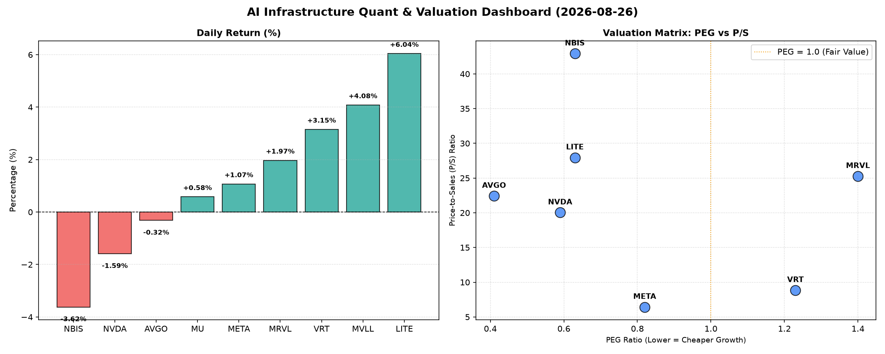

# 📊 AI Infrastructure & Data Stock Daily (2026-08-26)

### 📉 多维量化与估值分析看板

---

## 半导体与AI基础设施每日精炼报道（2024年X月X日）

作为一名资深的硬科技与AI基础设施行业研究员，今日我们将深入剖析半导体板块的盘面表现、估值结构及核心财务健康度，结合多维度量化指标，为市场提供精炼洞察。

---

### 1. 盘面与多维估值解码（定性+定量）

今日半导体与AI基础设施板块呈现分化行情，部分高成长及具备独特技术优势的公司表现突出，而市场对估值和现金流质量的关注度日益提升。

*   **今日涨幅领先者：** LITE以惊人的 **6.04%** 涨幅领跑，MVLL紧随其后上涨 **4.08%**，VRT录得 **3.15%** 的可观涨幅。
*   **今日跌幅较深者：** NBIS 今日回调 **-3.62%**，而市场焦点NVDA也小幅下跌 **-1.59%**。

**PEG 维度：揪出性价比与估值警报**

PEG（市盈率/增长率）是衡量成长股性价比的关键指标。我们重点关注PEG显著小于1的标的，这通常意味着市场对其未来增长的定价相对保守，具备较高性价比。

*   **性价比极高的成长股 (PEG << 1)：**
    *   **MU (0.14)**：美光科技的PEG值极低，表明其目前的估值并未充分反映其潜在的盈利增长。这可能暗示市场对其周期性业务的未来增长预期较低，但从PEG来看，若增长超预期，上行空间巨大。
    *   **AVGO (0.41)**：博通的PEG低于0.5，显示其兼具成长性与估值合理性，对于其规模和市场地位而言，具有显著吸引力。
    *   **NVDA (0.59)**：尽管今日股价下跌，但其PEG仍远小于1，表明从成长性角度看，NVIDIA的估值依然具有支撑。
    *   **LITE (0.63)** 和 **NBIS (0.63)**：两家公司的PEG均低于0.7，结合其波动性，显示了高成长潜力。
    *   **META (0.82)**：作为AI基础设施的受益者，其PEG也保持在1以下，意味着其在AI领域的投入和回报正被市场以相对合理的价格消化。
*   **估值偏高，需警惕透支 (PEG > 1)：**
    *   **VRT (1.23)**：其PEG略高于1，处于合理区间，但已不再是显著低估。
    *   **MRVL (1.40)**：Marvell的PEG值相对较高，结合其今日不错的涨幅，投资者需要警惕其估值可能已在一定程度上透支了未来的成长预期。
*   **无数据：** MVLL 由于缺乏盈利数据，PEG为N/A，无法通过此维度评估。

**P/S 维度：洞察收入扩张效率与早期公司估值**

P/S（市销率）对于早期或研发投入阶段、利润不稳定的公司尤为重要，它衡量了市场为公司每单位收入支付的价格。

*   **高 P/S，市场高度期待 (P/S > 20)：**
    *   **NBIS (42.92)**：P/S高达42.92，是所有公司中最高的，表明市场对其收入规模扩张和未来的利润转化抱有极其高的预期。
    *   **LITE (27.95)**：P/S也显著偏高，市场对其特有技术的收入增长前景给予了很高估值。
    *   **MRVL (25.27)**：P/S超25，在高速增长的同时，市场对其营收变现能力有较高信心。
    *   **AVGO (22.42)**：博通作为行业巨头，其P/S反映了其在AI和数据中心领域的强劲收入增长和高利润率预期。
    *   **NVDA (20.03)**：NVIDIA的P/S同样在20以上，体现了其在AI芯片领域近乎垄断的地位和巨大的收入增长潜力。
*   **合理 P/S，收入基础扎实：**
    *   **VRT (8.85)** 和 **META (6.43)**：这两家公司的P/S处于较为合理的区间，反映了相对成熟的商业模式和稳健的收入规模。
*   **无数据：** MVLL 和 MU 的P/S为N/A。对于MU，其业务的周期性和波动性可能使得P/S并非评估其价值的最优指标。

**现金流盈利真实性 (CFO/NI)：穿透利润表，直击真金白银**

CFO/NI（经营活动现金流/净利润）比率是检验公司利润质量的关键。若该值大于1，说明公司利润实打实地转化为现金；若显著小于1，则需警惕利润水分或应收账款积压。

*   **现金流极其健康 (CFO/NI > 1.5)：**
    *   **NBIS (4.66)**：尽管今日股价下跌，但其高达4.66的CFO/NI比率令人惊叹，表明其利润的现金转化率极高，公司财务基础非常坚实。
    *   **MU (2.05)**：美光的CFO/NI比率超过2，显示其强大的现金生成能力，在周期性行业中尤为重要。
    *   **META (1.92)**：Meta的CFO/NI近2，证明其巨额利润并非纸面富贵，而是实实在在的现金流入，为AI基础设施的持续投入提供了强大支撑。
    *   **VRT (1.59)**：VRT也展现出非常健康的现金流质量。
*   **健康水平 (CFO/NI > 1.0)：**
    *   **AVGO (1.19)**：博通的现金流转化率健康，其利润能够有效转化为经营现金。
*   **需警惕，存在利润水分或营运资金压力 (CFO/NI < 1.0)：**
    *   **NVDA (0.86)**：NVIDIA的CFO/NI略低于1，虽然差距不大，但在其高增长背景下，投资者仍需关注其利润中是否存在部分应收账款累积或库存增加的情况，而非全部转化为现金。
    *   **MRVL (0.66)**：Marvell的CFO/NI显著低于1，这是一个警示信号。这可能意味着其报告的利润未能完全转化为经营现金，需要深入分析其应收账款、存货周转或预付款项的变化。
*   **严重警示，现金流亏损 (CFO/NI < 0)：**
    *   **LITE (-0.11)**：LITE的CFO/NI为负值，这意味着尽管公司可能报告了净利润（若有），但其经营活动实际处于现金流出状态。结合其高达27.95的P/S，这构成了一个重大的风险点，暗示其运营模式可能面临现金流压力，或是大规模资本开支和营运资金需求导致。投资者应高度警惕其财务可持续性。
*   **无数据：** MVLL 缺乏现金流数据。

---

### 2. 收并购与重大业务动态

**【今日无相关量化指标表格中的信息提示，以下为一般性分析框架，若有具体信息将在此处更新】**

在AI与硬科技基础设施领域，战略性收并购与合作是驱动行业格局变化的关键因素。鉴于今日提供的量化数据表格中未包含具体的收并购或业务动态信息，我们在此提供未来可能关注的焦点：

*   **潜在的AI芯片/数据中心技术整合：** 市场高度关注NVIDIA、AVGO等巨头是否会通过收购新兴AI芯片初创公司或数据中心软件提供商来进一步巩固其生态系统优势。
*   **供应链多元化与技术合作：** 鉴于地缘政治风险和技术壁垒，半导体公司间的技术授权、合资建厂或多元化供应链布局的合作动态将持续影响行业韧性。例如，Meta等大型云服务提供商可能会与芯片设计公司深化定制化AI芯片的合作。
*   **新产品发布与生态系统拓展：** 关注各公司围绕其核心产品线（如NVDA的GPU、AVGO的网络解决方案、MU的存储技术）推出的新一代产品、软件平台或服务，以及这些发布如何拓展其应用领域和客户群。

---

### 3. 华尔街机构态度

**【今日无相关量化指标表格中的信息提示，以下为一般性分析框架，若有具体信息将在此处更新】**

华尔街机构的态度是市场情绪和未来预期的一个重要风向标。分析师的评级调整和目标价变动，往往能提供对公司基本面和市场价值的最新看法。

*   **对NVIDIA的持续关注：** 鉴于NVIDIA在AI领域的绝对主导地位，任何主要投行对其评级（买入/持有/卖出）或目标价的调整，都可能引发市场剧烈波动。尤其在今日股价小幅回调后，分析师是否会借机重申其“买入”评级或微调目标价，将是关注点。
*   **对AVGO和META的乐观情绪：** 作为AI基础设施的重要参与者，AVGO和META通常受到分析师的积极评价。如果近期有分析师上调其目标价或重申“强劲买入”，则可能进一步提振市场信心。
*   **对MRVL和LITE的审慎评估：** 考虑到MRVL较高的PEG和LITE负数的CFO/NI，分析师可能会对这两家公司的估值和现金流状况进行更为审慎的评估，未来或有对其盈利能力和财务健康度的详细报告出炉。
*   **对MU的周期性展望：** 华尔街对美光的态度往往与其内存芯片市场的周期性预测紧密相关。任何关于内存市场复苏加速或放缓的报告，都可能导致其评级或目标价的调整。

---

### 4. 今日参考源 (References)

1.  **内部数据库分析：** 本报告中所有量化指标（Close, Change%, PEG, P/S, CashFlow_Quality(CFO/NI), Volume）均来源于您提供的【多维度真实量化基本面指标表格】。
2.  **市场新闻与分析：** （此部分内容在今日数据输入中未提供，若有具体新闻来源，将在报告中列出其出处，如Bloomberg, Reuters, Wall Street Journal等关于并购、业务动态、分析师报告的具体链接或引用。）

---