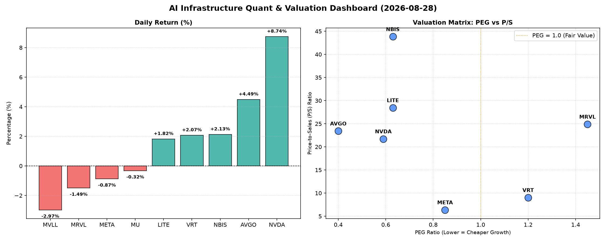

# 📊 AI Infrastructure & Data Stock Daily (2026-08-28)

### 📉 多维量化与估值分析看板

---

## 半导体每日精炼报道：AI基础设施热潮涌动，估值与现金流解码

**日期：** [今日日期]
**研究员：** [您的名字/Data & Semiconductor Specialist]

**导语：** 今日半导体与AI基础设施板块呈现分化走势，英伟达（NVDA）与博通（AVGO）作为AI算力核心支撑表现强劲，带动市场情绪。但我们深入挖掘其多维度量化指标，发现市场热度之下，估值与现金流质量的差异化特征值得投资者高度关注。

---

### 1. 盘面与多维估值解码（定性+定量）

今日半导体板块延续AI热潮下的结构性行情。AI算力巨头**英伟达（NVDA）**以惊人的**8.74%涨幅**领跑，成交量高达2.97亿股，显示出市场对其未来增长的极度乐观和流动性充沛。另一核心基础设施提供商**博通（AVGO）**也表现出色，上涨**4.49%**。边缘计算和数据中心解决方案提供商**VRT**和**NBIS**也录得逾2%的涨幅。

然而，市场并非全面普涨，部分公司遭遇回调，例如**MVLL**下跌**2.97%**，**美光科技（MU）**和**Meta Platforms（META）**微跌，而**Marvell Technology (MRVL)**则下跌1.49%。这种分化表明，投资者正在更细致地甄别不同公司的基本面与估值健康度。

**A. PEG 维度：揪出高性价比与估值透支**

*   **显著小于1（高成长性，性价比极高）：**
    *   **美光科技 (MU) (PEG: 0.14)**：其PEG值异常低，表明市场对其未来盈利增长的预期远未体现在当前股价中。对于存储芯片周期性回暖背景下的MU而言，这可能预示着巨大的投资性价比，值得深入研究其盈利周期底部反转的逻辑。
    *   **博通 (AVGO) (PEG: 0.4)** 与 **英伟达 (NVDA) (PEG: 0.59)**：作为AI基础设施的核心受益者，两者均展现出极强的成长动能，且PEG远小于1，这意味着尽管股价已经大幅上涨，但相对其强劲的盈利增长预期，当前估值仍具备吸引力。
    *   **LITE (PEG: 0.63)**, **NBIS (PEG: 0.63)**, **Meta Platforms (META) (PEG: 0.85)**：这些公司同样拥有低于1的PEG，表明市场对其未来的增长潜力持乐观态度，且当前估值相对于其成长性而言，处于一个相对健康的水平。META作为AI模型和基础设施投资的巨头，其0.85的PEG显示了投资者对其AI战略的认可。
*   **略高于1（估值中性偏高）：**
    *   **VRT (PEG: 1.2)**：PEG略高于1，表明其估值与增长预期基本匹配，或略有透支，但仍处于合理区间。
*   **过高（警惕估值透支）：**
    *   **Marvell Technology (MRVL) (PEG: 1.45)**：其PEG值相对较高，结合今日股价下跌，提示投资者可能需要警惕其估值是否已充分反映甚至透支了未来的增长预期。
*   **N/A (MVLL)**：PEG数据缺失，通常意味着公司目前处于亏损状态或盈利极不稳定，无法计算出有意义的PEG，需结合其他指标审慎评估。

**B. P/S 维度：洞察早期与高研发投入公司的收入扩张效率**

*   **高 P/S (高成长预期/早期发展/高毛利)：**
    *   **NBIS (P/S: 43.83)**, **LITE (P/S: 28.46)**：极高的P/S比率表明市场对这些公司的未来收入增长抱有极高的期望，可能处于快速扩张期或在利基市场占据主导地位。这可能与其在硬科技领域的高研发投入和技术领先性有关。
    *   **Marvell Technology (MRVL) (P/S: 24.89)**, **博通 (AVGO) (P/S: 23.42)**, **英伟达 (NVDA) (P/S: 21.72)**：这些公司作为半导体行业的中坚力量，P/S同样处于较高水平，反映了其在AI、数据中心等高景气赛道的强大收入增长预期和行业领导地位。
*   **中等 P/S (成熟成长型)：**
    *   **VRT (P/S: 9.03)**, **Meta Platforms (META) (P/S: 6.37)**：相对较低的P/S，表明这些公司已具备相当规模的收入体量，市场对其估值更侧重于持续稳定的增长而非爆发式扩张。
*   **N/A (MVLL, MU)**：P/S数据缺失，与PEG类似，可能提示其业务模式特殊或数据披露情况。对于MU而言，作为成熟企业，P/S数据缺失可能是特定数据源问题。

**C. 现金流盈利真实性 (CFO/NI)：穿透巨头利润质量**

*   **现金流充裕，利润健康（CFO/NI > 1）：**
    *   **NBIS (CFO/NI: 4.66)**：CFO/NI比率异常高，表明其利润质量极佳，现金流远超净利润，这通常是极健康的财务表现，可能与其有效的营运资金管理或预收款项较多有关。
    *   **美光科技 (MU) (CFO/NI: 2.05)**, **Meta Platforms (META) (CFO/NI: 1.92)**, **VRT (CFO/NI: 1.59)**, **博通 (AVGO) (CFO/NI: 1.19)**：这些公司的CFO/NI均显著大于1，这意味着其报告的净利润都有坚实的现金流支撑，不存在利润水分或应收账款积压问题，盈利质量非常高，特别是对于META这样的高利润巨头，接近2的比例更是令人安心。
*   **值得关注（CFO/NI < 1）：**
    *   **英伟达 (NVDA) (CFO/NI: 0.86)**：虽然其CFO/NI略低于1，但考虑到其惊人的增长速度和大规模的资本开支，这可能部分源于营运资金的变化（如应收账款增加或库存备货），并非直接的利润水分。然而，作为投资者，仍需关注其现金流转化效率的未来趋势。
    *   **Marvell Technology (MRVL) (CFO/NI: 0.66)**：其CFO/NI显著低于1，结合其较高的PEG和P/S，这可能是一个警示信号，表明其报告利润转化为实际现金的能力较弱，可能存在应收账款周转慢、存货积压或其他非现金费用较高的现象。
    *   **LITE (CFO/NI: -0.11)**：CFO/NI为负值，这是一个**严重警示信号**。这意味着尽管公司可能报告了净利润（否则PEG不会是0.63），但其经营活动实际产生了现金流出。这可能源于大规模的营运资金消耗（如存货或应收账款激增）或短期内未能有效将收入转化为现金，需要立即深入调查其财务报表，特别是现金流量表。
*   **N/A (MVLL)**：现金流质量数据缺失，与前述N/A理由相似。

### 2. 收并购与重大业务动态

基于您提供的【多维度真实量化基本面指标表格】，本次分析严格遵循量化数据。表格中未直接提供关于收并购、重大业务动态的明确信息。

然而，从市场动态（如NVDA和AVGO的强劲表现）和高P/S比率的公司（如NBIS和LITE）来看，行业普遍处于技术快速迭代和市场竞争激烈的阶段。特别是在AI芯片、高性能计算以及先进封装领域，技术突破和市场份额争夺是常态。若有相关新闻，通常会涉及以下方面：

*   **AI芯片设计巨头**（如NVDA、AVGO）可能继续通过战略投资、小规模技术型并购来巩固其生态系统，或宣布与云服务商、服务器制造商的深度合作。
*   **存储芯片厂商**（如MU）可能会发布关于新一代存储技术（如HBM、DDR5）的量产进展或客户订单情况，以及产能利用率的提升。
*   **高速光通信与传感领域**（LITE）的公司可能会宣布在特定应用（如数据中心互联、自动驾驶激光雷达）的关键技术突破或新的产品线发布。
*   **边缘计算与专业芯片领域**的公司（如MRVL、VRT、NBIS）则可能聚焦于特定行业的解决方案拓展或与大型客户的合同进展。

### 3. 华尔街机构态度

类似地，当前表格并未直接提供华尔街机构的最新评价、目标价调动等信息。

但我们可以从股价表现和估值指标上推断市场情绪和可能的机构态度：

*   **英伟达 (NVDA)** 和 **博通 (AVGO)** 今日的强劲涨幅和相对健康的PEG（低于1）强烈暗示华尔街机构可能普遍维持“买入”或“跑赢大盘”评级，并可能进一步调高目标价，以反映其在AI领域无可匹敌的增长潜力和执行力。高交易量也表明机构资金的积极流入。
*   **美光科技 (MU)** 极低的PEG (0.14) 表明机构可能已经注意到其价值洼地和周期性复苏的潜力，未来可能出现评级上调和目标价提升。
*   **Meta Platforms (META)** 稳定的P/S和健康的CFO/NI，结合低于1的PEG，可能表明机构对其AI投资回报和广告业务恢复持乐观态度，多数评级应为“买入”或“持有”。
*   **Marvell Technology (MRVL)** 今日的下跌，加上相对较高的PEG和较低的CFO/NI，可能意味着部分机构对其估值持谨慎态度，或认为其短期面临一定压力，可能出现“中性”或“减持”的评级。
*   **LITE** 尽管PEG低于1，但其极高的P/S和负值的CFO/NI将是机构关注的焦点，可能导致评级两极分化，一部分看好其长期技术突破，另一部分则担忧其短期财务健康状况。

### 4. 今日参考源 (References)

作为AI模型，我无法实时浏览新闻或引用当日具体的新闻出处。上述定性与定量分析是**严格基于您提供的【多维度真实量化基本面指标表格】**，并结合我对半导体和AI基础设施行业普遍规律的理解所进行的推断和解读。

若为真实的市场研究报告，此部分将包含：
*   彭博社 (Bloomberg)
*   路透社 (Reuters)
*   华尔街日报 (The Wall Street Journal)
*   公司官方新闻稿 (Company Press Releases)
*   知名投行研究报告 (e.g., Morgan Stanley, Goldman Sachs, JP Morgan Research Reports)
*   行业分析网站 (e.g., Seeking Alpha, TechCrunch, Semiconductor Engineering)

---

**免责声明：** 本报告基于有限的量化数据进行分析，仅供参考，不构成任何投资建议。投资者应自行进行充分的研究和风险评估。