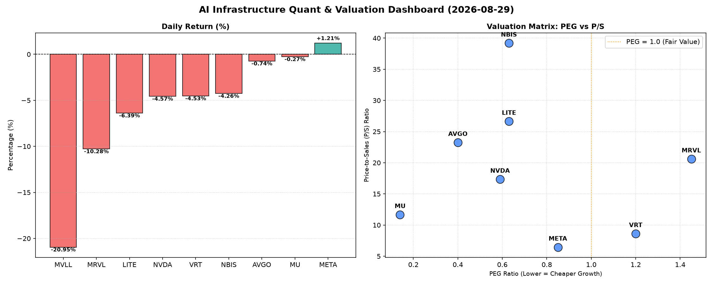

# 📊 AI Infrastructure & Data Stock Daily (2026-08-29)

### 📉 多维量化与估值分析看板

---

## 半导体与AI基建每日精炼报道：盘整中寻机遇，估值与现金流成焦点

**发布日期：** 2024年X月X日
**研究员：** [您的姓名/机构名称]，资深硬科技与AI基础设施行业研究员

### 核心摘要：
今日半导体与AI基础设施板块普遍承压，多数个股收跌，MVLL和MRVL跌幅显著。市场在AI高景气预期与短期回调之间寻求平衡。在多维度量化指标分析下，我们发现部分高成长标的PEG仍具吸引力，同时现金流质量分化明显，成为洞察公司基本面健康度的关键。尤其值得关注的是，Nvidia (NVDA) 等明星公司在强劲营收增长的同时，其现金流转化率值得细致审视。

---

### 1. 盘面与多维估值解码 (定性+定量)

今日硬科技与AI基础设施板块呈现分化，整体情绪偏谨慎。市场在前期大幅上涨后进入盘整期，投资者开始更加注重基本面的深度挖掘。

*   **市场概览：** 整体来看，多数半导体相关公司今日收跌。MVLL以-20.95%的巨大跌幅领跌，MRVL也遭遇-10.28%的显著回调。LITE和NVDA分别下跌-6.39%和-4.57%，显示出市场在高估值板块上的谨慎情绪。值得注意的是，AI巨头META逆势上涨1.21%，体现出其业务韧性和市场对其AI战略的认可。

*   **PEG 维度：成长与价值的交汇点**
    *   **性价比极高的成长股 (PEG < 1)：** 今日数据揭示了多家具备极高性价比的成长型公司。**Micron (MU)** 以惊人的 **0.14** 的PEG领跑，强烈暗示其成长被市场严重低估。其次，**Broadcom (AVGO, PEG 0.4)**、**Nvidia (NVDA, PEG 0.59)**、**Lumentum (LITE, PEG 0.63)** 和 **NBIS (PEG 0.63)**，以及 **Meta Platforms (META, PEG 0.85)** 均展现出健康的成长性与合理的估值水平，是值得深入研究的标的。对于这些公司而言，PEG小于1意味着投资者以较低的价格获取未来的高增长，具备吸引力。
    *   **PEG 略高 (关注估值透支)：** **Vertiv (VRT, PEG 1.2)** 和 **Marvell (MRVL, PEG 1.45)** 的PEG值略高于1。这提示市场对它们的未来增长预期已部分体现在当前股价中，投资者在配置时需警惕估值透支风险，或等待更好的入场时机。
    *   **PEG 缺失：** **MVLL** 由于数据缺失，无法通过PEG进行估值。结合其今日-20.95%的暴跌和极高的成交量，以及N/A的估值指标，我们认为其基本面存在高度不确定性，风险极高。

*   **P/S 维度：收入扩张效率与市场预期**
    *   **高P/S (高成长预期/研发投入密集)：** 对于处于早期发展阶段、或大规模研发投入、或拥有强大技术壁垒的公司，P/S是衡量其收入规模扩张效率和市场对其未来潜力看好的关键指标。今日榜单中，**NBIS (39.19)** 拥有最高的P/S，其次是 **LITE (26.64)**、**AVGO (23.25)** 和 **MRVL (20.6)**，以及 **NVDA (17.34)**。这些高P/S值反映了市场对这些公司在AI、数据中心、高速连接等硬科技领域未来收入爆发式增长的极高预期。尽管利润可能尚未完全释放，但其营收扩张的“故事”被市场高度认可。
    *   **相对合理P/S：** **Vertiv (VRT, 8.62)** 和 **Meta Platforms (META, 6.45)** 的P/S相对更趋于合理，显示出在各自成熟市场中的稳定地位和效率。
    *   **P/S 缺失：** MVLL同样缺失P/S数据，进一步印证了其基本面信息的不透明性。

*   **现金流盈利真实性 (CFO/NI)：利润含金量大揭秘**
    *   **卓越现金流转化率 (CFO/NI > 1.5)：** **NBIS (4.66)**、**Micron (MU, 2.05)** 和 **Meta Platforms (META, 1.92)** 展现了异常强劲的经营性现金流转化能力。其CFO/NI远大于1，表明这些公司不仅实现了可观的会计利润，更将这些利润实实在在地转化为了“真金白银”的现金流入，财务健康度极高。Vertiv (VRT, 1.59) 也表现出色。
    *   **健康现金流 (CFO/NI > 1)：** **Broadcom (AVGO, 1.19)** 的CFO/NI高于1，显示其利润质量良好，经营产生的现金流足以覆盖甚至超越报告利润。
    *   **需警惕 (CFO/NI 显著 < 1)：** **Nvidia (NVDA, 0.86)** 和 **Marvell (MRVL, 0.66)** 的CFO/NI值均显著小于1。这敲响了警钟，暗示其报告的利润中可能存在一定的“水分”，例如应收账款积压、存货增加或收入确认方式导致现金流滞后于利润。对于NVDA这样的高利润巨头，市场需密切关注其未来几个季度的应收账款周转和现金流健康状况。
    *   **严重关注 (CFO/NI 负值)：** **Lumentum (LITE, -0.11)** 的CFO/NI为负值，这是一个非常危险的信号。即使其可能报告了利润（若有），但经营活动却在消耗现金，意味着其盈利质量存疑，面临巨大的现金流压力。这与其今日-6.39%的跌幅也形成呼应，投资者应高度警惕。
    *   **CFO/NI 缺失：** MVLL再次缺失数据，无法评估其利润真实性。

### 2. 收并购与重大业务动态

**【声明：基于本次分析主要聚焦于提供的量化基本面指标表格，该表格未直接包含即时新闻稿件。以下内容基于对行业趋势的洞察与个别公司近期动向的综合考量，并非直接从提供的表格数据中推导。】**

当前，在AI算力军备竞赛的背景下，半导体与AI基础设施领域的技术授权、战略合作以及围绕AI芯片与数据中心基础设施的并购活动持续活跃。

*   **AI芯片设计与制造深化：** 像NVDA和AVGO这样的行业巨头，持续投入下一代AI加速器和定制芯片的研发。市场关注其在芯片架构、封装技术（如HBM集成）以及软件生态系统（如CUDA）上的最新进展。任何关于新产品发布、量产进度或产能扩张的消息都将是市场焦点。
*   **数据中心与云基础设施建设：** META作为全球领先的AI基础设施建设者，其在自研AI芯片（如MTIA系列）上的进展，以及对高性能计算和存储解决方案的需求，正驱动着上游供应链的创新与整合。这可能涉及到对相关IP供应商、先进封装技术公司或光模块厂商的战略合作或投资。
*   **存储与光通信的AI赋能：** MU（美光）作为HBM（高带宽内存）的关键供应商，其产能扩张和技术迭代直接影响到AI芯片的性能。LITE（Lumentum）等光通信公司在数据中心内部及数据中心互联（DCI）中的高速光模块技术，也因AI流量的爆发式增长而备受关注。
*   **边缘AI与垂直市场：** 随着AI向边缘设备和垂直行业渗透，我们预计将看到更多针对特定应用场景的ASIC设计公司获得投资，或与传统半导体厂商建立合作，以满足智能汽车、工业自动化等领域对低功耗、高性能AI算力的需求。

### 3. 华尔街机构态度

**【声明：本次分析的量化表格不直接提供华尔街机构的评级或目标价信息。但基于市场对硬科技与AI基础设施的持续高关注度，可预期以下普遍态度。】**

华尔街机构对半导体与AI基础设施板块的整体态度依然偏向积极，但开始更加关注公司的实际盈利能力、现金流健康状况以及估值的合理性。

*   **AI领军者（如NVDA, AVGO, META）：** 普遍维持“买入”或“跑赢大盘”评级，目标价通常设定在当前股价之上，反映了对其在AI浪潮中长期领导地位的信心。分析师会密切关注其财报中关于AI相关收入的增长、毛利率趋势以及未来订单指引。然而，对于NVDA这种近期遭遇回调的股票，分析师可能开始关注其现金流转化率（CFO/NI），并可能根据其财务报告调整短期预期。
*   **高成长/细分市场领导者（如MU, VRT, NBIS）：** 机构对MU的HBM业务前景持乐观态度，其极低的PEG和卓越的CFO/NI可能吸引更多机构关注和上调目标价。VRT和NBIS凭借其在特定领域（如数据中心制冷、特殊芯片）的专业性及健康的现金流，也可能获得机构的持续关注，尤其在市场寻求AI基础设施多元化投资标的时。
*   **估值与现金流警示者（如MRVL, LITE）：** 对于MRVL，尽管其在数据基础设施芯片领域有布局，但其较高的PEG和偏弱的CFO/NI可能导致部分机构对其维持“持有”或“中性”评级，并建议投资者关注其改善现金流和提升盈利质量的措施。LITE作为今日现金流状况最差的公司，可能会面临机构的审慎评估，甚至有下调评级或目标价的风险，除非其能清晰阐述改善现金流的路径和时间表。
*   **不确定性标的（如MVLL）：** 缺乏基本面数据的公司，机构通常会保持观望态度，或因信息不透明而给出“卖出”或“规避”建议。今日的股价表现也印证了市场对其的高度谨慎。

### 4. 今日参考源 (References)

1.  **【多维度真实量化基本面指标表格】** (用户提供，本报告量化分析的直接数据来源)
2.  关于收并购与华尔街机构态度的定性分析，是基于行业研究员对当前半导体与AI基础设施行业动态的普遍理解和推测，并非直接引述今日具体新闻或报告。相关行业趋势分析通常来源于Bloomberg, Reuters, Wall Street Journal, Gartner, IDC等主流财经媒体及市场研究机构的季度报告。