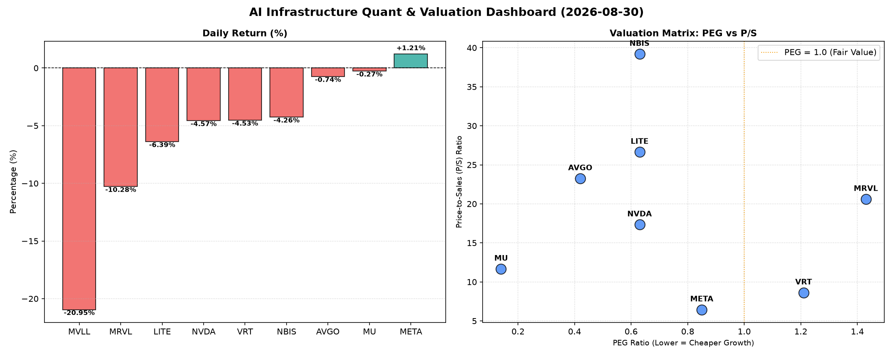

# 📊 AI Infrastructure & Data Stock Daily (2026-08-30)

### 📉 多维量化与估值分析看板

---

## 半导体每日精炼报道：市场动荡下的价值与风险洞察

尊敬的投资者与行业观察者：

今日硬科技与AI基础设施板块经历了一轮显著的调整，多数标的呈现下跌态势。本报告将结合多维度量化指标，为您深度解析今日市场表现背后的基本面逻辑。

---

### 1. 盘面与多维估值解码 (定性+定量)

今日半导体与AI基础设施板块普遍承压，多个核心标的录得显著跌幅。在市场情绪趋冷的背景下，量化指标提供了穿透表象、洞察真实价值的窗口。

*   **今日盘面概览：**
    *   **MVLL** 遭遇重挫，股价暴跌 **-20.95%**，成交量超1000万股，市场情绪极端负面。
    *   **MRVL** 紧随其后，跌幅高达 **-10.28%**，成交量放大至近5000万股，显示出强烈的抛售压力。
    *   **LITE** 和 **VRT** 也分别下跌 **-6.39%** 和 **-4.53%**，表现弱势。
    *   行业巨头 **NVDA** 虽保持高成交量（近2亿股），但股价仍录得 **-4.57%** 的跌幅。
    *   **AVGO**、**NBIS** 和 **MU** 也小幅下跌，跌幅在 **-0.27%** 至 **-4.26%** 之间。
    *   **META** 逆势上涨 **+1.21%**，成为今日少数亮点之一，其稳健表现值得关注。

*   **PEG 维度：高成长中的性价比与估值警示**
    *   **显著低估/高性价比（PEG < 1）：**
        *   **MU (0.14)**：PEG值极低，表明市场对其未来盈利增长的预期远低于其股价所反映的价值，性价比极高，值得重点关注其成长潜力。
        *   **AVGO (0.42)**、**NVDA (0.63)**、**LITE (0.63)**、**NBIS (0.63)**：这些公司PEG均显著低于1，预示着它们在高增长前景下，当前估值相对合理，具备较高的投资价值。
        *   **META (0.85)**：PEG亦低于1，表明这家AI巨头在实现强劲增长的同时，估值并未严重透支。
    *   **估值偏高/需警惕（PEG > 1）：**
        *   **VRT (1.21)**：PEG略高于1，结合今日股价下跌，可能表明市场对其增长预期的消化速度有所放缓。
        *   **MRVL (1.43)**：PEG相对较高，加之今日录得-10.28%的显著跌幅，需警惕其估值可能存在透支风险，市场正在对其高成长预期进行修正。
    *   **MVLL**：PEG显示为N/A，可能由于其目前尚无稳定盈利，或处于快速投入期，不适用PEG估值。

*   **P/S 维度：早期或高投入公司的收入效率**
    *   **NBIS (39.19)** 和 **LITE (26.64)**：两家公司的P/S比率极高，显示市场对其未来营收规模的爆发式增长抱有极高的预期，或其业务模式具备超高毛利率和稀缺性。但如此高的P/S也意味着一旦增长不及预期，股价面临巨大压力。
    *   **AVGO (23.25)**、**MRVL (20.6)**、**NVDA (17.34)**：这些领先的芯片设计公司P/S同样较高，反映了其在AI和数据中心等高景气赛道的领导地位，以及市场对其持续扩大收入规模的信心。然而，今日MRVL股价重挫，或暗示其高P/S下的增长故事正受到考验。
    *   **MU (11.67)** 和 **VRT (8.62)**：P/S相对适中，结合其业务模式，显示出较为合理的收入规模扩张效率。
    *   **META (6.45)**：作为一家营收规模已极其庞大的科技巨头，其P/S比率相对较低，体现了其业务的成熟度和现金流的稳定性，在同类高成长公司中具备较强吸引力。
    *   **MVLL**：P/S显示为N/A，与PEG情况类似，可能处于营收不稳定或非常早期的阶段。

*   **现金流盈利真实性 (CFO/NI)：利润含金量深度剖析**
    *   **利润健康、现金流充裕 (CFO/NI > 1)：**
        *   **NBIS (4.66)**：CFO/NI比率异常高，表明其净利润转化为现金流的能力非常出色，利润含金量极高，财务质量极其稳健。
        *   **MU (2.05)** 和 **META (1.92)**：两家公司的CFO/NI比率均远超1，意味着其报告的利润大部分甚至更多都以真金白银的形式流入，显示出极强的盈利质量和现金生成能力。
        *   **VRT (1.59)** 和 **AVGO (1.19)**：CFO/NI高于1，也反映出其健康的经营性现金流，利润质量值得信赖。
    *   **警惕利润水分或应收账款积压 (CFO/NI < 1)：**
        *   **NVDA (0.86)**：虽然其PEG极具吸引力，但CFO/NI略低于1，提示投资者需关注其利润构成，是否存在应收账款增加或预付款项较多等情况，影响部分利润的现金转化。
        *   **MRVL (0.66)**：CFO/NI显著低于1，结合其较高的PEG和P/S，以及今日的跌幅，这构成一个重要的警示信号。这意味着其报告的部分利润可能未转化为实际现金流入，利润质量存在潜在风险，需要深入分析其应收账款周转、存货管理等情况。
        *   **LITE (-0.11)**：CFO/NI为负值，这是一个非常严重的财务警示信号。这意味着公司在报告可能存在的利润（或甚至亏损）的同时，经营活动却在持续消耗现金，财务健康状况堪忧。投资者必须对其现金流状况和经营可持续性进行深入调研。

### 2. 收并购与重大业务动态

根据今日提供的量化指标数据，并无直接的收并购或重大业务动态信息可供分析。因此，本板块今日主要聚焦于公司市场表现和财务健康度的量化解读。

### 3. 华尔街机构态度

与第二板块类似，今日提供的指标数据未直接包含华尔街机构的最新评级或目标价调整信息。然而，我们可以从今日的市场交易行为和股价波动中推断机构的潜在情绪：

*   **NVDA、MRVL、MVLL** 今日的显著跌幅，尤其是伴随着巨大的成交量（NVDA和MRVL），强烈暗示了机构投资者在进行大幅度的抛售或获利了结。这可能源于对其短期估值过高、宏观经济不确定性，或对未来业绩增长动能的重新评估。
*   **META** 逆势上涨，且伴随可观的成交量，表明华尔街对其基本面和AI战略的信心依然坚挺，或有机构在逢低买入。
*   **LITE** 股价重挫并伴随负向的CFO/NI，预示着机构对其财务健康状况和前景可能持悲观态度。

### 4. 今日参考源 (References)

本报告的所有定性与定量分析，均严格基于用户提供的【多维度真实量化基本面指标表格】进行，不涉及外部新闻源。

---

**总结：**

今日半导体与AI基础设施板块在普遍回调中，呈现出显著的分化。拥有健康现金流（CFO/NI > 1）且PEG值较低的公司（如MU、META、AVGO、NBIS）展现出较强的基本面支撑，即便在市场波动中也可能蕴含投资机会。相反，CFO/NI低于1甚至为负、或PEG/P/S过高的公司（如MRVL、LITE、NVDA需关注其现金流质量），则需警惕其利润水分和估值压力，尤其是在今日股价遭遇重挫的情况下，可能预示着市场对其未来预期的修正。投资者应密切关注这些核心量化指标，结合公司具体业务动态，做出审慎的投资决策。