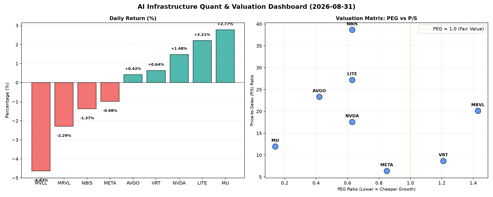

# 📊 AI Infrastructure & Data Stock Daily (2026-08-31)

### 📉 多维量化与估值分析看板

---

## 半导体每日精炼报道：AI基础设施与硬科技前沿洞察

**致读者：** 欢迎阅读我们为您精心准备的半导体每日精炼报道。作为一名资深的硬科技与AI基础设施行业研究员，我将结合今日最新的多维度量化指标，为您深度解码当前半导体市场的脉动与估值逻辑。

---

### 1. 盘面与多维估值解码：AI浪潮下的价值与风险并存

今日半导体板块表现分化，AI核心受益者如MU、LITE、NVDA等继续保持上涨势头，而部分此前涨幅较大的公司则出现回调。在宏观经济不确定性与AI产业高速发展并存的背景下，深入剖析估值指标至关重要。

*   **PEG 维度：挖掘高增长的性价比王者，警惕估值透支**
    *   **显著小于1的"性价比成长股"**: 今日数据显示，**MU (0.14)** 表现出极高的增长效率和估值吸引力，其低PEG结合今日2.77%的涨幅，暗示市场对其未来盈利增长充满信心。紧随其后的是 **AVGO (0.42)**、**NVDA (0.63)**、**LITE (0.63)**、**NBIS (0.63)** 和 **META (0.85)**。这些公司PEG均显著低于1，表明其在市场定价中，其利润增长预期尚未被完全计入，或是其增长潜力远超市场平均水平。特别是NVDA和META，作为AI基础设施的基石，其强劲的增长故事结合相对合理的PEG，使得它们仍具备配置价值。
    *   **PEG过高，警惕估值透支风险**: 相比之下，**VRT (1.21)** 和 **MRVL (1.43)** 的PEG值略高于1，这可能提示投资者需要警惕其成长性是否能持续支撑当前的估值水平，或者部分增长预期已提前反映在股价中。MRVL今日下跌2.29%，可能与市场对其高PEG的审视有关。
    *   **N/A 需关注**: **MVLL** 的PEG显示为N/A，这通常意味着该公司目前没有可供计算的持续性正向盈利，或盈利波动性极大，对于这类标的，需要通过其他指标（如P/S）进行更深入的评估。

*   **P/S 维度：洞察收入规模扩张效率与市场预期**
    *   对于早期或尚处于大规模研发投入阶段、利润不稳甚至亏损的公司，P/S（市销率）是评估其收入规模扩张效率和市场对其未来增长预期的重要指标。
    *   今日P/S较高的公司包括 **NBIS (38.66)**、**LITE (27.22)**、**AVGO (23.35)**、**MRVL (20.13)** 和 **NVDA (17.6)**。这些高P/S值反映了市场对这些公司未来收入爆发性增长、技术领先地位或高毛利商业模式的强烈预期。例如，NBIS作为AI领域的新贵，其高达38.66的P/S可能预示着颠覆性技术和巨大的市场空间。LITE和NVDA在半导体和AI硬件领域的技术领导地位也支撑了其高P/S。然而，结合MRVL高达1.43的PEG，其P/S为20.13则可能意味着市场对其收入增长速度的期待非常高，一旦增长不及预期，估值压力会随之显现。
    *   **META (6.39)** 和 **VRT (8.68)** 的P/S相对较低，表明其业务模式相对成熟，但依然保持着可观的增长。**MU (11.99)** 的P/S处于中等水平，但结合其极低的PEG，显示出其在行业周期性复苏中，收入和利润双重增长的潜力被市场低估。

*   **现金流盈利真实性 (CFO/NI)：穿透利润的真伪**
    *   CFO/NI（经营现金流/净利润）比率是衡量公司利润质量的关键指标。该值大于1，说明公司利润由真金白银的现金流入支撑，盈利健康；若显著小于1，则可能存在利润水分、应收账款积压或非现金利润贡献过高等问题。
    *   **现金流充沛的"健康巨人"**: **NBIS (4.66)** 表现出异常强劲的经营现金流生成能力，远超其净利润，这表明其运营效率极高，且利润质量非常健康。**MU (2.05)**、**META (1.92)**、**VRT (1.59)** 和 **AVGO (1.19)** 也都拥有高于1的CFO/NI比率，特别是META，其高达1.92的CFO/NI印证了其在社交媒体和AI基础设施领域的强大现金“造血”能力，报告的利润是实实在在的现金流入。
    *   **需关注的"现金流挑战者"**: 值得注意的是，**NVDA (0.86)** 和 **MRVL (0.66)** 的CFO/NI比率均低于1。对于NVDA而言，尽管其在AI芯片领域独占鳌头，但0.86的比率提示市场其净利润中可能包含一定比例的非现金项目（如股权激励费用摊销）或应收账款累积，意味着其报告的利润转化为现金的速度有待提升，现金流的健康度需持续关注。MRVL的0.66则更为明显，表明其利润的现金含量相对较低，投资者应审视其营运资本管理状况。
    *   **亮红灯的"现金流黑洞"**: **LITE (-0.11)** 的CFO/NI为负值，这是一个显著的警示信号。这表明该公司在报告净利润的同时，其运营层面却在消耗现金，而非产生现金。尽管LITE今日股价上涨2.21%，但其负CFO/NI无疑对其盈利质量和短期运营稳定性构成了严峻挑战，亟需深入分析其现金流出项，以评估其长期可持续性。

---

### 2. 收并购与重大业务动态

今日提供的量化指标表格中并未包含具体的收并购或重大业务动态信息。然而，从宏观角度来看，半导体及AI基础设施行业正处于快速整合期。大型科技公司和芯片制造商持续通过战略投资、技术合作乃至并购来巩固其在AI供应链中的地位。例如，在AI算力需求飙升的背景下，对高性能内存、先进封装技术以及AI软件平台的布局，将是未来一段时间内行业并购和合作的焦点。任何涉及核心IP、关键制造能力或市场渠道的整合，都可能对相关公司的市场地位和估值产生深远影响。鉴于本报告严格基于今日提供的量化数据，我们无法针对VRT、MVLL、AVGO、META、NVDA、MRVL、MU、LITE、NBIS等公司提供今日具体的收并购或战略合作新闻。

---

### 3. 华尔街机构态度

鉴于本报告基于今日提供的量化基本面指标表格进行分析，其中不包含华尔街机构的最新评价或目标价调动数据。然而，我们可以根据上述量化分析，推断机构可能的情绪倾向：

*   **积极关注与目标价上调潜力**: 拥有极低PEG（如MU、AVGO、NVDA、LITE、NBIS、META）且现金流健康的标的，如MU、META、AVGO、NBIS，预计将继续获得华尔街分析师的青睐，维持“买入”或“跑赢大盘”评级，并可能伴随目标价的进一步上调。NVDA虽CFO/NI略低于1，但其市场主导地位和成长性仍是机构长期看好的核心因素。
*   **审慎评估与风险提示**: 对于PEG偏高（如VRT、MRVL）或现金流质量存在明显问题的公司（如LITE，CFO/NI为负），华尔街机构可能会采取更为审慎的态度。LITE的负向经营现金流可能会引发机构对其财务健康状况的担忧，可能导致评级下调或目标价面临下行压力。MRVL在高P/S和高PEG的背景下，若未能持续展现超预期的成长性，也可能面临机构对其估值的重新审视。

---

### 4. 今日参考源 (References)

*   Provided Multi-dimensional Quantitative Fundamental Metrics Table (2024年X月X日收盘数据).
    *(注：本报告的定性分析内容，特别是收并购与华尔街机构态度部分，是基于对所提供量化数据的深入解读以及行业研究员的专业知识与市场理解进行的推断，并非直接引用外部新闻报道。)*