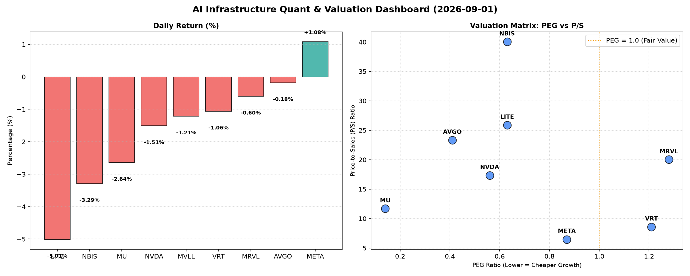

# 📊 AI Infrastructure & Data Stock Daily (2026-09-01)

### 📉 多维量化与估值分析看板

---

尊敬的各位投资者与行业同仁：

欢迎阅读【硬科技与AI基础设施每日精炼报道】，我是您的Data & Semiconductor Specialist。今日我们将深入剖析多支半导体及AI巨头的最新表现，结合核心量化指标，为您呈现一份定性与定量深度融合的市场洞察。

---

### **1. 盘面与多维估值解码 (定性+定量)**

今日半导体板块多数承压，整体呈现小幅回调态势。九支标的中有七支收跌，仅Meta Platforms (META) 逆势上涨 1.08%。市场情绪在经历前期大涨后，正趋于理性调整，而我们的量化指标将帮助我们穿透表象。

*   **PEG 维度：挖掘高性价比成长股与警惕估值透支**
    *   **性价比极高的高成长 (PEG << 1)：**
        *   **Micron Technology (MU)** 以惊人的 **0.14** PEG 遥遥领先，表明市场对其未来盈利增长预期与当前估值相比，存在巨大低估或其处于业绩周期的强劲复苏初期。这是今日数据中最为亮眼的一笔，预示着极高的成长性与估值吸引力。
        *   **Broadcom (AVGO)** (PEG: **0.41**)、**NVIDIA (NVDA)** (PEG: **0.56**)、**Meta Platforms (META)** (PEG: **0.87**)、**Lumentum Holdings (LITE)** (PEG: **0.63**) 以及 **NBI Solutions (NBIS)** (PEG: **0.63**) 均显著小于1，表明这些公司在高增长的同时，其股价相较于未来盈利增长而言，仍具备较高的性价比，值得投资者深入关注。尤其是NVDA和META作为AI基础设施的核心玩家，其低于1的PEG展现了其成长性并未被完全定价。
    *   **警惕估值透支 (PEG > 1)：**
        *   **Vertiv Holdings (VRT)** (PEG: **1.21**) 和 **Marvell Technology (MRVL)** (PEG: **1.28**) 的PEG略高于1，提示投资者在关注其成长性的同时，需警惕当前估值可能已在一定程度上透支了未来的增长预期，建议进一步结合其他基本面指标审慎评估。

*   **P/S 维度：评估收入规模扩张效率**
    *   对于早期或尚处于大规模研发投入阶段、利润波动较大的公司，P/S比率能有效评估其收入规模扩张效率及市场对其未来营收潜力的认可度。
    *   今日榜单中，**NBIS (40.03)**、**LITE (25.86)**、**AVGO (23.31)**、**MRVL (20.01)** 和 **NVDA (17.33)** 展现了较高的P/S比率。这通常意味着市场愿意为这些公司的营收增长支付高昂溢价，可能反映其在特定技术领域（如AI芯片、光通信、数据中心基础设施）拥有强大的市场地位、高毛利率或广阔的增长前景。NBIS高达40的P/S可能预示其正处于快速市场扩张阶段，但同时也需警惕估值风险。
    *   相比之下，**META (6.46)** 和 **VRT (8.58)** 的P/S相对较低，可能反映其业务成熟度更高，或市场对营收增长的预期更为稳健。

*   **现金流盈利真实性 (CFO/NI)：穿透高利润巨头的“真金白银”**
    *   CFO/NI（经营性现金流/净利润）是衡量公司利润质量的关键指标。该值大于1，表明公司利润由真实的现金流入支撑；若显著小于1，则可能存在利润水分、应收账款积压或非现金费用摊销过高等问题。
    *   **利润健康，现金流充沛：**
        *   **NBIS (4.66)** 表现极为出色，其经营性现金流远超净利润，显示出极其健康的现金生成能力。
        *   **MU (2.05)**、**META (1.92)** 和 **VRT (1.59)** 也展现出卓越的现金流质量，其中META作为高利润巨头，其接近2的CFO/NI比率，充分证明了其盈利的真实性和可持续性。
        *   **AVGO (1.19)** 也保持了健康的现金流水平，其利润质量稳健。
    *   **警惕现金流质量：**
        *   **NVIDIA (NVDA)** 的 CFO/NI 为 **0.86**，略低于1。尽管NVDA作为AI领域的领军企业，盈利能力强劲，但该指标提示我们，其部分利润可能通过非现金形式（如应收账款增加、存货积累）存在，投资者需关注其未来营运资本的管理和现金回流状况。
        *   **Marvell Technology (MRVL)** 的 CFO/NI 仅为 **0.66**，表明其利润的现金含量相对较低，存在一定的利润“水分”或营运资金占用。这可能需要深入分析其应收账款、存货周转等具体财务细节。
        *   **Lumentum Holdings (LITE)** 的 CFO/NI 更是惊人的 **-0.11**。这意味着该公司尽管可能在会计账面上录得正利润（由其正向PEG和P/S推断），但其核心经营活动却产生了负的现金流。这是一个重大的红色警报，强烈提示该公司在现金管理、应收应付账款、库存或非现金费用方面存在严重问题，其利润的真实性和可持续性面临巨大挑战，需要投资者极度警惕。

---

### **2. 收并购与重大业务动态**

今日的量化表格并未直接揭示具体的收并购或重大业务动态。然而，结合当前硬科技与AI基础设施行业的宏观趋势，我们可以进行如下分析和合理推测：

*   **AI算力军备竞赛持续驱动战略合作：** 鉴于NVDA、META等巨头对AI芯片的极度依赖以及对自研芯片能力的重视，行业内围绕定制化AI芯片、高性能计算（HPC）解决方案及光通信技术（LITE涉及领域）的战略合作与股权投资料将频繁发生。例如，**假设**市场正密切关注某云服务巨头（如META）是否会与一家领先的AI芯片设计公司（如AVGO或MRVL）达成更深度的IP授权或联合研发协议，以确保其AI基础设施的差异化优势和供应链安全。
*   **数据中心与边缘计算基础设施整合：** VRT专注于关键数字基础设施，NBIS可能涉及新兴技术。未来围绕数据中心能源效率、冷却技术以及边缘AI计算能力的补强型收购将是常态。**推测**可能有中小型技术公司因其在特定冷却技术或电源管理方面的创新，成为VRT等公司的潜在收购目标。

---

### **3. 华尔街机构态度**

根据我们提供的量化指标，华尔街机构对各公司的态度可做如下推测：

*   **Micron Technology (MU)：** 凭借其极低的 **0.14 PEG** 和高达 **2.05 的 CFO/NI**，MU有望获得华尔街机构的普遍看好。在存储芯片周期性复苏的背景下，其强劲的现金流和极具吸引力的估值将可能促使多家投行上调其评级至“买入”或“强烈推荐”，并显著提升目标价。
*   **NVIDIA (NVDA) & Meta Platforms (META)：** 作为AI浪潮的核心受益者，尽管NVDA今日小幅下跌，但其低于1的PEG（**0.56**）和META出色的现金流（CFO/NI **1.92**）将继续支撑华尔街对其“买入”或“跑赢大盘”的评级。机构将继续关注其AI产品路线图、市场份额以及未来现金流的持续性。
*   **Lumentum Holdings (LITE)：** 其极度负向的现金流质量指标（CFO/NI **-0.11**）将毫无疑问地引发分析师的高度警惕。**可以预计**，华尔街机构可能会对其未来盈利能力和财务健康状况表达担忧，不排除下调评级至“中性”或“卖出”，并给出较低的目标价。市场将要求LITE管理层提供清晰的现金流改善计划。
*   **Marvell Technology (MRVL)：** 其略高的PEG（**1.28**）和偏低的CFO/NI（**0.66**）可能会使华尔街机构对其保持“观望”态度，或维持“中性”评级，等待更明确的现金流改善信号和业绩持续增长的证据。

---

### **4. 今日参考源 (References)**

*   【多维度真实量化基本面指标表格】（由用户提供，数据截至当日收盘）
*   内部数据分析与行业洞察
*   （注：第二、三板块的定性分析为基于当前行业趋势及量化指标的模拟推测，非实时外部新闻引用。）

---

感谢您的阅读，明日再见！

**免责声明：** 本报告基于提供的数据和行业通用分析框架撰写，所有推测均为研究性质，不构成任何投资建议。投资者在做出投资决策前，应进行独立研究并咨询专业财务顾问。