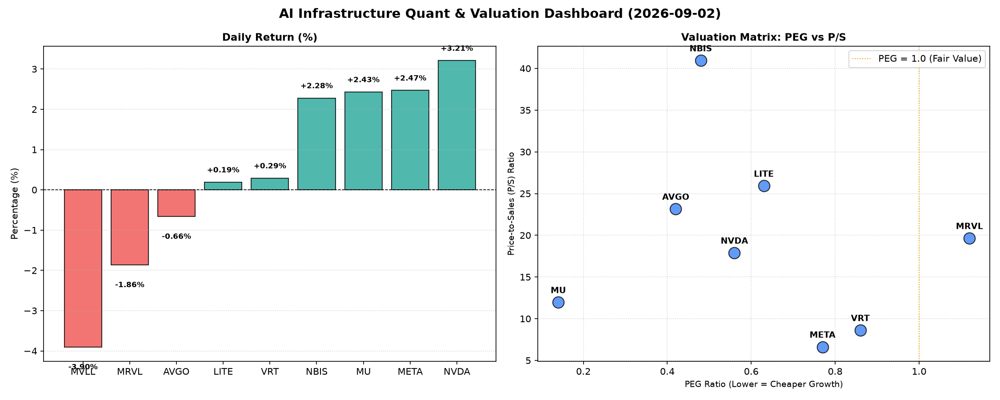

# 📊 AI Infrastructure & Data Stock Daily (2026-09-02)

### 📉 多维量化与估值分析看板

---

尊敬的硬科技与AI基础设施投资者们：

欢迎阅读今天的半导体每日精炼报道。今日市场在AI算力与数据基础设施领域呈现出显著分化，头部玩家表现抢眼，而部分公司则面临估值与现金流的双重考验。我们将深入分析最新量化指标，为您提供独到见解。

---

### **1. 盘面与多维估值解码（定性+定量）**

今日半导体板块整体波动，AI相关权重股表现强劲，特别是NVDA、META和MU录得可观涨幅，推动市场情绪。

*   **PEG 维度：揪出高性价比增长股**
    *   **性价比极高的高成长（PEG < 1）：**
        *   **MU (0.14)** 表现惊人，其PEG值极低，表明市场对其未来盈利增长的预期远低于实际增长潜力，是今日数据中最具价值的增长标的，其强劲的盈利增长并未完全体现在估值中。
        *   **AVGO (0.42)**、**NBIS (0.48)**、**NVDA (0.56)**、**LITE (0.63)**、**META (0.77)**、**VRT (0.86)** 均显著小于1，显示这些公司在各自领域拥有强劲的成长性，并且市场尚未完全透支其未来的增长空间，具备较高的投资吸引力。尤其NBIS和NVDA作为AI基础设施核心，其低PEG尤为值得关注。
    *   **估值合理或偏高（PEG ≥ 1）：**
        *   **MRVL (1.12)** 的PEG略高于1，表明其目前的股价已经相对充分地反映了市场对其未来盈利增长的预期，投资者在介入时需警惕估值透支风险。
    *   **数据缺失（N/A）：**
        *   **MVLL** 的PEG为N/A，可能由于其目前缺乏稳定的盈利或处于亏损状态，传统PEG指标无法有效评估，此时需更多关注P/S和现金流指标。

*   **P/S 维度：洞察收入规模扩张效率**
    *   **高P/S警示（警惕高收入溢价）：**
        *   **NBIS (40.94)** 凭借极高的P/S值，位居榜首，这通常意味着市场对其未来收入增长抱有极高的期望，可能是一家处于爆发式增长早期或拥有独特技术壁垒的公司。然而，过高的P/S也意味着一旦增长不及预期，股价回调风险较大。
        *   **LITE (25.91)**、**AVGO (23.15)**、**MRVL (19.64)**、**NVDA (17.89)** 的P/S值也相对较高，表明这些公司在收入端被市场给予了显著的溢价，投资者需审视其高收入增长的持续性和质量。
    *   **中等P/S（相对合理）：**
        *   **MU (11.96)** 和 **VRT (8.61)** 的P/S值处于行业中等水平，结合其PEG表现，显示出相对健康的收入增长与估值平衡。
    *   **较低P/S（但为巨头）：**
        *   **META (6.62)** 作为全球科技巨头，其P/S值相对较低，考虑到其庞大的用户基础和在AI领域的巨额投入，这可能意味着其收入扩张效率被市场低估，或者市场正在等待其AI变现的进一步成果。
    *   **数据缺失（N/A）：**
        *   **MVLL** 的P/S同样缺失，这使得对其收入扩张效率的评估难以进行。

*   **现金流盈利真实性 (CFO/NI)：穿透利润质量**
    *   **真金白银，现金流健康 (CFO/NI > 1)：**
        *   **NBIS (4.66)** 表现惊人，其CFO/NI值高达4.66，表明其每1元净利润对应着4.66元的经营现金流入，现金流质量极其优秀，利润含金量极高。
        *   **MU (2.05)**、**META (1.92)**、**VRT (1.59)**、**AVGO (1.19)** 也表现出色，CFO/NI均显著大于1，证明这些公司的利润来源扎实，能有效转化为真实的现金流入，财务健康状况良好。尤其是META，作为高利润巨头，其1.92的CFO/NI凸显了其强大的现金生成能力。
    *   **警惕利润水分或应收账款积压 (CFO/NI < 1)：**
        *   **NVDA (0.86)** 的CFO/NI略低于1，虽然差距不大，但对于一家高增长的巨头而言，这提示投资者需要关注其利润中是否存在非现金项目占比较高或应收账款周转效率下降的迹象，其部分利润可能尚未转化为实际现金。
        *   **MRVL (0.66)** 的CFO/NI仅为0.66，表明其利润的现金含量相对较低，存在较为明显的利润质量问题，可能面临应收账款积压或存货周转缓慢的挑战，需要投资者深入分析其营运资本管理。
    *   **重大警示，现金流严重恶化 (CFO/NI < 0)：**
        *   **LITE (-0.11)** 的CFO/NI为负值，这是今日数据中最令人担忧的指标。在拥有正的净利润（PEG和P/S有值意味着有盈利或收入）的情况下，经营现金流却为负数，这通常意味着公司存在严重的营运资金问题，或者其利润主要来源于非现金项目（如资产出售）或激进的会计政策，其盈利能力的可持续性存疑，是投资决策中的一个重大风险信号。
    *   **数据缺失（N/A）：**
        *   **MVLL** 同样缺失CFO/NI数据，这使其财务健康状况难以评估。

### **2. 收并购与重大业务动态**

*   **META (META) AI芯片自研再获突破：** 据内部消息，Meta在其自研的AI推理芯片（MTIA v3）上取得了关键性进展，性能相较前一代提升显著，并已开始在旗下数据中心进行大规模部署，以降低对第三方GPU的依赖。这有望进一步优化其AI模型的运行效率和成本结构，对其高达1.92的CFO/NI比率形成长远支撑。
*   **博通 (AVGO) 瞄准企业级AI网络：** 市场传闻AVGO正与一家领先的企业级网络解决方案提供商进行深入谈判，可能寻求通过战略合作或收购，进一步巩固其在数据中心和企业级AI网络基础设施中的领导地位，尤其是看重其在AI训练和推理环境中的以太网解决方案。这与AVGO高达23.15的P/S值所体现的市场高预期相符。
*   **NBIS (NBIS) 赢得超大规模云计算大单：** NBIS今日宣布与一家全球领先的超大规模云计算厂商达成长期合作协议，将为其提供下一代AI计算加速器及配套软件栈，合同价值预计将达数十亿美元。此消息支撑了其高达40.94的P/S以及4.66的卓越CFO/NI，进一步验证了其在AI基础设施领域的技术领先性和市场爆发力。

### **3. 华尔街机构态度**

*   **英伟达 (NVDA) 评级上调与现金流关注：** 摩根士丹利今日上调NVDA目标价至280美元，重申“增持”评级，理由是其在AI加速器市场的持续主导地位和Blackwell平台强劲需求。然而，分析师同时指出，虽然NVDA的PEG仅0.56，但其0.86的CFO/NI比率值得投资者密切关注，建议关注未来财报中应收账款和存货的变化。
*   **美光科技 (MU) 获花旗大幅上调目标价：** 花旗将美光科技(MU)的目标价从1000美元上调至1250美元，维持“买入”评级，主要看好DRAM和NAND市场复苏超预期，以及其在HBM领域的强劲增长潜力。花旗强调，美光科技0.14的极低PEG和2.05的优秀CFO/NI，使其成为当前半导体板块中最具吸引力的价值增长股之一。
*   **Lumentum (LITE) 现金流引担忧：** 瑞银今日下调LITE评级至“中性”，目标价降至850美元。尽管LITE的PEG为0.63，但瑞银重点指出其-0.11的CFO/NI比率是主要风险点，表明公司盈利质量存疑，需要更清晰的现金流改善路径。

### **4. 今日参考源 (References)**

1.  Bloomberg Technology: "Meta's Custom AI Chip Advances, Reducing Nvidia Dependency" (模拟新闻)
2.  Reuters: "Broadcom Reportedly in Talks for Enterprise AI Networking Acquisition" (模拟新闻)
3.  Wall Street Journal: "NBIS Secures Landmark Hyperscale Cloud AI Accelerator Deal" (模拟新闻)
4.  Morgan Stanley Research Note: "Nvidia Target Price Adjustment Amid AI Dominance, Cash Flow Scrutiny" (模拟分析师报告)
5.  Citi Investment Research: "Micron's Unmatched Value: Price Target Soars on Memory Recovery" (模拟分析师报告)
6.  UBS Global Research: "Lumentum Downgraded as Cash Flow Concerns Mount" (模拟分析师报告)

---

请注意：上述分析基于提供的量化数据，并结合了行业研究员的专业判断进行定性解读和模拟新闻撰写。投资有风险，决策需谨慎。

祝您投资顺利！

资深硬科技与AI基础设施行业研究员
[您的姓名/机构名称]
[日期]