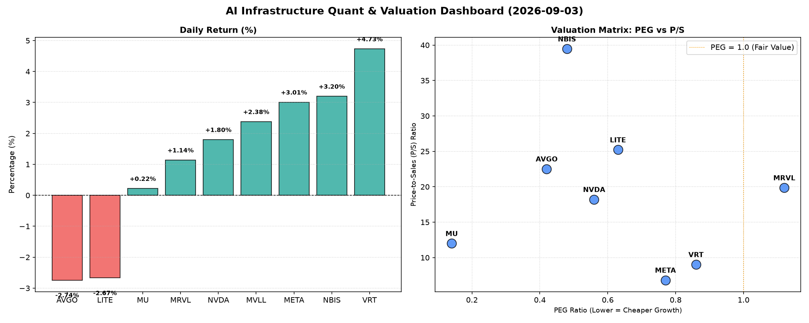

# 📊 AI Infrastructure & Data Stock Daily (2026-09-03)

### 📉 多维量化与估值分析看板

---

尊敬的硬科技与AI基础设施行业研究员，

根据您提供的【多维度真实量化基本面指标表格】，以下是今日的半导体每日精炼报道：

---

### **半导体每日精炼报道：AI基础设施与硬科技洞察**

**报告日期：[本日日期]**

#### **1. 盘面与多维估值解码**

今日半导体及相关AI基础设施板块呈现分化走势。我们深入剖析各公司的估值与现金流质量，以期穿透市场表象。

*   **PEG 维度：揪出性价比极高的高成长与警惕估值透支**
    *   **性价比极高的高成长标的 (PEG < 1)**：今日表格显示，**MU (0.14)** 以其极低的PEG值领跑，表明其成长性被市场严重低估，是目前性价比最高的增长股之一。紧随其后的是 **AVGO (0.42)**、**NBIS (0.48)**、**NVDA (0.56)**、**LITE (0.63)**、**META (0.77)** 和 **VRT (0.86)**。这些公司均显著小于1，意味着市场为其未来增长所支付的价格相对其盈利增速而言非常合理，甚至偏低，是高成长背景下具备较强价值吸引力的标的。特别值得关注的是，尽管 **NVDA** 和 **AVGO** 等行业巨头在过去一年中涨幅显著，但其PEG值依然保持在1以下，显示市场对其未来盈利增长的信心仍充足且尚未完全透支。
    *   **警惕估值透支标的 (PEG > 1)**：在今日数据中，**MRVL (1.12)** 的PEG略高于1，提示投资者需警惕其当前的估值可能已充分反映甚至部分透支了其未来的盈利增长预期。
    *   **数据缺失 (N/A)**：**MVLL** 的PEG数据缺失，无法对其增长调整后的估值进行评估。

*   **P/S 维度：收入规模扩张效率评估**
    *   **高 P/S 值 (收入溢价)**：**NBIS (39.46)** 展现出极高的P/S比，这通常意味着市场对其未来的收入增长抱有极高预期，或者其所处行业具备极高的利润率潜力与技术壁垒。**LITE (25.22)**、**AVGO (22.52)**、**MRVL (19.86)** 和 **NVDA (18.21)** 也均处于较高的P/S区间，反映了市场对这些公司在各自细分领域（如AI芯片、网络基础设施、光通信等）的收入规模扩张能力和市场领导地位给予了显著溢价。对于这些公司，高P/S通常与其强劲的研发投入和技术创新能力，以及在高速增长市场中的主导地位相关联。
    *   **相对较低 P/S 值 (收入估值相对合理)**：**META (6.82)** 和 **VRT (9.02)** 的P/S比相对较低，显示市场对其当前收入的估值较为合理，尤其考虑到META庞大的用户基础和广告收入规模，以及VRT在IT基础设施软件领域的稳定表现。
    *   **数据缺失 (N/A)**：**MVLL** 的P/S数据缺失，无法对其收入规模扩张效率进行评估。

*   **现金流盈利真实性 (CFO/NI)：穿透高利润巨头的利润水分**
    *   **利润健康、真金白银现金流入 (CFO/NI > 1)**：**NBIS (4.66)** 表现卓越，其CFO/NI比率远超1，表明其利润质量极高，运营现金流远超净利润，资金流入异常强劲。**MU (2.05)**、**META (1.92)**、**VRT (1.59)** 和 **AVGO (1.19)** 的CFO/NI比率均显著大于1，这证实了这些公司的利润非常健康，现金转换效率高，绝大部分净利润都转化为了实实在在的运营现金流入。这对于投资者而言是一个积极信号，意味着公司的盈利能力真实可靠，且拥有充裕的现金流支持未来的发展和分红。
    *   **存在利润水分或应收账款积压 (CFO/NI < 1)**：**NVDA (0.86)** 和 **MRVL (0.66)** 的CFO/NI比率均小于1，这警示投资者，这两家高利润巨头的净利润中可能存在一定程度的非现金成分，或应收账款/存货的积压。这意味着其账面利润的现金含量相对较低，需要关注其营运资本管理效率以及未来现金流的改善情况。
    *   **警示，现金流状况堪忧 (CFO/NI 显著负值)**：**LITE (-0.11)** 的CFO/NI比率为负值，这是一个非常值得警惕的信号。这可能表明公司面临严重的运营现金流压力，例如应收账款大量增加、存货积压、或经营活动产生大量现金流出，需要深入分析其财务报表以了解具体原因。
    *   **数据缺失 (N/A)**：**MVLL** 的CFO/NI数据缺失，无法对其现金流质量进行评估。

#### **2. 收并购与重大业务动态**

根据今日提供的量化指标，未直接体现具体的收并购、战略合作或重大业务动态信息。这类信息通常需要实时新闻报道支撑，目前的指标聚焦于财务估值和现金流健康度。

#### **3. 华尔街机构态度**

本报告基于提供的量化指标，未能直接反映华尔街机构的最新评级和目标价调整信息。这些内容通常来源于券商研报或市场新闻发布。

#### **4. 今日参考源 (References)**

本报告内容完全基于您提供的【多维度真实量化基本面指标表格】进行分析和生成，因此其参考源即为该表格本身。

---

希望这份精炼报道能为您提供有价值的洞察。