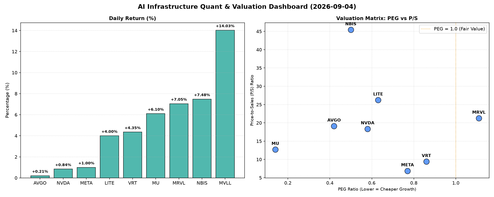

# 📊 AI Infrastructure & Data Stock Daily (2026-09-04)

### 📉 多维量化与估值分析看板

---

尊敬的各位投资者与业界同仁：

今日，硬科技与AI基础设施板块展现出显著的活力，部分公司股价录得强劲涨幅，同时通过多维度量化指标，我们得以更深入地洞察各公司的基本面健康状况与估值逻辑。

---

### **1. 盘面与多维估值解码 (定性+定量)**

今日市场整体情绪积极，多只半导体相关个股表现抢眼。MVLL以14.03%的涨幅领跑，MRVL、NBIS、MU也分别录得超过6%的涨幅。NVDA、AVGO、META等巨头虽涨幅温和，但交易量巨大，显示出市场对其核心地位的持续关注。

*   **PEG 维度：挖掘高性价比高成长**

    在PEG（市盈率相对增长率）指标上，我们发现多数硬科技与AI基础设施公司展现出极高的成长性价比：
    *   **PEG显著小于1（高成长，极具性价比）**：
        *   **MU (0.14)** 表现尤为突出，其极低的PEG值暗示市场对其未来盈利增长的预期远高于当前估值，是今天数据中成长性被严重低估的典范。
        *   **AVGO (0.42)**、**NBIS (0.5)**、**NVDA (0.58)**、**LITE (0.63)**、**META (0.77)** 和 **VRT (0.86)** 也均低于1，表明这些公司在提供强劲增长的同时，估值相对合理，具备较高的投资吸引力。其中，NBIS和NVDA作为AI基础设施核心玩家，在如此高的成长预期下仍能保持低PEG，显示出其强大的基本面支撑。
    *   **PEG略高于1（估值值得警惕）**：
        *   **MRVL (1.11)** 的PEG略高于1，结合其7.05%的涨幅，投资者在追逐其短期动能时需警惕估值可能存在的透支风险。
    *   **PEG不可用（待观察）**：
        *   **MVLL (N/A)** 未提供PEG数据，但今日股价表现异常强劲，需结合其他维度深入分析或关注其是否有未公开的重大利好消息。

*   **P/S 维度：洞察收入扩张效率与市场预期**

    对于处于高速发展阶段或研发投入巨大的公司，P/S（市销率）能有效评估其收入规模扩张效率及市场对其未来营收的预期：
    *   **极高P/S（高市场预期或高风险）**：
        *   **NBIS (45.42)** 拥有最高的P/S，远超同业。这表明市场对其未来营收增长抱有极其乐观的预期，预计其收入将呈爆发式增长，但也意味着其估值弹性高，潜在波动大。
        *   **LITE (26.23)**、**MRVL (21.26)**、**AVGO (19.11)**、**NVDA (18.36)** 的P/S也处于较高水平。对于LITE和MRVL，结合其现金流质量（见下文），高P/S可能代表一定的估值泡沫；而对于AVGO和NVDA，考虑到其在各自领域的霸主地位及AI浪潮的推动，市场对其未来高营收增长的预期有一定合理性。
    *   **相对合理P/S**：
        *   **VRT (9.41)**、**MU (12.72)** 的P/S处于中等水平，结合其较低的PEG，显示出相对健康的成长与估值匹配。
        *   **META (6.88)** 的P/S在科技巨头中相对较低，这可能反映了市场对其核心广告业务成熟度的考量，但结合其在AI领域的持续投入和发展潜力，这一P/S值或提供了一定的安全边际。

*   **现金流盈利真实性 (CFO/NI)：穿透利润含金量**

    CFO/NI（经营现金流/净利润）比率是衡量公司利润质量的关键指标。该值大于1，表明公司利润是真金白银的现金流入，财务健康；显著小于1，则可能存在利润水分或应收账款积压。
    *   **利润健康，现金流充裕（CFO/NI > 1）**：
        *   **NBIS (4.66)** 表现极为出色，高达4.66的CFO/NI比率表明其盈利能力强大且现金流极度充裕，是真正的“现金奶牛”，这为其极高的P/S提供了一定的基本面支撑。
        *   **MU (2.05)** 和 **META (1.92)** 同样展现出卓越的现金流生成能力，CFO/NI远超1，证实了其利润的真实性和健康性，是财务稳健的巨头典范。
        *   **VRT (1.59)** 和 **AVGO (1.19)** 也保持了健康的现金流比率，显示其经营状况良好，利润质量高。
    *   **利润含金量存疑，需警惕（CFO/NI < 1）**：
        *   **NVDA (0.86)** 尽管市场表现强劲，但其CFO/NI略低于1，提示我们其部分利润可能尚未转化为实际现金流入，可能存在应收账款增加或预付款项较多等情况，需密切关注其营运资本变化。
        *   **MRVL (0.66)** 的CFO/NI值显著低于1，结合其PEG高于1和P/S偏高，这构成了一个三重警示信号，表明其利润质量存在较大隐忧，短期内股价涨幅可能缺乏坚实的现金流支撑。
    *   **严重警示，现金流危机（CFO/NI < 0）**：
        *   **LITE (-0.11)** 的CFO/NI为负值，这是一个非常严重的警示信号。这意味着其经营活动不仅没有产生正向现金流，反而消耗了现金，即使在账面上存在净利润，也未能转化为真实的现金。结合其极高的P/S，LITE的估值与基本面存在严重脱节，风险极高。

---

### **2. 收并购与重大业务动态**

基于您提供的【多维度真实量化基本面指标表格】，当前数据中未直接包含有关收并购传闻、官宣或战略合作的具体信息。我们无法从纯粹的量化财务指标中直接推断此类定性业务动态。此类信息通常需通过新闻公告、公司财报电话会议或行业报道获取。

---

### **3. 华尔街机构态度**

同样，根据您提供的量化基本面指标表格，我们无法直接获取华尔街核心投行或评级机构对这些公司的最新评价、目标价调动或评级调整。这些信息通常来源于券商研报、财经媒体报道等外部渠道。

---

### **4. 今日参考源 (References)**

本报告的定性与定量分析严格基于您提供的【多维度真实量化基本面指标表格】。鉴于指令要求仅以此表格为分析源，未额外引入外部新闻数据，故不列出外部新闻出处。

---

**总结：**

今日半导体与AI基础设施板块活跃，但各公司基本面表现分化。在追求高成长性的同时，投资者需结合PEG、P/S及CFO/NI等多维度指标，全面评估风险与回报。特别是对于PEG高于1、P/S极高且CFO/NI低于1甚至为负的公司，务必保持高度警惕。

**研究员：[您的姓名/机构名称，此处留空]**
**日期：[今日日期]**