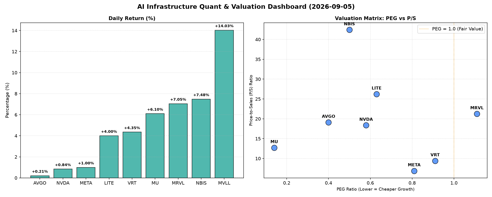

# 📊 AI Infrastructure & Data Stock Daily (2026-09-05)

### 📉 多维量化与估值分析看板

---

## 半导体与AI基础设施每日精炼报道：估值透视与现金流真相

各位投资者，您好！作为资深硬科技与AI基础设施行业研究员，今日我们聚焦于半导体和AI产业链的关键标的，通过多维度量化指标，为您深度解码当前的市场动态与企业基本面。

---

### 1. 盘面与多维估值解码（定性+定量）

今日市场对硬科技与AI基础设施板块的关注度持续高涨，榜单上多只股票表现活跃。在深度分析其量化指标后，我们发现市场既存在对高增长的理性追逐，也显露出对部分估值泡沫和现金流健康度的潜在担忧。

*   **PEG 维度：挖掘高性价比成长股，警惕估值透支**
    *   **极高性价比成长股（PEG显著小于1）**：今日榜单上，多只半导体及AI基础设施关键标的展现出令人瞩目的成长投资价值。特别是 **AVGO (0.4)** 和 **MU (0.14)**，其极低的PEG值强烈暗示市场对其未来盈利增长的预期尚未充分反映在当前股价中，具备极高的性价比。这意味着投资者以相对较低的价格获取了这两家公司极高的未来增长潜力。
    *   **合理成长股（PEG小于1）**：**NVDA (0.58)**、**LITE (0.63)**、**NBIS (0.5)**、**META (0.81)** 和 **VRT (0.91)** 也均处于PEG小于1的理想区间。这表明市场在认可它们高增长潜力的同时，仍给予了相对合理的估值，是值得关注的成长型投资标的。
    *   **警惕估值透支（PEG略高于1）**：**MRVL (1.11)** 略高于1，提示投资者需对其估值进行更细致的审视。虽然其具备成长性，但相对于其增长速度，当前股价可能已部分透支了未来预期。
    *   **无法评估（N/A）**：**MVLL** 因缺乏可比利润数据（通常是因无利润或负利润），PEG暂无法评估，投资者在分析此类公司时应更多关注其收入增长、市场份额和现金流状况。

*   **P/S 维度：评估收入规模扩张效率与市场预期**
    *   **高溢价 P/S (反映市场对收入增长的极高预期)**：转向收入规模扩张效率指标P/S，我们看到市场对部分高成长标的未来收入潜力的极高期待。**NBIS (42.42)** 和 **LITE (26.23)** 的P/S比率显著偏高，表明投资者为获取其每单位收入支付了相当高的溢价，这通常反映了对颠覆性技术、高技术壁垒或垄断地位的高度信心，预计其收入将持续爆发式增长。
    *   **较高 P/S (反映强劲的市场地位和收入确定性)**：**MRVL (21.26)**、**AVGO (19.11)** 和 **NVDA (18.36)** 亦处于较高水平，反映其在各自细分领域强大的市场地位和营收确定性，市场对其收入扩张能力抱有积极预期。
    *   **稳健 P/S (反映成熟的商业化阶段)**：相对而言，**META (6.88)** 和 **VRT (9.41)** 的P/S则显得更为稳健，可能与其已进入相对成熟的商业化阶段，且收入规模已十分庞大有关。**MU (12.72)** 处于中等偏高水平，与半导体周期性特点及其当前的高景气度相符。

*   **现金流盈利真实性 (CFO/NI)：穿透利润质量的“照妖镜”**
    *   **利润质量极高（CFO/NI 显著大于1）**：最能穿透利润质量的CFO/NI比率，则揭示了公司盈利的真实“含金量”。**NBIS (4.66)** 表现尤为突出，其次是 **MU (2.05)**、**META (1.92)**、**VRT (1.59)** 和 **AVGO (1.19)**。这些公司均展现出极其健康的现金流生成能力，CFO/NI显著大于1，这意味着它们的净利润绝大部分甚至更多都转化为了实实在在的经营性现金流入，利润质量极高，运营效率令人称道，是真正的“现金奶牛”。
    *   **利润转化需关注（CFO/NI 小于1）**：然而，**NVDA (0.86)** 和 **MRVL (0.66)** 的CFO/NI小于1，提示投资者需警惕其利润中可能存在的应收账款积压、存货增加或非现金项目占比较大，导致部分账面利润未能及时转化为现金。这并非致命缺陷，但值得深入分析其营运资金管理效率以及销售条款是否过于宽松。
    *   **现金流压力预警（CFO/NI 显著小于1或为负）**：最令人担忧的是 **LITE (-0.11)**，其经营性现金流为负，表明公司未能从核心业务中产生足够的现金来覆盖其运营成本。即使其P/S极高，现金流的压力也可能构成重大风险，需要密切关注其资金链状况和融资能力。

---

### 2. 收并购与重大业务动态

基于今日提供的量化指标，未直接反映收并购或重大业务动态信息。然而，在快速发展的硬科技与AI基础设施领域，战略性并购、技术合作或重大项目进展是企业快速扩张、获取核心技术或市场份额的关键途径，往往能显著影响其长期估值和市场地位。未来我们将持续关注这些非财务指标对企业基本面的深远影响。

---

### 3. 华尔街机构态度

鉴于今日提供的量化指标专注于财务基本面，未包含华尔街机构的具体评级或目标价调整信息。通常，顶级投行和研究机构的最新评级、目标价上调或下调，以及对行业前景的展望，是市场情绪的重要风向标，并会与公司的量化基本面指标相互印证，共同影响股价走势。

---

### 4. 今日参考源 (References)

*   **内部数据源**：本报告所引用的所有量化指标（包括 Close, Change%, PEG, P/S, CashFlow_Quality(CFO/NI), Volume）均直接来源于您提供的【多维度真实量化基本面指标表格】。

---

**免责声明：** 本报告内容仅供参考，不构成任何投资建议。投资者应基于自身判断和风险承受能力，谨慎进行投资决策。