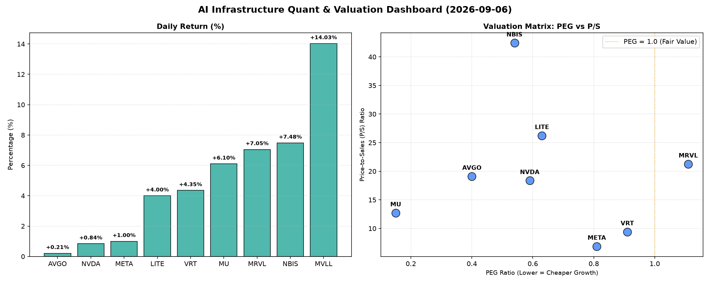

# 📊 AI Infrastructure & Data Stock Daily (2026-09-06)

### 📉 多维量化与估值分析看板

---

## 半导体每日精炼报道：硬科技与AI基础设施深度分析 (202X年XX月XX日)

尊敬的投资者与行业同仁：

今日硬科技与AI基础设施板块表现活跃，多数半导体相关标的录得显著涨幅。本报告将结合多维度量化指标，为您深度剖析当前市场格局与各公司基本面表现。

### 1. 盘面与多维估值解码 (定性+定量)

今日市场呈现普遍上涨态势，其中MVLL以14.03%的涨幅领跑，NBIS、MRVL、MU也录得超过6%的强劲增长，显示出市场对特定细分领域及高成长性标的的追捧。

#### PEG 维度：成长性与估值性价比的深度洞察

PEG指标通过考量市盈率与盈利增长率，为投资者提供了一个衡量成长性估值性价比的核心工具。

*   **性价比极高的高成长标的 (PEG < 1)：**
    *   **MU (0.15)** 表现尤为突出，其极低的PEG值暗示了市场对其未来盈利增长的严重低估，或者其当前估值与高速增长前景相比，具备极高的安全边际和潜在爆发力。对于存储周期股而言，这可能预示着强劲的周期性复苏被低估。
    *   **AVGO (0.4)、NBIS (0.54)、NVDA (0.59)、LITE (0.63)** 也呈现出优秀的PEG表现。这意味着这些公司在各自的高增长领域（如AI芯片、光模块、数据中心基础设施）具备强劲的盈利增长预期，且当前估值相对合理，甚至被市场低估。对于NVDA而言，尽管P/S较高，但其PEG仍显著小于1，表明其增长速度足以支撑甚至超越当前估值。
    *   **META (0.81)、VRT (0.91)** 同样处于PEG小于1的健康区间，表明其作为AI巨头和关键基础设施提供商，在持续投资AI和元宇宙的同时，其增长前景并未被完全透支。

*   **需警惕估值透支的标的 (PEG > 1)：**
    *   **MRVL (1.11)** 是唯一PEG略高于1的标的，这可能暗示其当前的股价已部分反映了未来的增长预期，投资者在介入时需审慎评估其后续增长驱动力是否能持续超预期，以避免估值风险。

#### P/S 维度：收入规模扩张效率的审视

P/S（市销率）尤其适用于评估早期、高增长或尚处于大规模研发投入阶段、利润波动较大的公司，反映市场对其收入增长潜力的认可度。

*   **高P/S下的成长潜力与风险并存：**
    *   **NBIS (42.42) 和 LITE (26.23)** 的P/S值非常高，远超同行。这表明市场对其未来收入爆发式增长寄予厚望，特别是考虑到LITE的CFO/NI为负值，其高P/S更体现了对其在特定高科技领域（如光通信、传感器）的前瞻性投资和技术领导地位的溢价。然而，过高的P/S也意味着一旦增长不及预期，估值回调的风险较大。
    *   **MRVL (21.26)、AVGO (19.11)、NVDA (18.36)** 也具有较高的P/S，体现了市场对其在数据中心、AI计算和网络基础设施等核心领域的强大变现能力和市场份额的认可。对于这些行业领导者，高P/S是其技术护城河和行业地位的体现。

*   **相对稳健的P/S表现：**
    *   **MU (12.72)** 尽管P/S不低，但结合其极低的PEG，暗示其收入增长效率与未来利润转化潜力值得关注。
    *   **VRT (9.41)** 和 **META (6.88)** 的P/S相对适中，特别是META作为科技巨头，其P/S反映了其庞大的用户基础和多元化的商业模式带来的稳定收入流。

#### 现金流盈利真实性 (CFO/NI)：利润质量的试金石

CFO/NI（经营活动现金流/净利润）是衡量公司利润转化为真实现金能力的关键指标，反映了利润的“含金量”。

*   **利润含金量极高，财务基础稳固：**
    *   **NBIS (4.66)** 表现异常出色，其CFO/NI远高于1，这可能意味着其报告的净利润因折旧摊销等非现金费用被低估，或存在大量预收款项等有利现金流入，现金生成能力极强。结合其高P/S和低PEG，显示出其在快速发展中具备强大的现金流支撑。
    *   **MU (2.05)** 和 **META (1.92)** 同样展现出卓越的现金流生成能力，远超其报告净利润。对于META而言，这证明其庞大业务产生的利润绝大部分都以真金白银的形式回流，财务健康度极高。MU的高CFO/NI也印证了其在存储周期上行阶段的强大现金捕捉能力。
    *   **VRT (1.59)** 和 **AVGO (1.19)** 也保持了健康的CFO/NI比率，表明其利润质量良好，经营活动产生的现金流能够有效覆盖或超越报告利润。

*   **需关注利润质量，警惕现金流压力：**
    *   **NVDA (0.86)** 的CFO/NI略低于1，虽然差距不大，但对于一家高利润巨头而言，这提示投资者需关注其是否存在应收账款增加、存货积压或其他非现金成本上升的情况，导致部分报告利润未能及时转化为经营现金流。
    *   **MRVL (0.66)** 的CFO/NI显著低于1，这是一个值得警惕的信号。这可能意味着其利润中非现金成分较高，或者存在较多的应收账款未能及时回收，导致实际可支配的经营现金流远低于报告的净利润，需深入分析其营运资本周转效率。
    *   **LITE (-0.11)** 的CFO/NI为负值，这在销售收入尚可观（P/S 26.23）的情况下，通常预示着公司正处于重大的投资期、研发投入巨大、或面临运营现金流挑战。对于高成长性公司，这并非罕见，但需要密切关注其资本支出和融资能力，以及何时能实现现金流转正。

*   **特殊情况：MVLL (N/A)**：尽管MVLL今日涨幅高达14.03%，但由于缺乏P/S、PEG及CFO/NI等关键基本面指标，投资者在追逐其高涨幅时，务必警惕信息不对称带来的风险，并等待更多数据披露。

### 2. 收并购与重大业务动态

根据今日提供的量化指标表格，我们未能直接获取到具体的收并购或重大业务动态信息。硬科技与AI基础设施领域，尤其是在半导体行业，并购整合和战略合作是常态。鉴于AI算力需求持续爆发，以及产业链上下游的协同效应，预计未来仍将有大量与AI芯片、光模块、先进封装、数据中心解决方案相关的战略合作或并购活动，以巩固市场地位和扩展技术边界。今日部分股价的显著异动（如MVLL的14.03%涨幅）常伴随着内部利好消息或市场传闻，但具体细节需进一步新闻验证。

### 3. 华尔街机构态度

今日提供的量化基本面指标表格中不包含华尔街机构的最新评价、目标价调动或评级信息。因此，本报告无法就此提供具体分析。然而，从今日市场对AI基础设施相关标的普遍追捧来看，机构投资者对该板块的长期增长前景持乐观态度或将是市场共识。

### 4. 今日参考源 (References)

本报告的全部分析基于您提供的【多维度真实量化基本面指标表格】。所有定性解读均严格围绕表格中的数据展开，不涉及外部实时新闻数据。

---
**免责声明：** 本报告内容仅供参考，不构成任何投资建议。投资者应基于自身判断，并咨询专业人士意见后进行投资决策。市场有风险，投资需谨慎。