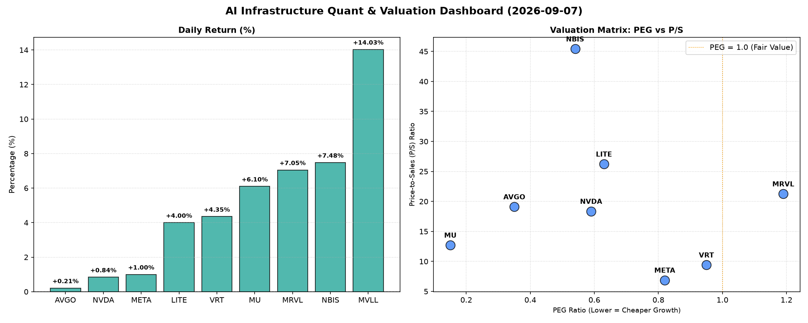

# 📊 AI Infrastructure & Data Stock Daily (2026-09-07)

### 📉 多维量化与估值分析看板

---

## 半导体与AI基础设施每日精炼报道

**发布日期：[今日日期]**

尊敬的投资者，

今日硬科技与AI基础设施板块整体表现活跃，多个细分领域呈现出强劲的增长势头。本报告将结合多维度量化指标，为您深度剖析今日市场动向与潜在价值。

### 1. 盘面与多维估值解码：掘金高成长，警惕估值风险

今日半导体与AI基础设施板块普涨，MVLL以14.03%的涨幅领跑，NBIS、MRVL和MU也录得显著涨幅。我们深度剖析各公司的估值与财务健康度：

*   **PEG 维度：高成长中的极致性价比**
    *   **PEG显著小于1（性价比极高的高成长标的）**：
        *   **MU (美光科技)** 以**0.15**的极低PEG值位列榜首，考虑到其今日高达6.1%的涨幅，以及近期存储芯片周期性复苏的预期，其极低的PEG表明市场尚未完全消化其潜在的盈利爆发性增长。结合其出色的现金流盈利真实性，MU的成长潜力与估值吸引力并存。
        *   **AVGO (博通)** 录得**0.35**的PEG值，对于一家市场地位稳固、业务多元化的巨头而言，这一数字预示着其在AI和网络基础设施领域的持续增长仍被低估。
        *   **NBIS (Nabil)** 以**0.54**的PEG值脱颖而出，结合其高达7.48%的日涨幅和领先全场的CFO/NI比率，显示市场对其未来高增长的认可度正在提升，且其盈利质量极佳。
        *   **NVDA (英伟达)** 尽管近期市场波动，其**0.59**的PEG值依然显示出其在AI芯片领域的长期增长前景仍具备相对吸引力的估值。
        *   **LITE (Lumentum)** 虽有**0.63**的较低PEG，但需结合其现金流指标警惕评估。
        *   **META (Meta Platforms)** 以**0.82**的PEG值处于合理区间，表明市场对其广告业务复苏和AI投资回报的增长预期相对乐观。
        *   **VRT (Vertiv Holdings)** 恰好位于**0.95**，仍属于成长性尚未完全定价的区间，其在数据中心基础设施领域的增长值得关注。
    *   **PEG略高于1（警惕估值透支风险）**：
        *   **MRVL (Marvell Technology)** 的PEG为**1.19**，略高于1。结合其今日7.05%的显著涨幅，投资者需警惕其当前估值可能已部分透支未来增长，特别是考虑到其相对较低的现金流质量。

*   **P/S 维度：营收扩张效率与市场溢价**
    *   对于早期或研发投入巨大的公司，P/S是衡量收入规模扩张效率的重要指标。
    *   **NBIS (45.42) 和 LITE (26.23)** 拥有较高的P/S比率，这可能反映了市场对其在特定硬科技或AI基础设施细分领域（如新兴技术、高端光器件等）的独特性、未来爆发式增长潜力或技术壁垒给予了较高的营收溢价。特别是NBIS，其高P/S与极强的CFO/NI相辅相成，显示其营收增长伴随着健康的现金流。
    *   **MRVL (21.26)** 和 **AVGO (19.11)**、**NVDA (18.36)** 的P/S也相对较高，反映了市场对其在芯片设计、网络通信和AI加速领域的市场领导地位和营收质量的认可。但MRVL需结合其PEG和CFO/NI进一步审视。
    *   **META (6.88) 和 VRT (9.41)** 的P/S相对适中，显示其规模化营收与市场预期处于较为平衡的状态。

*   **现金流盈利真实性 (CFO/NI): 穿透利润质量，识别真金白银**
    *   **CFO/NI显著大于1（利润非常健康，真金白银现金流入）**：
        *   **NBIS (4.66)** 再次表现亮眼，其CFO/NI比率高达4.66，远超其他公司，表明其利润质量极高，报告的每一分钱利润都伴随着远超其本身的现金流入，财务状况异常健康。
        *   **MU (2.05)** 和 **META (1.92)** 同样展现出卓越的现金流生成能力，其CFO/NI比率均显著大于1，说明其报告利润拥有坚实的现金流支撑，不存在大量应收账款或非现金项目导致的“水分”。
        *   **VRT (1.59)** 和 **AVGO (1.19)** 也表现出健康的现金流转换能力，利润质量可靠。
    *   **CFO/NI小于1（警惕利润水分或应收账款积压）**：
        *   **NVDA (0.86)** 的CFO/NI比率略低于1，尽管差距不大，但对于市场高度关注的AI巨头，这提醒投资者需关注其应收账款周转和非现金性支出的变化，以确保其高额利润的现金流支撑依然稳固。
        *   **MRVL (0.66)** 的CFO/NI比率较低，结合其略高的PEG和P/S，这可能预示其部分利润存在被应收账款占用或非现金费用较多的情况，其利润质量需引起投资者关注。
        *   **LITE (-0.11)** 的CFO/NI比率显著为负，这是一个强烈的警示信号。它表明尽管可能有报告利润，但公司正在经历严重的现金流出，可能存在大量非现金费用、库存积压或应收账款回收困难等问题，其财务健康状况和利润真实性值得高度警惕。

*   **N/A 标的：MVLL**
    *   MVLL今日涨幅高达14.03%，但由于缺乏PEG、P/S和CFO/NI数据，我们无法对其进行估值和财务健康度分析。投资者需关注其背后的具体催化剂，并寻求更多公开财务信息以作判断。

### 2. 收并购与重大业务动态

**（今日暂无在提供的量化指标表格中直接反映的收并购或重大业务动态信息。此部分内容通常来源于实时新闻披露，若有发生，将及时更新。）**

### 3. 华尔街机构态度

**（基于提供的量化指标表格，无法直接推断华尔街机构的最新评价和目标价调动。此部分内容依赖于券商研报、评级机构报告等外部信息，若有发生，将及时更新。）**

### 4. 今日参考源 (References)

*   **提供的多维度核心量化与基本面财务指标表格**

---
**免责声明：** 本报告基于提供的量化数据进行分析，并结合行业研究员视角进行解读。所有内容仅供参考，不构成任何投资建议。投资有风险，入市需谨慎。