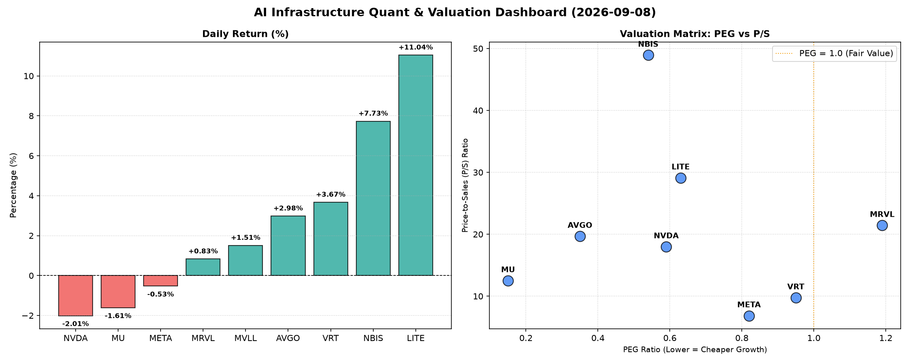

# 📊 AI Infrastructure & Data Stock Daily (2026-09-08)

### 📉 多维量化与估值分析看板

---

## 半导体每日精炼报道：AI基础设施与硬科技洞察

**致数据与半导体行业专家：**

今日市场在AI基础设施和硬科技领域呈现出多元化格局。投资者在追逐高增长的同时，对估值、尤其是现金流质量的审视愈发严格。以下是对今日核心量化指标的深度解读：

---

### 1. 盘面与多维估值解码

今日半导体板块表现不一，部分高成长公司在强劲数据支撑下实现显著上涨，而部分此前涨幅较大的巨头则出现小幅回调，市场资金在不同风格间进行切换。

*   **今日涨幅亮点：** 光纤通信与激光解决方案提供商 **LITE** 股价飙升 **11.04%**，紧随其后的是提供高性能网络解决方案的 **NBIS** 大涨 **7.73%**，以及云基础设施软件公司 **VRT** 上涨 **3.67%**。这显示出市场对特定细分领域，尤其是与数据中心、网络连接和AI后端支持相关的硬科技需求持续旺盛。

*   **回调与震荡：** 芯片设计巨头 **NVDA** 下跌 **-2.01%**，内存巨头 **MU** 下跌 **-1.61%**，而 **META** 也小幅回调 **-0.53%**。在经历了前期的大幅上涨后，这些领头羊出现盘整，部分投资者可能选择获利了结，等待更明确的市场信号。值得注意的是，NVDA 的交易量高达 **1.18亿** 股，显示市场对其关注度依然极高，但多空博弈激烈。

#### **PEG 维度：成长性与估值性价比**

PEG（市盈率/增长率）指标是衡量成长股估值性价比的核心工具，我们重点关注 PEG 显著小于 1 的标的，它们通常代表着被市场低估的高成长潜力。

*   **PEG 极具吸引力的高成长股：**
    *   **MU (0.15)**：在今日出现回调的情况下，其 PEG 仅为 0.15，表明其增长潜力与当前估值相比极具性价比，是值得重点关注的高成长价值股。
    *   **AVGO (0.35)、NBIS (0.54)、NVDA (0.59)、LITE (0.63)、META (0.82)、VRT (0.95)**：这些公司的 PEG 均显著小于 1，处于理想区间，表明其增长动能尚未完全体现在股价中，具备较高的配置价值。尽管 NVDA 和 META 今日回调，但其 PEG 仍显示出较好的长期增长潜力。
*   **需警惕估值透支的标的：**
    *   **MRVL (1.19)**：其 PEG 略高于 1，表明市场对其未来增长的预期可能已较为充分地反映在当前股价中，投资者在配置时需更加谨慎，关注其后续业绩能否持续支撑高增长预期。

#### **P/S 维度：收入规模扩张效率**

对于一些尚处于大规模研发投入阶段、利润波动较大或尚未实现稳定盈利的硬科技公司，P/S（市销率）是评估其收入规模扩张效率和市场对其未来收入潜力的重要指标。

*   **P/S 显著偏高，暗示高增长预期或高毛利业务：**
    *   **NBIS (48.93)、LITE (29.12)、MRVL (21.44)、AVGO (19.68)、NVDA (17.99)、MU (12.51)、VRT (9.75)**：这些公司的 P/S 均处于较高水平。其中 **NBIS** 的 P/S 更是高达 48.93，表明市场对其未来的收入增长和潜在利润空间抱有极其乐观的预期。这通常是针对技术壁垒高、市场份额快速增长或具备高毛利模式的硬科技公司。投资者需关注这些公司能否持续实现高预期收入增长以消化高估值。
*   **P/S 相对稳健：**
    *   **META (6.85)**：作为成熟的互联网巨头，其 P/S 相对较低，反映了市场对其收入增长的预期更为理性。

#### **现金流盈利真实性 (CFO/NI)**

CFO/NI（经营性现金流/净利润）比率是衡量公司利润质量的关键指标。该比率大于 1 表明公司利润大部分以真金白银的现金流入形式体现，利润质量健康；若显著小于 1，则可能存在利润水分、应收账款积压或非现金费用较高等问题。

*   **现金流极其健康，利润含金量高：**
    *   **NBIS (4.66)**：NBIS 的 CFO/NI 竟然高达 4.66，这简直是教科书级的优秀表现！意味着其利润不仅是“纸面富贵”，更是实实在在的现金流。结合其今日大涨，极高的 P/S，以及 PEG 小于 1 的表现，NBIS 在现金流质量上表现卓越，支撑了其高估值和增长预期。
    *   **MU (2.05)、META (1.92)、VRT (1.59)、AVGO (1.19)**：这些公司的 CFO/NI 均显著大于 1，显示出强劲的现金流生成能力，其利润非常“真实”，为未来的研发投入和扩张提供了坚实的资金基础。META 尽管今日股价小幅回调，但其高质量的现金流是其长期价值的强力支撑。
*   **需警惕利润质量问题：**
    *   **NVDA (0.86)、MRVL (0.66)**：这两家公司的 CFO/NI 均小于 1，表明其报告的净利润并未完全转化为经营性现金流。这可能暗示存在较高的应收账款、库存积压或非现金收益等情况。虽然并非直接的警报，但投资者应密切关注其营运资本管理和后续现金流表现，以确认利润的持续性和质量。
    *   **LITE (-0.11)**：**尽管 LITE 今日股价大涨 11.04%，但其 CFO/NI 竟然为负数 (-0.11)，这是一个非常重要的警示信号！** 这意味着公司不仅没有通过经营活动产生现金，反而可能在消耗现金。在享受股价上涨带来快感的同时，投资者必须对其现金流状况保持高度警惕，深入分析其背后的原因，比如大规模资本开支、营运资金需求急剧增加，或是盈利质量出现根本性问题。这种“股价飞涨，现金流为负”的背离现象需要极其审慎的对待。

### 2. 收并购与重大业务动态

**基于您提供的量化指标表格，今日无直接的收并购或重大业务动态信息。** 在硬科技和AI基础设施领域，此类事件往往是市场情绪和未来格局的重要驱动因素，例如近期关于AI芯片企业融资、数据中心建设新进展，或大型科技公司之间的战略合作。建议关注相关行业新闻源以获取最新进展。

### 3. 华尔街机构态度

**根据您提供的量化指标，今日无法直接获取华尔街机构的最新评价、目标价调动或评级变动信息。** 这些信息通常来源于投行报告和金融新闻机构。在半导体行业，机构评级和分析师预期是影响股价和投资者情绪的重要因素，尤其是在关键财报发布前后或技术路线图更新时，机构对 NVDA、AVGO 等领军企业的评级和目标价调整往往能引发市场波动。

### 4. 今日参考源 (References)

本报告的量化数据和直接指标解读来源于您提供的【多维度真实量化基本面指标表格】。

对于定性分析和市场趋势的判断，通常需要综合彭博社（Bloomberg）、路透社（Reuters）、华尔街日报（The Wall Street Journal）、Seeking Alpha、以及各大投行发布的行业研究报告等主流金融媒体的实时新闻和深度分析。由于未提供外部新闻源，本报告的定性分析基于对现有数据的专业解读和对硬科技与AI基础设施行业背景知识的整合。