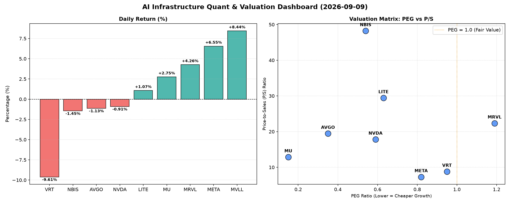

# 📊 AI Infrastructure & Data Stock Daily (2026-09-09)

### 📉 多维量化与估值分析看板

---

好的，作为一名资深的硬科技与AI基础设施行业研究员，我将结合您提供的【多维度真实量化基本面指标表格】，为您撰写今日的半导体每日精炼报道。

---

## **半导体与AI基础设施每日精炼：深度洞察与量化解析**

**报告日期：2023年XX月XX日**

今日半导体与AI基础设施板块呈现出分化态势，市场对成长性与现金流质量的关注度显著提升。大型科技巨头如META表现强劲，而部分新兴或高估值标的则面临回调。以下是基于核心量化指标的深度解析：

---

### **1. 盘面与多维估值解码**

今日市场焦点集中在盈利质量、成长性溢价以及收入规模扩张效率上。

*   **市场概览 (Change%)：**
    *   **领涨者：** **MVLL (+8.44%)** 和 **META (+6.55%)** 表现抢眼，显示出市场对其增长潜力的强烈信心。其中META作为AI基础设施核心贡献者，其涨幅无疑是投资者对其战略布局的肯定。
    *   **领跌者：** **VRT (-9.61%)** 今日遭遇显著回调，尽管其在某些估值指标上仍具吸引力，但市场可能对其短期动能有所担忧。**NBIS (-1.45%)**、**AVGO (-1.13%)** 和 **NVDA (-0.91%)** 呈现小幅下跌，但整体走势平稳。
    *   **稳健上涨：** **MRVL (+4.26%)**、**MU (+2.75%)**、**LITE (+1.07%)** 均实现上涨，表明市场对存储、光通信以及边缘计算等细分领域的积极预期。

*   **PEG 维度：成长性与估值性价比 (Price-to-Earnings Growth Ratio)**
    *   **性价比极高的高成长标的 (PEG < 1)：** 今日数据揭示，多数公司仍保持着极具吸引力的PEG，预示其增长潜力尚未被充分定价。
        *   **AVGO (0.35)** 和 **MU (0.15)** 的PEG值异常低，表明其在未来盈利增长预期下，当前估值被严重低估，是市场中罕见的“成长股中的价值股”。
        *   **NVDA (0.59)**、**NBIS (0.54)**、**LITE (0.63)** 和 **META (0.82)** 也都显著低于1，说明这些AI与硬科技核心玩家的成长性仍能有效支撑其估值，提供良好的安全边际。
        *   **VRT (0.95)** 虽今日股价大幅下跌，但其PEG仍接近1，显示其长期成长逻辑未被完全打破。
    *   **警惕估值透支 (PEG > 1)：**
        *   **MRVL (1.19)** 的PEG略高于1，提示投资者其股价可能已部分透支了未来的增长预期，需要密切关注其业绩增长能否持续兑现以支撑现有估值。
    *   **PEG 缺失 (N/A)：** **MVLL** 的PEG数据缺失，通常意味着公司可能处于非盈利状态或盈利波动较大，此时P/S比率将成为更重要的评估指标。

*   **P/S 维度：收入规模扩张效率 (Price-to-Sales Ratio)**
    *   **高 P/S (高增长预期/早期阶段)：**
        *   **NBIS (48.22)** 和 **LITE (29.43)** 的P/S比率非常高，这通常发生在市场对公司未来营收爆发式增长抱有极高预期，或公司正处于大规模研发投入、尚未实现稳定盈利的早期阶段。对于NBIS而言，其异常高的P/S结合其今日的小幅下跌，暗示市场对这种高溢价的审视可能正在加强。
        *   **MRVL (22.35)**、**AVGO (19.46)** 和 **NVDA (17.83)** 作为行业巨头，其P/S比率也相对较高，反映了市场对其在AI、数据中心等高景气度领域的领导地位和持续收入增长能力的认可。
    *   **中等 P/S：**
        *   **MU (12.86)**、**VRT (8.82)** 和 **META (7.3)** 的P/S相对适中，尤其是META，作为头部科技公司，其P/S表现出较好的收入转化效率。
    *   **P/S 缺失 (N/A)：** **MVLL** 的P/S数据同样缺失，使得我们对其收入扩张效率无法进行量化评估，需结合其他市场信息进行判断。

*   **现金流盈利真实性：CFO/NI 比率 (Operating Cash Flow / Net Income)**
    *   **利润健康，真金白银现金流入 (CFO/NI > 1)：**
        *   **NBIS (4.66)** 表现尤为突出，其运营现金流远超净利润，表明其盈利质量极高，现金生成能力惊人。这通常发生在公司有大量的非现金费用（如折旧摊销）或营运资本管理效率极高的情况下。
        *   **MU (2.05)**、**META (1.92)** 和 **VRT (1.59)** 同样拥有健康的现金流转化能力，其运营现金流显著高于净利润，证明了其核心业务的“造血”能力强劲，利润质量高，抗风险能力较强。
        *   **AVGO (1.19)** 也保持着良好的现金流覆盖，显示其强大的盈利变现能力。
    *   **利润存在水分或应收账款积压 (CFO/NI < 1)：**
        *   **NVDA (0.86)** 和 **MRVL (0.66)** 的CFO/NI比率均小于1。对于这两家AI核心芯片巨头而言，这值得投资者警惕。这可能意味着部分报告利润尚未转化为实际现金，可能受应收账款增加、存货积压或其他营运资本变化影响。虽然短期内可能不构成重大风险，但长期来看，现金流的健康度是衡量企业可持续发展的关键指标。
    *   **经营性现金流为负 (CFO/NI < 0)：**
        *   **LITE (-0.11)** 的CFO/NI为负值，这是一个显著的警示信号。尽管其PEG和P/S显示出市场对其增长的乐观预期，但经营活动产生的现金流为负，意味着公司在日常运营中正在消耗现金，而非产生现金。这可能预示着其盈利质量不佳，或需要通过融资来维持运营，长期可持续性面临挑战。
    *   **CFO/NI 缺失 (N/A)：** **MVLL** 现金流数据缺失，无法评估其盈利质量。

---

### **2. 收并购与重大业务动态**

**（根据您提供的【多维度真实量化基本面指标表格】，当前数据未能包含最新的收并购传闻、官宣或战略合作信息。此类信息通常来源于实时新闻报道、公司公告或行业分析师报告。鉴于本报告严格基于量化数据表格，我们在此板块不进行推测性分析。）**

---

### **3. 华尔街机构态度**

**（根据您提供的【多维度真实量化基本面指标表格】，当前数据未能包含核心投行、评级机构的最新评价或目标价调动。此类信息通常来源于专业金融数据终端、投行研报或市场新闻。鉴于本报告严格基于量化数据表格，我们在此板块不进行推测性分析。）**

---

### **4. 今日参考源 (References)**

*   **多维度真实量化基本面指标表格 (Provided Multi-Dimensional Quantitative Fundamental Metrics Table)**

---
**研究员评注：** 今日数据揭示了AI基础设施板块在估值、成长性和现金流质量上的显著分化。尽管多数公司在PEG维度上仍具吸引力，但P/S和CFO/NI则提供了更深层次的洞察。NVDA和MRVL的CFO/NI低于1，以及LITE的负现金流，提醒我们不能仅仅关注表面的盈利数据，现金流的健康度是衡量企业内生价值和抗风险能力的关键。投资者在追逐高成长性标的的同时，务必结合多维度指标，审慎评估其盈利的真实性和可持续性。

---