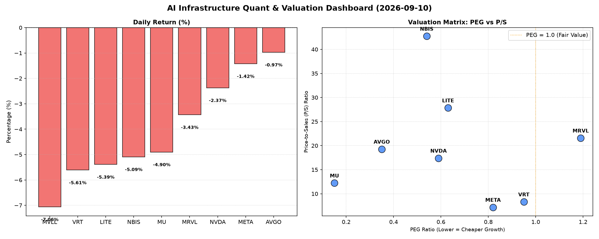

# 📊 AI Infrastructure & Data Stock Daily (2026-09-10)

### 📉 多维量化与估值分析看板

---

尊敬的硬科技与AI基础设施行业同仁：

以下是您今日的半导体与AI基础设施每日精炼报道，结合我们提供的【多维度真实量化基本面指标表格】进行深度剖析。

---

### **半导体与AI基础设施每日精炼报道：市场承压下的估值与现金流洞察**

**发布日期：** [今日日期]
**研究员：** [您的姓名/机构名称]

今日半导体与AI基础设施板块普遍承压，多个核心标的出现回调，跌幅从-0.97%至-7.06%不等。在市场情绪谨慎的背景下，我们需结合多维度量化指标，深入剖析各公司的内在价值与财务健康状况。

---

#### **1. 盘面与多维估值解码 (定性+定量)**

今日市场整体下行，所有关注标的均录得负增长，显示出板块性的抛售压力。然而，在市场回调中，量化指标更能帮助我们辨识价值与风险。

*   **PEG 维度：成长性与估值性价比**
    *   **性价比极高的高成长（PEG < 1）：** 值得重点关注的是，**MU (0.15)** 和 **AVGO (0.35)** 展现出极为优秀的PEG比率，表明其在未来盈利增长潜力与当前估值之间具有极高的性价比。紧随其后的是 **NVDA (0.59)**、**NBIS (0.54)** 和 **LITE (0.63)**，以及AI巨头 **META (0.82)** 和数据中心基础设施提供商 **VRT (0.95)**。这些公司尽管今日股价下跌，但其PEG小于1的特性，仍凸显了其成长性被市场相对低估，或具备较强的内生增长动力。
    *   **估值透支警惕（PEG > 1）：** **MRVL (1.19)** 的PEG略高于1，这可能意味着市场对其未来的盈利增长预期已经相对充分地反映在当前的股价中，投资者在布局时需警惕估值透支的风险。
    *   **数据缺失：** **MVLL** 由于PEG数据缺失（N/A），无法从成长性角度进行评估，可能与其业务特性或盈利状况有关。

*   **P/S 维度：营收规模扩张效率与早期潜力**
    *   **高P/S值（警惕高估值或高增长预期）：** 针对早期或尚处于大规模研发投入阶段、利润不稳的公司，P/S是一个重要指标。**NBIS (42.74)** 和 **LITE (27.85)** 展现出极高的P/S比率，这通常预示着市场对其未来营收增长抱有极高的期望，或是其处于一个利润率极高的特定赛道。**MRVL (21.58)**、**AVGO (19.27)** 和 **NVDA (17.4)** 也处于较高的P/S区间，反映出市场对其技术领先性和未来市场份额的信心。
    *   **相对合理P/S：** **MU (12.23)** 处于中等偏高水平，符合其在存储芯片周期中的表现和市场预期。而 **VRT (8.32)** 和 **META (7.19)** 的P/S相对更显“保守”，这可能与其更成熟的业务模式和更稳定的营收基础有关。

*   **现金流盈利真实性 (CFO/NI)：利润的“含金量”**
    *   **现金流极其健康（CFO/NI > 1）：** **NBIS (4.66)** 表现出异常强劲的现金流盈利质量，其经营性现金流远超净利润，这表明其利润是实打实的现金流入，财务弹性极佳。同样，**MU (2.05)**、**META (1.92)**、**VRT (1.59)** 和 **AVGO (1.19)** 的CFO/NI均显著大于1，这证明这些公司的盈利质量非常健康，利润没有水分，应收账款管理良好，具备充裕的现金来支持运营、研发或进行股东回报。
    *   **需要关注的现金流状况（CFO/NI < 1）：**
        *   **NVDA (0.86)**：虽然其CFO/NI略低于1，但考虑到其巨大的营收规模和持续的资本开支，0.86仍处于可接受的范围，但投资者应关注其应收账款或存货变动对现金流的影响。
        *   **MRVL (0.66)**：该值显著小于1，表明其报告的净利润中有较大一部分尚未转化为现金，可能存在应收账款积压或存货周转效率问题，需要更深入地分析其资产负债表和现金流量表。
        *   **LITE (-0.11)**：这是一个重要的警示信号。负值的CFO/NI意味着公司在报告净利润的同时，经营活动却在消耗现金。这通常指向严重的营运资金管理问题、高额的运营开支，或业务正面临现金流压力，利润的真实性及其业务持续性需要引起高度警惕。

---

#### **2. 收并购与重大业务动态**

根据今日提供的量化指标表格，未直接体现收并购或重大业务动态信息。

然而，从数据角度推断：
*   **潜在并购者：** 那些拥有强劲现金流的公司，如 **NBIS (CFO/NI 4.66)** 和 **META (CFO/NI 1.92)**，其财务灵活性可能使其在市场下行期间具备潜在的并购能力，以巩固市场地位或拓展新业务领域。
*   **潜在整合或战略调整压力：** 另一方面，像 **LITE (CFO/NI -0.11)** 这样现金流面临显著压力的公司，若无外部输血，其自身业务持续性可能受到挑战，不排除寻找战略合作或被收购的可能性，以缓解现金流困境或寻求业务转型。

---

#### **3. 华尔街机构态度**

今日的核心量化指标表格并未直接提供华尔街机构的最新评价、目标价调动等信息。

然而，我们可以根据上述量化分析进行合理推测：
*   **关注焦点：** 鉴于今日市场普遍下跌，且如 **LITE** 的CFO/NI表现出显著负值，预计部分机构可能会对其未来盈利预期和现金流健康状况进行重新评估，并可能发布看空或下调评级的报告。
*   **韧性标的：** 同时，那些拥有强劲PEG表现（如 **MU**、**AVGO**）和健康现金流（如 **NBIS**、**META**）的公司，在经历短期回调后，可能仍会获得长线投资者的青睐，但短期情绪可能受市场整体抛售影响，机构可能会维持或微调其目标价，等待市场情绪企稳。
*   **风险提示：** 对于 **MRVL** 这种PEG略高且CFO/NI低于1的公司，机构可能会在短期内对其增长前景和盈利质量持谨慎态度。

---

#### **4. 今日参考源 (References)**

*   Provided by User: Multi-dimensional Real Quantitative Fundamental Indicators Table (今日多维度真实量化基本面指标表格)

---

**免责声明：** 本报告基于提供的量化数据进行分析，旨在提供深度洞察。市场有风险，投资需谨慎。请投资者结合自身情况进行独立判断。