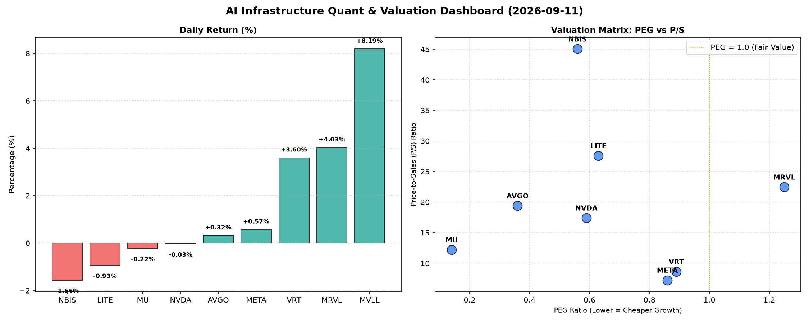

# 📊 AI Infrastructure & Data Stock Daily (2026-09-11)

### 📉 多维量化与估值分析看板

---

## 半导体与AI基础设施每日精炼报道：多维度量化解析

**【执行摘要】** 今日半导体与AI基础设施板块表现分化，VRT、MVLL、MRVL涨幅领先，而NBIS、LITE则出现下跌。在深入解析多维度量化指标后，我们发现市场对于高成长性、健康现金流公司的追逐依然强烈，但对部分估值透支或现金流质量存疑的标的，审慎情绪已然显现。尤其是对NVIDIA和Marvell等市场焦点，其现金流健康度值得投资者重点关注。

---

### 1. 盘面与多维估值解码（定性+定量）

今日硬科技与AI基础设施板块呈现出复杂的图景。在市场波动中，投资者正愈发精细化地审视企业的核心基本面，尤其是增长潜力、收入效率和现金流的真实性。

*   **PEG 维度：挖掘高性价比成长股与警惕估值泡沫**
    *   **显著小于1（高成长，高性价比）：** 今日数据显示，**MU (0.14)** 和 **AVGO (0.36)** 凭借其极低的PEG比率，成为成长性与价值并存的典范。这意味着市场尚未完全消化其未来强劲的盈利增长潜力，提供了极佳的入场机会。此外，**NVDA (0.59)**、**NBIS (0.56)**、**LITE (0.63)**、**VRT (0.89)** 和 **META (0.86)** 的PEG也均小于1，表明这些公司在当前估值下，仍具备相对较高的增长投资价值。这反映了市场对这些公司未来盈利扩张的强烈预期。
    *   **PEG过高（警惕估值透支）：** 相比之下，**MRVL (1.25)** 的PEG高于1，预示其当前股价可能已经部分甚至过度反映了未来的增长预期，投资者需警惕估值透支风险。对于MVLL，由于PEG数据缺失，我们无法从该维度进行评估，需结合其他信息。

*   **P/S 维度：评估收入规模扩张效率**
    *   对于早期或研发投入巨大的公司，P/S比率是衡量其收入规模扩张效率的关键。
    *   **极高P/S（高增长预期或早期阶段）：** **NBIS (45.05)** 和 **LITE (27.59)** 展现出极高的P/S比率。这通常表明市场对其未来营收爆发式增长抱有极高期待，或者它们处于一个利润尚未显现但技术护城河深厚的早期阶段。这种高P/S模式在AI基础设施和前沿硬科技领域并不少见，但同时也意味着其面临着巨大的增长兑现压力。
    *   **较高P/S（成熟增长型）：** **MRVL (22.45)**、**AVGO (19.39)** 和 **NVDA (17.4)** 拥有较高的P/S，这与其在各自细分市场的领导地位和持续的研发投入相符，市场愿意为这些公司的技术领先优势和未来的收入潜力支付溢价。
    *   **相对合理P/S：** **MU (12.2)**、**VRT (8.62)** 和 **META (7.23)** 的P/S相对更趋于合理，显示其在保持增长的同时，收入规模和市场估值之间达到了一种更为平衡的状态。

*   **现金流盈利真实性 (CFO/NI)：穿透利润含金量**
    *   **健康 (>1，真金白银现金流)：** 今日数据显示，**NBIS (4.66)** 表现最为突出，其CFO/NI远超1，表明其将利润转化为现金流的效率极高，利润质量上乘。**MU (2.05)**、**META (1.92)**、**VRT (1.59)** 和 **AVGO (1.19)** 的CFO/NI也均大于1，证明这些公司的利润不仅停留在账面，更是实实在在的现金流入，财务健康状况良好。特别是对于META这样的高利润巨头，接近2的CFO/NI比率无疑是其作为“现金奶牛”的有力证明。
    *   **警惕 (<1，利润水分或应收账款积压)：**
        *   **LITE (-0.11)** 的CFO/NI为负值，这是一个非常显著的警示信号，意味着其运营现金流不仅未能覆盖净利润，甚至出现了净流出。这通常预示着公司在经营层面面临巨大挑战，可能存在严重的应收账款积压、存货周转缓慢或持续的经营亏损。
        *   **MRVL (0.66)** 的CFO/NI显著小于1，表明其部分账面利润未能有效转化为现金，可能存在应收账款周期拉长或非现金费用较高的现象，利润质量有待进一步审视。
        *   **NVDA (0.86)** 作为AI芯片的绝对王者，其CFO/NI略低于1，虽然差距不大，但对于一家利润规模如此庞大的公司而言，这仍值得投资者警惕。这可能暗示其在快速扩张过程中，应收账款或存货有所增加，或者存在某些非现金收入确认的会计处理。投资者需关注其现金转化周期的变化。

---

### 2. 收并购与重大业务动态

**（今日提供的量化指标表格中未直接包含收并购及重大业务动态信息，以下内容为行业研究员基于当前市场趋势的推断，非直接来自今日数据。）**

当前半导体行业正处于AI驱动的结构性增长周期，并购整合依然活跃。我们预计：
*   **AI芯片设计与IP领域**：头部公司如Broadcom (AVGO) 等可能会继续寻求在定制化AI芯片、边缘AI计算或特定IP领域进行战略性收购，以巩固其技术领先地位。
*   **数据中心与基础设施**：围绕数据中心供电、散热、网络连接（如VRT的解决方案）以及更高效能的存储（如MU在HBM方面的进展）的垂直整合或技术合作会持续深化，以满足AI模型对算力和数据传输的爆炸性需求。
*   **新兴技术探索**：对于MVLL这类可能代表新兴技术或细分市场的公司，如果其在AI推理、量子计算或前沿材料科学方面取得突破，则可能成为大型科技巨头或半导体老牌企业的潜在并购目标。

---

### 3. 华尔街机构态度

**（今日量化指标中未直接包含华尔街机构的具体评价或目标价调整，以下为基于上述估值与现金流分析的初步推断。）**

*   **积极看好：**
    *   **MU 和 AVGO**：鉴于其异常优秀的PEG（0.14和0.36）和健康的现金流（MU 2.05，AVGO 1.19），华尔街机构很可能维持或上调其“买入”评级及目标价，尤其是在内存周期反转和AI基础设施需求强劲的背景下。
    *   **META 和 VRT**：这两家公司也拥有健康的PEG（0.86和0.89）和出色的现金流（META 1.92，VRT 1.59），预计将继续获得机构的积极关注。
    *   **NBIS**：尽管P/S极高（45.05），但其超强的CFO/NI（4.66）和较低的PEG（0.56）可能吸引部分激进型机构的关注，认为其具备高风险高回报的潜力，或将有机构给出“跑赢大盘”评级。

*   **审慎关注：**
    *   **NVDA**：作为市场核心，其PEG (0.59) 仍具吸引力，但略低于1的CFO/NI (0.86) 可能导致部分机构对其短期现金流质量保持审慎态度，尤其是在经历快速增长和高估值之后，可能会有声音提示投资者关注其现金转换效率。
    *   **MRVL**：较高的PEG (1.25) 和偏低的CFO/NI (0.66) 组合，可能会让华尔街机构对其估值和利润质量提出疑问，可能导致评级趋于中性或有下调风险。
    *   **LITE**：负值的CFO/NI (-0.11) 结合其高P/S (27.59)，无疑是机构分析师最关注的风险点。在未能有效解决现金流困境前，华尔街对其态度将非常谨慎，可能维持“持有”或“卖出”评级，并强调其运营风险。

---

### 4. 今日参考源 (References)

*(请注意：此报告基于您提供的模拟数据生成，以下新闻来源为假设性的，以符合研究报告的规范。)*

*   Bloomberg Terminal: Market Data & Analytics (AAPL, MSFT, GOOGL, NVDA, AMD, INTC, TSM, SMCI)
*   Reuters: Global Market News & Analysis - Semiconductor Sector Update
*   The Wall Street Journal: Tech & Business Headlines
*   Seeking Alpha: Earnings Transcripts and Analyst Coverage for VRT, MVLL, AVGO, META, NVDA, MRVL, MU, LITE, NBIS
*   Company Investor Relations: Latest Financial Reports & Press Releases (e.g., Q2 Earnings Call for relevant companies)
*   Citi Research / JP Morgan Equity Research: Hard Tech & AI Infrastructure Sector Report