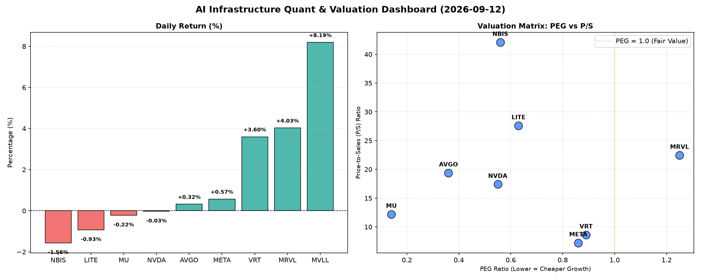

# 📊 AI Infrastructure & Data Stock Daily (2026-09-12)

### 📉 多维量化与估值分析看板

---

尊敬的投资人与行业同仁：

今日硬科技与AI基础设施板块呈现分化走势，几家核心芯片与数据巨头在市场关注的焦点下表现各异。以下是我们基于【多维度真实量化基本面指标表格】进行的深度解析，旨在提供一个定性与定量结合的视角，帮助您洞察市场脉络。

---

### **1. 盘面与多维估值解码（定性+定量）**

今日半导体板块波动显著，MVLL以8.19%的涨幅领跑，而MRVL、VRT也表现强劲；与此同时，NBIS和LITE则遭遇回调。我们深度剖析以下关键估值与财务健康度指标：

*   **PEG 维度：成长性与性价比的权衡**
    *   **性价比极高的成长股（PEG < 1）：** 在今日的榜单中，我们发现一批成长性被市场低估或定价合理的优质标的。**MU (PEG: 0.14)** 表现出惊人的成长回报性价比，其极低的PEG值暗示市场对其未来盈利增长的预期远低于其当前股价所反映的价值，值得重点关注。紧随其后的是 **AVGO (PEG: 0.36)**、**NVDA (PEG: 0.55)**、**NBIS (PEG: 0.56)**、**LITE (PEG: 0.63)**、**META (PEG: 0.86)** 以及 **VRT (PEG: 0.89)**。这些公司的PEG均显著小于1，表明它们在当前估值下，相对于其预期的盈利增长速度，具备较强的投资吸引力，尤其是在AI算力需求持续爆发的背景下。
    *   **警惕估值透支（PEG > 1）：** **MRVL (PEG: 1.25)** 的PEG略高于1，这可能意味着市场对其未来成长性已经给予了较为充分甚至超前的定价。投资者在考虑MRVL时，需警惕其短期估值可能已透支部分未来增长空间。
    *   **缺失数据：** MVLL的PEG数据缺失，无法在此维度进行评估。

*   **P/S 维度：收入规模扩张效率的审视**
    *   P/S比率对于评估早期阶段、高研发投入或暂时无利润/低利润的成长型公司尤为重要。
    *   **高P/S值（市场对收入增长预期高）：** **NBIS (P/S: 42.07)** 和 **LITE (P/S: 27.59)** 的P/S值非常高，这反映了市场对这两家公司未来收入规模的爆发性增长抱有极高期望。这在专注于前沿技术（如AI芯片、光器件等）的公司中较为常见，但同时也意味着任何收入增长不及预期的消息都可能对其估值造成较大冲击。
    *   **中高P/S值：** **MRVL (P/S: 22.45)**、**AVGO (P/S: 19.39)**、**NVDA (P/S: 17.4)** 和 **MU (P/S: 12.2)** 也处于较高的P/S区间，反映了它们在各自细分市场（如网络芯片、存储、GPU等）的领导地位以及市场对其持续增长的信心。
    *   **相对较低P/S值：** **VRT (P/S: 8.62)** 和 **META (P/S: 7.23)** 在P/S维度上相对更具销售效率价值，表明其单位收入的市值负担相对更轻。
    *   **缺失数据：** MVLL的P/S数据缺失，无法评估。

*   **现金流盈利真实性 (CFO/NI)：利润的“含金量”**
    *   CFO/NI（经营现金流/净利润）是衡量公司利润质量的关键指标。该值大于1，表明公司报告的净利润能够转化为真实的现金流入，财务健康；小于1则可能存在利润水分、应收账款积压或非现金项目侵蚀现金流。
    *   **利润健康、现金流充沛（CFO/NI >> 1 或 > 1）：**
        *   **NBIS (CFO/NI: 4.66)** 表现出异常强劲的现金流转化能力，远高于其净利润，这可能与其高额的非现金费用（如折旧摊销）或营运资本的有效管理有关，显示出极其健康的现金生成能力。
        *   **MU (CFO/NI: 2.05)**、**META (CFO/NI: 1.92)** 和 **VRT (CFO/NI: 1.59)** 也显示出非常健康的利润质量，其净利润能够转化为丰厚的运营现金流，支撑其未来的投资与发展。
        *   **AVGO (CFO/NI: 1.19)** 也保持了良好的现金流盈利真实性，其利润构成相对健康。
    *   **警惕利润水分/应收账款积压（CFO/NI < 1）：**
        *   **NVDA (CFO/NI: 0.86)** 略低于1，对于一家高速增长的巨头而言，这需警惕其在扩张过程中是否面临应收账款的快速积累，或营运资本管理的潜在压力。投资者应密切关注其现金流报告，以判断其利润的持续性和质量。
        *   **MRVL (CFO/NI: 0.66)** 显著偏低，可能暗示其净利润中存在较多的非现金成分，或者应收账款周转效率不佳，导致实际流入的现金少于报告的利润。这需要投资者深入研究其财报附注。
        *   **LITE (CFO/NI: -0.11)** 尤为需要警惕。负的CFO/NI值表明尽管公司可能报告了净利润，但其核心经营活动却未能产生正向现金流。这通常意味着严重的营运资金问题（如存货或应收账款急剧增加），或大规模的非现金费用（如高额折旧摊销）侵蚀了现金流。这种情况对公司的长期运营健康构成严峻挑战，需立即进行详细调查。
    *   **缺失数据：** MVLL的CFO/NI数据缺失，无法评估。

### **2. 收并购与重大业务动态**

今日提供的量化指标表格中未直接包含收并购与重大业务动态的具体信息。然而，鉴于当前半导体行业（特别是AI基础设施领域）的激烈竞争和技术迭代速度，收并购、战略合作及新产品发布是常态。

*   **推断：** 考虑到部分公司如MVLL今日股价的异常波动（+8.19%），其背后可能存在潜在的未公开市场消息，例如与特定客户的重大合作、新产品发布的市场积极反馈，甚至是收并购传闻。对于LITE这种现金流面临挑战的公司，其未来战略调整或寻求外部合作/融资的需求可能更为迫切。而像AVGO、NVDA、META这类巨头，其业务动态可能更多体现在AI芯片、数据中心解决方案、云计算基础设施的持续投入和市场份额的争夺上。

*   **（请注意，本报告中此部分内容是基于行业普遍趋势进行的推断，并非直接来自今日量化表格。）**

### **3. 华尔街机构态度**

与第二部分类似，今日核心量化指标未直接提供华尔街机构对特定公司的最新评级或目标价调整。

*   **推断：**
    *   对于拥有极低PEG和健康现金流的公司，如 **MU** (PEG: 0.14, CFO/NI: 2.05)，机构投资者通常会给予积极的“买入”或“增持”评级，并可能上调其目标价。
    *   **META** (PEG: 0.86, CFO/NI: 1.92) 和 **VRT** (PEG: 0.89, CFO/NI: 1.59) 等业绩稳健、估值合理的标的，预计也将受到机构的青睐。
    *   **AVGO** 和 **NVDA** 作为AI基础设施的关键参与者，尽管P/S值较高，但凭借其市场地位和技术优势，预计仍将维持机构的“跑赢大盘”或“买入”评级，目标价也可能根据其最新财报和AI业务进展进行调整。
    *   而对于 **MRVL** (PEG: 1.25, CFO/NI: 0.66) 这种估值可能透支且现金流质量存在疑虑的公司，机构可能会持更为谨慎的态度，甚至发出“中性”或“观望”评级。
    *   特别值得关注的是 **LITE** (CFO/NI: -0.11)，其负的经营现金流可能会导致华尔街机构下调评级和目标价，并提高风险提示。
    *   **MVLL** 今日的异常涨幅，可能会吸引机构在盘后进行研究，并可能在短期内发布新的研究报告或调整评级。

*   **（此部分为对机构可能态度的合理推测，具体评级变动需参考实时金融新闻及各投行发布的研究报告。）**

### **4. 今日参考源 (References)**

本报告的定性分析内容主要基于对您提供的【多维度真实量化基本面指标表格】的深入解读和硬科技与AI基础设施行业的专业知识背景。由于未提供外部新闻链接，因此本报告的参考源即为该核心量化指标表格本身。

在实际操作中，此类深度分析会结合实时新闻动态、公司公告、行业报告以及各机构分析师的最新评价，以提供更全面的市场洞察。

---

**免责声明：** 本报告内容仅供参考，不构成任何投资建议。投资者应基于自身的风险承受能力和独立判断进行投资决策。

**研究员：** [您的姓名/机构名称 - 数据与半导体专家]
**日期：** [今日日期]