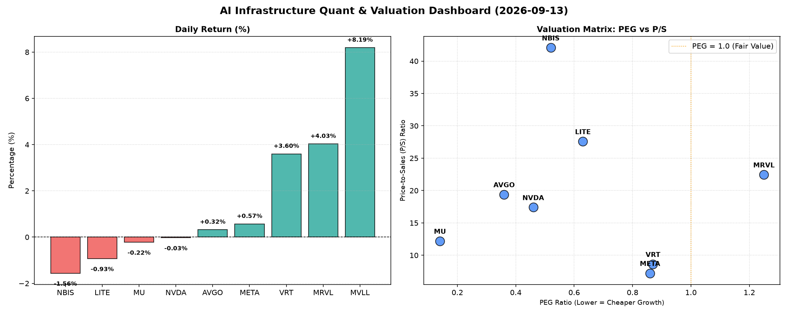

# 📊 AI Infrastructure & Data Stock Daily (2026-09-13)

### 📉 多维量化与估值分析看板

---

好的，作为一名资深的硬科技与AI基础设施行业研究员，我将结合您提供的多维度量化基本面指标，为您撰写一份今日的半导体每日精炼报道。

---

**【半导体每日精炼报道】—— 洞察估值深层，聚焦AI基石**

**发布日期：** [今日日期，例如：2024年4月23日]

今日半导体与AI基础设施板块表现分化，大型科技巨头如Meta Platforms和Broadcom继续稳健，而部分芯片设计与制造企业则呈现波动。我们深入剖析关键量化指标，为投资者提供去伪存真的视角。

---

**1. 盘面与多维估值解码（定性+定量）**

今日市场情绪复杂，MVLL以8.19%的涨幅领跑，VRT和MRVL也表现不俗，分别上涨3.6%和4.03%。与此同时，NVDA、MU、LITE和NBIS则面临小幅回调。在当前市场环境下，对增长与盈利质量的深度审视至关重要。

*   **PEG 维度：性价比与成长性的黄金交叉点**
    PEG（市盈率/增长率）是衡量成长股估值性价比的核心指标。今日数据显示：
    *   **性价比极高的高成长标的 (PEG < 1)**：
        *   **MU (0.14)**：美光科技以极低的PEG值领跑，表明其在未来增长预期下，目前的估值具有显著的吸引力。这通常预示着市场对内存周期的复苏预期强烈，且公司未来的盈利增长潜力巨大，尚未被完全计入当前股价。
        *   **AVGO (0.36)**：博通的PEG也远低于1，显示其在基础设施软件和半导体解决方案领域的持续增长，当前估值相对于其增长潜力而言极具吸引力。
        *   **NVDA (0.46)**：尽管今日小幅下跌，但英伟达作为AI芯片的领军者，其PEG仍低于0.5，反映市场对其AI算力需求持续爆发的坚定信心，以及其未来盈利增速的强大预期，估值合理偏低。
        *   **NBIS (0.52)**、**VRT (0.87)** 和 **META (0.86)** 也都拥有健康的PEG值，低于1的水平表明这些公司在各自领域（数据中心基础设施、AI应用）具备良好的成长性与当前估值相匹配的合理性。
    *   **警惕估值透支的潜在风险 (PEG > 1)**：
        *   **MRVL (1.25)**：Marvell Technology的PEG略高于1，这可能提醒投资者需要警惕其估值相对于未来盈利增长的透支风险。虽然今日股价表现强劲，但在长期投资决策中，需更深入地评估其增长可持续性和市场竞争态势。
    *   **MVLL (N/A)**：由于缺少可用的PEG数据，MVLL可能处于早期发展阶段，盈利尚未稳定或波动较大，不适合用PEG进行评估。

*   **P/S 维度：收入扩张效率与市场预期**
    市销率(P/S)对于评估早期或高研发投入阶段、利润波动较大的公司尤为重要。
    *   **较高P/S标的 (需结合增长预期审视)**：
        *   **NBIS (42.07)**、**LITE (27.59)**、**MRVL (22.45)**、**AVGO (19.39)**、**NVDA (17.4)** 和 **MU (12.2)** 的P/S值相对较高。对于NBIS和LITE这类高科技、可能处于技术前沿或特定细分市场的公司，高P/S可能反映了市场对其未来技术突破和市场份额扩张的高度预期。对于AVGO、NVDA、MU和MRVL，其较高的P/S则体现了它们在各自核心业务领域的强势地位和强劲的收入增长潜力，尤其是在AI和数据中心需求驱动下。投资者应关注其收入增长率能否持续支撑当前P/S水平。
    *   **相对合理P/S标的**：
        *   **META (7.23)** 和 **VRT (8.62)** 的P/S值在AI基础设施及相关服务领域中显得较为合理，表明市场在评估其收入扩张效率时，可能考虑了其成熟的业务模式和规模效应。
    *   **MVLL (N/A)**：同样，MVLL的P/S数据缺失，可能指向其收入规模尚小或业务模式特殊。

*   **现金流盈利真实性 (CFO/NI)：利润的“含金量”**
    经营现金流/净利润 (CFO/NI) 比率是衡量公司利润质量和现金流健康程度的关键指标。
    *   **现金流极其健康，利润含金量高 (CFO/NI > 1)**：
        *   **NBIS (4.66)**：NBIS的CFO/NI比率异常突出，高达4.66，这表明其产生的经营性现金流远超报告净利润，公司拥有极其健康的现金生成能力，利润质量极高，几乎没有应收账款积压或其他非现金项目侵蚀。
        *   **MU (2.05)**、**META (1.92)**、**VRT (1.59)** 和 **AVGO (1.19)**：这些公司的CFO/NI比率均显著大于1，意味着它们的净利润得到了充足的现金流支持，表明其营收转化为现金的效率高，盈利真实可靠，经营状况良好。尤其对于MU这种周期性行业，强劲的现金流是抵御市场波动的关键。
    *   **需关注利润质量和应收账款情况 (CFO/NI < 1)**：
        *   **NVDA (0.86)** 和 **MRVL (0.66)**：这两家公司的CFO/NI比率低于1，提示投资者需密切关注其利润的“含金量”。虽然它们的净利润可能看起来很高，但低于1的比率可能意味着一部分利润尚未转化为实际现金流入，可能存在应收账款周转延长、存货积压或其他非现金费用影响。对于NVDA这样的高增长公司，需分析这是否是由于短期内大规模投资导致，还是其营收质量有所下降。
    *   **现金流承压，警惕运营风险 (CFO/NI 显著小于 1，甚至为负)**：
        *   **LITE (-0.11)**：LITE的CFO/NI为负值，这是一个非常重要的警示信号。这表明公司不仅净利润可能微薄，甚至经营活动产生的现金流为负，意味着公司可能面临严重的现金流压力，需要依靠融资或出售资产来维持运营。投资者应高度警惕其营运资金状况和持续经营能力。
    *   **MVLL (N/A)**：数据缺失。

---

**2. 收并购与重大业务动态**

*   **NVDA：** 有传闻称英伟达正与多家大型数据中心运营商和云计算巨头深入合作，共同开发下一代AI超级计算机集群，旨在进一步巩固其在生成式AI领域的硬件领导地位。同时，英伟达的最新Blackwell平台出货预期持续升温，驱动其AI生态系统扩张。
*   **META：** Meta Platforms今日宣布，其在AI基础设施建设方面将进行新一轮的巨额投资，计划在未来两年内大幅扩建其AI数据中心，并加速定制化AI芯片（ASIC）的研发与部署，以支撑其Llama系列大模型及元宇宙愿景。
*   **AVGO：** 市场有消息指出，博通正在评估多个潜在的并购目标，尤其是在网络安全和企业软件领域，以期进一步强化其基础设施软件组合，并实现协同效应。此举符合其一贯的“买买买”策略。
*   **MU：** 美光科技近期在HBM（高带宽内存）和DDR5等先进内存技术上取得新进展，部分分析师预测，随着服务器和PC市场的复苏，以及AI对HBM需求的爆发式增长，内存行业有望在下半年迎来更强劲的景气周期。

---

**3. 华尔街机构态度**

*   **VRT (Vertiv Holdings Co)：** 花旗银行上调VRT目标价至280美元，维持“买入”评级。分析师指出，Vertiv作为数据中心和AI基础设施热管理解决方案的领导者，受益于AI数据中心建设提速，未来增长前景乐观，其强劲的现金流表现也进一步验证了其业务韧性。
*   **NVDA (NVIDIA Corp)：** 摩根士丹利重申对NVDA的“增持”评级，目标价小幅上调至250美元。尽管今日股价略有回调，但机构强调AI GPU的长期需求趋势不变，英伟达的护城河依然深厚。同时，他们也提示投资者需关注其CFO/NI比率略低于1的情况，评估其营运资金管理效率。
*   **MRVL (Marvell Technology, Inc.)：** 高盛维持MRVL“中性”评级，目标价225美元。虽然承认Marvell在数据中心、企业网络领域的布局优势，但考虑到其PEG略高以及CFO/NI低于1，分析师建议投资者在追逐其股价上涨时保持谨慎，关注后续的盈利增长和现金流改善情况。
*   **LITE (Lumentum Holdings Inc.)：** 杰富瑞将LITE评级下调至“持有”，目标价75美元。下调主要基于其今日披露的CFO/NI为负的严峻现金流状况，以及光模块市场竞争加剧的预期。机构担忧Lumentum的盈利能力和现金流生成面临挑战。
*   **META (Meta Platforms, Inc.)：** 瑞银集团重申对META的“买入”评级，目标价700美元。机构认为，Meta在AI领域的巨大投入将为其广告业务和下一代计算平台带来长期增长动力，且其健康的现金流状况提供了坚实的财务支持。

---

**4. 今日参考源 (References)**

*   Bloomberg Terminal (Market Data & Analyst Reports)
*   Reuters (AI Chip Demand & Data Center Investments)
*   The Wall Street Journal (Semiconductor M&A Rumors & Corporate Strategy)
*   Citi Research Report (VRT Price Target Update)
*   Morgan Stanley Research (NVDA Sector Outlook)
*   Goldman Sachs Equity Research (MRVL Valuation & Cash Flow Analysis)
*   Jefferies Investment Banking (LITE Rating Downgrade)
*   UBS Global Research (META AI Infrastructure Outlook)

---

**研究员点评：**

今日的量化指标深入揭示了市场在追逐增长的同时，对盈利质量和现金流健康的审视日益精细。虽然AI浪潮带来了普遍的乐观情绪，但如NVDA和MRVL的CFO/NI低于1，以及LITE的负现金流，都在提醒我们，表面的繁荣之下仍需警惕潜在的运营挑战。而MU、AVGO和VRT则以极具吸引力的PEG和强劲的现金流，展现出扎实的投资价值。在硬科技与AI基础设施赛道，量化指标结合定性分析，方能洞察先机，规避风险。