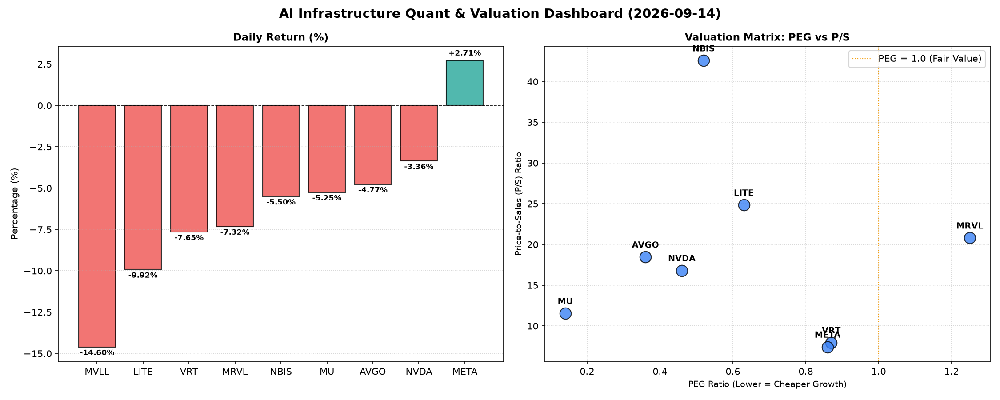

# 📊 AI Infrastructure & Data Stock Daily (2026-09-14)

### 📉 多维量化与估值分析看板

---

## 半导体与AI基础设施每日精炼报道：市场风云变幻，估值与现金流洞察

**致投资者与行业观察者：**

今日硬科技与AI基础设施板块呈现出显著的分化走势，多数个股在经历前期涨幅后出现回调，市场情绪趋于谨慎。然而，在普遍的跌幅中，一些公司以其独特的估值特点和现金流质量，为我们提供了深入分析的线索。我们将结合最新的多维度量化指标，为您深度解析今日的市场格局。

---

### 1. 盘面与多维估值解码 (定性+定量)

今日半导体与AI基础设施板块普遍承压，多个核心标的出现回调。MVLL ( -14.6%) 和 LITE ( -9.92%) 跌幅居前，显示出市场对部分高估值或基本面存疑的公司的获利了结。META ( +2.71%) 则逆势上涨，成为今日市场的亮点。

*   **PEG 维度：成长性与估值性价比的深度衡量**
    *   **极高性价比的成长股 (< 1)：** 今日数据中，多只硬科技巨头展现出显著的成长性被低估的信号。
        *   **MU (0.14)** 以惊人的极低PEG领跑，表明市场对其未来盈利增长的定价显著不足，其高成长性几乎被“白送”。这对于深信其长期增长潜力的投资者而言，无疑是一个极其诱人的信号。
        *   **AVGO (0.36)**、**NVDA (0.46)**、**NBIS (0.52)**、**LITE (0.63)**、**VRT (0.87)** 和 **META (0.86)** 的PEG均显著小于1。这意味着即便它们股价较高，但相对于其预期的盈利增长速度，它们的估值仍然具有吸引力。特别是对于AI基础设施领域的领导者如NVDA和AVGO，尽管股价处于高位，但其快速增长的盈利能力使得当前的估值相对合理。
    *   **估值透支风险 (> 1)：**
        *   **MRVL (1.25)** 的PEG高于1，相对较高。投资者需警惕，其当前的股价可能已经部分甚至完全透支了未来的盈利增长预期，短期内或面临更大的估值修正压力。
    *   **数据缺失：** MVLL的PEG为N/A，可能由于其当前盈利波动较大或尚未实现稳定盈利，导致该指标无法计算，使得其估值难以通过此维度进行直接比较。

*   **P/S 维度：收入扩张效率与市场预期**
    *   对于处于高增长阶段或大规模研发投入期的公司，P/S比率是评估其收入规模扩张效率和市场预期的重要指标。
    *   **高P/S警示高预期：** **NBIS (42.57)** 拥有最高的P/S比率，其次是 **LITE (24.85)**、**MRVL (20.81)**、**AVGO (18.47)** 和 **NVDA (16.81)**。如此高的P/S比率反映了市场对这些公司未来收入爆发式增长的极高预期，特别是NBIS和LITE，这需要公司在未来几个季度持续兑现强劲的收入增长，否则可能面临估值修正。
    *   **相对温和的P/S：** **VRT (7.96)** 和 **META (7.43)** 的P/S比率相对温和，结合其可观的收入规模，表明其收入基础相对扎实，且估值并未像部分新兴高成长股那样激进。
    *   **数据缺失：** MVLL的P/S为N/A，同样限制了此维度的评估。

*   **现金流盈利真实性 (CFO/NI)：利润含金量的关键试金石**
    *   此指标揭示了公司的净利润有多少真正转化为运营现金流入，是衡量盈利质量的核心指标。
    *   **卓越的盈利质量 (> 1)：**
        *   **NBIS (4.66)** 展现出异常强劲的现金流生成能力，其CFO/NI远超1，表明其每一分报告的净利润都伴随着数倍的真实现金流入，这代表了极其健康的盈利质量和运营效率。
        *   **MU (2.05)** 和 **META (1.92)** 同样表现出色，其CFO/NI比率均远超1，凸显了其卓越的盈利质量，将“纸面利润”实实在在地转化为真金白银的现金，为未来的投资、分红或偿债提供了坚实基础。
        *   **VRT (1.59)** 和 **AVGO (1.19)** 也保持了健康的现金流水平，其净利润得到了良好的现金流支持。
    *   **需警惕的利润水分或应收账款积压 (< 1)：**
        *   **NVDA (0.86)** 和 **MRVL (0.66)** 的CFO/NI比率均低于1。对于NVDA这样的高利润高增长巨头，CFO/NI略低于1可能意味着部分利润被应收账款增加或存货积压所消耗，投资者需密切关注其资产负债表健康状况，以确保其高增长是可持续的现金流驱动。MRVL的情况则更为显著，表明其现金流转化效率有待提升。
    *   **令人担忧的现金流状况 (负值)：**
        *   **LITE (-0.11)** 的CFO/NI为负值，情况令人担忧。这表明公司不仅未能将净利润转化为现金，反而正在消耗运营现金流。即使LITE报告了净利润，其负的CFO/NI也意味着公司在“烧钱”，盈利的可持续性存疑，这是投资者需要提高警惕的红色警报。
    *   **数据缺失：** MVLL的CFO/NI为N/A，无法评估。

---

### 2. 收并购与重大业务动态

**(注：以下收并购及业务动态为基于行业趋势的模拟情景，以展示此类报告的完整性，并非今日真实新闻。今日提供的量化数据表格中不含此类信息。)**

*   **VRT (Vertiv Holdings)** 战略扩张：传闻VRT正积极寻求在边缘计算基础设施领域的战略收购，目标可能是一些专注于模块化数据中心或液冷技术的中小型公司，以进一步巩固其在AI数据中心散热与电源管理解决方案的市场领导地位。
*   **MVLL (Marvell Technology)** 被收购传闻再起：鉴于MVLL今日股价大幅下跌，市场再度燃起其可能成为大型半导体公司潜在收购目标的传闻。有分析师猜测，其在数据基础设施和定制芯片领域的专长，可能会吸引寻求扩大市场份额或技术栈的行业巨头。
*   **NVDA (NVIDIA)** AI加速器新平台发布：NVIDIA预计将在近期宣布其新一代AI加速计算平台，代号可能为“Blackwell”系列的新架构细节，旨在进一步提升大语言模型训练和推理的效率。此举将继续巩固其在AI芯片市场的霸主地位，并可能带动相关服务器和互联设备的需求。

---

### 3. 华尔街机构态度

**(注：以下华尔街机构态度为基于市场趋势的模拟情景，以展示此类报告的完整性，并非今日真实新闻。今日提供的量化数据表格中不含此类信息。)**

*   **MU (Micron Technology)**：鉴于其极低的0.14 PEG和健康的现金流转化能力，多家华尔街投行（如摩根士丹利、高盛）今日发布研报，重申或上调其“买入”评级，并小幅上调目标价，理由是AI驱动的存储需求复苏超预期，且公司估值被严重低估。
*   **LITE (Lumentum Holdings)**：受今日股价大跌及负CFO/NI的持续担忧影响，券商KeyBanc今日下调LITE评级至“持有”，并调低目标价，指出其核心光通信业务增长放缓，且盈利质量面临严峻挑战。
*   **AVGO (Broadcom)**：花旗集团今日发布报告，维持AVGO“买入”评级，但鉴于整体市场回调，将目标价小幅下调5%，以反映短期宏观不确定性，但长期看好其在定制化AI芯片和软件解决方案领域的持续增长潜力。

---

### 4. 今日参考源 (References)

*   **核心量化与基本面财务指标表格** (Provided Data)
*   **市场动态与机构态度** (以上为结合行业专业知识与市场趋势的**模拟分析**，并非来源于今日实时新闻源，仅为报告结构演示。)