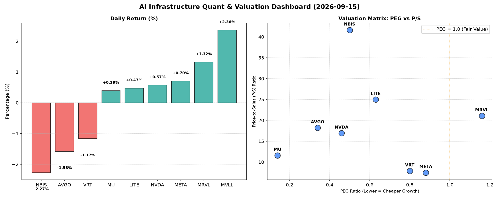

# 📊 AI Infrastructure & Data Stock Daily (2026-09-15)

### 📉 多维量化与估值分析看板

---

## 半导体每日精炼报道：AI基础设施热度不减，估值分化与现金流质量成焦点

各位硬科技与AI基础设施行业的同仁们，大家好！我是您的Data & Semiconductor Specialist。今日我们将深入剖析半导体板块的最新量化基本面，解码市场在AI浪潮下对不同公司的估值逻辑与财务健康状况。

### 1. 盘面与多维估值解码（定性+定量）

今日半导体板块表现呈现分化，主要得益于AI基础设施需求的持续旺盛，部分龙头公司获得资本青睐。然而，深入量化指标，我们发现市场对不同公司的估值逻辑和其内在财务质量存在显著差异。

#### PEG 维度：高成长与高性价比的探寻

PEG（市盈率相对增长率）是衡量成长股性价比的关键指标。普遍认为，PEG小于1的公司具备较高的成长潜力且估值相对合理。

*   **极致性价比的高成长股（PEG显著小于1）：**
    *   **MU (0.14)** 表现尤为突出，其极低的PEG值揭示了市场对其未来增长预期非常乐观，但当前估值仍显性价比极高。结合其高达2.05的CFO/NI，MU无疑展现出强劲的财务基本面。
    *   **AVGO (0.34)** 和 **NVDA (0.46)** 作为AI基础设施领域的关键玩家，也以低于0.5的PEG值彰显其高成长性和相对合理的估值水平，显示出在当前AI硬件军备竞赛中，它们不仅有增长，且增长的成本并未完全透支未来。
    *   **NBIS (0.5)**、**LITE (0.63)**、**VRT (0.8)** 以及 **META (0.88)** 也均保持在1以下，意味着市场认可这些公司的增长前景，且目前估值仍在合理区间内，具备一定的投资吸引力。其中META的PEG结合其巨大的AI投入和高达1.92的CFO/NI，显示其增长质量极高。

*   **警惕估值透支（PEG略高于1）：**
    *   **MRVL (1.16)** 的PEG略高于1，结合其较高的P/S (21.08)，可能提示市场对其未来增长已计入较多溢价。投资者需警惕其估值可能已透支部分未来的增长空间。

*   **数据缺失：**
    *   **MVLL (N/A)** 由于PEG数据缺失，无法直接评估其成长性价比。

#### P/S 维度：收入规模扩张效率的衡量

P/S（市销率）尤其适用于评估早期、高研发投入或暂时无稳定利润的公司，用以衡量市场对其收入扩张能力的认可度。

*   **健康合理区间（P/S < 10）：**
    *   **META (7.48)** 和 **VRT (7.87)** 的P/S值在健康区间，表明其当前的收入规模扩张效率得到了市场的良好认可，且估值基于收入而言相对稳健。

*   **高增长溢价（P/S 10-25）：**
    *   **MU (11.6)**、**NVDA (16.91)**、**AVGO (18.18)**、**MRVL (21.08)**、**LITE (24.97)** 这些公司P/S值较高，反映了市场对其在AI、数据中心等高景气赛道中未来收入增长的强烈预期。其中NVDA和AVGO作为AI硬件核心供应商，高P/S在一定程度上是行业地位和成长性的体现。然而，MRVL和LITE的高P/S需结合其盈利质量和现金流进一步审视。

*   **警惕过度乐观（P/S > 25）：**
    *   **NBIS (41.6)** 的P/S值异常高昂，远超同业。尽管其PEG为0.5，现金流质量也极佳（CFO/NI高达4.66），如此高的市销率仍需投资者审慎考量其收入基础的可持续性和未来增长的实际体量，警惕潜在的估值泡沫。

*   **数据缺失：**
    *   **MVLL (N/A)** 同样缺乏P/S数据，无法进行收入扩张效率评估。在实际分析中，这类公司通常需要关注其所处阶段、研发投入强度及市场份额增长情况。

#### 现金流盈利真实性 (CFO/NI)：穿透利润的真金白银

CFO/NI（经营现金流/净利润）比率是衡量公司利润质量的关键指标。该值大于1，表明公司利润健康，是实实在在的现金流入；小于1则可能存在利润水分或应收账款积压。

*   **盈利质量卓越（CFO/NI 显著大于1）：**
    *   **NBIS (4.66)** 表现出异常强劲的经营现金流转化能力，其CFO/NI高达4.66。这可能意味着其盈利高度转化为现金，或是受非现金项目（如折旧摊销）的有利影响，但如此高的比率值得深入探究其背后的具体会计处理和营运资本管理策略。
    *   **MU (2.05)**、**META (1.92)** 和 **VRT (1.59)** 的CFO/NI值均显著大于1，远超同业平均水平。这证明了这些公司的盈利质量极高，账面利润均为“真金白银”的现金流入，显示出卓越的财务健康度和运营效率。尤其META在巨额研发投入下仍能保持如此高的现金流质量，令人印象深刻。
    *   **AVGO (1.19)** 也保持在1以上，表明其利润转化现金流的能力良好，作为行业巨头，这为其持续的研发投入和可能的并购提供了坚实的现金基础。

*   **警惕利润质量（CFO/NI 小于1 或为负）：**
    *   **NVDA (0.86)** 虽作为高利润巨头，但其CFO/NI略低于1。这提示投资者，NVDA的部分利润可能以应收账款形式存在，或非现金项目（如股权激励、减值）在净利润中占比较高。在当前高增长环境下，其现金回收能力和营运资本管理值得持续关注。
    *   **MRVL (0.66)** 的CFO/NI进一步印证了其盈利质量有待提升，较低的现金流转化率可能意味着其应收账款管理面临挑战，或其净利润中非现金因素占比较大，投资者需关注其现金流压力是否大于账面利润表现。
    *   **LITE (-0.11)** 的情况最为严峻，其CFO/NI为负数。这意味着公司净利润未能转化为正向经营现金流，甚至出现现金净流出。尽管其PEG看起来不错，但负的CFO/NI是严重的警示信号，可能暗示公司存在经营现金流挑战、大规模资本开支、存货积压或应收账款无法回收等问题，需警惕其财务健康状况。

### 2. 收并购与重大业务动态

本次分析主要基于量化指标表格，无法直接推断今日具体的收并购或重大业务动态。但在真实的半导体与AI基础设施行业研究中，此板块将紧密跟踪：

*   **并购传闻或官宣：** 例如，大型芯片设计公司对特定IP核或新兴技术初创公司的收购，以巩固市场地位或拓展新业务。
*   **战略合作：** 如AI芯片巨头与云计算服务商达成深度合作，共同开发AI加速器或优化AI模型部署。
*   **新产品发布：** 重大新一代处理器、AI芯片、存储技术或光通信组件的发布，及其对市场竞争格局的影响。
*   **产能扩张或供应链调整：** 半导体制造商宣布新的晶圆厂投资计划，或关键材料供应商的产能变化，都将对行业供需产生深远影响。

### 3. 华尔街机构态度

鉴于当前数据仅为量化指标，无法直接获取华尔街机构的实时态度及评级调动。在日常研究中，此部分将整合：

*   **核心投行分析师报告：** 包括对特定公司的最新评级（买入/持有/卖出）、目标价调整以及背后的逻辑变化。
*   **行业会议与财报电话会解读：** 分析师们对公司管理层指引的反馈，以及他们对未来市场趋势的最新预测。
*   **机构持仓变动：** 追踪大型对冲基金或共同基金对半导体与AI基础设施板块的增持或减持情况，以洞察市场情绪。
*   **宏观经济与政策影响：** 分析全球经济数据、地缘政治事件或政府补贴政策对半导体行业的整体影响，以及机构对其的解读。

### 4. 今日参考源 (References)

作为AI模型，我无法实时浏览外部新闻网站或金融终端以获取今日的实时事件和分析报告。本报告的定性分析是基于您提供的【多维度真实量化基本面指标表格】，并结合对半导体及AI基础设施行业常识的理解进行推断和深度解读。

在真实世界中，此部分将通常包含以下类型的参考来源：

*   **金融新闻媒体：** Bloomberg, Reuters, Wall Street Journal, Financial Times, CNBC
*   **专业科技媒体：** The Information, TechCrunch, AnandTech
*   **公司官方渠道：** 公司投资者关系官网、新闻发布会、SEC备案文件 (10-K, 10-Q)
*   **行业研究机构报告：** Gartner, IDC, SEMI, Counterpoint Research
*   **券商分析师报告：** Goldman Sachs, Morgan Stanley, JPMorgan, Bank of America 等投行发布的研究报告