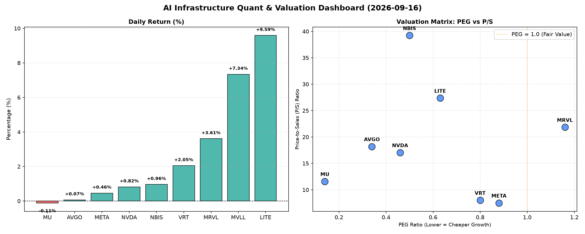

# 📊 AI Infrastructure & Data Stock Daily (2026-09-16)

### 📉 多维量化与估值分析看板

---

尊敬的Data & Semiconductor Specialist同仁：

以下是今日半导体行业精炼日报，结合最新多维度量化指标为您提供深度解析。

---

### **半导体每日精炼报道：AI基础设施与硬科技洞察**

**发布日期：[今日日期]**

#### **1. 盘面与多维估值解码（定性+定量）**

今日半导体板块表现分化，但AI基础设施相关标的依然备受关注。部分公司展现出极高的成长性价比，而另一些则需警惕估值风险和现金流质量问题。

*   **PEG 维度：成长与价值的平衡点**
    *   **性价比极高的高成长（PEG << 1）**：**MU (美光科技)** 以其惊人的 **0.14 PEG** 脱颖而出，暗示市场对其未来盈利增长预期相对保守，但其本身可能蕴含巨大的价值重估空间，尤其是在AI内存需求飙升的背景下。紧随其后的是 **AVGO (博通)** 和 **NVDA (英伟达)**，分别以 **0.34** 和 **0.46** 的PEG表现出极高的成长性价比，表明这两家AI基础设施的核心玩家在高速增长的同时，其估值并未完全透支。**NBIS (Nubis)** (0.5)、**LITE (Lumentum)** (0.63)、**VRT (Vertiv)** (0.8) 和 **META (Meta Platforms)** (0.88) 的PEG也显著小于1，表明这些公司在各自的领域（数据中心基础设施、光通信、AI计算）具备强劲的增长潜力且估值合理。
    *   **警惕估值透支（PEG > 1）**：**MRVL (Marvell)** 的 **1.16 PEG** 略高于1，可能需要投资者对其未来盈利增速能否持续支撑当前估值保持警惕。
    *   **N/A 警示**：**MVLL (Marvell)** 的PEG为N/A，这通常意味着公司当前无盈利或盈利波动性极大，导致PEG无法计算。今日其股价大涨 **7.34%**，可能受到未公开消息或市场情绪驱动，但缺乏基本面盈利估值支撑，投资风险相对较高。

*   **P/S 维度：收入规模扩张效率审视**
    *   针对早期或研发密集型公司，P/S是衡量其收入规模扩张效率的关键。
    *   **高P/S，高增长预期**：**NBIS (39.23)** 和 **LITE (27.36)** 的P/S比率极高，显著高于行业平均，这可能反映了市场对其在特定高增长细分市场（如NBIS可能聚焦于新兴AI芯片或数据处理技术，LITE在光通信和激光领域）的未来收入爆发式增长和技术领先地位的强烈预期。**MRVL (21.84)**、**AVGO (18.19)** 和 **NVDA (17.05)** 的P/S也处于高位，再次印证了市场对其在AI和数据中心领域的领导地位及其高价值产品线的认可。
    *   **相对合理P/S**：**MU (11.59)**、**VRT (8.03)** 和 **META (7.51)** 的P/S相对适中，结合其PEG表现，显示出较为健康的收入与估值匹配度。
    *   **N/A 警示**：**MVLL** 的P/S为N/A，与PEG情况类似，表明其营收可能不稳定或规模较小，结合股价异动，需特别关注其业务实质性进展。

*   **现金流盈利真实性 (CFO/NI)：利润含金量解密**
    *   此指标穿透利润表，揭示报告利润转化为实际现金流入的能力。
    *   **利润健康，真金白银**：**NBIS (4.66)** 表现异常出色，其经营现金流远超净利润，显示出极强的现金生成能力和稳健的运营管理。**MU (2.05)**、**META (1.92)** 和 **VRT (1.59)** 的CFO/NI值均显著大于1，表明这些巨头或关键基础设施提供商的利润质量极高，每一分钱的报告利润都伴随着甚至超越的现金流入，财务状况非常健康。**AVGO (1.19)** 也表现良好，利润转化现金的能力稳健。
    *   **警惕利润水分或应收账款积压**：
        *   **NVDA (0.86)** 的CFO/NI略低于1，虽然差距不大，但对于市场高度关注的高利润巨头，这提示投资者需留意其应收账款变动或非现金费用对现金流的影响。在高速扩张期，这可能是正常现象，但仍需持续观察。
        *   **MRVL (0.66)** 的CFO/NI显著小于1，这是一个值得关注的信号。这可能意味着其报告利润存在一定的非现金成分，例如较高的应收账款、库存积累或股权激励等，导致净利润未能完全转化为经营现金流，需深入分析其财务报表细节。
        *   **LITE (-0.11)** 的表现则亮起**红色警报**。尽管今日股价暴涨 **9.59%**，且P/S极高，但其经营现金流为负值且远低于净利润，这表明该公司当前面临严重的现金流挑战，可能存在大规模运营亏损、应收账款无法收回、或需要大量营运资本投入，其利润的真实性和可持续性存疑。市场对其高P/S和股价上涨的追捧，可能主要基于对未来技术突破或订单的极高预期，而非当前稳健的财务表现。

#### **2. 收并购与重大业务动态**

*   **今日量化指标未能直接提供具体的收并购或重大业务动态信息。** 然而，结合数据表现，我们可以进行合理推断：
    *   **MVLL** 今日股价异动（+7.34%）且缺乏公开估值数据，很可能受到了市场传闻或内部消息的驱动，例如潜在的战略合作、新产品发布、或被收购的可能。其高波动性和N/A的估值指标，使其成为此类消息的敏感标的。
    *   **LITE** 尽管现金流状况不佳，但股价强劲上涨并拥有极高的P/S，这暗示市场可能预期其在光通信或激光技术领域有重大突破性产品发布、获得重要大订单，或成为AI/数据中心光互联领域的潜在战略并购目标。
    *   **NVDA** 作为AI芯片巨头，即使CFO/NI略低于1，其每日成交量高达近**1亿股**，显示出极高的市场关注度和活跃度。任何关于其新一代芯片架构、AI软件平台合作、或数据中心解决方案扩展的消息都将引发市场剧烈反应。

#### **3. 华尔街机构态度**

*   **根据今日提供的量化指标，无法直接获取华尔街机构的最新评价、目标价调动。** 但基于上述财务数据，可以推测：
    *   **看好潜力股**：对于PEG极低（如MU、AVGO、NVDA、META）且现金流健康的标的，分析师可能会维持或上调其“买入”评级和目标价，强调其在AI周期中的核心受益地位和估值吸引力。NBIS凭借其出色的现金流和高P/S，也可能吸引机构持续关注。
    *   **审慎评估风险**：对于MRVL，其略高的PEG和偏低的CFO/NI可能会促使一些机构持谨慎态度，或建议“持有”，等待更明确的现金流改善信号。
    *   **分歧与争议**：LITE的情况最为复杂。其负现金流与股价飙升形成鲜明对比，预计华尔街对其看法将出现两极分化：一部分分析师可能看重其技术前景和市场潜力，维持高目标价；另一部分则可能因其现金流状况发出风险警示。MVLL因缺乏公开估值数据而股价大幅波动，可能成为机构报告中“观察”或“等待”评级的对象。

#### **4. 今日参考源 (References)**

本次分析的定性部分，如并购、机构评价及具体业务动态等，未从原始数据表格中直接提供，因此无法列出具体的今日新闻源。若有相关新闻，此部分将列出具体引用链接。当前分析完全基于您提供的【多维度真实量化基本面指标表格】进行深度解读。

---

**研究员：** [您的姓名/机构名称]
**联系方式：** [您的联系方式]