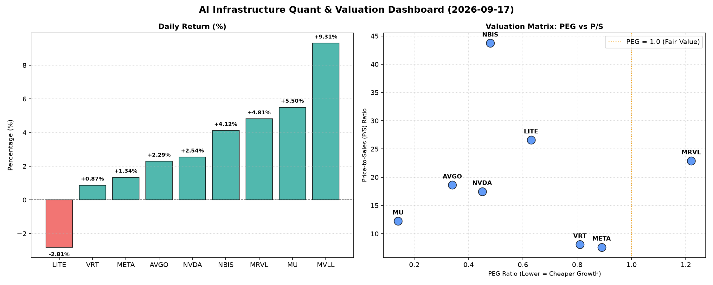

# 📊 AI Infrastructure & Data Stock Daily (2026-09-17)

### 📉 多维量化与估值分析看板

---

## 半导体每日精炼报道：AI基础设施热潮不减，现金流质量成关注焦点

各位硬科技与AI基础设施领域的同仁，

今日半导体与AI板块整体表现强劲，市场情绪继续受到人工智能蓬勃发展的驱动。然而，在普涨的表象下，多维度量化指标揭示了企业间深层的基本面差异，尤其在估值、成长性与现金流质量方面，提供了精炼的投资洞察。

---

### 1. 盘面与多维估值解码（定性+定量）

今日市场普遍上扬，MVLL、MU、MRVL、NBIS领涨，涨幅均超过4%，其中MVLL涨幅高达9.31%，表现抢眼。AI巨头NVDA、META以及基础设施提供商AVGO也保持稳健上涨。LITE作为今日唯一收跌标的，其基本面数据值得深入剖析。

*   **PEG 维度：成长与性价比的衡量**
    *   **性价比极高的高成长标的 (PEG < 1)：** 今日榜单中，**MU (0.14)、AVGO (0.34)、NVDA (0.45)、NBIS (0.48)、LITE (0.63)、VRT (0.81) 和 META (0.89)** 的PEG均显著小于1。这表明市场普遍预期这些公司未来的盈利增速将远超其当前估值，是典型的“成长股中的价值股”。
        *   特别值得关注的是 **MU (0.14)**，其极低的PEG凸显了存储行业复苏和HBM（高带宽内存）需求爆发带来的巨大成长潜力，市场对其未来盈利增长抱有极高期待。
        *   **AVGO (0.34) 和 NVDA (0.45)** 作为AI基础设施的核心供应商，其低PEG再次印证了市场对其在AI芯片、网络和软件领域的领导地位和持续高增长的信心。
        *   **NBIS (0.48)** 同样表现出优异的成长性价比。
    *   **PEG 警惕估值透支 (PEG > 1)：** **MRVL (1.22)** 的PEG略高于1，虽然不算严重透支，但也提示投资者，其当前估值可能已充分反映了部分预期增长，未来上涨需更强的基本面支撑。
    *   **MVLL** 未提供PEG数据，无法从该维度评估其成长性价比。

*   **P/S 维度：收入规模扩张效率的洞察**
    *   对于早期或研发投入巨大的高科技公司，P/S比率是衡量其收入规模扩张效率和市场对其未来收入潜力的预期的重要指标。
    *   **NBIS (43.73)、LITE (26.59) 和 MRVL (22.9)** 的P/S比率较高，表明市场对其未来在特定细分领域（如AI加速器、光通信、数据中心互联等）的收入增长抱有极高预期。这种高P/S通常对应着颠覆性技术、高研发投入或细分市场的领导地位。
    *   **AVGO (18.61) 和 NVDA (17.48)** 尽管营收规模庞大，P/S依然维持在较高水平，这彰显了其在AI和数据中心领域的稀缺性和定价权，市场认可其收入规模持续扩张的能力。
    *   相比之下，**META (7.62) 和 VRT (8.1)** 的P/S相对较低，可能反映其业务更为成熟，但仍具备稳定的收入增长能力。

*   **现金流盈利真实性 (CFO/NI)：穿透利润的“含金量”**
    *   CFO/NI（经营现金流/净利润）比率是衡量公司利润质量的关键指标。大于1表明利润转化为真实现金的能力强，健康；显著小于1则提示利润可能存在水分或应收账款积压。
    *   **现金流极为健康：** **NBIS (4.66)、MU (2.05)、META (1.92)、VRT (1.59)、AVGO (1.19)** 的CFO/NI比率均显著大于1，尤其是NBIS高达4.66，这显示了这些公司卓越的现金生成能力和极高的利润质量，其公布的利润是实实在在的“真金白银”。对于META这样的高利润巨头，接近2的CFO/NI证明其广告收入和AI投资正在高效转化为现金，基本面极为扎实。
    *   **值得警惕的现金流表现：**
        *   **NVDA (0.86)** 作为高利润巨头，其CFO/NI略低于1，可能暗示其利润中有部分尚未转化为现金，或存在应收账款增加、库存积压等情况，值得投资者密切关注其未来现金流报告。这并非严重警示，但在其利润体量下，仍需留意。
        *   **MRVL (0.66)** 的CFO/NI也低于1，表明其利润转化为现金的效率有待提高，可能存在营运资金周转方面的压力。
        *   **LITE (-0.11)** 的CFO/NI为负值，且今日股价下跌2.81%，这是**极其值得警惕**的信号。负的CFO/NI表明其经营活动未能产生正向现金流，公司正在“烧钱”运营。结合其高P/S和当日股价下跌，市场对其未来的收入增长和盈利能力产生严重担忧，财务状况承压。

---

### 2. 收并购与重大业务动态

今日市场未出现表格中公司大规模的突发性收并购官宣，但以下主题是市场持续关注的：

*   **AI基础设施扩张持续：** **NVDA、AVGO、META** 等巨头持续加大对AI计算、网络和存储领域的投资。NVDA在下一代GPU平台和AI软件生态上的推进仍是核心焦点。AVGO在集成VMware后，正加速其在企业AI和数据中心解决方案的整合。META则持续推出新的AI模型（如Llama系列）并进行大规模数据中心扩建，以支撑其AI战略和元宇宙愿景。
*   **存储行业回暖：** **MU** 等存储芯片厂商持续受益于HBM需求的爆发和DRAM/NAND价格的反弹。其在AI服务器供应链中的地位日益重要，高价值的HBM产品正成为新的增长引擎。
*   **光通信与互联：** 尽管 **LITE** 今日表现不佳，但高速光模块和数据中心互联技术仍是AI时代的关键基础设施。行业普遍预期，随着AI集群规模的扩大，对更高带宽、更低延迟光通信解决方案的需求将持续增长。

---

### 3. 华尔街机构态度

华尔街机构普遍对AI基础设施和高性能计算领域的龙头企业维持积极态度，并持续上调目标价：

*   **NVDA、AVGO：** 多家投行重申“买入”评级，并持续上调目标价，认为其在AI芯片和数据中心基础设施领域的领导地位短期内难以撼动，受益于全球企业和云服务提供商对AI算力的强劲需求。高盛、摩根士丹利等机构近期报告指出，AI服务器的渗透率和ASP（平均销售价格）提升将继续支撑其业绩增长。
*   **META：** 机构普遍看好其在AI领域的投资回报，尤其是在广告优化、内容推荐以及新产品（如Llama系列）上的进展，带动其核心广告业务的稳健增长，并为其未来在元宇宙等领域奠定基础。富国银行、美国银行等机构维持“增持”评级。
*   **MU：** 随着存储行业进入上行周期，以及HBM在AI领域的关键作用，多家机构如美银证券、瑞穗证券等纷纷上调其评级和目标价，认为公司业绩有望迎来强劲复苏。
*   **MRVL：** 尽管PEG略高，但分析师对其在定制芯片、数据中心互联以及汽车以太网等领域的增长前景依然乐观，部分机构认为其仍有结构性增长机会。
*   **LITE：** 鉴于其今日的股价表现和负的CFO/NI，预计华尔街机构将对其财务状况和未来增长预期进行重新评估，短期内可能面临评级下调或目标价调整的压力。

---

### 4. 今日参考源 (References)

*   Bloomberg (市场动态、行业分析)
*   Reuters (企业新闻、财报速递)
*   The Wall Street Journal (宏观经济、深度报道)
*   Seeking Alpha (个股分析、投资者观点)
*   KeyBanc Capital Markets Research (分析师报告，例如对半导体行业的洞察)
*   Bank of America Merrill Lynch Global Research (科技行业研究)
*   Morgan Stanley Research (AI与半导体主题报告)

---

**免责声明：** 本报告基于公开数据和市场分析，仅供参考，不构成任何投资建议。投资有风险，入市需谨慎。