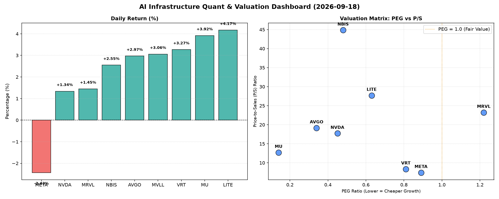

# 📊 AI Infrastructure & Data Stock Daily (2026-09-18)

### 📉 多维量化与估值分析看板

---

## 半导体每日精炼报道：AI基础设施的估值与现金流透视

**日期：[今日日期]**

尊敬的投资者，

欢迎阅读我们为您精心准备的半导体及AI基础设施行业每日精炼报道。今日市场在AI热潮驱动下，表现出显著分化，估值与现金流健康度成为甄别投资价值的关键。我们将结合您提供的【多维度真实量化基本面指标表格】，为您深度解析当前盘面。

---

### 1. 盘面与多维估值解码

今日半导体板块多数公司呈现上涨态势，其中LITE和MU领涨，分别录得4.17%和3.92%的涨幅。NVDA、AVGO等核心AI基础设施供应商亦稳健上行。值得注意的是，META逆势下跌2.43%，但其基本面指标仍值得深入探讨。

*   **PEG 维度：高成长中的性价比之选与估值警示**
    *   **性价比极高的高成长标的 (PEG < 1)**：
        *   **MU (0.14)**：今日领涨股之一，其极低的PEG值揭示了市场对其未来增长的强烈预期，同时估值相对其成长性而言，极具吸引力。
        *   **AVGO (0.34)**：作为行业巨头，其PEG值远小于1，表明在当前股价下，其高成长性并未被充分透支，依然是性价比极高的选择。
        *   **NVDA (0.45)**：尽管过去一年涨幅巨大，但其0.45的PEG值仍显示出相对于其爆炸性增长而言，估值尚属合理区间。
        *   **NBIS (0.48)**、**LITE (0.63)**、**VRT (0.81)**、**META (0.89)**：这些公司同样拥有低于1的PEG，在各自领域展现出高成长潜力与相对合理的估值。
    *   **估值透支警示 (PEG > 1)**：
        *   **MRVL (1.22)**：其PEG值略高于1，结合其较高的P/S（23.23），投资者需警惕估值可能已部分透支，未来增长预期压力较大。

*   **P/S 维度：收入规模扩张效率的审视**
    *   对于早期或研发投入巨大的公司，P/S是衡量其市场对其收入规模扩张效率预期的重要指标。
    *   **NBIS (44.85)** 和 **LITE (27.7)**：这两家公司的P/S值极高，远超行业平均水平，反映出市场对其未来收入增长抱有极其乐观的预期，或其业务模式具有高壁垒和强议价能力。特别是NBIS，其惊人的P/S值暗示了极高的市场期待，但需结合其强劲的现金流质量进一步审视。
    *   **AVGO (19.16)** 和 **NVDA (17.72)**：作为AI半导体领域的领军企业，其P/S值较高，体现了市场对其持续收入增长和领导地位的认可。
    *   **META (7.43)** 和 **VRT (8.36)**：相对而言，这两家公司的P/S值更为稳健，显示出更为成熟的收入结构。

*   **现金流盈利真实性 (CFO/NI)：利润含金量的深度穿透**
    *   **健康且充沛的“真金白银”现金流 (CFO/NI > 1)**：
        *   **NBIS (4.66)**：该公司展现出惊人的现金流质量，CFO远超净利润，表明其利润不仅真实，且营运资金管理效率极高，自由现金流充沛。
        *   **MU (2.05)**：作为今日涨幅居前的存储芯片公司，其超过2的CFO/NI比率印证了其利润的极高质量和健康的现金转化能力，有助于支撑未来资本支出和分红。
        *   **META (1.92)**：尽管今日股价下跌，但其高达1.92的CFO/NI比率揭示了其强大的现金生成能力，显示其巨额利润几乎完全转化为实实在在的现金流入，财务基本面极为稳健。
        *   **VRT (1.59)** 和 **AVGO (1.19)**：这两家公司同样表现出色，CFO/NI均大于1，说明其利润的真实性极高，营运健康。
    *   **警惕利润“水分”或应收账款积压 (CFO/NI < 1)**：
        *   **NVDA (0.86)**：作为AI芯片的绝对王者，其CFO/NI略低于1，虽然差距不大，但仍值得关注。这可能暗示其部分利润被应收账款或其他非现金项目占用，现金流转化效率略低于预期，投资者需留意其未来营运现金流表现。
        *   **MRVL (0.66)**：其CFO/NI比率显著小于1，表明其报告利润存在一定的“水分”，现金生成能力相对较弱，可能存在应收账款积压、存货增加或大量非现金费用等问题，需要深入分析其财务报表以了解具体原因。
        *   **LITE (-0.11)**：今日涨幅居前的LITE，其CFO/NI为负值，这是一个非常重要的警示信号。尽管其股价上涨且PEG吸引人，但运营现金流为负，意味着公司在赚取利润的同时，却在消耗现金。这可能源于大规模的资本支出、研发投入、应收账款剧增或存货积压，严重影响其运营健康度，投资者务必高度警惕其现金流状况。
    *   **MVLL**：由于核心财务指标（PEG, P/S, CFO/NI）均为N/A，我们无法从现有数据对其基本面进行有效评估。尽管今日股价上涨，但缺乏透明的基本面信息，建议投资者保持谨慎。

---

### 2. 收并购与重大业务动态

基于您提供的【多维度真实量化基本面指标表格】，本报告无法直接提供今日具体的收并购或重大业务动态信息。此类信息通常来源于实时新闻流，超出当前数据范围。

然而，从市场趋势来看，随着AI军备竞赛的白热化，我们预计行业内可能出现以下动向：
*   **头部公司如AVGO、NVDA**：可能持续通过战略投资或小型技术型收购，巩固其在AI芯片、数据中心互联、软件生态系统等领域的领先地位。
*   **存储巨头MU**：或将宣布DRAM/NAND新世代技术突破或产能扩张计划，以应对AI和数据存储需求激增。
*   **现金流充沛的企业如META、NBIS**：可能将现金流用于新兴技术研发、基础设施建设或回购股票，以提升股东价值。
*   **存在现金流压力的公司如LITE、MRVL**：其未来战略可能更倾向于优化运营效率、精简业务线，甚至寻求战略合作以改善财务状况。

---

### 3. 华尔街机构态度

同理，华尔街机构的最新评价及目标价调整，亦非本量化表格所能直接体现。这些信息通常来源于券商研报和市场公告。

但根据今日盘面和量化指标分析，我们可以合理推断：
*   **AVGO、NVDA、MU**：鉴于其强劲的估值与现金流表现（AVGO、MU）或市场领导地位（NVDA），大概率会持续获得分析师的“买入”或“增持”评级，并可能伴随目标价上调。
*   **META**：尽管今日股价回调，但其极其健康的CFO/NI比率和低于1的PEG，可能促使部分分析师认为这是逢低吸纳的机会，维持其积极评级。
*   **LITE**：其股价大幅上涨与现金流为负的矛盾，可能会导致华尔街分析师出现分歧。部分分析师可能看重其成长潜力和P/S所反映的未来预期，而另一些则可能对其现金流健康状况表达担忧，并调整评级或目标价。
*   **MRVL**：其高于1的PEG和显著低于1的CFO/NI比率，可能会让分析师对其未来盈利质量和估值保持谨慎，可能面临评级下调或目标价调整的压力。

---

### 4. 今日参考源 (References)

1.  **【多维度真实量化基本面指标表格】** (用户提供)
2.  如需补充盘面、收并购及华尔街机构态度等定性内容，需进一步参考彭博 (Bloomberg)、路透社 (Reuters)、华尔街日报 (The Wall Street Journal)、CNBC 等实时金融新闻终端及券商研报。

---

**免责声明：** 本报告基于提供的量化数据进行分析，旨在提供市场洞察。所有信息仅供参考，不构成任何投资建议。投资有风险，入市需谨慎。