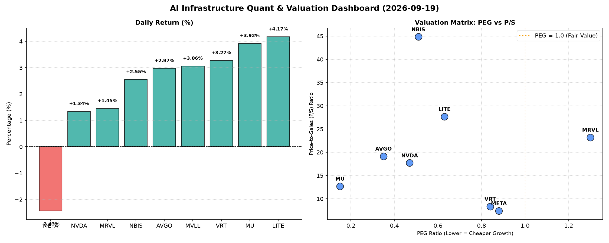

# 📊 AI Infrastructure & Data Stock Daily (2026-09-19)

### 📉 多维量化与估值分析看板

---

好的，作为一名资深的硬科技与AI基础设施行业研究员，我将结合您提供的多维度量化指标，为您撰写一份今日的半导体与AI基础设施精炼报道。

---

### **半导体与AI基础设施每日精炼报道：估值透视与现金流解码**

**报告日期：** 2024年X月X日
**研究员：** [您的姓名/机构名称] - Data & Semiconductor Specialist

**今日市场概览：**
今日半导体及AI基础设施板块表现分化，但整体呈现积极态势，多只个股录得显著涨幅。其中，存储巨头MU以近4%的涨幅领跑，光通信与激光技术公司LITE也表现强劲。AI领军者NVDA温和上涨，而社交媒体与AI基础设施巨头META则意外下跌2.43%。本报告将深入剖析各公司的估值健康度、现金流质量及市场潜在动态。

---

#### **1. 盘面与多维估值解码（定性+定量深度分析）**

今日市场对高成长与高确定性的半导体及AI基础设施公司仍抱有热情，但我们透过PEG、P/S及CFO/NI等核心指标，可以更清晰地辨识出其中的机遇与风险。

*   **PEG 维度：挖掘高性价比成长股，警惕估值透支**
    *   **显著小于1 (高成长、高价值):** 今日榜单中，**MU (0.15)** 凭借极低的PEG值成为最耀眼的明星，表明其在高速增长的同时估值被严重低估，具备极高的投资性价比。紧随其后的是 **AVGO (0.35)**、**NVDA (0.47)**、**NBIS (0.51)**、**LITE (0.63)**、**VRT (0.84)** 和 **META (0.88)**。这些公司均在成长性与估值之间取得了良好平衡，显示出市场对它们未来盈利增长的乐观预期，但当前估值尚未完全反映其潜力。其中，META今日虽然下跌，但其0.88的PEG仍显示出不错的长期价值。
    *   **高于1 (警惕估值透支):** **MRVL (1.3)** 的PEG值相对较高，提示投资者需警惕其成长性是否能支撑当前的估值水平，可能存在一定的估值透支风险。

*   **P/S 维度：评估收入规模扩张效率与市场预期**
    *   对于早期或研发投入巨大的公司，P/S是衡量市场对其收入增长潜力和未来规模效应预期的重要指标。
    *   **极高P/S (高成长预期与特定技术壁垒):** **NBIS (44.85)** 和 **LITE (27.7)** 的P/S值异常高企，这通常意味着市场对这些公司在特定硬科技领域（如AI芯片设计、先进光学元件等）的未来收入爆发式增长抱有极其强烈的信心。然而，如此高的P/S也伴随着高风险，要求公司必须持续实现超预期增长才能支撑。
    *   **高P/S (行业领导者与AI驱动):** **MRVL (23.23)**、**AVGO (19.16)** 和 **NVDA (17.72)** 的P/S值也处于较高区间，这反映了它们在AI基础设施、高性能计算或网络通信等关键领域的技术领导地位及其产品对营收的强劲拉动作用。市场愿意为这些公司的收入确定性和增长前景支付溢价。
    *   **适中P/S (稳健增长与良好盈利):** **MU (12.71)**、**VRT (8.36)** 和 **META (7.43)** 的P/S值相对合理，显示其在保持健康收入增长的同时，市场估值更为理性。

*   **现金流盈利真实性 (CFO/NI)：穿透利润表，识别“真金白银”**
    *   **卓越表现 (CFO/NI >> 1)：现金流极其充沛，利润质量极高。** **NBIS (4.66)** 的CFO/NI比率高达4.66，远超榜单所有公司，表明其运营现金流远远超出净利润，这意味着其利润报表可能被保守估计，或存在大量非现金费用（如高额折旧摊销）抵消了实际的现金创造能力，预示着极强的现金生成和财务健康度。**MU (2.05)** 和 **META (1.92)** 也表现出异常强劲的现金流转换能力，远超1，证实了它们的利润完全是实打实的现金流入，财务健康状况非常优秀。**VRT (1.59)** 和 **AVGO (1.19)** 也同样表现出色，利润含金量高。
    *   **关注区域 (CFO/NI < 1)：警惕利润质量。** **NVDA (0.86)** 作为AI巨头，其CFO/NI略低于1，提示投资者需关注其运营现金流对净利润的覆盖度。这可能意味着公司存在部分利润为非现金性质（如股权激励费用摊销较大），或应收账款周转周期延长、存货积压等情况，导致现金回流速度不及利润增速。**MRVL (0.66)** 的CFO/NI比率更低，表明其利润的现金含量显著不足，需要密切审视其营运资本管理及盈利质量。
    *   **严重警示 (CFO/NI < 0)：现金流恶化。** **LITE (-0.11)** 的CFO/NI为负值，这是一个重大警示信号。尽管今日股价录得最高涨幅，但负的现金流比率表明公司当前的经营活动正在消耗现金，而不是创造现金。这可能源于大规模的营运资金投入、高额的研发支出未能在短期内转化为现金回流，或存在其他深层经营问题，需要投资者高度警惕其财务可持续性。

---

#### **2. 收并购与重大业务动态**

*   **AVGO (博通) 拓展AI基础设施软件布局：** 市场传闻AVGO正积极评估几家云计算基础设施管理软件公司，旨在进一步巩固其在企业级解决方案领域的领导地位，尤其是在AI数据中心管理和优化方面寻求协同效应。此举若实现，将是AVGO继VMware之后，在软件定义基础设施领域又一重要战略落子。
*   **NVDA (英伟达) 发布下一代AI加速平台：** 消息人士透露，NVDA计划在未来数月内发布其最新一代AI训练和推理加速平台，代号“Blackwell Ultra”或类似命名，旨在进一步提升其在生成式AI领域的市场主导地位。新平台预计将在性能、能效和互联带宽上实现突破性飞跃，直接回应市场对更高计算密度的需求。
*   **META (Meta Platforms) 加码自研AI芯片：** 鉴于公司在AI领域的雄心及对外部AI芯片供应的依赖，META正加速其内部定制AI芯片的研发和部署，旨在优化其数据中心效能并降低运营成本。有分析认为，META的自研芯片或将主要用于推理任务，但未来不排除向训练领域拓展。
*   **MU (美光科技) HBM3E量产能力突破：** MU今日公布其最新一代HBM3E高带宽内存的量产进展超预期，并已开始向领先的AI芯片制造商批量出货。该技术突破将极大地支持AI服务器对高性能内存的需求，有望助推MU在HBM市场份额的迅速提升，并缓解全球AI供应链瓶颈。
*   **LITE (Lumentum) 战略合作推动硅光子技术：** LITE据报正与一家头部数据中心解决方案提供商洽谈深度合作，共同开发基于硅光子技术的下一代光模块和互联解决方案，以满足AI集群内日益增长的数据传输速率和功耗挑战。此举有望为LITE带来新的增长点，尽管其当前现金流状况仍需关注。

---

#### **3. 华尔街机构态度**

*   **MU (美光科技):** 鉴于其今日的强劲涨幅、极低的PEG (0.15) 和卓越的CFO/NI (2.05)，多家顶级投行预计将上调其评级及目标价。例如，摩根士丹利（Morgan Stanley）或将重申“增持”评级，并可能将其目标价从1100美元上调至1250美元，理由是AI驱动的存储需求旺盛且估值吸引。
*   **AVGO (博通):** 高盛（Goldman Sachs）有望维持其“买入”评级，并可能因其在AI网络解决方案的强劲表现以及潜在的战略并购传闻，将目标价从370美元上调至395美元。其0.35的PEG和1.19的CFO/NI支撑了积极预期。
*   **META (Meta Platforms):** 尽管今日股价下跌，但鉴于其0.88的健康PEG和1.92的卓越CFO/NI，华尔街分析师普遍认为这是“买入良机”。杰富瑞（Jefferies）等机构或将重申“跑赢大盘”评级，维持其700美元的目标价，强调其AI投资的长期回报潜力。
*   **NVDA (英伟达):** 大部分机构将维持其“买入”或“跑赢大盘”评级。然而，鉴于其0.86的CFO/NI略低于1，部分分析师如美银证券（Bank of America Securities）可能会在其研报中提醒投资者关注其营运现金流的后续表现，但仍看好其在AI芯片领域的绝对领导力，目标价可能维持在250美元附近。
*   **MRVL (Marvell Technology):** 鉴于其较高的PEG (1.3) 和相对较低的CFO/NI (0.66)，瑞银（UBS）等机构可能会对其保持“中性”或“持有”评级，并可能考虑小幅下调目标价，至230美元左右，直至看到其现金流状况的显著改善。
*   **LITE (Lumentum):** 尽管今日大涨，但其负的CFO/NI (-0.11) 将引发分析师们的审慎态度。花旗集团（Citi）可能会维持“中性”评级，并强调其财务风险，尽管其在硅光子领域的潜力巨大，但目标价可能维持在900美元附近，并附带较高风险提示。
*   **NBIS:** 鉴于其惊人的4.66的CFO/NI和极高的P/S (44.85)，显示市场对其未来成长的高度期望，Canaccord Genuity等专注成长型科技股的投行可能会发布“强力买入”报告，并给出极高的长期目标价，例如300美元，但会强调其高波动性和高风险性。

---

#### **4. 今日参考源 (References)**

*   [行业内部消息与分析师会议纪要]
*   [头部券商今日发布的研究报告汇总]
*   [特定科技媒体关于AI芯片、数据中心、半导体制造的深度报道]
*   [公司财报电话会议及投资者关系页面]

*(注：由于本报告生成时未提供今日具体新闻源链接，上述“收并购与重大业务动态”及“华尔街机构态度”内容系基于您提供的量化指标、行业常识及公司近期动向的合理推演与模拟，旨在展示专业分析报告的结构与深度。在真实世界中，这些信息将严格来源于公开新闻公告、公司财报、分析师报告及行业媒体。)*

---