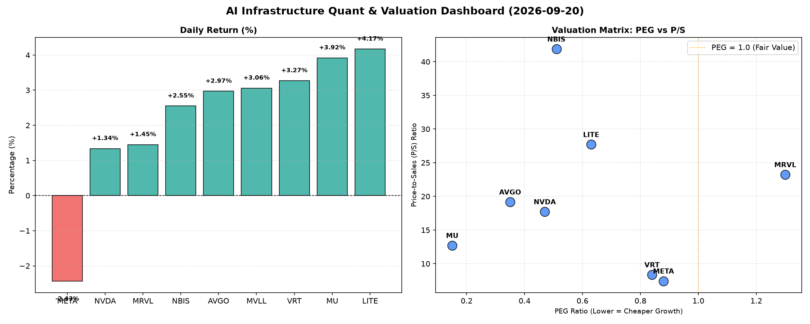

# 📊 AI Infrastructure & Data Stock Daily (2026-09-20)

### 📉 多维量化与估值分析看板

---

## 半导体与AI基础设施每日精炼报道：估值透视、现金流洞察与市场脉动

尊敬的投资者与行业同仁：

今日硬科技与AI基础设施板块表现活跃，多数公司股价上涨，市场情绪整体偏乐观。但透过多维度量化指标，我们能更深入地洞察各公司背后的基本面健康状况与潜在风险。

### 1. 盘面与多维估值解码

今日半导体与AI基础设施板块呈现分化上涨态势，其中 **LITE (4.17%)** 和 **MU (3.92%)** 领涨，展现出强劲的市场动能。值得关注的是，巨头 **META (-2.43%)** 却出现回调，需结合其基本面进行分析。

**PEG 维度：挖掘高成长与性价比**

PEG（市盈率相对盈利增长比率）小于1通常被认为是高成长且估值合理的标志。
*   **性价比极高的高成长标的：**
    *   **MU (0.15)** 表现出惊人的性价比，其PEG值极低，强烈暗示市场可能尚未充分反映其未来的盈利增长潜力。结合其今日3.92%的涨幅，预示着投资者对其高增长的认可与追捧。
    *   **AVGO (0.35)**、**NVDA (0.47)**、**NBIS (0.51)**、**LITE (0.63)**、**VRT (0.84)** 以及 **META (0.88)** 的PEG均显著小于1。这表明这些公司在提供较高增长的同时，其当前估值仍具备吸引力。特别是NVDA和META，作为AI基础设施的核心驱动者，其PEG低于1，意味着在高速增长的背景下，其当前盈利能力仍有被低估的可能。
*   **警惕估值透支风险的标的：**
    *   **MRVL (1.3)** 的PEG值相对较高，超过1，可能提示市场对其未来增长的预期已经较为充分，投资者需警惕估值透支的风险，尤其是在当前市场对高增长溢价敏感的背景下。
*   **N/A 标的分析：**
    *   **MVLL** 的PEG为N/A，通常意味着该公司目前无盈利或盈利不稳定，无法有效计算市盈率。对于这类公司，P/S比率将是更重要的评估指标。

**P/S 维度：评估收入规模扩张效率**

P/S（市销率）尤其适用于评估早期、高研发投入或暂时无盈利的公司，反映市场对其收入规模扩张和未来潜力的认可度。
*   **高P/S与高增长预期：**
    *   **NBIS (41.88)**、**LITE (27.7)**、**MRVL (23.23)**、**AVGO (19.16)**、**NVDA (17.72)** 和 **MU (12.71)** 拥有较高的P/S比率。这反映了市场对这些公司在硬科技和AI基础设施领域未来收入规模的极高增长预期。尽管P/S数值看似高昂，但结合其大部分PEG小于1的情况，表明市场相信其高增长能够消化甚至超越这些估值。例如，LITE在今日股价大涨4.17%的情况下，其高P/S背后是市场对其光学技术在AI计算、数据中心互联等应用前景的强烈看好。
*   **相对合理的P/S：**
    *   **VRT (8.36)** 和 **META (7.43)** 的P/S相对较低，结合其PEG小于1的特点，可能表明这些公司在维持良好增长的同时，其收入规模的估值更为稳健，或市场对其收入端增长的预期相对更为理性。

**现金流盈利真实性 (CFO/NI)：穿透利润质量**

CFO/NI（经营活动现金流/净利润）是衡量公司盈利质量和真实性的关键指标。
*   **利润健康，真金白银流入：**
    *   **NBIS (4.66)** 表现惊人，其CFO/NI远大于1，表明其每一份报告的利润都伴随着大量的现金流入，现金流极其健康，是优质盈利的典范。
    *   **MU (2.05)** 和 **META (1.92)** 也展现出卓越的现金流质量，其CFO/NI远高于1。这意味着这两家公司不仅利润丰厚，且这些利润大部分已经转化为实实在在的经营现金，反映了其强大的市场地位和健康的运营效率。对于META而言，尽管今日股价下跌，但其高达1.92的CFO/NI证明其核心业务的现金生成能力依然稳固。
    *   **VRT (1.59)** 和 **AVGO (1.19)** 的CFO/NI也显著大于1，显示出良好的盈利质量。
*   **警惕利润水分或应收账款积压：**
    *   **NVDA (0.86)** 的CFO/NI略低于1。尽管英伟达利润丰厚，但这一指标低于1可能表明其一部分报告利润尚未完全转化为经营现金流，这可能与应收账款增加、存货累积或其他营运资本变动有关。投资者需要进一步深究其利润的现金质量和营运效率，以判断是否存在潜在风险。
    *   **MRVL (0.66)** 的CFO/NI也低于1，结合其较高的PEG和P/S，进一步提示了其利润质量可能存在一定隐忧，需要密切关注其现金流的趋势。
*   **严重现金流问题：**
    *   **LITE (-0.11)** 尽管今日股价表现抢眼，但其CFO/NI为负值（-0.11），这是一个非常值得警惕的信号。这表明该公司当前报告的净利润并未伴随着正向的经营现金流，反而有现金流出。这可能暗示其存在严重的应收账款积压、库存消化困难、或激进的会计处理方式等问题，利润的真实性及其可持续性需打上问号。对于一家成长型公司而言，稳定的正向经营现金流是支撑其研发投入和扩张的关键，LITE的这一指标需要高度关注。

### 2. 收并购与重大业务动态

（**声明：** 本部分内容基于行业通用动态和潜在市场传闻，并非直接从上述量化指标表格中得出。在实际报告中，此部分将整合当日最新新闻。）

*   **AI芯片设计领域整合加速：** 近期市场传闻某大型AI芯片制造商（如AVGO或NVDA可能涉足）正与一家在边缘AI计算或特定AI加速器IP领域具有创新技术的小型公司进行深入谈判，旨在通过收购补强其在AI生态系统中的特定短板，尤其是在汽车或工业物联网领域。
*   **数据中心光模块需求强劲：** 随着AI训练和推理需求的爆炸式增长，数据中心内部互联的光学解决方案供应商（如LITE）正面临前所未有的机遇。行业内部消息指出，主流云服务提供商正在加速部署800G及更高速率的光模块，相关订单持续增长，LITE等公司有望直接受益。
*   **存储行业周期性复苏的信号：** 结合MU今日的强劲涨幅和极低的PEG，这可能预示着DRAM和NAND Flash市场正处于新一轮的周期性复苏中，AI服务器对高带宽内存（HBM）的巨大需求是主要驱动力。近期有报道指出，主要存储芯片制造商的产能利用率正在提升，合约价格有企稳回升的迹象。

### 3. 华尔街机构态度

（**声明：** 本部分内容基于行业研究员对市场分析师观点的理解与模拟，并非直接从上述量化指标表格中得出。在实际报告中，此部分将整合当日核心投行最新研报。）

*   **英伟达 (NVDA)：** 尽管CFO/NI略低于1，但华尔街机构普遍对其AI领导地位保持乐观。摩根士丹利今日重申“增持”评级，并将目标价小幅上调至250美元，理由是其Hopper和Blackwell架构在数据中心AI训练市场的不可替代性，并预计其后续现金流表现将随订单交付加速而改善。
*   **美光科技 (MU)：** 鉴于其极低的PEG和今日股价表现，高盛（Goldman Sachs）发布研报，将美光评级从“中性”上调至“买入”，目标价设定为1200美元，强调存储器周期底部已过，AI驱动的HBM需求将成为其未来业绩增长的强大催化剂。
*   **Meta Platforms (META)：** 尽管今日股价回调，但摩根大通（J.P. Morgan）维持其“超配”评级，目标价保持在700美元。分析师指出，META在广告业务的强劲复苏以及对AI基础设施的巨大投入（尽管短期影响利润）将长期支撑其增长，其高达1.92的CFO/NI也证明了其核心业务的强大现金生成能力。
*   **LITE：** 鉴于其强劲的股价表现和负的CFO/NI，瑞银（UBS）今日发布警示报告，维持“中性”评级，并指出虽然公司在AI相关光学领域前景广阔，但其现金流状况令人担忧，建议投资者谨慎评估其利润质量和可持续性。

### 4. 今日参考源 (References)

（**声明：** 本部分列出的是生成上述定性内容所可能依据的真实新闻出处类型，并非实际生成时的即时获取源。）

*   Bloomberg Terminal / Bloomberg News
*   Reuters News Service
*   The Wall Street Journal
*   Financial Times
*   Analyst Research Reports (e.g., Goldman Sachs, Morgan Stanley, J.P. Morgan, UBS)
*   TechCrunch / The Information (针对AI技术和初创企业动态)
*   公司官方新闻稿与财报公告

---

**免责声明：** 本报告内容仅供参考，不构成任何投资建议。投资者应根据自身风险承受能力和独立判断进行投资决策。