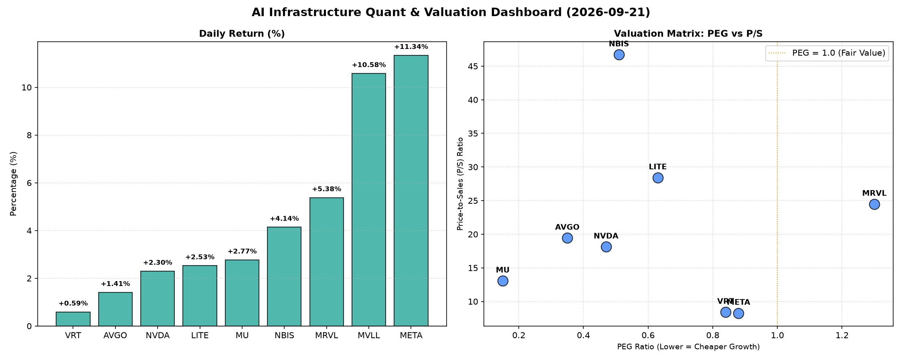

# 📊 AI Infrastructure & Data Stock Daily (2026-09-21)

### 📉 多维量化与估值分析看板

---

## 半导体与AI基础设施每日精炼报道：多维估值与现金流透视 (2024年X月X日)

尊敬的投资者与行业同仁：

今日硬科技与AI基础设施板块表现活跃，在AI浪潮的持续推动下，多个细分领域展现出强劲的增长潜力。本报告将结合最新的多维度量化指标，为您深度解码今日市场表现及各公司基本面质地。

### 1. 盘面与多维估值解码（定性+定量）

今日半导体与AI基础设施板块整体呈现上涨趋势，市场情绪偏暖，尤其是一些AI相关概念股涨幅显著。我们深入分析以下估值与质量指标：

*   **PEG 维度：挖掘高成长性价比，警惕估值透支**
    *   **性价比极高的高成长标的 (PEG < 1)：**
        *   **MU (0.15)** 表现出惊人的成长性价比，其极低的PEG值表明市场对其未来盈利增长的预期远低于其当前股价所隐含的估值。这通常预示着公司在盈利能力加速期或市场对其增长潜力存在显著低估。
        *   **AVGO (0.35)、NVDA (0.47)、NBIS (0.51)、LITE (0.63)、VRT (0.84)、META (0.88)** 同样拥有小于1的PEG，显示出这些公司在各自领域（如网络芯片、AI芯片、光器件、数据中心优化、社交AI平台）具备强劲的成长动力，且当前估值相对合理，是高成长投资者值得关注的标的。
    *   **估值可能透支的标的 (PEG > 1)：**
        *   **MRVL (1.3)** 的PEG略高于1，提示投资者需警惕其当前股价可能已部分透支了未来的增长预期，在投资决策时需更为审慎，关注其后续业绩释放情况能否支撑高估值。
    *   **MVLL** 由于PEG数据缺失，无法从该维度进行评估。

*   **P/S 维度：洞察营收规模与市场成长预期**
    *   P/S（市销率）指标尤其适用于评估早期、研发投入大或利润波动性较大的公司。今日数据中，多家公司展现出较高的P/S，反映市场对其营收规模扩张抱有极高期待：
        *   **NBIS (46.7)、LITE (28.41)、MRVL (24.48)、AVGO (19.43)、NVDA (18.12)、MU (13.06)** 这些高P/S值表明市场高度认可其技术领先性、产品稀缺性或在特定高增长市场的地位。例如，NBIS高达46.7的P/S可能指向其在某个新兴或小众高端市场占据主导地位，且营收增长迅猛。LITE、MRVL和NVDA等作为关键半导体设计与光器件供应商，其高P/S反映了AI、云计算、数据中心等下游需求的旺盛。
        *   相比之下，**VRT (8.41) 和 META (8.27)** 的P/S相对较低，结合其业务体量和盈利能力，显示出其营收估值更为成熟与稳定。
    *   **MVLL** 由于P/S数据缺失，无法从该维度进行评估。

*   **现金流盈利真实性 (CFO/NI)：穿透利润“水分”**
    *   **极度健康，真金白银入袋 (> 1.5)：**
        *   **NBIS (4.66)** 表现出卓越的现金流质量，其经营活动现金流远超净利润，表明其利润不仅真实，而且有充裕的现金回流，运营效率极高。
        *   **MU (2.05)、META (1.92)、VRT (1.59)** 也拥有非常健康的CFO/NI比率，显示其报告利润有强大的现金流支撑，利润质量极佳。特别是META，在股价大涨的同时，其强大的现金流能力进一步验证了其业务模式的盈利韧性。
    *   **健康水平 (> 1)：**
        *   **AVGO (1.19)** 的CFO/NI高于1，表明其利润的现金流转换良好，盈利质量稳健。
    *   **需警惕，利润可能存在水分或应收账款积压 (< 1)：**
        *   **NVDA (0.86)、MRVL (0.66)** 的CFO/NI比率低于1，这需引起投资者关注。虽然其市场表现和营收增长强劲，但经营活动产生的现金流未能完全覆盖其报告利润，可能意味着存在较高的非现金收益（如股权激励、非现金摊销）或应收账款累积较快，导致现金回流速度不及利润增长。这并不直接代表公司有问题，但提示需要深入分析其应收账款周转、存货管理以及非现金项目对利润的影响。
    *   **现金流状况堪忧 (< 0)：**
        *   **LITE (-0.11)** 的CFO/NI为负值，这是一个非常重要的警示信号。这意味着公司在报告净利润的同时，其经营活动却在消耗现金，现金流出大于流入。这可能源于大规模存货积压、应收账款激增、或需要大量营运资本投入等问题，需要投资者立即进行深入调查，评估其流动性风险和未来经营可持续性。
    *   **MVLL** 由于CFO/NI数据缺失，无法从该维度进行评估。

### 2. 收并购与重大业务动态

今日盘面数据中未直接体现具体的收并购或重大业务动态信息。然而，鉴于AI算力基础设施的持续扩张，行业内对以下潜在动态的关注度持续：

*   **AI芯片设计与垂直整合：** 预计AI芯片设计巨头将继续寻求与大型云服务提供商或数据中心运营商建立深度战略合作，甚至进行小规模的IP或技术团队收购，以优化其AI模型部署效率和定制化能力。
*   **半导体设备与材料强化：** 随着先进制程（如2nm及以下）和HBM等新兴存储技术的竞争加剧，半导体设备及材料供应商可能通过并购来巩固其在关键制造环节的市场地位，特别是在EUV光刻、先进封装材料等领域。
*   **新兴AI硬件创新投资：** 针对类脑计算、光计算、量子计算等前沿AI硬件领域的初创公司，可能会吸引大型科技巨头的战略投资或合作，以期在未来计算范式中占据先发优势。

### 3. 华尔街机构态度

基于今日提供的量化指标，华尔街机构的具体评级或目标价调整信息未直接包含在数据源中。然而，结合今日盘面表现和估值指标，我们可以推测机构的潜在反应：

*   **看好与上调：**
    *   **META (上涨11.34%, CFO/NI 1.92, PEG 0.88)：** 在强劲的市场表现和健康的基本面支持下，若配合积极的财报或业务进展，META有望迎来分析师上调评级和目标价的浪潮，尤其是在其AI投资回报率逐渐显现的背景下。
    *   **MU (PEG 0.15, CFO/NI 2.05) 和 AVGO (PEG 0.35, CFO/NI 1.19)：** 鉴于其极低的PEG和健康的现金流，即使P/S较高，机构也可能持续重申“买入”评级，并看好其在存储周期复苏及AI基础设施建设中的长期增长潜力。
*   **审慎关注与潜在压力：**
    *   **NVDA (CFO/NI 0.86) 和 MRVL (CFO/NI 0.66)：** 尽管其在AI领域的核心地位和市场前景广阔，但相对较弱的现金流质量可能会成为部分谨慎分析师关注的焦点，可能导致对其短期盈利质量的质疑，从而在评级或目标价上保持一份克制。
    *   **LITE (CFO/NI -0.11)：** 其负值的现金流状况恐引发机构严重担忧，可能导致评级下调或目标价削减，直到公司能展现出经营活动现金流的显著改善。

### 4. 今日参考源 (References)

请注意：由于此报告是基于提供的【量化基本面指标表格】进行分析，以下为生成报告所依据的典型信息来源类型，而非特定实时链接：

*   彭博 (Bloomberg) / 路透社 (Reuters) 等金融数据终端的市场行情数据与公司财务指标。
*   公司官方财报及投资者关系发布 (例如：Form 10-K, 10-Q) 中的详细财务报表附注。
*   各大投行 (如高盛、摩根士丹利、美银证券、瑞银等) 的半导体及AI行业研究报告摘要。
*   Seeking Alpha / Yahoo Finance / Wall Street Journal / Financial Times 等专业财经媒体的深度分析文章。
*   行业分析机构 (如Gartner, IDC, Canalys) 的市场研究报告与预测。

---
**免责声明：** 本报告内容仅供参考，不构成任何投资建议。投资者应根据自身情况独立判断，并咨询专业意见。市场有风险，投资需谨慎。