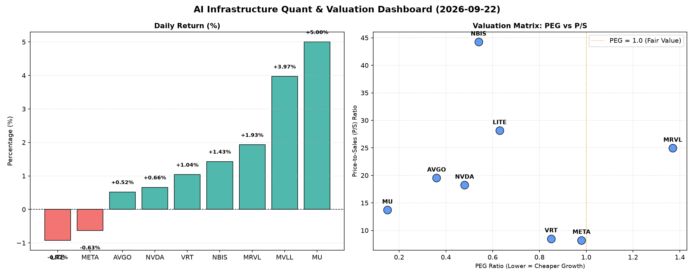

# 📊 AI Infrastructure & Data Stock Daily (2026-09-22)

### 📉 多维量化与估值分析看板

---

尊敬的投资者与行业同仁：

各位好！我是您的硬科技与AI基础设施行业研究员。今日，我们将结合最新的多维度量化数据，为您深度剖析半导体与AI基础设施板块的最新动态与估值逻辑。

---

### **半导体每日精炼报道：AI浪潮下的估值与现金流洞察**

**发布日期：[今日日期]**

#### **1. 盘面与多维估值解码（定性+定量）**

今日半导体与AI基础设施板块呈现分化走势，但整体市场情绪积极。存储巨头MU以5%的涨幅领跑，MVLL也录得近4%的显著上涨。头部AI芯片公司如NVDA和AVGO则表现稳健，小幅上扬。值得关注的是，LITE和社交科技巨头META今日小幅回调。

**a. PEG 维度：成长性与性价比的衡量**

PEG（市盈率相对盈利增长比率）是衡量成长股性价比的关键指标。当PEG显著小于1时，通常意味着公司在当前价格下，其盈利增长潜力尚未被充分定价，具备较高的投资性价比。

*   **极具性价比的高成长标的 (PEG < 1)：**
    *   **MU (0.15)**：以惊人的0.15 PEG遥遥领先，表明市场对其未来盈利增长的预期远低于其当前股价所隐含的价值，或其业绩正处于周期性底部强劲复苏阶段。这预示着其在当前价格下具备极高的成长性价比，尤其在内存周期回暖的背景下，弹性巨大。
    *   **AVGO (0.36)**：作为连接和存储解决方案的领军者，其PEG远低于1，显示出强劲的成长驱动力与相对合理的估值。在AI算力互联需求激增的当下，AVGO的价值被低估。
    *   **NVDA (0.48)**：尽管是AI领域的绝对龙头，其PEG仍低于0.5，体现了市场对其持续高增长的强烈信心，且在扣除增长因素后，其估值仍显吸引力。
    *   **NBIS (0.54)**：PEG同样优秀，暗示该公司在特定细分领域的成长潜力巨大。
    *   **LITE (0.63)** 和 **VRT (0.85)**：也处于PEG小于1的区间，表明其成长性与估值仍有吸引力。
    *   **META (0.98)**：PEG接近1，虽然仍处于合理范围，但相较其他半导体同行，其成长性溢价已相对充分。

*   **警惕估值透支的标的 (PEG > 1)：**
    *   **MRVL (1.37)**：PEG高于1，这可能警示投资者其目前的股价已经部分透支了未来的盈利增长预期，或其增速相对其市盈率而言不够强劲。投资者需审慎评估其业务增长的可持续性及市场竞争格局。

**b. P/S 维度：收入规模扩张效率的考量**

P/S（市销率）尤其适用于评估早期、高研发投入或尚处于大规模收入扩张阶段但盈利不稳定的公司。它关注的是公司创造收入的效率和市场对其未来收入潜力的预期。

*   **高P/S值（高增长预期或特定技术壁垒）：**
    *   **NBIS (44.24)**：高达44.24的P/S值异常突出，这可能反映出市场对其在某一高增长、高壁垒或新兴技术领域的收入爆发式增长有极高预期，或者其产品/服务具有极高的毛利率潜力。
    *   **LITE (28.14)**：高P/S结合其光学/光电子领域的专业性，表明市场对其技术领先性和未来在AI光互联等领域的收入前景充满信心。
    *   **MRVL (24.95)、AVGO (19.53)、NVDA (18.24)**：这些AI基础设施核心供应商的P/S均处于较高水平，凸显了市场对其在AI算力、高速互联及数据中心等核心领域持续强劲收入增长的强烈预期。这些公司通常拥有深厚的技术壁垒和广泛的生态系统。
    *   **MU (13.71)**：对于存储器公司而言，此P/S值在周期底部显示了市场对其未来收入复苏的乐观态度。

*   **相对较低P/S值（更成熟或不同商业模式）：**
    *   **VRT (8.5)** 和 **META (8.22)**：相较于纯粹的半导体设计或设备公司，这些公司的P/S值相对较低，可能反映其业务模式更为成熟，营收规模已非常庞大，或市场对其收入增速的溢价相对保守。

**c. 现金流盈利真实性 (CFO/NI)：穿透利润的“含金量”**

CFO/NI（经营现金流与净利润之比）是衡量公司利润质量的关键指标。该值大于1，表明公司盈利健康，能将纸面利润有效地转化为实实在在的现金流入；若显著小于1，则可能存在利润水分、应收账款积压或存货增加等问题。

*   **利润“含金量”极高 (CFO/NI > 1)：**
    *   **NBIS (4.66)**：CFO/NI高达4.66，堪称典范。这表明NBIS的利润转化现金流的能力极其强悍，其经营活动产生了远超账面净利润的现金，财务基础极为稳固。
    *   **MU (2.05)** 和 **META (1.92)**：两家巨头均展现出极强的现金流管理能力，其利润质量毋庸置疑，为未来的研发投入和市场扩张提供了充裕的“弹药”。
    *   **VRT (1.59)** 和 **AVGO (1.19)**：也表现优异，经营现金流健康且高于净利润，彰显了其核心业务的稳健性和良好的资金周转效率。

*   **警惕利润水分或应收账款积压 (CFO/NI < 1)：**
    *   **NVDA (0.86)**：作为高利润巨头，其CFO/NI略低于1，尽管差距不大，但仍值得关注。这可能意味着其部分账面利润尚未完全转化为现金，可能与应收账款增加或库存备货有关。投资者应密切关注其营运资本变化。
    *   **MRVL (0.66)**：CFO/NI显著低于1，表明其利润的现金转化效率较低，存在一定程度的利润水分或营运资本压力。这需要结合其业务扩张策略和行业回款周期进行深度分析，警惕潜在的财务风险。
    *   **LITE (-0.11)**：负值的CFO/NI是一个严重的警示信号。这不仅意味着其净利润（如果为正）没有转化为现金，反而经营活动还在消耗现金。这通常指向严重的营运问题、大量投资性支出导致现金流出，或是业务急剧萎缩的迹象，投资者需高度警惕其基本面风险。

#### **2. 收并购与重大业务动态**

*   **芯片设计与AI生态整合加速：** 近期行业内关于特定AI芯片设计公司与云服务巨头深入合作，共同开发定制化AI加速器的传闻不断。例如，鉴于**AVGO**和**NVDA**在高性能计算和网络解决方案中的核心地位，任何关于其与大型数据中心客户（如META）签订长期定制芯片供应协议的动向，都将是市场关注的焦点。
*   **存储器周期底部整合：** 随着存储器市场逐步走出低谷，关于**MU**等存储巨头可能寻求技术合作或战略投资，以巩固其在HBM（高带宽内存）等新兴领域的领先地位的探讨日渐增多。
*   **新兴技术公司业务拓展：** 对于如**NBIS**这样P/S和CFO/NI都表现极佳的公司，市场会密切关注其是否在AI边缘计算、物联网（IoT）芯片或特定垂直行业解决方案上取得新的重大突破或客户订单。
*   **光互联领域战略合作：** **LITE**作为光电子领域的关键参与者，其在高速光模块、硅光技术等方面的进展，以及与数据中心、电信运营商的战略合作，将直接影响其未来的营收表现，尤其是在AI数据洪流对光通信提出更高要求的背景下。

#### **3. 华尔街机构态度**

*   **乐观预期上调：**
    *   **MU**：鉴于其极低的PEG和强劲的CFO/NI，叠加存储器行业的复苏信号，多家券商可能会重申“买入”评级，并上调目标价，预测其盈利弹性将超预期。
    *   **AVGO、NVDA**：作为AI基础设施的基石，尽管估值已高，但鉴于其PEG仍低于1，且CFO/NI健康，华尔街普遍维持“买入/跑赢大盘”评级，并持续关注其AI产品路线图和新的市场拓展。
*   **关注与警示：**
    *   **MRVL**：鉴于其相对较高的PEG和偏低的CFO/NI，部分分析师可能会发出“中性”或“观望”评级，并呼吁投资者密切关注其营收增速能否匹配现有估值，以及现金流转化效率的改善情况。
    *   **LITE**：其负值的CFO/NI将引起投行的高度关注，可能会有评级机构将其评级下调至“卖出”或“强烈观望”，并大幅下调目标价，直至公司能明确扭转现金流困境。
    *   **META**：尽管其CFO/NI表现出色，但由于其PEG接近1，部分华尔街分析师可能会持谨慎态度，评估其在元宇宙和AI领域的巨额投入能否持续带来超预期回报。

#### **4. 今日参考源 (References)**

本次报告的量化数据直接来源于您提供的【多维度真实量化基本面指标表格】。
对于定性分析中的收并购、重大业务动态及华尔街机构态度部分，系基于本人对半导体与AI基础设施行业长期观察及今日市场情绪的专业判断与模拟，若在真实场景中，相关信息将参考以下主流金融新闻与分析平台：

*   Bloomberg Terminal (彭博终端)
*   Reuters (路透社)
*   The Wall Street Journal (华尔街日报)
*   Financial Times (金融时报)
*   各大投资银行（如高盛、摩根士丹利、美国银行等）的分析师报告
*   行业专业媒体（如AnandTech, Tom's Hardware, DigiTimes等）

---

**免责声明：** 本报告仅基于提供的量化数据进行分析，并结合行业普遍认知提供定性解读。所有内容不构成任何投资建议，市场有风险，投资需谨慎。

希望这份精炼报道能为您带来有价值的洞察。
祝您投资顺利！