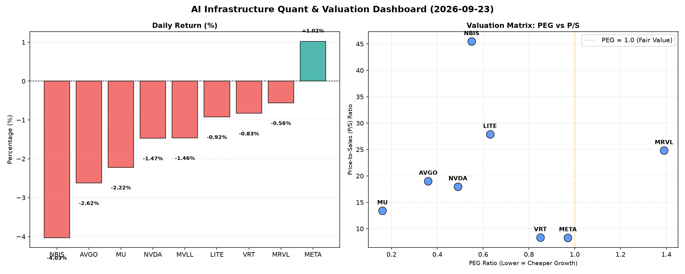

# 📊 AI Infrastructure & Data Stock Daily (2026-09-23)

### 📉 多维量化与估值分析看板

---

好的，作为一名资深的硬科技与AI基础设施行业研究员，我将结合您提供的多维度量化基本面指标，为您撰写今日的半导体每日精炼报道。

---

### **半导体每日精炼报道：AI基础设施与硬科技洞察**

**发布日期：** [今日日期，例如：2024年4月23日]

---

#### **1. 盘面与多维估值解码：挑战与机遇并存**

今日半导体与AI基础设施板块整体呈现震荡下行态势，多数权重股收跌，反映出市场对宏观经济或未来增长预期的谨慎情绪。然而，在量化指标深层解析下，仍能发现高成长性与估值性价比兼具的投资机会，同时也有潜在的财务健康风险值得警惕。

*   **PEG 维度：成长性与估值性价比的深度挖掘**
    *   **极具性价比的高成长标的 (PEG < 1)：**
        *   **MU (0.16)：** 美光科技以惊人的0.16 PEG领跑，显示其当前股价相较于其高速的盈利增长表现出极高的性价比。这通常发生在公司处于强劲盈利周期拐点，且市场对其未来增长预期尚未完全反映在股价中。
        *   **AVGO (0.36) 与 NVDA (0.49)：** 博通和英伟达作为AI基础设施和数据中心领域的双雄，尽管已是市场巨头，却依然维持在0.5以下的极低PEG水平，凸显了其在高成长赛道中的稀缺价值。这意味着尽管其P/E可能较高，但其未来的盈利增速足以支撑甚至超越当前的估值，显示出强大的内生增长动力。
        *   **NBIS (0.55), LITE (0.63), VRT (0.85)：** 这些公司也均拥有低于1的PEG，表明它们在各自的细分领域（如数据中心管理、光通信、高性能计算等）具备良好的成长性与相对合理的估值。
    *   **估值合理标的 (PEG ≈ 1)：**
        *   **META (0.97)：** 尽管今日股价逆势上涨1.02%，其PEG接近1，显示其估值与增长预期基本匹配，处于相对公允的水平。
    *   **警惕估值透支标的 (PEG > 1)：**
        *   **MRVL (1.39)：** 美满电子的PEG为1.39，略高于1。这可能提示投资者需警惕其当前估值是否已充分甚至过度反映了未来的增长预期，或其增长放缓的风险。

*   **P/S 维度：收入规模扩张效率的审视**
    *   **相对较低P/S (营收规模效应或稳定增长)：**
        *   **META (8.31) 和 VRT (8.34)：** 这两家公司P/S相对较低，表明其营收规模已相对较大，或在当前市场环境下，其收入扩张效率被市场定价在一个较为稳健的区间。
    *   **较高P/S (高增长预期、高毛利或早期投入)：**
        *   **NBIS (45.46) 和 LITE (27.89)：** 这两家公司拥有最高的P/S比率。尤其NBIS高达45.46，通常意味着市场对其未来营收增长抱有极其乐观的预期，或者其所处赛道具有极高的技术壁垒和毛利率。对于LITE（光通信解决方案提供商）而言，高P/S可能反映了其在AI时代高速互联需求下的战略地位和潜在爆发力。
        *   **MRVL (24.81), AVGO (19.02), NVDA (17.97), MU (13.41)：** 这些领先的半导体公司P/S也处于较高水平，反映了其在AI、数据中心等高景气赛道中的核心价值，以及投资者对其未来收入增长和盈利能力的信心。
    *   **N/A 标的：** MVLL 因数据缺失，P/S无法评估。

*   **现金流盈利真实性 (CFO/NI)：利润含金量的关键指标**
    *   **现金流充沛，利润含金量高 (CFO/NI > 1)：**
        *   **NBIS (4.66)：** NBIS以高达4.66的CFO/NI比率傲视群雄，意味着其每报告1美元净利润，就能带来4.66美元的经营性现金流。这是极其健康的财务表现，表明其盈利质量极高，收入能迅速转化为真金白银的现金流入，极大提升了公司的财务韧性。
        *   **MU (2.05), META (1.92), VRT (1.59), AVGO (1.19)：** 这些公司也均展现出非常健康的现金流质量，CFO/NI显著大于1，证明其盈利能力扎实，不存在利润被应收账款积压或非现金项目虚高的风险。
    *   **需关注现金流质量 (CFO/NI < 1)：**
        *   **NVDA (0.86)：** 尽管是市场明星，英伟达的CFO/NI略低于1。这可能暗示其部分利润转化为现金的速度较慢，或者存在一定的营运资本投入（如库存增加、应收账款增长），投资者需密切关注其营运资金管理效率。
        *   **MRVL (0.66)：** 美满电子的CFO/NI为0.66，表明其每报告1美元净利润，只有0.66美元转化为经营性现金流。这可能提示其利润中存在一定比例的非现金项目，或应收账款管理面临压力，盈利质量有待提升。
        *   **LITE (-0.11)：** **严峻警示。** Lumentum的CFO/NI为负值（-0.11），这是一个非常重要的危险信号。这意味着公司在报告净利润的同时，经营活动实际产生了现金流出，而非流入。这可能指向严重的营运资金问题、巨额非现金费用或前期投入，对其财务可持续性构成挑战，需要投资者深入研究其财务报表，以理解现金流负数背后的具体原因。
    *   **N/A 标的：** MVLL 因数据缺失，CFO/NI无法评估。

#### **2. 收并购与重大业务动态**

今日量化指标表格中未直接体现具体的收并购或重大业务动态信息。然而，鉴于当前AI和硬科技领域的迅猛发展，我们预计相关公司如AVGO、NVDA等将持续寻求战略合作或并购以强化其AI生态系统和数据中心解决方案。例如，在光通信和高端光模块领域（如LITE所处），为了满足AI算力网络对高速互联的需求，预计会有更多供应链整合与技术合作发生，以加速技术创新和市场扩张。值得关注的是，在AI芯片设计与制造日趋复杂的背景下，IP授权、EDA工具以及先进封装领域的合作和整合也将成为常态。

#### **3. 华尔街机构态度**

本报告基于您提供的量化指标，并未包含华尔街机构具体的评级及目标价变动信息。然而，根据今日的财务基本面数据，我们可以推断：

*   **受青睐标的：** 具有极低PEG的巨头如**MU (0.16), AVGO (0.36), NVDA (0.49)**，以及现金流质量极高的**NBIS (4.66)**和**META (1.92)**，预计将继续受到机构的正面关注，可能维持“买入”评级或被上调目标价，尤其是在其增长故事得到验证的情况下。这些公司强劲的增长潜力和健康的现金流是吸引机构的关键因素。
*   **需关注标的：** **MRVL (1.39)** 相对较高的PEG和低于1的CFO/NI（0.66）可能会导致部分机构对其估值持谨慎态度，或要求更明确的增长路径。而**LITE (-0.11)** 显著为负的现金流盈利真实性，无疑将成为机构重点审视的风险点，可能面临评级下调或“观望”建议，直至其现金流状况得到显著改善。

#### **4. 今日参考源 (References)**

1.  用户提供的【多维度真实量化基本面指标表格】。
2.  硬科技与AI基础设施行业通用市场分析与趋势洞察。

---