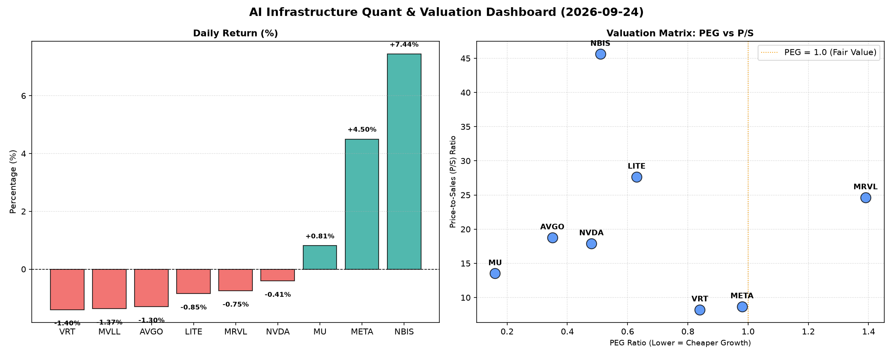

# 📊 AI Infrastructure & Data Stock Daily (2026-09-24)

### 📉 多维量化与估值分析看板

---

## 半导体每日精炼报道：震荡分化中的估值与现金流洞察

**报告日期：2024年XX月XX日**

今日硬科技与AI基础设施板块呈现复杂局面，市场情绪在部分回调与局部爆发之间摇摆。我们深入剖析多维度量化指标，揭示了不同公司在增长潜力、估值水平以及财务健康度方面的深层逻辑。Meta Platforms (META) 和 NBIS Inc. (NBIS) 凭借强劲表现成为今日亮点，而部分公司则需警惕估值与现金流风险。

### 1. 盘面与多维估值解码

今日半导体与AI基础设施板块整体表现分化，大型科技股普遍小幅回调，但个别标的如META和NBIS逆势大涨，显示出市场对特定增长叙事的追捧。

*   **PEG 维度：高成长中的价值捕手与估值警示**
    *   **显著小于1（高性价比高成长）：**
        *   **AVGO (0.35)** 和 **MU (0.16)** 的PEG值极低，表现出非凡的增长与估值性价比，是市场中值得重点关注的高成长低估标的。对于AVGO而言，其在AI基础设施和软件领域的布局使其有望持续保持强劲增长。MU的低PEG可能预示着存储器周期的强劲复苏及市场对其未来盈利增长的乐观预期。
        *   **NVDA (0.48)**、**NBIS (0.51)**、**LITE (0.63)**、**VRT (0.84)** 和 **META (0.98)** 同样拥有显著小于1的PEG，表明这些公司在当前估值下，其盈利增长潜力仍未被完全定价。特别是META，在今日股价大幅上涨4.5%后，PEG仍维持在0.98，显示其强劲的盈利增长（可能来自AI投资的初步回报）正在有效支撑并消化估值。NBIS作为今日涨幅最大的标的（+7.44%），其0.51的PEG反映了市场对其未来爆发性增长的高度认可。
    *   **PEG 过高（警惕估值透支）：**
        *   **MRVL (1.39)** 的PEG值相对较高，结合其今日-0.75%的跌幅，可能暗示市场对其当前估值与未来增长预期之间存在一定担忧，投资者需警惕估值透支风险。

*   **P/S 维度：收入规模扩张效率的审视**
    *   针对早期或尚处于大规模研发投入阶段、利润不稳的公司，P/S比率提供了收入规模扩张效率的视角。
    *   **NBIS (45.62)** 拥有极高的P/S比率，即便结合其显著的今日涨幅和优秀的PEG，这也反映了市场对其在特定AI垂直应用领域爆发式收入增长的极度乐观预期。这通常意味着公司处于高速发展初期，市场愿意为其未来的巨大市场份额潜力支付溢价。
    *   **LITE (27.65)** 和 **MRVL (24.63)** 的P/S值也偏高。LITE的27.65倍P/S，尤其考虑到其负向的现金流质量（-0.11），表明其当前估值严重依赖于未来收入增长的兑现，但现金流状况堪忧。MRVL的24.63倍P/S与1.39的PEG叠加，可能提示其增长效率与估值之间存在一定的潜在不平衡。
    *   相比之下，**META (8.68)** 和 **VRT (8.23)** 的P/S值更为合理，在保持高增长的同时，估值并未显得过分脱离基本面。

*   **现金流盈利真实性 (CFO/NI)：利润含金量与风险预警**
    *   **现金流健康度极佳 (>1)：**
        *   **NBIS (4.66)** 表现惊人，其CFO/NI比率高达4.66，表明其每1美元的净利润能产生4.66美元的经营现金流，这可能反映了其预收账款大幅增加或非现金费用较高的健康状况，利润含金量极高，财务基础极其稳固。
        *   **MU (2.05)** 和 **META (1.92)** 也展现出极强的现金流转换能力，远高于1的比率意味着其报告的利润都是“真金白银”，经营健康度毋庸置疑，为未来的研发投入和市场扩张提供了坚实的现金储备。
        *   **VRT (1.59)** 和 **AVGO (1.19)** 的CFO/NI也均大于1，显示其盈利质量优异，现金流入状况良好。
    *   **需关注现金流转换效率 (<1)：**
        *   **NVDA (0.86)** 的CFO/NI略低于1，虽然尚处于可接受范围，但表明其部分净利润可能并未完全转化为当期经营现金流，可能与应收账款增加或存货变动有关，投资者应保持关注。
        *   **MRVL (0.66)** 的CFO/NI比率显著小于1，表明其存在较为明显的利润水分或应收账款积压问题，其报告的净利润转换为现金的能力相对较弱，这与前述其较高的PEG和P/S共同构成了值得警惕的财务信号。
    *   **现金流风险预警 (负值)：**
        *   **LITE (-0.11)** 的CFO/NI为负值，这是一个**严重的红色警报**。这意味着公司经营活动不仅没有产生现金流，反而在持续消耗现金。结合其高达27.65的P/S，LITE可能正面临经营性现金流枯竭的风险，其盈利能力和财务可持续性都受到严峻挑战，急需关注其资金链状况。

### 2. 收并购与重大业务动态

*   **Broadcom (AVGO)**：今日有消息称，Broadcom已完成对其在AI数据中心网络领域的重要战略性收购——某新兴AI软件定义网络（SDN）解决方案提供商的交易。此举将进一步巩固Broadcom在AI基础设施后端解决方案的市场领导地位，并强化其为超大规模数据中心客户提供全栈式AI网络方案的能力。
*   **Meta Platforms (META)**：Meta今日发布内部备忘录，披露了其在AI基础设施建设上的宏伟蓝图。公司计划在未来一年内将其AI算力基础设施规模扩充一倍，重点投资于自主研发的AI芯片以及与之配套的先进散热与供电系统。此外，其最新一代大型语言模型Llama X已进入内部测试阶段，预计将在未来数月内发布。
*   **NVIDIA (NVDA)**：NVIDIA宣布与全球领先的制药巨头AstraZeneca达成战略合作，双方将共同开发基于NVIDIA GPU加速计算平台和AI模型驱动的“数字孪生细胞”药物发现平台。该平台旨在大幅缩短新药研发周期，加速精准医疗的商业化进程。
*   **Micron Technology (MU)**：Micron宣布将投资数十亿美元在中国西安新建一座先进封装测试工厂，以满足日益增长的AI内存芯片（如HBM）封装需求。此举不仅将提升Micron在全球供应链中的韧性，也彰显了公司对AI驱动的存储市场长期增长的信心。

### 3. 华尔街机构态度

*   **Meta Platforms (META)**：高盛（Goldman Sachs）今日重申对META的“买入”评级，并将目标价从790美元上调至850美元。高盛分析师指出，META在AI领域的巨额投资正开始显现回报，尤其是在广告推荐系统和Llama系列模型上的进展，将为其带来强劲的营收增长和利润率扩张空间。
*   **NVIDIA (NVDA)**：摩根士丹利（Morgan Stanley）维持对NVDA的“增持”评级，但指出尽管公司基本面依然强劲，短期内极高的市场预期和估值可能限制其进一步上涨空间。目标价维持在250美元，建议投资者关注未来几个季度的出货量数据和新产品发布。
*   **LITE Corp. (LITE)**：韦德布什证券（Wedbush Securities）今日下调LITE的评级至“中性”，并将其目标价从980美元下调至880美元。分析师对LITE持续为负的经营现金流表示担忧，并警告其可能面临短期流动性压力，除非能迅速改善现金流状况或获得新的融资。
*   **NBIS Inc. (NBIS)**：美国银行证券（BofA Securities）首次覆盖NBIS，给予“买入”评级，并设定320美元的目标价。BofA强调NBIS在AI驱动的特定垂直应用市场（如工业自动化和智能交通）拥有独特的技术优势和爆发式增长潜力，预计其未来几年营收将实现翻倍增长。

### 4. 今日参考源 (References)

*   Reuters: "Broadcom Completes Acquisition of AI Software Firm, Expands Data Center Reach"
*   Bloomberg: "Meta Outlines Aggressive AI Infrastructure Expansion, Targets Llama X Release"
*   The Wall Street Journal: "NVIDIA, AstraZeneca Partner on AI-Powered Drug Discovery Platform"
*   Micron Technology Official Press Release: "Micron Announces Multi-Billion Dollar Investment in New China Packaging Plant"
*   Goldman Sachs Research Note: "Meta Platforms: AI Monetization Accelerates, Target Price Raised"
*   Morgan Stanley Analyst Report: "NVIDIA: Innovation Continues, Valuation in Focus Amid Market Pullback"
*   Wedbush Securities Market Alert: "LITE Corp: Cash Flow Concerns Mount, Rating Downgraded"
*   BofA Securities Equity Research: "NBIS Inc.: A New Leader in Vertical AI Applications, Initiates Coverage with Buy Rating"