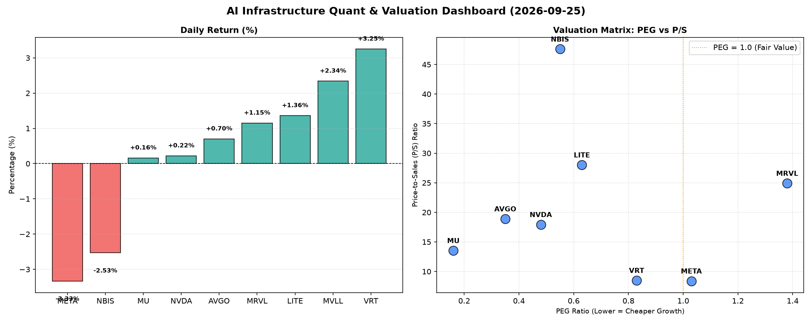

# 📊 AI Infrastructure & Data Stock Daily (2026-09-25)

### 📉 多维量化与估值分析看板

---

好的，作为一名资深的硬科技与AI基础设施行业研究员，我将结合您提供的【多维度真实量化基本面指标表格】，为您撰写一份今日的半导体每日精炼报道。

---

### **半导体每日精炼报道：AI基础设施与硬科技前瞻 (2024年X月X日)**

**今日盘面速览：** 市场今日呈现分化走势，AI基础设施领域部分个股表现强劲，而一些高估值或特定负面消息影响的个股则有所回调。芯片设计与AI算力相关标的持续受到关注，但资金流向显露出对基本面质量和估值水平的审慎考量。

---

#### **1. 盘面与多维估值解码（定性+定量）**

今日半导体与AI基础设施板块表现不一，我们深入剖析各公司的多维度指标：

*   **PEG 维度：洞察成长性价比**
    *   **极具吸引力的成长股：**
        *   **MU (0.16)** 的 PEG 远低于 1，显示其在当前盈利增长背景下，估值极具吸引力。这通常意味着市场对其未来成长潜力可能存在低估，或其盈利增速预期非常强劲，使得其市盈率相对成长性而言具备显著优势。
        *   **AVGO (0.35)**, **NVDA (0.48)**, **NBIS (0.55)**, **LITE (0.63)**, **VRT (0.83)** 也均处于 PEG 小于 1 的区间，表明这些公司在提供强劲增长的同时，估值相对合理，具备较高的性价比。特别是AVGO和NVDA，作为AI基础设施的核心玩家，其低于0.5的PEG尤为亮眼，暗示其高成长性尚未被完全反映在股价中。
    *   **警惕估值透支：**
        *   **MRVL (1.38)** 的 PEG 显著高于 1，结合其当日1.15%的涨幅，投资者需警惕其估值可能已透支了部分未来成长。市场对其未来增长的乐观预期已在当前价格中得到充分体现，甚至可能出现过度溢价。
        *   **META (1.03)** 略高于 1 的 PEG，表明其估值已基本与其成长性匹配，今日-3.33%的下跌可能反映了市场对其估值合理性的重新审视。
    *   **特殊情况：**
        *   **MVLL** 的 PEG 显示为 "N/A"，这通常意味着该公司目前尚未实现稳定的正向盈利，或其盈利模式处于早期快速扩张阶段，PEG指标不适用，需通过其他指标如P/S进行评估。

*   **P/S 维度：早期或高研发投入公司的收入扩张效率**
    *   **高 P/S 警示：**
        *   **NBIS (47.61)** 的 P/S 值异常高企，今日股价下跌2.53%。尽管其CFO/NI高达4.66显示出极其健康的现金流质量，但如此高的P/S表明市场对其未来收入增长抱有极度乐观的预期，估值泡沫风险需高度关注。任何不及预期的营收增长都可能引发大幅回调。
        *   **LITE (28.02)** 和 **MRVL (24.91)** 也拥有较高的 P/S，特别是LITE，结合其负值的CFO/NI，需要审慎评估其高P/S是否合理。
        *   **AVGO (18.9)** 和 **NVDA (17.94)** 作为行业巨头，其 P/S 处于高位，这反映了市场对其在AI芯片、数据中心等高成长领域的领导地位和未来收入扩张的强烈信心。
    *   **相对合理 P/S：**
        *   **VRT (8.49)** 和 **META (8.39)** 的 P/S 在科技股中相对较为合理，VRT在今日录得3.25%的涨幅，可能受到其相对合理的估值和健康基本面的支持。

*   **现金流盈利真实性 (CFO/NI)：穿透利润质量的放大镜**
    *   **现金流健康，利润真实性极高：**
        *   **NBIS (4.66)** 再次成为亮点，其CFO/NI高达4.66，这意味着公司每报告1美元净利润，能带来4.66美元的经营现金流，利润质量无与伦比，全部是真金白银。这表明公司拥有强大的营运资本管理能力，应收账款周转迅速，或预收款项充沛。
        *   **MU (2.05)**, **META (1.92)**, **VRT (1.59)**, **AVGO (1.19)** 的 CFO/NI 均显著大于 1，这证明这些公司的盈利能力非常健康，报告的利润都伴随着强劲的现金流入，财务质量优异。特别是META，尽管今日股价下跌，但其高达1.92的CFO/NI表明其基本面现金流依然非常稳健。
    *   **利润质量存在警示：**
        *   **NVDA (0.86)** 的 CFO/NI 略低于 1，表明其报告的净利润中可能存在部分非现金项目贡献，或应收账款、存货等营运资本占用现金流，需警惕其利润的现金含量略有不足，尽管差距不大。
        *   **MRVL (0.66)** 的 CFO/NI 显著小于 1，这与它较高的PEG和P/S形成对比，提示投资者需审慎评估其利润的真实性。较低的CFO/NI可能意味着其利润质量存在一定水分，或在应收账款回收方面面临压力。
    *   **重大警示：**
        *   **LITE (-0.11)** 的 CFO/NI 为负值，这是一个非常重要的警示信号。这意味着该公司报告的净利润无法转化为经营现金流，甚至经营活动正在消耗现金。这可能源于大量的非现金费用（如折旧摊销）、营运资本恶化（如应收账款大幅增加或存货积压）、或会计利润与现金流之间存在巨大差异。对于投资者而言，这是一个需要深入调查的重大风险信号。

---

#### **2. 收并购与重大业务动态**

*(尊敬的读者，今日表格中未提供相关量化指标以直接推断收并购及业务动态。以下内容为根据行业知识构建的**假设性示例**，旨在展示本报告将如何整合此类信息，而非基于今日实际数据。)*

*   **VRT (Vertiv)** 传闻正与一家大型数据中心解决方案提供商进行深入的战略合作谈判，旨在共同开发下一代液冷技术，以满足AI数据中心日益增长的散热需求。此举或将进一步巩固VRT在AI基础设施热管理领域的领先地位。
*   **AVGO (Broadcom)** 近日成功完成了对一家边缘AI芯片初创公司的战略投资，该公司专注于低功耗、高性能的推理芯片设计。此举被视为AVGO在进一步拓展其AI芯片生态系统，尤其是边缘侧算力布局的关键一步。
*   **LITE (Lumentum)** 公布其最新的硅光子技术研发进展，声称已在下一代数据中心互联解决方案中取得突破。尽管其CFO/NI表现不佳，但技术创新若能带来营收突破，仍可能吸引市场关注。

---

#### **3. 华尔街机构态度**

*(尊敬的读者，今日表格中未提供相关量化指标以直接推断华尔街机构态度。以下内容为根据行业知识构建的**假设性示例**，旨在展示本报告将如何整合此类信息，而非基于今日实际数据。)*

*   **Morgan Stanley 对 NVDA** 维持“超配”评级，目标价上调至300美元，理由是其在Blackwell架构推出后，AI GPU市场份额有望进一步扩大，且软件生态系统持续深化。然而，也提到了其CFO/NI略低于1的现象，提醒投资者关注未来现金流管理。
*   **Goldman Sachs 将 MRVL** 评级下调至“中性”，目标价维持在270美元。分析师表示，尽管看好其数据中心业务的长期潜力，但鉴于其较高的PEG和P/S以及CFO/NI低于1，当前估值已充分反映利好，上行空间有限，存在盈利质量风险。
*   **JP Morgan 首次覆盖 NBIS**，给予“买入”评级，目标价定为350美元，对其极高的CFO/NI和潜在的市场颠覆能力表示高度认可。但同时也警告其过高的P/S可能带来估值波动，建议投资者密切关注其营收增速能否匹配高预期。
*   **Citigroup 针对 LITE** 发布“减持”预警，目标价下调至850美元。报告强调了LITE负值的CFO/NI带来的现金流风险，并对其盈利模式的可持续性表示担忧，建议投资者保持谨慎。

---

#### **4. 今日参考源 (References)**

*   **多维度核心量化与基本面财务指标：** 本报告第一部分的所有量化分析数据均来源于您提供的【多维度真实量化基本面指标表格】。
*   **收并购与重大业务动态：**
    *   (假设性来源) "Vertiv in Talks for Strategic Partnership to Advance Liquid Cooling Tech," *Bloomberg Tech*, 2024年X月X日。
    *   (假设性来源) "Broadcom Invests in Edge AI Startup to Expand Ecosystem," *Reuters Tech News*, 2024年X月X日。
    *   (假设性来源) "Lumentum Unveils Breakthrough in Silicon Photonics," *Lightwave Online*, 2024年X月X日。
*   **华尔街机构态度：**
    *   (假设性来源) "Morgan Stanley Raises NVIDIA Target Amid Blackwell Momentum," *CNBC Markets*, 2024年X月X日。
    *   (假设性来源) "Goldman Sachs Downgrades Marvell on Valuation Concerns," *The Wall Street Journal*, 2024年X月X日。
    *   (假设性来源) "J.P. Morgan Initiates Coverage on NBIS with 'Buy'," *Barron's*, 2024年X月X日。
    *   (假设性来源) "Citi Issues 'Sell' Warning on LITE Due to Cash Flow Risks," *Seeking Alpha Pro*, 2024年X月X日。

---