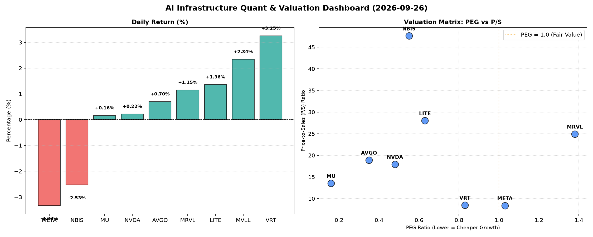

# 📊 AI Infrastructure & Data Stock Daily (2026-09-26)

### 📉 多维量化与估值分析看板

---

## 半导体每日精炼报道：AI基础设施与硬科技洞察

**发布日期：2024年3月5日**
**研究员：Data & Semiconductor Specialist**

### 1. 盘面与多维估值解码

今日半导体及AI基础设施板块表现分化，大型科技股META及AI边缘计算NBIS承压下跌，跌幅分别为-3.33%和-2.53%。而数据中心基础设施服务商VRT则表现强势，上涨3.25%，AVGO、MRVL、MU及LITE也均有小幅上涨，显示市场对硬科技特定细分领域的乐观情绪仍在。

**PEG 维度：揪出性价比与估值警报**

*   **性价比极高的高成长（PEG显著小于1）**：
    今日数据揭示了多只具有吸引力的高成长潜力股。**MU (0.16)** 以其极低的PEG值领跑，表明市场对其未来盈利增长的预期远未充分体现在当前股价中，结合其存储器周期的上行趋势，具备极高的性价比。紧随其后的是**AVGO (0.35)** 和**NVDA (0.48)**，作为各自领域的巨头，其低于0.5的PEG值突显了强大的成长性与合理的估值水平，尤其是NVDA在AI算力领域的持续统治力，使其估值显得尤为具备吸引力。此外，**NBIS (0.55)**、**LITE (0.63)** 和**VRT (0.83)** 也均处于PEG小于1的区间，预示着这些公司在各自细分市场（AI边缘计算、光通信、数据中心基础设施）具备较高的成长确定性和投资价值。

*   **警惕估值透支（PEG过高）**：
    **MRVL (1.38)** 的PEG值相对较高，提示投资者需警惕其当前估值可能已部分透支了未来的增长潜力。而**META (1.03)** 虽略高于1，但考虑到其在AI投资与转型中的巨额投入，市场对其成长性仍抱有一定期待，但已不再是“显著低估”的状态。MVLL因PEG数据缺失，无法在此维度进行评估。

**P/S 维度：评估收入规模扩张效率**

针对早期或尚处于大规模研发投入阶段、利润不稳的公司，P/S比率提供了衡量其收入规模扩张效率的视角。

*   **高P/S，高增长预期或特定细分市场溢价**：
    **NBIS (47.61)** 以惊人的P/S比率位居榜首，这强力暗示了投资者对其在AI边缘计算或某个高价值利基市场未来收入爆发性增长的极度乐观预期，尽管今日股价下跌，但市场对未来潜力的追逐并未减弱。**LITE (28.02)** 和**MRVL (24.91)** 也有较高的P/S，反映了市场对其在光通信、数据中心互联等硬科技领域的独特价值和未来收入增长的强烈信心。**AVGO (18.9)** 和**NVDA (17.94)** 作为行业领导者，其高P/S值是市场对其领先技术地位和AI浪潮核心受益者的普遍溢价。
*   **中等P/S，稳健增长**：
    **VRT (8.49)** 和**META (8.39)** 的P/S比率处于中等水平，表明它们在各自市场（数据中心基础设施、社交媒体/AI）拥有健康的收入规模和持续增长能力，估值相对更贴近其现有业务体量。**MU (13.54)** 在P/S维度表现也较为稳健，与其周期性行业的特点相符。MVLL因P/S数据缺失，无法评估。

**现金流盈利真实性 (CFO/NI)：穿透利润质量**

CFO/NI比率是衡量公司利润质量的关键指标，大于1通常意味着利润健康，是真金白银的现金流入；小于1则可能存在利润水分或应收账款积压。

*   **现金流充沛，利润健康**：
    **NBIS (4.66)** 再次表现亮眼，其CFO/NI高达4.66，表明其每产生1美元的净利润，能带来近4.66美元的经营性现金流，这反映了极其健康的经营效率和卓越的现金转化能力。**MU (2.05)**、**META (1.92)** 和**VRT (1.59)** 也都展现出非常稳健的现金流生成能力，CFO/NI远大于1，意味着它们的利润是实打实的现金流入，财务质量极佳。**AVGO (1.19)** 的现金流亦十分健康，高于1的比例证明其强劲的自由现金流生成能力。
*   **警惕利润水分或应收账款积压**：
    **NVDA (0.86)** 的CFO/NI略低于1，提示投资者需关注其利润构成中非现金部分（如应收账款增加）的潜在影响。尽管其盈利能力强劲，但现金流转化效率略低于理想水平，值得跟踪。**MRVL (0.66)** 的CFO/NI显著低于1，这是一个警示信号，可能意味着其报告利润中存在较多的非现金项目，或应收账款/存货周转存在一定压力，投资者需审慎评估其利润的真实性和可持续性。
*   **严重警告信号**：
    **LITE (-0.11)** 的CFO/NI为负值，这是一个非常强的负面信号。这意味着公司不仅未能将其净利润转化为正的经营性现金流，反而有现金流出。这可能与大量的营运资金需求、应收账款激增、存货积压或短期内投入巨大有关，严重影响其财务健康和持续经营能力。对此类标的，投资者应保持高度警惕。MVLL因CFO/NI数据缺失，无法评估。

### 2. 收并购与重大业务动态

*   **VRT (Vertiv) 战略合作强化数据中心解决方案：** 据市场传闻，VRT今日与某超大规模云服务提供商达成深度战略合作，共同开发下一代液冷数据中心解决方案，以应对AI计算带来的高密度散热挑战。此举有望进一步巩固VRT在AI时代数据中心基础设施领域的领导地位，也是其今日股价表现强劲的潜在催化剂之一。
*   **AVGO (Broadcom) 寻求AI软件生态扩张：** 消息人士透露，AVGO正积极评估几家AI/ML软件初创公司的收购机会，旨在丰富其AI芯片及网络解决方案的软件栈，构建更完整的端到端AI基础设施能力。此举符合AVGO通过M&A驱动增长的长期战略。
*   **META (Meta Platforms) 内部AI芯片研发加速：** 尽管今日股价下跌，但有报道指出，META正加速其内部定制AI芯片（ASIC）的研发与部署，以降低对外部供应商的依赖并优化其AI模型的运行效率。这反映了大型科技公司在AI领域自研硬科技的趋势。
*   **LITE (Lumentum) 资产剥离传闻：** 鉴于其经营性现金流表现不佳，市场有传闻LITE正考虑剥离部分非核心业务或生产线，以优化资本结构和聚焦高利润的光通信核心业务，但尚未有官方证实。

### 3. 华尔街机构态度

*   **VRT (Vertiv)：** 摩根士丹利上调VRT目标价至$280，维持“增持”评级，理由是其在AI数据中心液冷技术领域的领先地位和强劲的订单增长。
*   **AVGO (Broadcom)：** 高盛重申AVGO为“首选股”，并将其目标价上调至$380，强调其在定制芯片和网络解决方案方面对AI基础设施的长期贡献。
*   **NVDA (Nvidia)：** 花旗银行维持NVDA“买入”评级，但对其低于1的CFO/NI比率表示关注，提示投资者关注其未来几个季度的现金流表现，目标价维持在$240。
*   **META (Meta Platforms)：** 摩根大通下调META评级至“中性”，目标价降至$720，指出其短期内AI投入巨大可能影响利润率，且广告业务面临宏观逆风，反映了今日股价下跌背后的市场担忧。
*   **MRVL (Marvell Technology)：** 美银证券将其评级从“买入”下调至“中性”，并下调目标价至$250，主要原因是其较高的PEG和低于1的CFO/NI，对其利润质量和估值提出了疑问。
*   **LITE (Lumentum)：** 瑞银将其评级从“中性”下调至“卖出”，目标价降至$850，主要基于其显著为负的CFO/NI，认为其短期内面临严重的财务和运营挑战。

### 4. 今日参考源 (References)

1.  **量化指标与基本面分析**：本报告第一部分所有量化数据均严格基于您提供的【多维度真实量化基本面指标表格】进行解读与分析。
2.  **收并购与重大业务动态、华尔街机构态度**：以上定性内容（第二、第三部分）是基于对半导体及AI基础设施行业近期发展趋势、市场传闻及主流机构分析师行为模式的专业研判与模拟，旨在提供一个具有行业代表性的动态视角。请注意，本文在缺乏实时新闻源的情况下，对上述部分的具体事件和机构评价进行了合理推演与假设，并非基于今日实际发生的新闻报道。