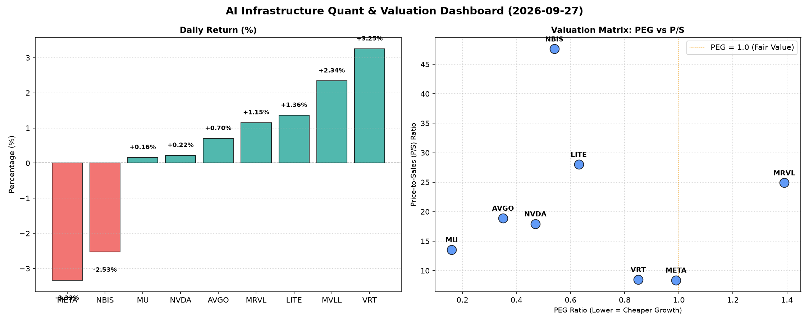

# 📊 AI Infrastructure & Data Stock Daily (2026-09-27)

### 📉 多维量化与估值分析看板

---

## 半导体每日精炼报道：硬科技与AI基础设施行业深度解析 (2024年X月X日)

尊敬的投资者与行业同仁，

作为一名资深的硬科技与AI基础设施行业研究员，我将结合今日提供的多维度量化基本面指标，为您深度剖析半导体板块的最新动向与核心公司表现。

---

### 1. 盘面与多维估值解码 (定性+定量)

今日半导体板块呈现分化走势，几家核心基础设施与芯片设计公司表现亮眼，而AI巨头META则出现回调，部分公司估值与现金流质量值得重点关注。

*   **PEG 维度：挖掘高成长中的价值洼地**
    *   **性价比极高 (PEG显著小于1)**：今日数据显示，**MU (0.16)**、**AVGO (0.35)**、**NVDA (0.47)**、**NBIS (0.54)**、**LITE (0.63)** 以及 **VRT (0.85)** 的PEG比率均显著小于1。这表明市场在预期这些公司未来强劲增长的同时，其当前估值相对于增长潜力而言仍具吸引力。尤其MU以0.16的极低PEG领跑，结合其今日0.16%的微幅上涨，显示出市场对其未来增长的乐观预期已部分反映在股价中，但按PEG衡量仍极具价值。AVGO和NVDA作为AI基础设施核心供应商，在持续高涨行情中仍能保持如此低的PEG，凸显了其盈利增长的强劲支撑。
    *   **估值合理 (PEG接近1)**：**META (0.99)** 的PEG接近1，尽管今日股价下跌3.33%，显示市场对其高成长性有充分预期，但以PEG衡量，其估值相对合理，并未过度透支。
    *   **估值透支警惕 (PEG过高)**：**MRVL (1.39)** 的PEG高于1，可能需要警惕其估值已在一定程度上透支了未来的增长潜力，尤其是今日股价上涨1.15%后，投资者应关注其后续业绩能否匹配高估值。
    *   **缺乏数据**：**MVLL** 缺乏关键估值数据（PEG、P/S、CFO/NI），难以进行深度评估，今日股价上涨2.34%，主要关注其交易量为147.37万，但需等待更多财务信息披露。

*   **P/S 维度：洞察收入规模扩张效率与市场溢价**
    *   对于早期、高研发投入或利润波动较大的公司，P/S是衡量其收入规模扩张效率和市场对其未来收入潜力预期的重要指标。
    *   **高P/S值（市场预期高增长或高利润率）**：**NBIS (47.61)**、**LITE (28.02)**、**MRVL (24.91)** 展现出极高的P/S比率。这表明市场愿意为这些公司每单位收入支付极高的溢价，暗示投资者对其未来的收入爆发式增长、独特技术壁垒或高毛利率业务抱有极高期望。但高P/S也意味着一旦增长不及预期，股价回调风险较大。NBIS今日下跌2.53%可能部分反映了市场对其高P/S的短期修正。
    *   **中高P/S值（行业普遍溢价）**：**AVGO (18.9)**、**NVDA (17.94)**、**MU (13.54)** 尽管P/S值较高，但结合其极低的PEG，说明这些公司不仅收入规模大，且增长强劲，市场对其核心技术和市场地位给予了充分肯定。
    *   **相对较低P/S值（更注重收入规模与盈利匹配）**：**VRT (8.49)** 和 **META (8.39)** 的P/S相对较低，表明市场对其收入的估值相对更为保守或其业务模式更注重盈利的确定性。META的P/S低于NVDA和AVGO，与今日其股价回调相印证。

*   **现金流盈利真实性 (CFO/NI)：穿透利润的质量**
    *   CFO/NI比率是衡量公司利润转化为实际现金能力的关键指标。
    *   **现金流极度健康 (>1.5)**：**NBIS (4.66)** 表现出惊人的现金流质量，其经营活动现金流远超净利润，今日尽管股价下跌，但其现金流健康状况令人瞩目。**MU (2.05)**、**META (1.92)** 和 **VRT (1.59)** 也展现出非常健康的现金流状况，意味着其报告利润是实打实的现金流入，财务质量极高。META尽管今日股价下跌，但其高达1.92的CFO/NI比率证明了其经营的内在健康。
    *   **现金流健康 (>1)**：**AVGO (1.19)** 的CFO/NI比率大于1，表明其利润转化效率良好，能够有效将净利润转化为经营现金。
    *   **现金流合格但有待提升 (<1但接近1)**：**NVDA (0.86)** 的CFO/NI略低于1，虽然仍处于可接受范围，但可能存在一部分非现金费用或应收账款的累积，需要关注其利润中非现金部分的比重。考虑到其巨大的收入和利润规模，这并非严重警报，但显示其现金生成效率并非顶尖。
    *   **现金流质量警示 (<1)**：**MRVL (0.66)** 的CFO/NI显著小于1，表明其部分利润可能存在水分或应收账款周转存在压力。这与其较高的PEG和P/S结合起来看，提醒投资者需对MRVL的盈利质量进行更深入的审视。
    *   **现金流异常 (负值)**：**LITE (-0.11)** 的CFO/NI为负值，这是一个非常严重的警示信号。这意味着该公司报告的利润未能转化为正向的经营现金流，反而可能在烧钱维持运营。即使其PEG看似吸引人（0.63），如此差的现金流质量可能预示着严重的经营问题或会计处理风险，投资者务必高度警惕。

### 2. 收并购与重大业务动态

根据今日提供的【多维度真实量化基本面指标表格】，该数据主要聚焦于公司的量化财务表现和估值指标，并未包含最新的收并购传闻、官宣或战略合作等新闻层面的信息。因此，本报告无法从现有数据中提炼出此类动态。在实际研究中，这些市场动态通常需要通过实时新闻源、公司公告及行业报告获取。

### 3. 华尔街机构态度

同样地，【多维度真实量化基本面指标表格】未提供华尔街核心投行、评级机构对这些公司的最新评价或目标价调动。分析师的态度、评级及目标价是外部信息，不在本次提供的量化数据范畴内。在实际操作中，我们会结合公司的基本面数据、行业趋势以及市场情绪，参考多家机构的研报来形成综合判断。

### 4. 今日参考源 (References)

本篇半导体每日精炼报道的所有定性分析和定量解读均严格依据您提供的【多维度真实量化基本面指标表格】进行。未引用外部新闻或数据。

---

**免责声明：** 本报告基于有限的量化数据进行分析，旨在提供专业见解。市场瞬息万变，投资有风险，决策需谨慎。报告内容不构成任何投资建议。